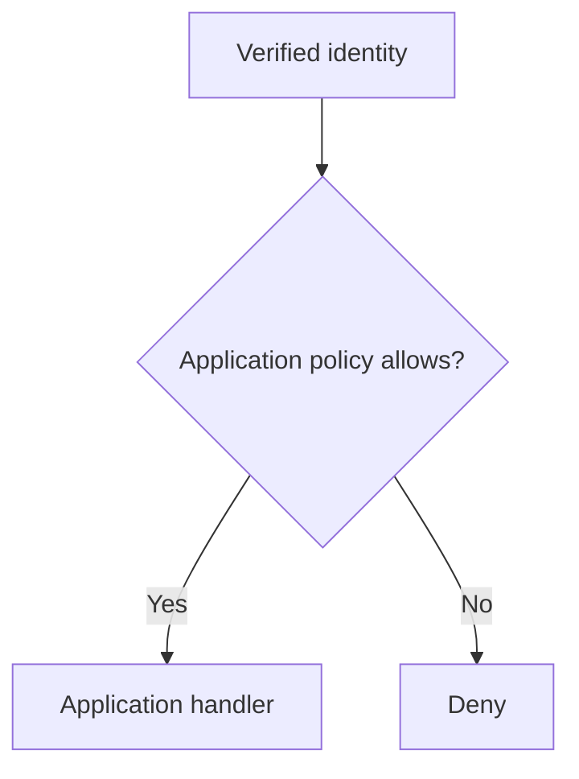

# Documentation diagrams

Author diagrams beside the explanation in a fenced `mermaid` block. The docs
remark plugin maps each block to a static figure with light/dark SVGs, a caption,
a keyboard-scrollable viewport, a full-size image link, and downloadable source.
No Mermaid runtime is sent to readers, and diagrams work without JavaScript.
Caption paragraphs are discoverable by the maintained search crawler; generic
controls stay outside its paragraph selector. Wide diagrams scroll horizontally
to keep labels readable rather than shrinking all content into the page width.

Each block needs a single-line accessible title and description:

````markdown

````

Use one question per diagram. Keep labels short, show relevant failure/lifecycle
branches, and explain scope and version limits in the caption and adjacent prose.
The description must remain useful to someone who cannot see the image. A table
can be clearer for simple field mappings or configuration choices. Existing
screenshots remain useful for UI steps and should be preserved.

After editing Mermaid source, run:

```sh
npm run diagrams:render
npm run diagrams:check
npm run typecheck
npm run build
```

Rendering uses the pinned Mermaid and Playwright Core development dependencies
and an installed Chrome browser. On macOS it uses the standard Google Chrome
application path; elsewhere it uses Playwright's Chrome channel. Set
`AUTHCRUNCH_DIAGRAM_BROWSER` to an executable path when necessary. It does not
download a browser. One instance and page are reused serially, then closed even
on failure. Run browser checks and builds sequentially on a constrained machine.

The renderer writes `static/img/diagrams/` and `assets/diagrams/manifest.json`.
Commit source, manifest, and assets together. Source hashes determine filenames;
do not rename or hand-edit rendered assets. SVG links also carry the per-theme
render hash to invalidate cached images when rendering settings change. SVGs
include Mermaid's accessible title/description and use the site's blue/navy
palettes. Source, rendering recipe, dimensions, and render hashes are checked
before every production build; normal CI builds need no browser.
Inspect actual renders in both themes, including labels, arrows, and narrow-screen
scrolling. A syntax check alone does not establish a readable diagram.

The grammar and accessibility options follow [Mermaid's documentation](https://mermaid.js.org/config/accessibility.html).
The static figure is this site's MDX integration; it does not use Docusaurus's
client-rendered Mermaid theme.
