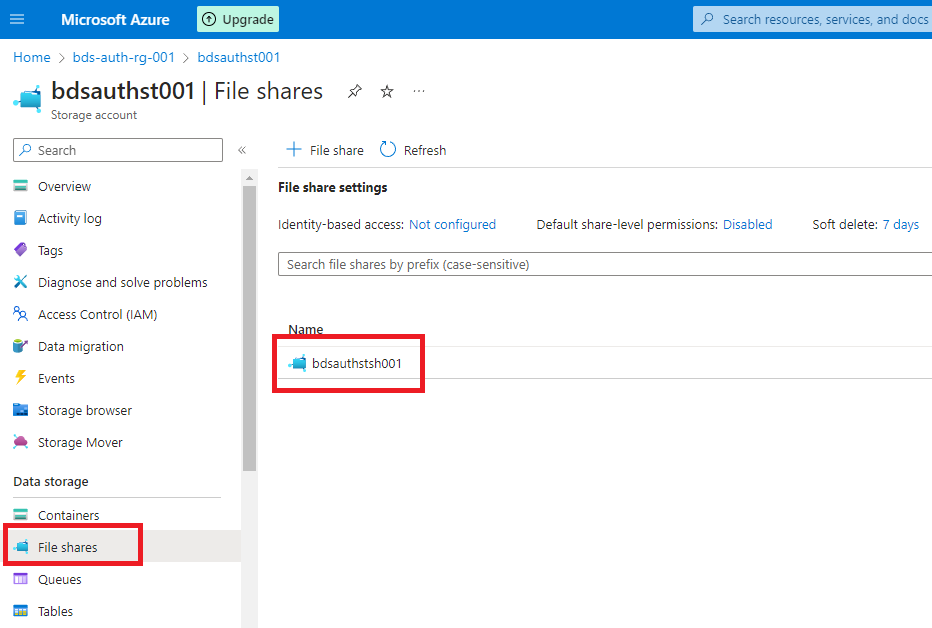
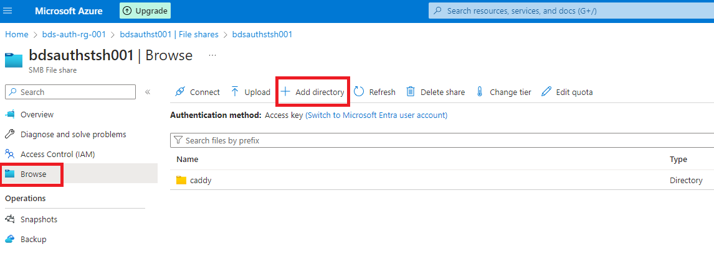
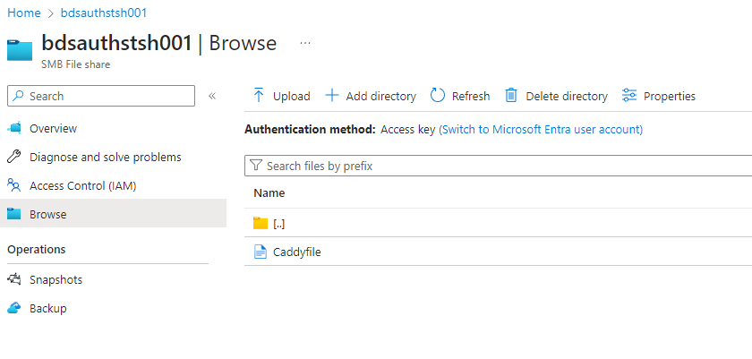
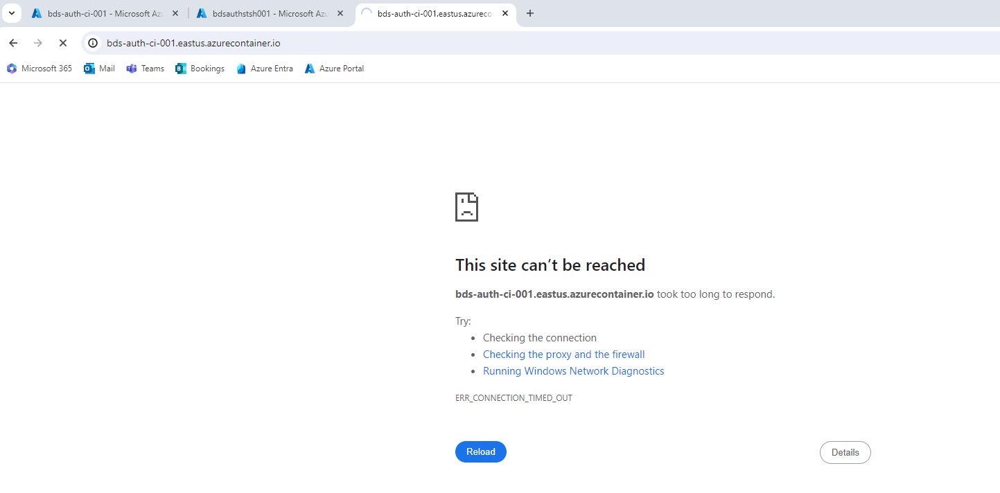
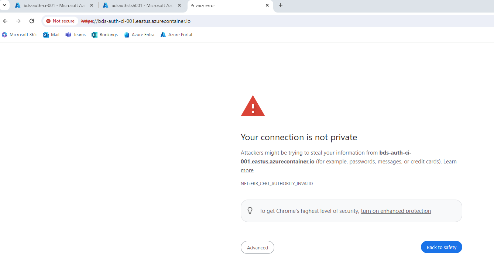
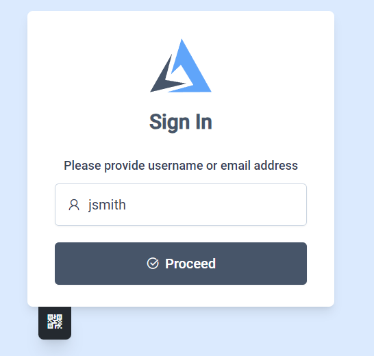
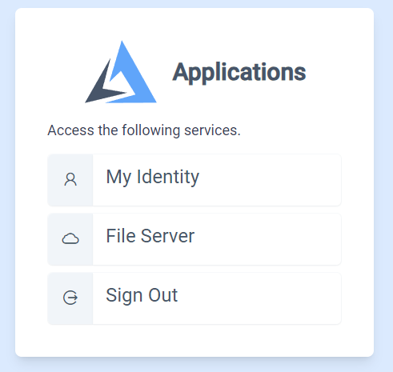
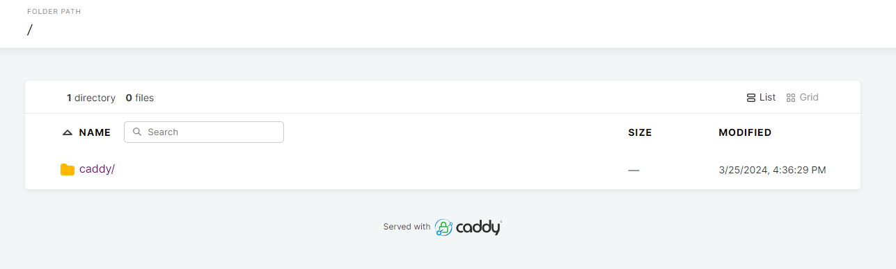

This updated deployment note preserves the original Azure Container Instances
(ACI) walkthrough images and replaces its unsafe configuration assumptions.
The AuthCrunch reference targets Caddy Security v1.3.0 / go-authcrunch v1.3.8;
Azure account, image, networking, TLS and storage still require environment
verification. No current ACI deployment was executed for this revision.

{/* truncate */}

import CodeBlock from '@theme/CodeBlock';
import caddyfile from '@site/assets/conf/cloud/azure-aci/Caddyfile?raw';

## Table of Contents

- [Azure Configuration](#azure-configuration)
- [Add Azure File Share](#add-azure-file-share)
- [Copy Files to Azure File Share](#copy-files-to-azure-file-share)
- [Container Deployment](#container-deployment)
- [Accessing Container](#accessing-container)
- [Troubleshooting](#troubleshooting)
- [Conclusion](#conclusion)

## Azure Configuration

Choose the public HTTPS hostname, identity source and intended application
members before creating a container. The reference below uses Entra OIDC and
requires `App.Access` to grant `app/member`; it does not publish local-user
passwords or grant every signed-in user access to the file server.

Use the [Entra setup guide](/docs/authenticate/oauth/backend-oauth2-0006-microsoft)
for the app registration, callback and roles. Set `AUTHCRUNCH_PUBLIC_HOST`,
`ENTRA_TENANT_ID`, `ENTRA_CLIENT_ID`, `ENTRA_CLIENT_SECRET` and a private
`JWT_SHARED_KEY`. The callback is
`https://<public-host>/auth/oauth2/azure`. Host/tenant expand when adapting the
Caddyfile; the credential/signing values resolve during provisioning.

### Add Azure File Share

ACI is ephemeral without external storage. Its [Azure Files mounting guide](https://learn.microsoft.com/en-us/azure/container-instances/container-instances-volume-azure-files)
describes SMB/CIFS mounting and Linux/root/access-key prerequisites. A mounted
share does not automatically satisfy AuthCrunch's private filesystem, locking
and single-owner requirements for [persistent runtime state](/docs/operations/runtime-state).

Separate the files by purpose:

| Container path | Purpose | Public HTTP exposure |
| --- | --- | --- |
| `/etc/authcrunch/Caddyfile` | Private service configuration | Never served |
| `/srv/public` | Deliberately published application content | Only after app authorization |
| Caddy storage | TLS/account material | Never served |
| AuthCrunch state/local user data, if configured | Private identity/session material | Never served; verify supported storage separately |

Do not make a browsable file-server root out of the whole volume containing
configuration, user databases or TLS keys. Avoid putting local users or the
private state backend on a shared/network filesystem as an unverified shortcut.
This reference uses an external identity provider and does not enable persistent
AuthCrunch sessions. Replacement loses cached portal sessions; a still-valid
access JWT can remain accepted by an app policy with unchanged signing trust.
Plan those outcomes separately.

### Copy Files to Azure File Share

Upload only the intended public files to the content mount and place the
Caddyfile in its private configuration location. The reference strips `/app`
before serving `/srv/public`, does not enable directory browsing, and runs
`authorize` before `file_server`.

<CodeBlock language="caddyfile" title="Caddyfile">{caddyfile}</CodeBlock>

Provide a suitable index/content file. Keep upload permissions separate from
read access and prevent untrusted users from creating links to private storage.

### Container Deployment

Use an image pinned to a verified version/digest with the security module,
instead of assuming `latest` matches the documented bundle. Inspect its actual
entrypoint and binary name; published bundle executables use `authcrunch`,
while an older/custom image may use `caddy`.

Before deployment, run the image's executable with `version`, `security version`
and `list-modules`, then adapt the configuration with the required synthetic
environment values. Validate with real private values in your controlled
environment and test the actual provider/network boundary.

Use Azure's current [container deployment and volume procedure](https://learn.microsoft.com/en-us/azure/container-instances/container-instances-volume-azure-files#deploy-container-and-mount-volume---cli)
for the selected image, ports, mounts and container group. Supply private
credentials through the deployment's protected secret mechanism. Do not echo
storage access keys or paste fixed signing secrets into a public command/example.

Keep 443 reachable under the configured hostname and choose a valid public TLS
certificate strategy. Caddy's certificate storage lifecycle must match restart
and replacement behavior. The old internal-CA/on-demand example is not a
publicly trusted certificate deployment strategy.

## Accessing Container

Open `/app/` in a fresh browser. Verify the provider login, then test an Entra
`App.Access` member and a signed-in nonmember. The member reaches the intended
content; the nonmember must receive 403. Request private paths such as a
Caddyfile/user database directly and confirm they are never served.

Use a valid certificate chain. A public browser certificate warning is a TLS
configuration failure to fix, not an instruction to click through. Check a
fresh `/app/` request after logout. Replacing the container should have the
explicit session/key outcome you chose, rather than an accidental loss of trust.

## Troubleshooting

Inspect the current container without publishing its private environment:

```sh
az container logs --resource-group "${ACI_RG_NAME}" --name "${ACI_CONTAINER_NAME}"
az container show --resource-group "${ACI_RG_NAME}" --name "${ACI_CONTAINER_NAME}"
```

| Failure | Check |
| --- | --- |
| Container cannot run | Image architecture, actual command/entrypoint, mounted file visibility and startup error |
| HTTPS fails | Public DNS/port 443, certificate issuance/reachability, time and private Caddy storage |
| Callback fails | Public hostname, `/auth/oauth2/azure`, configured tenant/client and provider metadata reachability |
| Nonmember reaches content | Entra role mapping, reserved-role clearing and authorization before the file server |
| Private data is downloadable | Wrong root/mount or public routing; isolate private directories before exposing the service |
| Restart invalidates sessions | Intended in-memory lifetime versus a separately verified durable state design |

## Conclusion

The useful ACI pattern is explicit container configuration with an identity
provider, a controlled application role and a private/public storage boundary.
The original screenshots below remain as historical illustrations, not a
recipe to reuse old credentials, bypass TLS or browse the entire storage share.
For a locally verified starting point, use [the learning path](/docs/intro).

## Historical ACI walkthrough

<figure>



<figcaption>Historical Azure file-share selection.</figcaption>
</figure>

<figure>



<figcaption>Historical directory creation; private configuration must stay outside the public root.</figcaption>
</figure>

<figure>



<figcaption>Historical Caddyfile upload; replace the old configuration rather than reusing its secrets.</figcaption>
</figure>

<figure>



<figcaption>Historical startup timeout; diagnose container status and listeners.</figcaption>
</figure>

<figure>



<figcaption>Historical untrusted internal certificate; do not bypass this for public deployment.</figcaption>
</figure>

<figure>



<figcaption>Historical local-user login; public demo accounts must not become production credentials.</figcaption>
</figure>

<figure>



<figcaption>Historical Applications menu; a link is not an app permission.</figcaption>
</figure>

<figure>



<figcaption>Historical broad storage browsing; the current reference serves only the deliberate public directory.</figcaption>
</figure>
