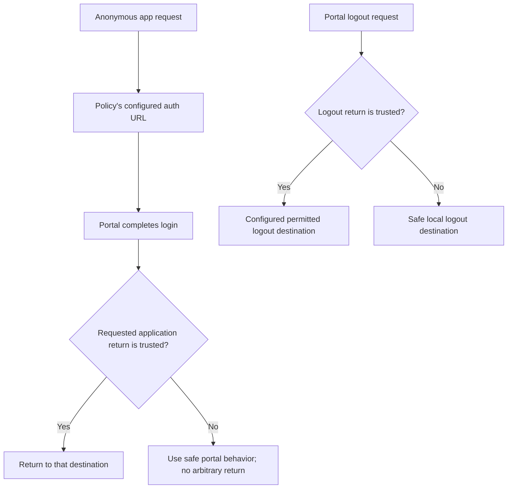

# Trusted Login and Logout Redirects

A protected application sends an unauthenticated browser to the portal with
`redirect_url` identifying its original destination. The portal records that
value only when a configured domain **and** path rule matches. Otherwise login
still works, but the browser continues to the portal rather than that destination.

Trust rules govern navigation. They neither grant application access nor share
cookies across hosts. A complete deployment needs matching routes, a usable
application role, verification keys and [cookie scope](auth-cookie.md).




## Trust Login Redirect URI

Inside the portal, explicitly trust the application's exact host and routes:

```caddyfile
trust login redirect uri domain exact app.example.com path exact /dashboard
trust login redirect uri domain exact app.example.com path prefix /dashboard/
```

Both conditions in one rule must match; several rules are alternatives. Omitting
the strategy selects exact matching. The two paths above admit `/dashboard` and
its descendants without also admitting `/dashboard-other`.

Avoid `domain suffix example.com`: it also matches `evil-example.com`. If many
subdomains are intentionally trusted, an anchored, escaped regex can distinguish
a label boundary, but an explicit list of application hosts is easier to audit.
A domain rule matches URL `Host`, including a port, and a path rule matches `Path`;
query parameters are not an additional restriction. These directives contain no
scheme matcher. Keep generated application destinations canonical HTTPS and do
not describe a host/path rule as enforcing HTTPS by itself.

### Full Configuration Example

Use the tested [generic OIDC example](oauth/81-backend-oauth2-0000-generic.md) for a complete
single-host deployment. For a cross-host portal, all these settings must agree:

| Setting | Example |
| --- | --- |
| Portal handler mount | `https://auth.example.com/auth/` |
| Policy auth URL | `https://auth.example.com/auth/oauth2/upstream` |
| Trusted return host/path | Exact `app.example.com`, exact `/dashboard` and prefix `/dashboard/` |
| Access-cookie delivery | `cookie domain example.com` and `cookie path /`, only if all subdomains are trusted |
| Application policy | Matching verifier plus an explicitly granted `app/member` role |

A relative auth URL such as `/auth/login` on the application host cannot reach a
portal that exists only on a different host. Trusted redirects do not fix that
routing error. Prefer a single host when broad parent-domain cookies would expose
credentials to unrelated subdomains.

### How It Works

1. The anonymous browser requests the protected application.
2. Its policy redirects to the configured auth URL with an encoded `redirect_url`.
3. The portal checks the host/path pair and records a trusted target in its
   mount-scoped return cookie.
4. The user completes the required login and receives an access credential.
5. The portal consumes the return destination; the application evaluates its
   own policy on the new request.

A trusted return destination does not make a nonmember pass the application ACL.
Test a member, a nonmember and an anonymous user.

### Match Types

| Type | Behavior |
| --- | --- |
| `exact` | Entire value equals the configured value |
| `partial` | Configured text appears anywhere |
| `prefix` | Value starts with configured text |
| `suffix` | Value ends with configured text |
| `regex` | Go regular expression matches; anchor it when requiring the entire value |

Matching is case-sensitive string comparison except for the chosen regex behavior.
Include escaped dots and intentional label/path boundaries. Use exact matching
for sign-out landing pages and other fixed destinations.

### Troubleshooting

Enable [diagnostic logging](../operations/logging.md) locally and look for
`provided redirect_url is not trusted` or
`trust login redirect uri is not configured, but detected redirect_url attempt`.
Check the actual host **including port**, path, portal mount, cookie delivery and
policy auth URL. Avoid logging live credential cookies while investigating.

Try the intended destination and rejection cases: a lookalike hostname,
`app.example.com.evil.test`, an unexpected port, `/dashboard-other`, and a URL
outside the permitted paths. Check the Location and Set-Cookie headers as well
as the final browser destination.

## Trust Logout Redirect URI

Logout uses **`redirect_uri`**, not the login parameter. For a fixed landing page:

```caddyfile
trust logout redirect uri domain exact app.example.com path exact /signed-out
```

The same domain/path matching applies. [Logout](15-logout.md#external-endpoint-logout)
explains the separate upstream provider flow and refresh-session confirmation.
A trusted landing page does not itself revoke any additional credential.

## Non-Standard Ports

List the actual port rather than accepting every port:

```caddyfile
trust login redirect uri domain exact app.example.com:8443 path prefix /dashboard/
trust logout redirect uri domain exact app.example.com:8443 path exact /signed-out
```

For a deliberately reviewed pair of ports, an anchored regex can use
`^app[.]example[.]com:(443|8443)$`. A URL with no explicit port still has a different
Host string from one containing `:443`; add a separate exact rule when needed.

## Agentic Prompts

Copy a prompt into your LLM to explore this topic. Each prompt prioritizes
upstream repository guidance and code over this page, and asks for version-aware
reasoning.

<div className="agentic-prompts">

<details>
<summary>Trace trusted navigation</summary>

```text
Help me understand Trusted Login and Logout Redirects.

Primary authorities (take precedence over website documentation):
https://github.com/greenpau/caddy-security/blob/main/AGENTS.md
https://github.com/greenpau/caddy-security/tree/main/.codex/skills
https://github.com/greenpau/go-authcrunch/blob/main/AGENTS.md
https://github.com/greenpau/go-authcrunch/tree/main/.codex/skills
Read each repository's root AGENTS.md first, then any scoped AGENTS.md that
applies to inspected paths. Read the relevant SKILL.md files and follow their
implementation and test references.

Relevant skills to locate: configuration-authentication,
authentication-portal-cookies.

Secondary reference:
https://docs.authcrunch.com/docs/authenticate/trust-login-logout

If a source is inaccessible, ask me to paste its relevant text. Identify the
versions your answer applies to; main may be newer than my release. Resolve
disagreements using code and tests, and flag unverified claims. Use synthetic
credentials and redacted examples; explain proposed checks before any changes.

Explain how a policy supplies redirect_url and the portal checks domain plus
path before storing a return destination. Contrast a trusted destination with
cookie sharing and application access. Use an anonymous user, member, and
nonmember in one flow diagram.
```

</details>

<details>
<summary>Review host and path matching</summary>

```text
Help me understand Trusted Login and Logout Redirects.

Primary authorities (take precedence over website documentation):
https://github.com/greenpau/caddy-security/blob/main/AGENTS.md
https://github.com/greenpau/caddy-security/tree/main/.codex/skills
https://github.com/greenpau/go-authcrunch/blob/main/AGENTS.md
https://github.com/greenpau/go-authcrunch/tree/main/.codex/skills
Read each repository's root AGENTS.md first, then any scoped AGENTS.md that
applies to inspected paths. Read the relevant SKILL.md files and follow their
implementation and test references.

Relevant skills to locate: configuration-authentication,
authentication-portal-cookies.

Secondary reference:
https://docs.authcrunch.com/docs/authenticate/trust-login-logout

If a source is inaccessible, ask me to paste its relevant text. Identify the
versions your answer applies to; main may be newer than my release. Resolve
disagreements using code and tests, and flag unverified claims. Use synthetic
credentials and redacted examples; explain proposed checks before any changes.

Compare exact/prefix/suffix/regex rules for app.example.com and /dashboard/.
Include evil-example.com, app.example.com.evil.test, /dashboard-other, and
explicit ports. Derive matching from the implementation; explain which URL
parts these rules do not restrict.
```

</details>

<details>
<summary>Diagnose landing on Applications</summary>

```text
Help me understand Trusted Login and Logout Redirects.

Primary authorities (take precedence over website documentation):
https://github.com/greenpau/caddy-security/blob/main/AGENTS.md
https://github.com/greenpau/caddy-security/tree/main/.codex/skills
https://github.com/greenpau/go-authcrunch/blob/main/AGENTS.md
https://github.com/greenpau/go-authcrunch/tree/main/.codex/skills
Read each repository's root AGENTS.md first, then any scoped AGENTS.md that
applies to inspected paths. Read the relevant SKILL.md files and follow their
implementation and test references.

Relevant skills to locate: configuration-authentication,
authentication-portal-cookies.

Secondary reference:
https://docs.authcrunch.com/docs/authenticate/trust-login-logout

If a source is inaccessible, ask me to paste its relevant text. Identify the
versions your answer applies to; main may be newer than my release. Resolve
disagreements using code and tests, and flag unverified claims. Use synthetic
credentials and redacted examples; explain proposed checks before any changes.

Help me investigate login that ends on the portal instead of the requested
app. Ask for redacted target host/port/path, trust rules, mount, and
return-cookie metadata. Separate rejected navigation from cookie delivery or
application-role failure.
```

</details>

<details>
<summary>Plan cross-host tests</summary>

```text
Help me understand Trusted Login and Logout Redirects.

Primary authorities (take precedence over website documentation):
https://github.com/greenpau/caddy-security/blob/main/AGENTS.md
https://github.com/greenpau/caddy-security/tree/main/.codex/skills
https://github.com/greenpau/go-authcrunch/blob/main/AGENTS.md
https://github.com/greenpau/go-authcrunch/tree/main/.codex/skills
Read each repository's root AGENTS.md first, then any scoped AGENTS.md that
applies to inspected paths. Read the relevant SKILL.md files and follow their
implementation and test references.

Relevant skills to locate: configuration-authentication,
authentication-portal-cookies.

Secondary reference:
https://docs.authcrunch.com/docs/authenticate/trust-login-logout

If a source is inaccessible, ask me to paste its relevant text. Identify the
versions your answer applies to; main may be newer than my release. Resolve
disagreements using code and tests, and flag unverified claims. Use synthetic
credentials and redacted examples; explain proposed checks before any changes.

Design tests that align policy auth URL, portal mount, trusted return rule,
access-cookie delivery, verifier, and member ACL. Include a relative auth URL
on the wrong host. Explain why changing a trust rule cannot repair unreachable
routing or untrusted parent-domain cookie exposure.
```

</details>

<details>
<summary>Practice login versus logout</summary>

```text
Help me understand Trusted Login and Logout Redirects.

Primary authorities (take precedence over website documentation):
https://github.com/greenpau/caddy-security/blob/main/AGENTS.md
https://github.com/greenpau/caddy-security/tree/main/.codex/skills
https://github.com/greenpau/go-authcrunch/blob/main/AGENTS.md
https://github.com/greenpau/go-authcrunch/tree/main/.codex/skills
Read each repository's root AGENTS.md first, then any scoped AGENTS.md that
applies to inspected paths. Read the relevant SKILL.md files and follow their
implementation and test references.

Relevant skills to locate: configuration-authentication,
authentication-portal-cookies.

Secondary reference:
https://docs.authcrunch.com/docs/authenticate/trust-login-logout

If a source is inaccessible, ask me to paste its relevant text. Identify the
versions your answer applies to; main may be newer than my release. Resolve
disagreements using code and tests, and flag unverified claims. Use synthetic
credentials and redacted examples; explain proposed checks before any changes.

Quiz me on login redirect_url, logout redirect_uri, domain/path AND,
alternative rules, scheme handling, and omitted versus explicit ports. Wait
for each answer and have me predict both the final destination and independent
application-access decision.
```

</details>

</div>

## Source Code References

Start with the code search, then follow the parser, runtime, and tests relevant
to this topic. These links target `main`; use GitHub's branch/tag selector to
compare them with your installed release.

1. [Search this topic in both repositories](https://github.com/search?q=%28repo%3Agreenpau%2Fgo-authcrunch%20OR%20repo%3Agreenpau%2Fcaddy-security%29%20%28TrustedRedirect%20OR%20RedirectURI%20OR%20injectRedirectURL%29&type=code)
   — searches topic-specific symbols and paths across both codebases.
2. [caddy-security: caddyfile_authn_misc.go](https://github.com/greenpau/caddy-security/blob/main/caddyfile_authn_misc.go)
   — parses portal options, selections, and trusted redirect rules.
3. [go-authcrunch: pkg/authn/inject_redirect_url.go](https://github.com/greenpau/go-authcrunch/blob/main/pkg/authn/inject_redirect_url.go)
   — accepts a trusted login return URL into portal state.
4. [go-authcrunch: pkg/redirects/redirect_match.go](https://github.com/greenpau/go-authcrunch/blob/main/pkg/redirects/redirect_match.go)
   — evaluates configured host/path return-target trust rules.
5. [go-authcrunch: pkg/redirects/redirect_match_test.go](https://github.com/greenpau/go-authcrunch/blob/main/pkg/redirects/redirect_match_test.go)
   — tests redirect matching strategies and target boundaries.
6. [go-authcrunch: pkg/authn/handle_http_logout_test.go](https://github.com/greenpau/go-authcrunch/blob/main/pkg/authn/handle_http_logout_test.go)
   — tests portal logout responses and destinations.
