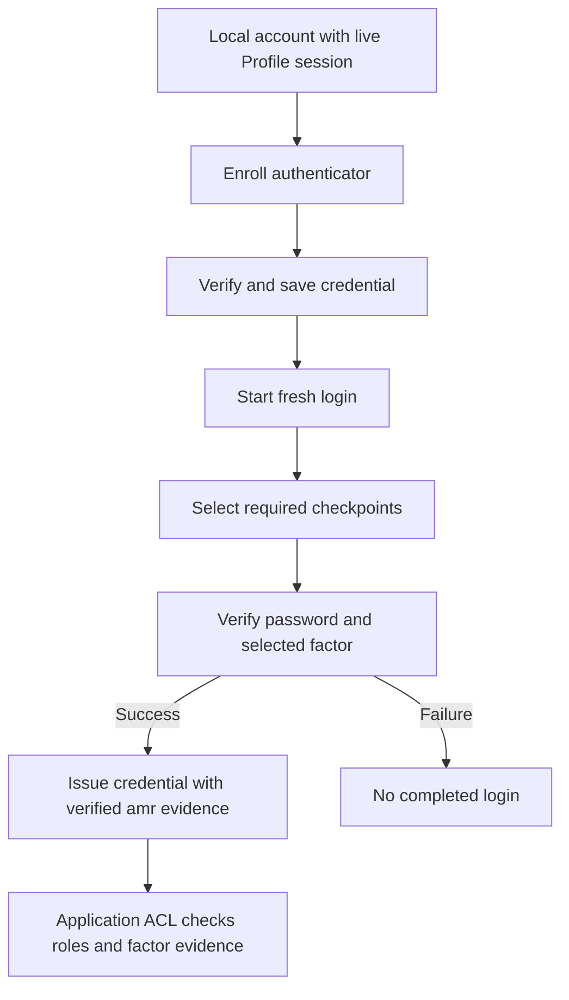

# Multi-factor authentication

For local accounts, the portal can require a password followed by a registered
TOTP authenticator or WebAuthn credential. An external OAuth, SAML or LDAP
provider's own MFA is a separate policy at that provider; `require mfa` does not
turn an upstream login into a local enrollment workflow.




## Enabling MFA

Add this fragment to an otherwise working local portal:

```caddyfile
transform user {
    match realm local
    require mfa
}
```

Match the store's **realm**, not just the fact that it is a local store. Start
with the [first application](../start/first-app.md), then enable MFA for its local
realm. Keep application roles and signing keys unchanged while testing the
additional checkpoint.

Without an explicit challenge policy, local login normally requires a password
and any configured MFA. `require mfa` adds the MFA requirement, including enrollment
when no usable token exists. Creating a token changes credential state: enrollment
is not proof that a subsequent login checkpoint has passed. Complete a fresh
login with the newly registered method.

For a deliberate passwordless or ordered-method policy, use
[authentication challenges](13-authentication-challenges.md). A password-only
fallback explicitly weakens that policy; choose it only when intended.

## Add MFA Authenticator Application

For an already signed-in local user with `authp/user` or `authp/admin`, open
`/auth/profile/`, then choose MFA and add an authenticator application. First-login
enrollment may instead appear in the sandbox flow when the policy requires it.

1. Use HTTPS and confirm that you are enrolling the intended account.
2. Add an account in a TOTP application and scan the **new QR displayed by your
   own portal**, or enter its secret manually.
3. Give the token a recognizable comment and submit the verification code
   requested by the current form. The current profile form uses one code;
   the historical form below requested two consecutive codes.
4. Finish enrollment and sign in again. Confirm that a password alone does not
   complete login, a wrong/expired code is rejected, and the current code succeeds.

The provisioning URI follows the [authenticator key URI format](https://github.com/google/google-authenticator/wiki/Key-Uri-Format).
Synchronize the server and authenticator clocks. The enrollment secret and QR are
credentials; the historical demonstration below must never be reused as a real
account's secret.

<figure className="doc-screenshot">
  <a href={require('./images/settings_mfa_app.png').default}></a>
  <figcaption>Historical Settings UI. Current account management is at `/profile/` and its TOTP form differs; use the QR and verification fields displayed by your running release.</figcaption>
</figure>

<details className="screenshot-gallery">
<summary>Historical Microsoft Authenticator enrollment sequence</summary>

<figure className="doc-screenshot">
  
  <figcaption>Add the account type supported by your authenticator's current interface.</figcaption>
</figure>
<figure className="doc-screenshot">
  
  <figcaption>Scan your own portal's fresh enrollment QR; this older image illustrates the camera step.</figcaption>
</figure>
<figure className="doc-screenshot">
  
  <figcaption>The authenticator produces time-based codes after enrollment.</figcaption>
</figure>

</details>

## Hardware tokens and passkeys

WebAuthn enrollment and assertion require a secure browser origin. Keep the
portal hostname stable; credentials are bound to its relying-party identity.
The historical `u2f` keyword selects this hardware/passkey checkpoint. Issuing
an assertion challenge alone does not complete authentication.

Test the actual browser and device combinations you support. A discoverable
passkey is not an automatic promise of username-free login in this portal.
Maintain a reviewed recovery process with a local administrator; the released
`/recover` handler does not implement a complete password or MFA recovery flow.

## Agentic Prompts

Copy a prompt into your LLM to explore this topic. Each prompt prioritizes
upstream repository guidance and code over this page, and asks for version-aware
reasoning.

<div className="agentic-prompts">

<details>
<summary>Separate enrollment and authentication</summary>

```text
Help me understand Multi-factor authentication.

Primary authorities (take precedence over website documentation):
https://github.com/greenpau/caddy-security/blob/main/AGENTS.md
https://github.com/greenpau/caddy-security/tree/main/.codex/skills
https://github.com/greenpau/go-authcrunch/blob/main/AGENTS.md
https://github.com/greenpau/go-authcrunch/tree/main/.codex/skills
Read each repository's root AGENTS.md first, then any scoped AGENTS.md that
applies to inspected paths. Read the relevant SKILL.md files and follow their
implementation and test references.

Relevant skills to locate: authentication-portal-mfa,
authentication-portal-challenges,
configuration-authentication-user-transforms.

Secondary reference:
https://docs.authcrunch.com/docs/authenticate/mfa

If a source is inaccessible, ask me to paste its relevant text. Identify the
versions your answer applies to; main may be newer than my release. Resolve
disagreements using code and tests, and flag unverified claims. Use synthetic
credentials and redacted examples; explain proposed checks before any changes.

Explain require mfa for a local realm, first-login enrollment, and a fresh
factor-verified login. Contrast this with upstream provider MFA. Show why a
registered authenticator or an added role is not evidence that a checkpoint
succeeded.
```

</details>

<details>
<summary>Compare TOTP and WebAuthn</summary>

```text
Help me understand Multi-factor authentication.

Primary authorities (take precedence over website documentation):
https://github.com/greenpau/caddy-security/blob/main/AGENTS.md
https://github.com/greenpau/caddy-security/tree/main/.codex/skills
https://github.com/greenpau/go-authcrunch/blob/main/AGENTS.md
https://github.com/greenpau/go-authcrunch/tree/main/.codex/skills
Read each repository's root AGENTS.md first, then any scoped AGENTS.md that
applies to inspected paths. Read the relevant SKILL.md files and follow their
implementation and test references.

Relevant skills to locate: authentication-portal-mfa,
authentication-portal-challenges,
configuration-authentication-user-transforms.

Secondary reference:
https://docs.authcrunch.com/docs/authenticate/mfa

If a source is inaccessible, ask me to paste its relevant text. Identify the
versions your answer applies to; main may be newer than my release. Resolve
disagreements using code and tests, and flag unverified claims. Use synthetic
credentials and redacted examples; explain proposed checks before any changes.

Explain the verification assumptions for a TOTP app and a WebAuthn credential:
secret/time versus secure origin/relying-party identity. Distinguish
hardware/passkey support from a promise of username-free login. Use synthetic
examples and never request an enrollment secret.
```

</details>

<details>
<summary>Diagnose a factor failure</summary>

```text
Help me understand Multi-factor authentication.

Primary authorities (take precedence over website documentation):
https://github.com/greenpau/caddy-security/blob/main/AGENTS.md
https://github.com/greenpau/caddy-security/tree/main/.codex/skills
https://github.com/greenpau/go-authcrunch/blob/main/AGENTS.md
https://github.com/greenpau/go-authcrunch/tree/main/.codex/skills
Read each repository's root AGENTS.md first, then any scoped AGENTS.md that
applies to inspected paths. Read the relevant SKILL.md files and follow their
implementation and test references.

Relevant skills to locate: authentication-portal-mfa,
authentication-portal-challenges,
configuration-authentication-user-transforms.

Secondary reference:
https://docs.authcrunch.com/docs/authenticate/mfa

If a source is inaccessible, ask me to paste its relevant text. Identify the
versions your answer applies to; main may be newer than my release. Resolve
disagreements using code and tests, and flag unverified claims. Use synthetic
credentials and redacted examples; explain proposed checks before any changes.

Help me investigate a local user stuck at enrollment or a failed factor
checkpoint. Ask about realm matching, registered method, server/authenticator
clock, browser origin, and selected challenges. Separate wrong/expired
assertion from unavailable-method policy and unsupported recovery UI.
```

</details>

<details>
<summary>Design fresh-login tests</summary>

```text
Help me understand Multi-factor authentication.

Primary authorities (take precedence over website documentation):
https://github.com/greenpau/caddy-security/blob/main/AGENTS.md
https://github.com/greenpau/caddy-security/tree/main/.codex/skills
https://github.com/greenpau/go-authcrunch/blob/main/AGENTS.md
https://github.com/greenpau/go-authcrunch/tree/main/.codex/skills
Read each repository's root AGENTS.md first, then any scoped AGENTS.md that
applies to inspected paths. Read the relevant SKILL.md files and follow their
implementation and test references.

Relevant skills to locate: authentication-portal-mfa,
authentication-portal-challenges,
configuration-authentication-user-transforms.

Secondary reference:
https://docs.authcrunch.com/docs/authenticate/mfa

If a source is inaccessible, ask me to paste its relevant text. Identify the
versions your answer applies to; main may be newer than my release. Resolve
disagreements using code and tests, and flag unverified claims. Use synthetic
credentials and redacted examples; explain proposed checks before any changes.

Plan cases for a new account, enrolled factor, password alone, wrong/expired
TOTP, WebAuthn on the wrong origin, and stronger challenge policy. Explain
which observations show enrollment and which prove completed factors. Use
disposable accounts only.
```

</details>

<details>
<summary>Review a fallback decision</summary>

```text
Help me understand Multi-factor authentication.

Primary authorities (take precedence over website documentation):
https://github.com/greenpau/caddy-security/blob/main/AGENTS.md
https://github.com/greenpau/caddy-security/tree/main/.codex/skills
https://github.com/greenpau/go-authcrunch/blob/main/AGENTS.md
https://github.com/greenpau/go-authcrunch/tree/main/.codex/skills
Read each repository's root AGENTS.md first, then any scoped AGENTS.md that
applies to inspected paths. Read the relevant SKILL.md files and follow their
implementation and test references.

Relevant skills to locate: authentication-portal-mfa,
authentication-portal-challenges,
configuration-authentication-user-transforms.

Secondary reference:
https://docs.authcrunch.com/docs/authenticate/mfa

If a source is inaccessible, ask me to paste its relevant text. Identify the
versions your answer applies to; main may be newer than my release. Resolve
disagreements using code and tests, and flag unverified claims. Use synthetic
credentials and redacted examples; explain proposed checks before any changes.

Compare require mfa with an explicit ordered challenge policy and a
password-only fallback. Ask what level of assurance I require and how recovery
is administered. Quiz me on why Basic or API-key authentication cannot
manufacture interactive-factor evidence.
```

</details>

</div>

## Source Code References

Start with the code search, then follow the parser, runtime, and tests relevant
to this topic. These links target `main`; use GitHub's branch/tag selector to
compare them with your installed release.

1. [Search this topic in both repositories](https://github.com/search?q=%28repo%3Agreenpau%2Fgo-authcrunch%20OR%20repo%3Agreenpau%2Fcaddy-security%29%20%28RequireMFA%20OR%20WebAuthn%20OR%20TOTP%29&type=code)
   — searches topic-specific symbols and paths across both codebases.
2. [caddy-security: caddyfile_authn_transform.go](https://github.com/greenpau/caddy-security/blob/main/caddyfile_authn_transform.go)
   — adapts user-transform matchers, actions, and required challenges.
3. [go-authcrunch: pkg/authchal/config/check.go](https://github.com/greenpau/go-authcrunch/blob/main/pkg/authchal/config/check.go)
   — selects an ordered sequence from available authentication methods.
4. [go-authcrunch: pkg/authn/authentication_challenges.go](https://github.com/greenpau/go-authcrunch/blob/main/pkg/authn/authentication_challenges.go)
   — checks direct credential login against resolved challenge requirements.
5. [go-authcrunch: pkg/authn/webauthn_enrollment.go](https://github.com/greenpau/go-authcrunch/blob/main/pkg/authn/webauthn_enrollment.go)
   — binds WebAuthn enrollment to account and browser state.
6. [go-authcrunch: pkg/authn/mfa_enrollment_e2e_test.go](https://github.com/greenpau/go-authcrunch/blob/main/pkg/authn/mfa_enrollment_e2e_test.go)
   — tests local MFA enrollment and authentication behavior.
7. [go-authcrunch: pkg/authn/authentication_challenges_sequence_e2e_test.go](https://github.com/greenpau/go-authcrunch/blob/main/pkg/authn/authentication_challenges_sequence_e2e_test.go)
   — tests ordered authentication sequences through portal requests.
