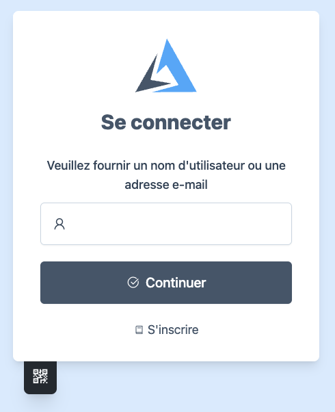

# Internationalization (i18n)

The following configuration changes the language to French:

```Caddyfile
authentication portal myportal {
  ui {
    language fr
  }
}
```



The translations for various messages are [here](https://github.com/greenpau/go-authcrunch/blob/main/pkg/translate/data/messages.json).

At the moment, the authentication portal supports the following languages:

```json
    {
        "id": "thank_you",
        "description": "A standard expression of gratitude.",
        "other": {
            "en": "Thank you!",
            "de": "Vielen Dank!",
            "fr": "Merci !",
            "ja": "ありがとうございます！",
            "zh": "谢谢！",
            "he": "תודה רבה!",
            "ar": "شكراً لك!",
            "ru": "Спасибо!"
        }
    }
```

