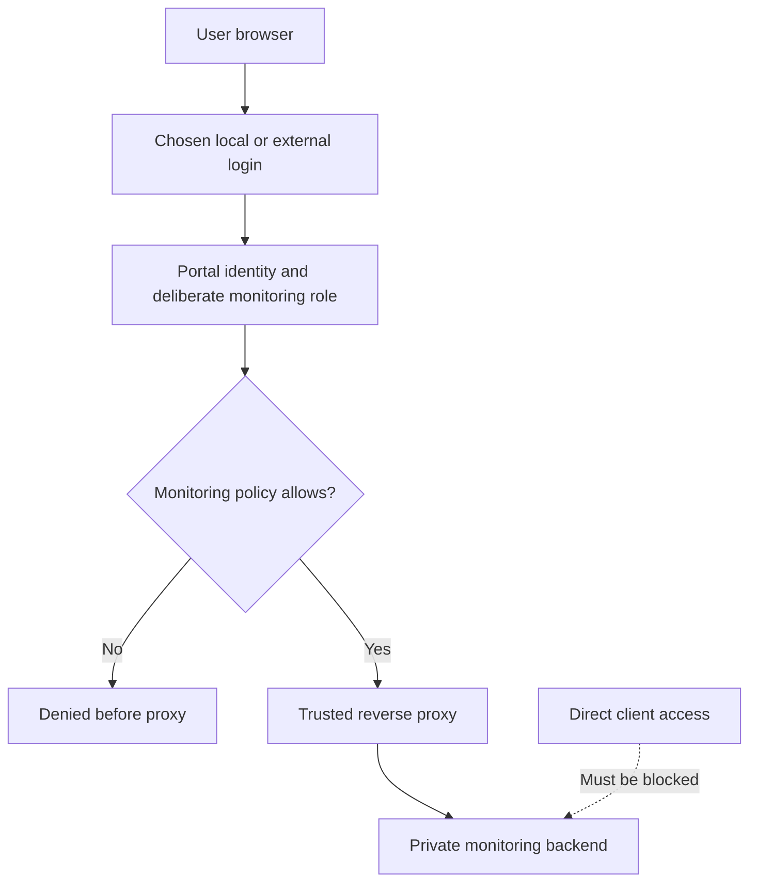

# Monitoring application example

Protect each monitoring application's entire route with an authorization policy,
then configure that application's external URL to match the proxy path. Login
alone does not protect Prometheus, Alertmanager, Kibana or Elasticsearch; the
`authorize` handler must run before their responses and proxy requests.




## Choose the login source

Begin with the maintained [local walkthrough](../start/first-app.md),
[LDAP guide](ldap/10-ldap.md), or [GitHub guide](oauth/81-backend-oauth2-0007-github.md).
Grant a distinct application role such as `app/monitoring` and require it in the
monitoring policy. Separate read-only viewers from administration rather than
letting every portal user reach every service.

The repository's [legacy combined LDAP example](https://github.com/authcrunch/authcrunch.github.io/blob/main/assets/conf/ldap/Caddyfile)
shows the historical architecture, but includes obsolete UI directives, broad
roles, demo credentials and skipped certificate verification. It is not the
current production starting point.

## Protect a route before proxying

In an otherwise complete deployment with `monitoringpolicy` already defined:

```caddyfile
@prometheus path /prometheus /prometheus/*
handle @prometheus {
    route {
        authorize with monitoringpolicy
        reverse_proxy 127.0.0.1:9090
    }
}
```

This preserves the prefix. Configure Prometheus's public external URL and route
prefix to match, or deliberately choose a stripping proxy design and configure
the backend for that design. Apply the same decision to assets, redirects,
WebSockets and API requests; protecting just the landing page is insufficient.

For Kibana, `server.basePath: "/kibana"` alone does not define who removes the
prefix. Configure its matching rewrite/public-URL settings for your installed
Kibana version and proxy design. AuthCrunch does not replace Elasticsearch's
backend account permissions or Kibana's native security features.

## Verify the boundary

Check anonymous redirect, a monitoring member's access and a nonmember's 403 for
both the root and an API/static path. Verify logout, generated links, backend
redirects and streaming/WebSocket requests. Bind backends privately so users
cannot bypass the policy by reaching their original listening ports.

For server-to-server monitoring clients, choose a documented nonbrowser
credential flow and policy. Do not make the whole monitoring namespace public
just because a scraper cannot follow interactive login.

## Agentic Prompts

Copy a prompt into your LLM to explore this topic. Each prompt prioritizes
upstream repository guidance and code over this page, and asks for version-aware
reasoning.

<div className="agentic-prompts">

<details>
<summary>Draw the monitoring boundary</summary>

```text
Help me understand Monitoring application example.

Primary authorities (take precedence over website documentation):
https://github.com/greenpau/caddy-security/blob/main/AGENTS.md
https://github.com/greenpau/caddy-security/tree/main/.codex/skills
https://github.com/greenpau/go-authcrunch/blob/main/AGENTS.md
https://github.com/greenpau/go-authcrunch/tree/main/.codex/skills
Read each repository's root AGENTS.md first, then any scoped AGENTS.md that
applies to inspected paths. Read the relevant SKILL.md files and follow their
implementation and test references.

Relevant skills to locate: configuration-http-integrations,
configuration-authorization, configuration-identity-stores.

Secondary reference:
https://docs.authcrunch.com/docs/authenticate/usage-examples

If a source is inaccessible, ask me to paste its relevant text. Identify the
versions your answer applies to; main may be newer than my release. Resolve
disagreements using code and tests, and flag unverified claims. Use synthetic
credentials and redacted examples; explain proposed checks before any changes.

Map browser, portal, authorize handler, proxy, and private
Prometheus/Alertmanager/Kibana backend. Explain why protecting a landing page
is insufficient. Compare navigation links with access to API, static,
streaming, and WebSocket routes.
```

</details>

<details>
<summary>Compare proxy prefix designs</summary>

```text
Help me understand Monitoring application example.

Primary authorities (take precedence over website documentation):
https://github.com/greenpau/caddy-security/blob/main/AGENTS.md
https://github.com/greenpau/caddy-security/tree/main/.codex/skills
https://github.com/greenpau/go-authcrunch/blob/main/AGENTS.md
https://github.com/greenpau/go-authcrunch/tree/main/.codex/skills
Read each repository's root AGENTS.md first, then any scoped AGENTS.md that
applies to inspected paths. Read the relevant SKILL.md files and follow their
implementation and test references.

Relevant skills to locate: configuration-http-integrations,
configuration-authorization, configuration-identity-stores.

Secondary reference:
https://docs.authcrunch.com/docs/authenticate/usage-examples

If a source is inaccessible, ask me to paste its relevant text. Identify the
versions your answer applies to; main may be newer than my release. Resolve
disagreements using code and tests, and flag unverified claims. Use synthetic
credentials and redacted examples; explain proposed checks before any changes.

Help me compare preserving a /prometheus or /kibana prefix with explicitly
stripping it. Ask for the installed backend versions and consult their
official external-URL/base-path documentation. Explain which component
rewrites the path and how redirects/assets must agree.
```

</details>

<details>
<summary>Review membership and administration</summary>

```text
Help me understand Monitoring application example.

Primary authorities (take precedence over website documentation):
https://github.com/greenpau/caddy-security/blob/main/AGENTS.md
https://github.com/greenpau/caddy-security/tree/main/.codex/skills
https://github.com/greenpau/go-authcrunch/blob/main/AGENTS.md
https://github.com/greenpau/go-authcrunch/tree/main/.codex/skills
Read each repository's root AGENTS.md first, then any scoped AGENTS.md that
applies to inspected paths. Read the relevant SKILL.md files and follow their
implementation and test references.

Relevant skills to locate: configuration-http-integrations,
configuration-authorization, configuration-identity-stores.

Secondary reference:
https://docs.authcrunch.com/docs/authenticate/usage-examples

If a source is inaccessible, ask me to paste its relevant text. Identify the
versions your answer applies to; main may be newer than my release. Resolve
disagreements using code and tests, and flag unverified claims. Use synthetic
credentials and redacted examples; explain proposed checks before any changes.

Compare a monitoring-specific member role, a read-only viewer, and backend
administration permissions. Explain why every portal user should not
automatically receive access and why AuthCrunch does not replace
Elasticsearch/Kibana’s native authorization.
```

</details>

<details>
<summary>Diagnose a broken subresource</summary>

```text
Help me understand Monitoring application example.

Primary authorities (take precedence over website documentation):
https://github.com/greenpau/caddy-security/blob/main/AGENTS.md
https://github.com/greenpau/caddy-security/tree/main/.codex/skills
https://github.com/greenpau/go-authcrunch/blob/main/AGENTS.md
https://github.com/greenpau/go-authcrunch/tree/main/.codex/skills
Read each repository's root AGENTS.md first, then any scoped AGENTS.md that
applies to inspected paths. Read the relevant SKILL.md files and follow their
implementation and test references.

Relevant skills to locate: configuration-http-integrations,
configuration-authorization, configuration-identity-stores.

Secondary reference:
https://docs.authcrunch.com/docs/authenticate/usage-examples

If a source is inaccessible, ask me to paste its relevant text. Identify the
versions your answer applies to; main may be newer than my release. Resolve
disagreements using code and tests, and flag unverified claims. Use synthetic
credentials and redacted examples; explain proposed checks before any changes.

Help me investigate a dashboard that loads but its API or asset returns
redirects/403/404. Ask for redacted paths and routing order. Separate
proxy-prefix mismatch, missing session delivery, and policy denial before
suggesting a broad public bypass.
```

</details>

<details>
<summary>Test browser and scraper clients</summary>

```text
Help me understand Monitoring application example.

Primary authorities (take precedence over website documentation):
https://github.com/greenpau/caddy-security/blob/main/AGENTS.md
https://github.com/greenpau/caddy-security/tree/main/.codex/skills
https://github.com/greenpau/go-authcrunch/blob/main/AGENTS.md
https://github.com/greenpau/go-authcrunch/tree/main/.codex/skills
Read each repository's root AGENTS.md first, then any scoped AGENTS.md that
applies to inspected paths. Read the relevant SKILL.md files and follow their
implementation and test references.

Relevant skills to locate: configuration-http-integrations,
configuration-authorization, configuration-identity-stores.

Secondary reference:
https://docs.authcrunch.com/docs/authenticate/usage-examples

If a source is inaccessible, ask me to paste its relevant text. Identify the
versions your answer applies to; main may be newer than my release. Resolve
disagreements using code and tests, and flag unverified claims. Use synthetic
credentials and redacted examples; explain proposed checks before any changes.

Create cases for anonymous user, member, nonmember, root/API/static paths,
logout, backend direct reachability, and a nonbrowser scraper. Explain a
documented machine credential flow and how to keep the whole monitoring
namespace from becoming public.
```

</details>

</div>

## Source Code References

Start with the code search, then follow the parser, runtime, and tests relevant
to this topic. These links target `main`; use GitHub's branch/tag selector to
compare them with your installed release.

1. [Search this topic in both repositories](https://github.com/search?q=%28repo%3Agreenpau%2Fgo-authcrunch%20OR%20repo%3Agreenpau%2Fcaddy-security%29%20%28AuthorizationHandler%20OR%20AuthzMiddleware%20OR%20ServeHTTP%29&type=code)
   — searches topic-specific symbols and paths across both codebases.
2. [caddy-security: plugin_authorization.go](https://github.com/greenpau/caddy-security/blob/main/plugin_authorization.go)
   — preserves handled responses and applies authorized identity in the Caddy handler chain.
3. [caddy-security: plugin_authz.go](https://github.com/greenpau/caddy-security/blob/main/plugin_authz.go)
   — connects policy results to Caddy authentication and route configuration.
4. [caddy-security: caddyfile_authz.go](https://github.com/greenpau/caddy-security/blob/main/caddyfile_authz.go)
   — dispatches authorization-policy subdirectives into library configuration.
5. [go-authcrunch: pkg/authz/gatekeeper.go](https://github.com/greenpau/go-authcrunch/blob/main/pkg/authz/gatekeeper.go)
   — constructs validators and handles policy requests, bypass, and redirects.
6. [go-authcrunch: pkg/authz/path_e2e_test.go](https://github.com/greenpau/go-authcrunch/blob/main/pkg/authz/path_e2e_test.go)
   — exercises request-path restrictions through gatekeeper requests.
