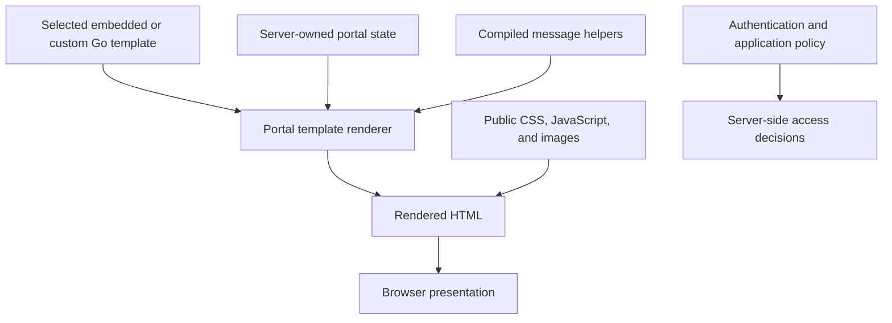

# Customizing the User Interface (UI)

Customize the authentication portal through its `ui` block, independently of this
Docusaurus documentation site. Begin with links, metadata and a local logo; use
CSS or template replacement only when those settings cannot express the change.
Keep the login fields, checkpoint bindings, mount paths and security headers intact.




## Templates

### Defining another theme

The released bundle registers **`basic` only**. `theme basic` selects it; an
arbitrary directory name does not register another theme. The embedded pages
already follow browser color preferences.

```caddyfile
ui {
    theme basic
    meta title "Example sign in"
    meta description "Sign in to Example applications"
    logo url /auth/assets/images/company.svg
    logo description "Example"
    static_asset assets/images/company.svg image/svg+xml /etc/authcrunch/ui/company.svg
}
```

This fragment belongs inside a working portal mounted at `/auth/`. Supply the
local asset and keep its public URL aligned with that mount. The current default
AuthCrunch logo is the blue/navy mark, not the historical green padlock.

### Creating a new theme

The built-in Go HTML templates are
[versioned in the library](https://github.com/greenpau/go-authcrunch/tree/v1.3.8/pkg/authn/ui/page_templates/basic).
They are compiled into the executable. A custom compiled theme is source-level
work, rather than a Caddyfile folder convention. For a deployment-level change,
override an existing page instead.

Current pages include login, portal, register, sandbox, whoami, session and OIDC.
The profile interface at `/profile/` is a separate embedded client application;
replacing an old `settings.template` does not replace that interface.

### Overriding a specific page template

Copy the selected release's template and configure its file:

```caddyfile
ui {
    template login /etc/authcrunch/ui/login.template
}
```

The engine uses Go `html/template`. Preserve the expected form actions, names,
server-provided state and escaping. Files must be readable by the service;
remote template URLs are unsupported. Test username/password, required MFA,
provider redirects, error states and mobile layout after replacement.

## Other customization

### Portal Links

Add application and account links explicitly:

```caddyfile
ui {
    links {
        "Example app" /app/ icon "las la-cube"
        "My identity" /auth/whoami icon "las la-id-card"
        "My profile" /auth/profile/ icon "las la-user"
        "Status" https://status.example.com target_blank
        "Future app" /future/ disabled
    }
}
```

`target_blank` opens a new tab, `icon` supplies a Line Awesome class, and `disabled`
omits the link. A visible link does not authorize its destination; protect each
application with its own policy. Profile account management requires a local
identity and an allowed portal role. Use [transforms](42-user-transforms.md#add-ui-links)
for identity-specific links.

<figure className="doc-screenshot">
  <a href={require('./images/portal_ui_icons.png').default}></a>
  <figcaption>Historical link styling. Current account management uses `/profile/`; the links above are explicit configuration.</figcaption>
</figure>

### Cascading Style Sheets (CSS)

```caddyfile
ui {
    custom css path /etc/authcrunch/ui/styles.css
}
```

For `/auth/`, the ordinary template pages serve this at
`/auth/assets/css/custom.css`. Use a file readable by the service and verify
contrast, keyboard focus, error text and narrow layouts. Do not assume every
selector from the older Settings UI exists in the current profile app.

### JavaScript

```caddyfile
ui {
    custom js path /etc/authcrunch/ui/script.js
}
```

Ordinary template pages load `/auth/assets/js/custom.js`. Code running there can
read form contents and alter authentication interactions; keep it minimal and
avoid third-party analytics on credential screens. A new refresh client must
obey [rotation and concurrency rules](30-refresh-token.md), rather than assuming
old portal JavaScript provides renewal.

The [A00002 script](https://github.com/authcrunch/authcrunch.github.io/blob/main/assets/solutions/A00002/custom.js)
is a historical customization example, not a current supported DOM/API contract.

### Custom HTML Template Header

```caddyfile
ui {
    custom html header path /etc/authcrunch/ui/head.html
}
```

This file is read **during Caddyfile adaptation** and injected into embedded
page headers. A runtime `{env.NAME}` path cannot satisfy that read; use an
absolute path or an adaptation-time `{$NAME}` value. Keep adapted configuration
private if the header contains private information. Verify the rendered result
on each affected page; this is not a universal profile-app customization hook.

### Other Static Assets

```caddyfile
ui {
    static_asset assets/css/app.css text/css /etc/authcrunch/ui/app.css
}
```

This serves the file at `/auth/assets/css/app.css`. Static asset URIs must start
with `assets/`; media types must describe the actual content. Static assets are
public: never place credentials, private keys, user databases or internal
configuration in them. Validate the complete Caddyfile, then inspect actual
responses and the browser console.

## Agentic Prompts

Copy a prompt into your LLM to explore this topic. Each prompt prioritizes
upstream repository guidance and code over this page, and asks for version-aware
reasoning.

<div className="agentic-prompts">

<details>
<summary>Map customization surfaces</summary>

```text
Help me understand Customizing the User Interface (UI).

Primary authorities (take precedence over website documentation):
https://github.com/greenpau/caddy-security/blob/main/AGENTS.md
https://github.com/greenpau/caddy-security/tree/main/.codex/skills
https://github.com/greenpau/go-authcrunch/blob/main/AGENTS.md
https://github.com/greenpau/go-authcrunch/tree/main/.codex/skills
Read each repository's root AGENTS.md first, then any scoped AGENTS.md that
applies to inspected paths. Read the relevant SKILL.md files and follow their
implementation and test references.

Relevant skills to locate: configuration-authentication-ui,
authentication-portal-themes.

Secondary reference:
https://docs.authcrunch.com/docs/authenticate/ui-features

If a source is inaccessible, ask me to paste its relevant text. Identify the
versions your answer applies to; main may be newer than my release. Resolve
disagreements using code and tests, and flag unverified claims. Use synthetic
credentials and redacted examples; explain proposed checks before any changes.

Explain configuration metadata/links/assets, local template overrides,
compiled themes, and the separate Profile app. Distinguish the authentication
portal from this documentation site. Check the registered themes in my release
rather than assuming any directory name enables a new theme.
```

</details>

<details>
<summary>Review a template override</summary>

```text
Help me understand Customizing the User Interface (UI).

Primary authorities (take precedence over website documentation):
https://github.com/greenpau/caddy-security/blob/main/AGENTS.md
https://github.com/greenpau/caddy-security/tree/main/.codex/skills
https://github.com/greenpau/go-authcrunch/blob/main/AGENTS.md
https://github.com/greenpau/go-authcrunch/tree/main/.codex/skills
Read each repository's root AGENTS.md first, then any scoped AGENTS.md that
applies to inspected paths. Read the relevant SKILL.md files and follow their
implementation and test references.

Relevant skills to locate: configuration-authentication-ui,
authentication-portal-themes.

Secondary reference:
https://docs.authcrunch.com/docs/authenticate/ui-features

If a source is inaccessible, ask me to paste its relevant text. Identify the
versions your answer applies to; main may be newer than my release. Resolve
disagreements using code and tests, and flag unverified claims. Use synthetic
credentials and redacted examples; explain proposed checks before any changes.

Walk through copying the release-matched login template and preserving form
actions, names, escaping, state, and portal mount. Explain which tasks require
source compilation versus a readable local override file. Ask what design
change I need before recommending replacement.
```

</details>

<details>
<summary>Diagnose a missing asset</summary>

```text
Help me understand Customizing the User Interface (UI).

Primary authorities (take precedence over website documentation):
https://github.com/greenpau/caddy-security/blob/main/AGENTS.md
https://github.com/greenpau/caddy-security/tree/main/.codex/skills
https://github.com/greenpau/go-authcrunch/blob/main/AGENTS.md
https://github.com/greenpau/go-authcrunch/tree/main/.codex/skills
Read each repository's root AGENTS.md first, then any scoped AGENTS.md that
applies to inspected paths. Read the relevant SKILL.md files and follow their
implementation and test references.

Relevant skills to locate: configuration-authentication-ui,
authentication-portal-themes.

Secondary reference:
https://docs.authcrunch.com/docs/authenticate/ui-features

If a source is inaccessible, ask me to paste its relevant text. Identify the
versions your answer applies to; main may be newer than my release. Resolve
disagreements using code and tests, and flag unverified claims. Use synthetic
credentials and redacted examples; explain proposed checks before any changes.

Help me inspect a logo/CSS/JS asset that fails to load. Check public assets/
URI, media type, filesystem permissions, mount prefix, and whether the file is
read at adaptation or runtime. Treat static assets as public and never request
private configuration as a served file.
```

</details>

<details>
<summary>Plan UI behavior checks</summary>

```text
Help me understand Customizing the User Interface (UI).

Primary authorities (take precedence over website documentation):
https://github.com/greenpau/caddy-security/blob/main/AGENTS.md
https://github.com/greenpau/caddy-security/tree/main/.codex/skills
https://github.com/greenpau/go-authcrunch/blob/main/AGENTS.md
https://github.com/greenpau/go-authcrunch/tree/main/.codex/skills
Read each repository's root AGENTS.md first, then any scoped AGENTS.md that
applies to inspected paths. Read the relevant SKILL.md files and follow their
implementation and test references.

Relevant skills to locate: configuration-authentication-ui,
authentication-portal-themes.

Secondary reference:
https://docs.authcrunch.com/docs/authenticate/ui-features

If a source is inaccessible, ask me to paste its relevant text. Identify the
versions your answer applies to; main may be newer than my release. Resolve
disagreements using code and tests, and flag unverified claims. Use synthetic
credentials and redacted examples; explain proposed checks before any changes.

Design browser checks for password/MFA, provider callbacks, errors, keyboard
focus, mobile layout, contrast, and ordinary versus Profile pages. Explain why
old DOM selectors and replacing settings.template may not affect the current
client. Include custom JavaScript’s access to credential forms.
```

</details>

<details>
<summary>Review navigation and branding</summary>

```text
Help me understand Customizing the User Interface (UI).

Primary authorities (take precedence over website documentation):
https://github.com/greenpau/caddy-security/blob/main/AGENTS.md
https://github.com/greenpau/caddy-security/tree/main/.codex/skills
https://github.com/greenpau/go-authcrunch/blob/main/AGENTS.md
https://github.com/greenpau/go-authcrunch/tree/main/.codex/skills
Read each repository's root AGENTS.md first, then any scoped AGENTS.md that
applies to inspected paths. Read the relevant SKILL.md files and follow their
implementation and test references.

Relevant skills to locate: configuration-authentication-ui,
authentication-portal-themes.

Secondary reference:
https://docs.authcrunch.com/docs/authenticate/ui-features

If a source is inaccessible, ask me to paste its relevant text. Identify the
versions your answer applies to; main may be newer than my release. Resolve
disagreements using code and tests, and flag unverified claims. Use synthetic
credentials and redacted examples; explain proposed checks before any changes.

Help me add current branding and a minimal app/identity/Profile link set while
preserving login behavior. Explain icons, disabled links, new-tab behavior,
and identity-specific transforms. Quiz me on why a visible link cannot replace
the destination’s authorization policy.
```

</details>

</div>

## Source Code References

Start with the code search, then follow the parser, runtime, and tests relevant
to this topic. These links target `main`; use GitHub's branch/tag selector to
compare them with your installed release.

1. [Search this topic in both repositories](https://github.com/search?q=%28repo%3Agreenpau%2Fgo-authcrunch%20OR%20repo%3Agreenpau%2Fcaddy-security%29%20%28UserInterface%20OR%20CustomCSS%20OR%20StaticAsset%29&type=code)
   — searches topic-specific symbols and paths across both codebases.
2. [caddy-security: caddyfile_authn_ui.go](https://github.com/greenpau/caddy-security/blob/main/caddyfile_authn_ui.go)
   — parses templates, metadata, links, language, and local UI assets.
3. [go-authcrunch: pkg/authn/ui/params.go](https://github.com/greenpau/go-authcrunch/blob/main/pkg/authn/ui/params.go)
   — defines template, branding, link, and asset parameters.
4. [go-authcrunch: pkg/authn/ui/ui.go](https://github.com/greenpau/go-authcrunch/blob/main/pkg/authn/ui/ui.go)
   — renders Go templates with portal state and template helpers.
5. [go-authcrunch: pkg/authn/portal.go](https://github.com/greenpau/go-authcrunch/blob/main/pkg/authn/portal.go)
   — constructs the portal, identity sources, session managers, and UI.
6. [go-authcrunch: pkg/authn/handle_http_static.go](https://github.com/greenpau/go-authcrunch/blob/main/pkg/authn/handle_http_static.go)
   — serves the portal’s embedded and configured public assets.
7. [go-authcrunch: pkg/authn/ui/ui_test.go](https://github.com/greenpau/go-authcrunch/blob/main/pkg/authn/ui/ui_test.go)
   — tests UI configuration and rendering behavior.
