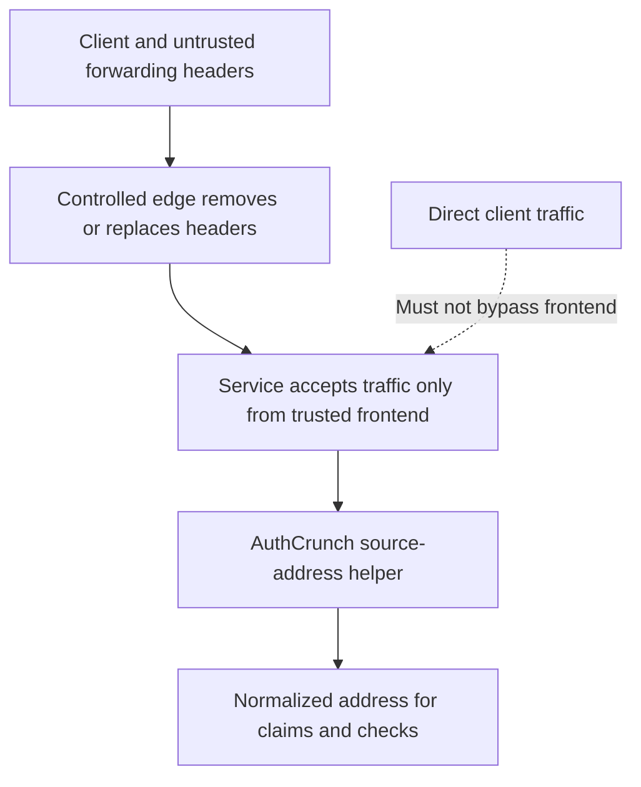

# Portal operations notes

Use the [version reference](../operations/versions.md) to identify the executable
and bundled library before investigating behavior. Runtime files, forwarding
headers and session ownership affect authentication independently of site layout.

## Binding to Privileged Ports

On Linux, follow your service manager's supported Caddy installation and
capability configuration. A binary capability can permit ports 80/443:

```sh
sudo setcap cap_net_bind_service=+ep /usr/local/bin/authcrunch
getcap /usr/local/bin/authcrunch
```

Use the actual installed path; this is not a deployment script. Replacing a
binary can remove its capabilities. Do not delete the installation directory
or run the whole authentication service as root merely to bind a port. A
higher-port listener behind a controlled frontend is another option.




## Recording Source IP Address in JWT Token

Inside an otherwise working portal and its policy:

```caddyfile
authentication portal myportal {
    enable identity store localdb
    enable source ip tracking
}

authorization policy apppolicy {
    validate source address
    allow roles app/member
}
```

This records a source address and compares it on protected requests. It is useful
only when both handlers see the same normalized, trustworthy client address.
Mobile networks, VPN changes and different proxy paths can invalidate legitimate
requests. It is not a replacement for authentication or token revocation.

The released address helper reads `X-Real-IP`, then `X-Forwarded-For`, then the
connection address. It also reads forwarding host/protocol headers when building
URLs. Syntax validation is **not** proof that those headers came from your proxy.
At a public edge, remove client-supplied forwarding headers before these handlers;
behind a proxy, admit requests only from the trusted frontend and have it replace
the headers with canonical values. Do not assume Caddy's separate trusted-proxy
setting automatically rewrites every header read by AuthCrunch.

Test spoofed forwarding headers, direct backend reachability and both IPv4/IPv6
before depending on [source-address filtering](../authorize/ip-filter.md).

## Session ID Cache

A portal's live session cache associates completed login with claims and backend
evidence. Account management needs that live context, not just a correctly signed
JWT. Thus a token may authorize an application while being insufficient for a
local profile operation.

[Persistent runtime state](../operations/runtime-state.md) can retain completed
sessions across a controlled stop/start. Without it, a restart can lose profile
session context even when an explicit JWT key still verifies older tokens.
Persistence is single-owner storage, not shared active/active session replication.

## Shortcuts

Prefer explicit named store/provider definitions and portal selections. Legacy
positional shortcuts hide realm and callback details and do not produce a complete
deployment on their own. Use the maintained
[local example](../start/first-app.md),
[generic OIDC example](oauth/81-backend-oauth2-0000-generic.md), or
[LDAP guide](ldap/10-ldap.md) for the corresponding boundary.

## Auto-Redirect URL

The policy's `set auth url` selects where anonymous requests begin login. The
portal's trusted `redirect_url` mechanism returns to a permitted application;
its default temporary cookie is `AUTHP_REDIRECT_URL`.

The separate `ui { auto_redirect_url ... }` setting chooses a configured portal
landing destination. It does not register OAuth callbacks, grant application
roles or create a trust rule for arbitrary return URLs. Review
[trusted redirects](100-trust-login-logout.md) and test the complete browser flow.

For renewal, storage and diagnostics, use [refresh sessions](30-refresh-token.md),
[runtime state](../operations/runtime-state.md) and [logging](../operations/logging.md).

## Agentic Prompts

Copy a prompt into your LLM to explore this topic. Each prompt prioritizes
upstream repository guidance and code over this page, and asks for version-aware
reasoning.

<div className="agentic-prompts">

<details>
<summary>Separate operational layers</summary>

```text
Help me understand Portal operations notes.

Primary authorities (take precedence over website documentation):
https://github.com/greenpau/caddy-security/blob/main/AGENTS.md
https://github.com/greenpau/caddy-security/tree/main/.codex/skills
https://github.com/greenpau/go-authcrunch/blob/main/AGENTS.md
https://github.com/greenpau/go-authcrunch/tree/main/.codex/skills
Read each repository's root AGENTS.md first, then any scoped AGENTS.md that
applies to inspected paths. Read the relevant SKILL.md files and follow their
implementation and test references.

Relevant skills to locate: configuration-authentication,
configuration-runtime-resolution, runtime-state.

Secondary reference:
https://docs.authcrunch.com/docs/authenticate/misc

If a source is inaccessible, ask me to paste its relevant text. Identify the
versions your answer applies to; main may be newer than my release. Resolve
disagreements using code and tests, and flag unverified claims. Use synthetic
credentials and redacted examples; explain proposed checks before any changes.

Explain how listener permissions, source-address metadata, live portal session
state, and routing affect authentication independently. Use a higher-port
frontend scenario and avoid treating running the whole service as root as a
routine solution.
```

</details>

<details>
<summary>Trace forwarded address data</summary>

```text
Help me understand Portal operations notes.

Primary authorities (take precedence over website documentation):
https://github.com/greenpau/caddy-security/blob/main/AGENTS.md
https://github.com/greenpau/caddy-security/tree/main/.codex/skills
https://github.com/greenpau/go-authcrunch/blob/main/AGENTS.md
https://github.com/greenpau/go-authcrunch/tree/main/.codex/skills
Read each repository's root AGENTS.md first, then any scoped AGENTS.md that
applies to inspected paths. Read the relevant SKILL.md files and follow their
implementation and test references.

Relevant skills to locate: configuration-authentication,
configuration-runtime-resolution, runtime-state.

Secondary reference:
https://docs.authcrunch.com/docs/authenticate/misc

If a source is inaccessible, ask me to paste its relevant text. Identify the
versions your answer applies to; main may be newer than my release. Resolve
disagreements using code and tests, and flag unverified claims. Use synthetic
credentials and redacted examples; explain proposed checks before any changes.

Inspect the helper’s actual forwarding-header precedence and compare the
addresses seen by portal and policy. Ask which frontend replaces
client-supplied values. Explain why Caddy’s separate proxy setting does not
automatically prove every header read by AuthCrunch is trustworthy.
```

</details>

<details>
<summary>Diagnose Profile after restart</summary>

```text
Help me understand Portal operations notes.

Primary authorities (take precedence over website documentation):
https://github.com/greenpau/caddy-security/blob/main/AGENTS.md
https://github.com/greenpau/caddy-security/tree/main/.codex/skills
https://github.com/greenpau/go-authcrunch/blob/main/AGENTS.md
https://github.com/greenpau/go-authcrunch/tree/main/.codex/skills
Read each repository's root AGENTS.md first, then any scoped AGENTS.md that
applies to inspected paths. Read the relevant SKILL.md files and follow their
implementation and test references.

Relevant skills to locate: configuration-authentication,
configuration-runtime-resolution, runtime-state.

Secondary reference:
https://docs.authcrunch.com/docs/authenticate/misc

If a source is inaccessible, ask me to paste its relevant text. Identify the
versions your answer applies to; main may be newer than my release. Resolve
disagreements using code and tests, and flag unverified claims. Use synthetic
credentials and redacted examples; explain proposed checks before any changes.

Help me explain why an old JWT can still authorize an app while Profile access
fails after restart. Separate explicit signing keys from live session context
and optional single-owner persistence. Identify observations that distinguish
lost session from missing application permission.
```

</details>

<details>
<summary>Review redirect and shortcut choices</summary>

```text
Help me understand Portal operations notes.

Primary authorities (take precedence over website documentation):
https://github.com/greenpau/caddy-security/blob/main/AGENTS.md
https://github.com/greenpau/caddy-security/tree/main/.codex/skills
https://github.com/greenpau/go-authcrunch/blob/main/AGENTS.md
https://github.com/greenpau/go-authcrunch/tree/main/.codex/skills
Read each repository's root AGENTS.md first, then any scoped AGENTS.md that
applies to inspected paths. Read the relevant SKILL.md files and follow their
implementation and test references.

Relevant skills to locate: configuration-authentication,
configuration-runtime-resolution, runtime-state.

Secondary reference:
https://docs.authcrunch.com/docs/authenticate/misc

If a source is inaccessible, ask me to paste its relevant text. Identify the
versions your answer applies to; main may be newer than my release. Resolve
disagreements using code and tests, and flag unverified claims. Use synthetic
credentials and redacted examples; explain proposed checks before any changes.

Compare set auth url, trusted redirect_url, and ui auto_redirect_url. Explain
their independent jobs. Help me expand a legacy positional shortcut into
explicit named selections for learning, without changing a deployment or
inventing a complete configuration.
```

</details>

<details>
<summary>Plan an operational verification</summary>

```text
Help me understand Portal operations notes.

Primary authorities (take precedence over website documentation):
https://github.com/greenpau/caddy-security/blob/main/AGENTS.md
https://github.com/greenpau/caddy-security/tree/main/.codex/skills
https://github.com/greenpau/go-authcrunch/blob/main/AGENTS.md
https://github.com/greenpau/go-authcrunch/tree/main/.codex/skills
Read each repository's root AGENTS.md first, then any scoped AGENTS.md that
applies to inspected paths. Read the relevant SKILL.md files and follow their
implementation and test references.

Relevant skills to locate: configuration-authentication,
configuration-runtime-resolution, runtime-state.

Secondary reference:
https://docs.authcrunch.com/docs/authenticate/misc

If a source is inaccessible, ask me to paste its relevant text. Identify the
versions your answer applies to; main may be newer than my release. Resolve
disagreements using code and tests, and flag unverified claims. Use synthetic
credentials and redacted examples; explain proposed checks before any changes.

Build checks for Linux capability after binary replacement, spoofed forwarding
headers, direct backend reachability, IPv4/IPv6 consistency, and
restart/session behavior. Explain what each check can establish and which
requires the actual running service.
```

</details>

</div>

## Source Code References

Start with the code search, then follow the parser, runtime, and tests relevant
to this topic. These links target `main`; use GitHub's branch/tag selector to
compare them with your installed release.

1. [Search this topic in both repositories](https://github.com/search?q=%28repo%3Agreenpau%2Fgo-authcrunch%20OR%20repo%3Agreenpau%2Fcaddy-security%29%20%28SourceIPTracking%20OR%20GetSourceAddress%20OR%20SessionID%29&type=code)
   — searches topic-specific symbols and paths across both codebases.
2. [caddy-security: caddyfile_authn_misc.go](https://github.com/greenpau/caddy-security/blob/main/caddyfile_authn_misc.go)
   — parses portal options, selections, and trusted redirect rules.
3. [go-authcrunch: pkg/util/addr/utils.go](https://github.com/greenpau/go-authcrunch/blob/main/pkg/util/addr/utils.go)
   — extracts request source addresses from forwarding headers and connection metadata.
4. [go-authcrunch: pkg/authn/portal.go](https://github.com/greenpau/go-authcrunch/blob/main/pkg/authn/portal.go)
   — constructs the portal, identity sources, session managers, and UI.
5. [go-authcrunch: pkg/authn/profile_session_e2e_test.go](https://github.com/greenpau/go-authcrunch/blob/main/pkg/authn/profile_session_e2e_test.go)
   — tests the live-session boundary for profile access.
6. [caddy-security: caddyfile_authz_misc.go](https://github.com/greenpau/caddy-security/blob/main/caddyfile_authz_misc.go)
   — parses source selection, validation, identity, and redirect options.
