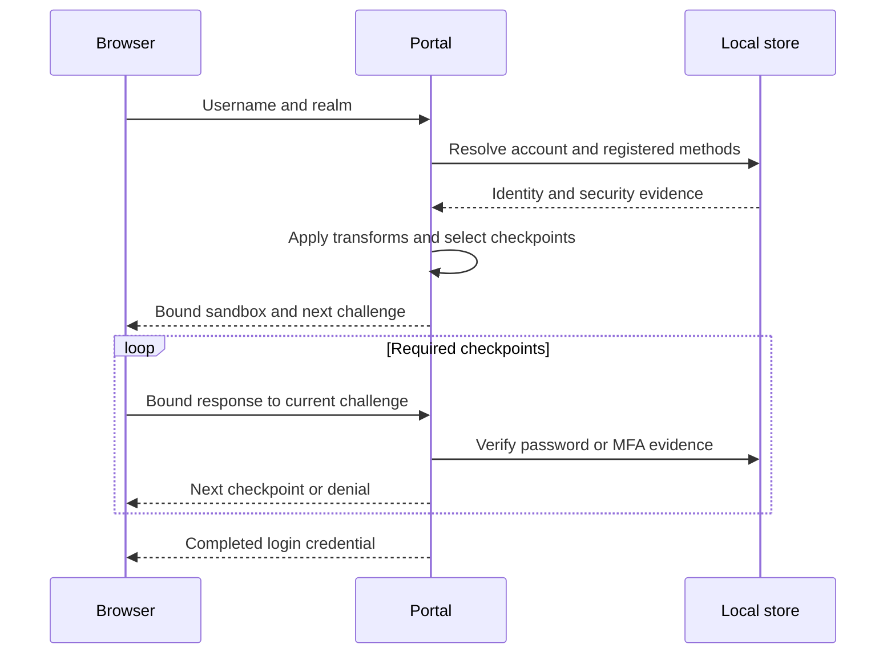

# Authentication challenge internals

This page explains the local portal's identity-to-proof transition. For deployment
configuration, start with [challenge rules](13-authentication-challenges.md); for
custom clients, use the [Portal API](api/20-portal-api.md).

## Authentication Challenges

The username/email and realm identify the backend account. They are not proof of
ownership. The portal resolves registered methods from that backend, applies
transforms, selects a challenge sequence, and creates temporary sandbox state.
It verifies each checkpoint in order before issuing the final credential.

Ordered policy selection and successful verification are separate. A custom claim,
issued WebAuthn challenge or newly registered token cannot manufacture completed
proof. Security-state changes require current evidence, including a fresh login
after enrollment. Explicit unavailable-method policies deny rather than silently
falling back to password.

Built-in authentication checkpoints include password, TOTP and WebAuthn (`u2f`),
with `mfa` selecting a usable factor. Additional consent requirements are not
another authentication factor. Federated OAuth/SAML complete their own browser
protocol and do not run local password verification.

## Sandbox Views

Views describe the current interaction; they are not public evidence claims:

| View family | Purpose |
| --- | --- |
| `password_auth` | Enter and verify the current password |
| `mfa_app_auth`, `mfa_u2f_auth`, `mfa_mixed_auth` | Verify a registered TOTP/WebAuthn factor or present factor selection |
| `mfa_app_register`, `mfa_u2f_register`, `mfa_mixed_register` | Enroll a factor when additive requirements need one |
| `error`, `terminate` | Report failure or end the temporary interaction |
| `password_recovery` | Legacy view name; not a complete implemented account recovery service |

The [sandbox guide](local/60-sandbox.md) describes lifetime, retries and cancellation.
Keep custom clients synchronized with the server's next challenge and rotating
sandbox secret. Starting WebAuthn is not completing its assertion.

The released sources are the
[login handler](https://github.com/greenpau/go-authcrunch/blob/v1.3.8/pkg/authn/handle_http_login.go),
[sandbox handler](https://github.com/greenpau/go-authcrunch/blob/v1.3.8/pkg/authn/handle_http_sandbox.go)
and [challenge selector](https://github.com/greenpau/go-authcrunch/blob/v1.3.8/pkg/authchal/config/check.go).
The older `aaasf` links no longer define this release's behavior.
