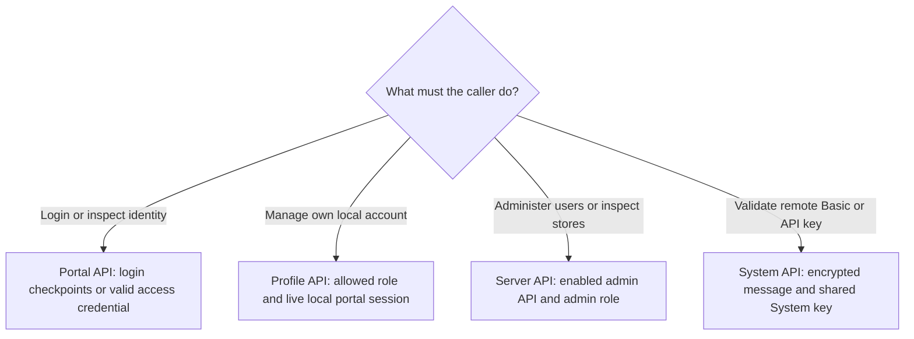

# API Overview

AuthCrunch has four API families. Choose one by the task and caller; a token
that can enter an application does not automatically grant account management
or server administration.

| Family | Use it for | Authentication |
| --- | --- | --- |
| [Portal](20-portal-api.md) | Login challenges, identity claims, expiry checks | Login challenge credentials; a valid access token for identity checks |
| [Profile](30-profile-api.md) | Manage the signed-in local user's password, authenticators, and keys | A live local portal session with `authp/user` or `authp/admin` |
| [Server](40-server-api.md) | Inspect stores and administer users | Explicitly enabled admin API and `authp/admin` |
| [System](50-system-api.md) | Authenticate Basic credentials or API keys from another gatekeeper | An encrypted message using a shared System key and matching key ID |

All paths are relative to the configured portal mount. If the portal is mounted
at `/auth`, `/api/server/info` means **`/auth/api/server/info`**. It is not an
endpoint at the site's root. Examples use `https://auth.example.com/auth`.

Use `Accept: application/json` when calling the Portal API. Profile and Server
request bodies use JSON; System requests contain encrypted PASETO text. Unsafe
requests with an `Origin` header must match the portal's public origin. Native
clients may omit browser-origin headers; this does not waive authentication.
Configure an upstream proxy to normalize forwarded host and scheme information
rather than trusting arbitrary client headers.

The references target [Caddy Security v1.3.0 and its bundled library](../../operations/versions.md).
The [refresh-session endpoints](../30-refresh-token.md) have their own transport,
rotation, and logout requirements. [OIDC provider endpoints](../../apps/oidc-provider.md)
implement a separate protocol and credential lifecycle.




## Agentic Prompts

Copy a prompt into your LLM to explore this topic. Each prompt prioritizes
upstream repository guidance and code over this page, and asks for version-aware
reasoning.

<div className="agentic-prompts">

<details>
<summary>Choose an API family</summary>

```text
Help me understand API Overview.

Primary authorities (take precedence over website documentation):
https://github.com/greenpau/caddy-security/blob/main/AGENTS.md
https://github.com/greenpau/caddy-security/tree/main/.codex/skills
https://github.com/greenpau/go-authcrunch/blob/main/AGENTS.md
https://github.com/greenpau/go-authcrunch/tree/main/.codex/skills
Read each repository's root AGENTS.md first, then any scoped AGENTS.md that
applies to inspected paths. Read the relevant SKILL.md files and follow their
implementation and test references.

Relevant skills to locate: authentication-portal-api,
authentication-portal-profile.

Secondary reference:
https://docs.authcrunch.com/docs/authenticate/api/api

If a source is inaccessible, ask me to paste its relevant text. Identify the
versions your answer applies to; main may be newer than my release. Resolve
disagreements using code and tests, and flag unverified claims. Use synthetic
credentials and redacted examples; explain proposed checks before any changes.

Compare Portal, Profile, Server, and System APIs by task, caller, and
authentication boundary. Add refresh and OIDC as separate lifecycle/protocol
surfaces. Use four scenarios: native login, self-service password change,
administrator role update, and remote credential verification.
```

</details>

<details>
<summary>Resolve mount and response format</summary>

```text
Help me understand API Overview.

Primary authorities (take precedence over website documentation):
https://github.com/greenpau/caddy-security/blob/main/AGENTS.md
https://github.com/greenpau/caddy-security/tree/main/.codex/skills
https://github.com/greenpau/go-authcrunch/blob/main/AGENTS.md
https://github.com/greenpau/go-authcrunch/tree/main/.codex/skills
Read each repository's root AGENTS.md first, then any scoped AGENTS.md that
applies to inspected paths. Read the relevant SKILL.md files and follow their
implementation and test references.

Relevant skills to locate: authentication-portal-api,
authentication-portal-profile.

Secondary reference:
https://docs.authcrunch.com/docs/authenticate/api/api

If a source is inaccessible, ask me to paste its relevant text. Identify the
versions your answer applies to; main may be newer than my release. Resolve
disagreements using code and tests, and flag unverified claims. Use synthetic
credentials and redacted examples; explain proposed checks before any changes.

Explain how a portal mount changes every API URL. Compare Accept/format
selection, JSON request bodies, and encrypted System text. Show why
Content-Type alone does not select a JSON Portal response and why a site-root
path may be wrong.
```

</details>

<details>
<summary>Diagnose insufficient authority</summary>

```text
Help me understand API Overview.

Primary authorities (take precedence over website documentation):
https://github.com/greenpau/caddy-security/blob/main/AGENTS.md
https://github.com/greenpau/caddy-security/tree/main/.codex/skills
https://github.com/greenpau/go-authcrunch/blob/main/AGENTS.md
https://github.com/greenpau/go-authcrunch/tree/main/.codex/skills
Read each repository's root AGENTS.md first, then any scoped AGENTS.md that
applies to inspected paths. Read the relevant SKILL.md files and follow their
implementation and test references.

Relevant skills to locate: authentication-portal-api,
authentication-portal-profile.

Secondary reference:
https://docs.authcrunch.com/docs/authenticate/api/api

If a source is inaccessible, ask me to paste its relevant text. Identify the
versions your answer applies to; main may be newer than my release. Resolve
disagreements using code and tests, and flag unverified claims. Use synthetic
credentials and redacted examples; explain proposed checks before any changes.

A token passes whoami but a management operation fails. Help me inspect API
family, role, local identity, live session, and enablement. Separate 401, 403,
disabled/wrong-path responses, and body-level failures without suggesting an
admin grant merely to make a call work.
```

</details>

<details>
<summary>Review native and browser clients</summary>

```text
Help me understand API Overview.

Primary authorities (take precedence over website documentation):
https://github.com/greenpau/caddy-security/blob/main/AGENTS.md
https://github.com/greenpau/caddy-security/tree/main/.codex/skills
https://github.com/greenpau/go-authcrunch/blob/main/AGENTS.md
https://github.com/greenpau/go-authcrunch/tree/main/.codex/skills
Read each repository's root AGENTS.md first, then any scoped AGENTS.md that
applies to inspected paths. Read the relevant SKILL.md files and follow their
implementation and test references.

Relevant skills to locate: authentication-portal-api,
authentication-portal-profile.

Secondary reference:
https://docs.authcrunch.com/docs/authenticate/api/api

If a source is inaccessible, ask me to paste its relevant text. Identify the
versions your answer applies to; main may be newer than my release. Resolve
disagreements using code and tests, and flag unverified claims. Use synthetic
credentials and redacted examples; explain proposed checks before any changes.

Compare unsafe same-origin browser calls with native clients omitting
browser-origin headers. Explain why omitting Origin does not waive
authentication and why forwarded host/scheme must be normalized. Ask for
redacted request metadata and actual mount.
```

</details>

<details>
<summary>Test boundaries instead of endpoints alone</summary>

```text
Help me understand API Overview.

Primary authorities (take precedence over website documentation):
https://github.com/greenpau/caddy-security/blob/main/AGENTS.md
https://github.com/greenpau/caddy-security/tree/main/.codex/skills
https://github.com/greenpau/go-authcrunch/blob/main/AGENTS.md
https://github.com/greenpau/go-authcrunch/tree/main/.codex/skills
Read each repository's root AGENTS.md first, then any scoped AGENTS.md that
applies to inspected paths. Read the relevant SKILL.md files and follow their
implementation and test references.

Relevant skills to locate: authentication-portal-api,
authentication-portal-profile.

Secondary reference:
https://docs.authcrunch.com/docs/authenticate/api/api

If a source is inaccessible, ask me to paste its relevant text. Identify the
versions your answer applies to; main may be newer than my release. Resolve
disagreements using code and tests, and flag unverified claims. Use synthetic
credentials and redacted examples; explain proposed checks before any changes.

Build a test table for each API family with correct authority, wrong family
credential, wrong mount, wrong method, and malformed body. Identify what must
be observed in status and response content. Quiz me about the difference
between application access and account administration.
```

</details>

</div>

## Source Code References

Start with the code search, then follow the parser, runtime, and tests relevant
to this topic. These links target `main`; use GitHub's branch/tag selector to
compare them with your installed release.

1. [Search this topic in both repositories](https://github.com/search?q=%28repo%3Agreenpau%2Fgo-authcrunch%20OR%20repo%3Agreenpau%2Fcaddy-security%29%20%28handleAPIProfile%20OR%20handleAPIAdmin%20OR%20handleAPISystem%20OR%20handleJSONLogin%29&type=code)
   — searches topic-specific symbols and paths across both codebases.
2. [caddy-security: plugin_authn.go](https://github.com/greenpau/caddy-security/blob/main/plugin_authn.go)
   — mounts the portal in Caddy and delegates HTTP requests.
3. [go-authcrunch: pkg/authn/serve_http.go](https://github.com/greenpau/go-authcrunch/blob/main/pkg/authn/serve_http.go)
   — dispatches browser, API, and provider routes under the portal mount.
4. [go-authcrunch: pkg/authn/handle_json_login.go](https://github.com/greenpau/go-authcrunch/blob/main/pkg/authn/handle_json_login.go)
   — advances stateful JSON login checkpoints and returns completion results.
5. [go-authcrunch: pkg/authn/handle_api_profile.go](https://github.com/greenpau/go-authcrunch/blob/main/pkg/authn/handle_api_profile.go)
   — checks local identity/session access and dispatches Profile operations.
6. [go-authcrunch: pkg/authn/respond_api.go](https://github.com/greenpau/go-authcrunch/blob/main/pkg/authn/respond_api.go)
   — dispatches API routes and enforces admin enablement and role checks.
7. [go-authcrunch: pkg/authn/handle_api_system.go](https://github.com/greenpau/go-authcrunch/blob/main/pkg/authn/handle_api_system.go)
   — decrypts System requests and dispatches supported remote authentication kinds.
