# Portal API

Use this API to complete a local login or inspect a portal access token. Login
is a stateful sequence: knowing the username or receiving a challenge does not
authenticate a user. For an ordinary browser integration, prefer the portal's
built-in login and [Profile UI](../auth-portal.md).

## Request Requirements

Request JSON with `Accept: application/json` or `format=json`. A JSON
`Content-Type` alone does not select a JSON response for these routes.

```bash
export AUTH_PORTAL_BASE_URL=https://auth.example.com/auth
```

Use HTTPS. Browser-origin headers on unsafe requests must match the portal's
public origin. Keep cookies or bearer credentials private. The examples below
show JSON bodies so secrets do not need to be pasted into a shell history.

## User Login API

**`POST /auth/login`** supports the local challenge sequence. OAuth and SAML
login involve provider redirects and callbacks; this is not a password grant
against every external identity provider.

### Initial Login Request

```json
{"username":"alice","realm":"local"}
```

The response identifies a temporary login sandbox:

```json
{
  "sandbox_id":"opaque-login-id",
  "sandbox_secret":"opaque-current-secret",
  "next_challenge":"password"
}
```

Select the configured realm and retain these values privately. The sandbox
expires 300 seconds after creation. Send one response at a time; its secret
rotates as the sequence advances. Never replay the secret from an earlier step.
An explicit unsatisfiable challenge policy denies login. See
[challenge selection](../13-authentication-challenges.md) for ordered alternatives.

### Password Challenge

```json
{
  "username":"alice",
  "realm":"local",
  "sandbox_id":"opaque-login-id",
  "sandbox_secret":"opaque-current-secret",
  "challenge_kind":"password",
  "challenge_response":"replace-with-the-account-password"
}
```

Use the returned sandbox fields and `next_challenge` to continue. A successful
password checkpoint may lead to another factor; it is not permission to assume
that the login is complete. Failed password and MFA attempts have separate
[lockout behavior](../13-authentication-challenges.md).

### MFA Application Passcode Challenge

Enroll an authenticator in `/auth/profile/` before requiring it for login.
Scan the enrollment QR code in a private authenticator app and verify a code.
The following preserved Profile screens illustrate enrollment, not an API
that distributes a user's factor secret to another application.

<figure className="doc-screenshot">

[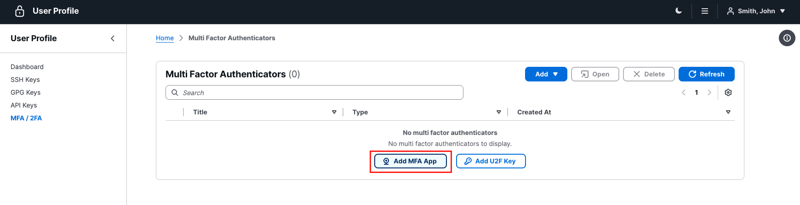](./images/user_profile_mfa_app_01.png)

<figcaption>Start application authenticator enrollment from Profile → MFA / 2FA.</figcaption>
</figure>

<details className="screenshot-gallery">
<summary>Application authenticator enrollment screens</summary>

<figure className="doc-screenshot">

[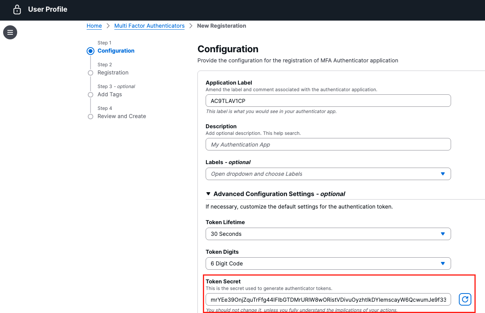](./images/user_profile_mfa_app_02.png)

<figcaption>This published training account illustrates the enrollment fields. Never reuse its visible secret; generate and keep your own enrollment private.</figcaption>
</figure>

<figure className="doc-screenshot">

[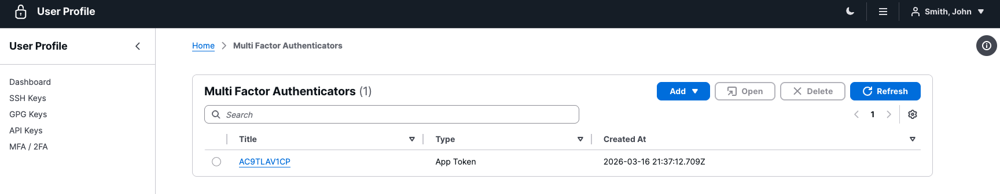](./images/user_profile_mfa_app_03.png)

<figcaption>The saved App Token appears in the authenticator list.</figcaption>
</figure>

<figure className="doc-screenshot">

[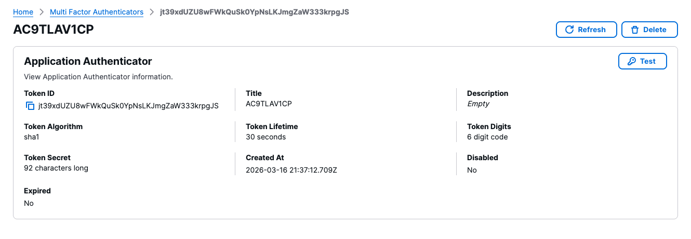](./images/user_profile_mfa_app_04.png)

<figcaption>Inspect the authenticator and use Test to verify a current code.</figcaption>
</figure>

</details>

When `next_challenge` is `totp`, send the current authenticator code and the
**latest** sandbox secret:

```json
{
  "username":"alice",
  "realm":"local",
  "sandbox_id":"opaque-login-id",
  "sandbox_secret":"latest-secret-from-password-response",
  "challenge_kind":"totp",
  "challenge_response":"current-code-from-authenticator"
}
```

A generic `mfa` checkpoint can accept a numeric authenticator code or begin
WebAuthn. An explicitly selected `totp` checkpoint does not allow the client to
substitute another method. Enrollment changes can require a fresh login.

### WebAuthn/U2F Challenge

Enroll and verify the credential in Profile first. Browser and operating-system
prompts vary; a security key, platform authenticator, or supported passkey
manager can perform the ceremony. AuthCrunch's UI labels this credential U2F.

<figure className="doc-screenshot">

[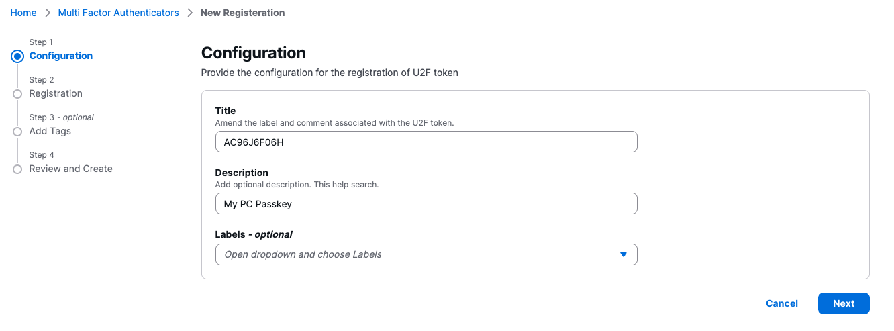](./images/user_profile_add_u2f_01.png)

<figcaption>Give the authenticator a recognizable title and description.</figcaption>
</figure>

<details className="screenshot-gallery">
<summary>WebAuthn enrollment and verification screens</summary>

<figure className="doc-screenshot">

[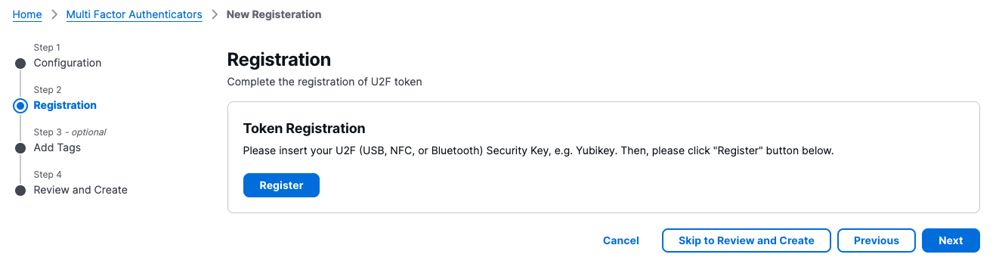](./images/user_profile_add_u2f_02.png)

<figcaption>Start the browser registration ceremony.</figcaption>
</figure>

<figure className="doc-screenshot">

[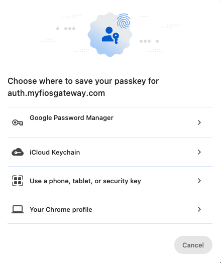](./images/user_profile_add_u2f_03.png)

<figcaption>Choose a supported credential manager or security key.</figcaption>
</figure>

<figure className="doc-screenshot">

[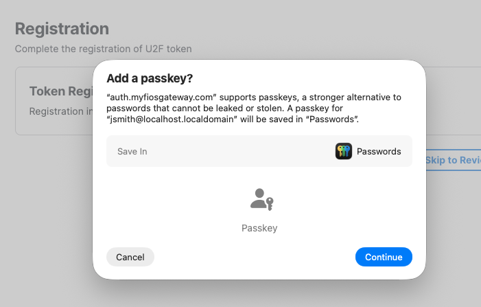](./images/user_profile_add_u2f_04.png)

<figcaption>Confirm creation in the selected manager.</figcaption>
</figure>

<figure className="doc-screenshot">

[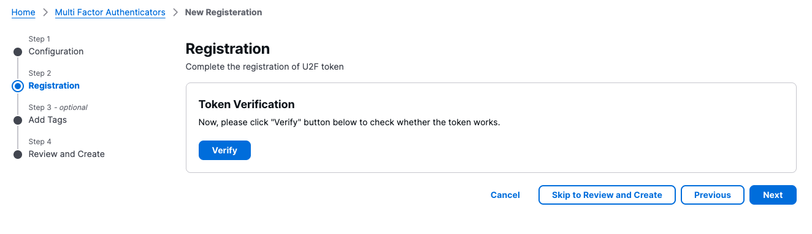](./images/user_profile_add_u2f_05.png)

<figcaption>Verify the newly registered credential before saving.</figcaption>
</figure>

<figure className="doc-screenshot">

[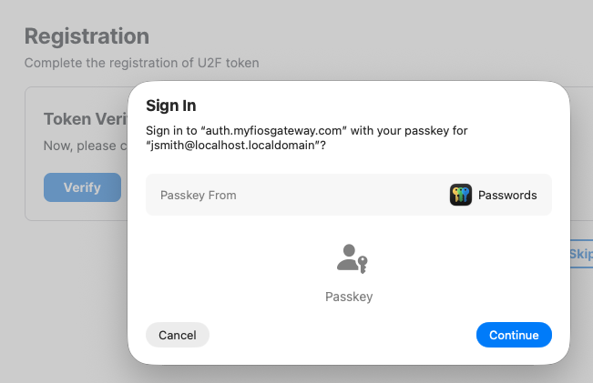](./images/user_profile_add_u2f_06.png)

<figcaption>Allow the manager to use the credential for this site.</figcaption>
</figure>

<figure className="doc-screenshot">

[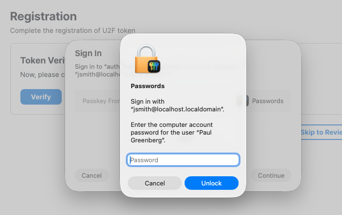](./images/user_profile_add_u2f_07.png)

<figcaption>Unlock the local authenticator; this prompt does not send the computer password to AuthCrunch.</figcaption>
</figure>

<figure className="doc-screenshot">

[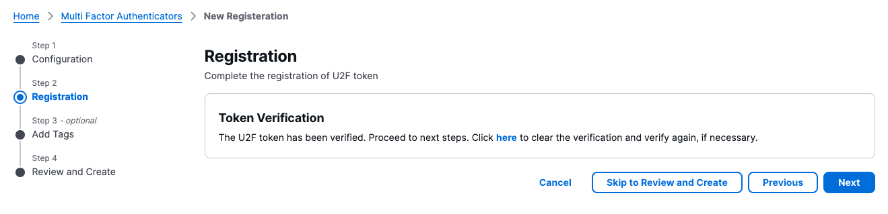](./images/user_profile_add_u2f_08.png)

<figcaption>A verified credential can proceed to review.</figcaption>
</figure>

<figure className="doc-screenshot">

[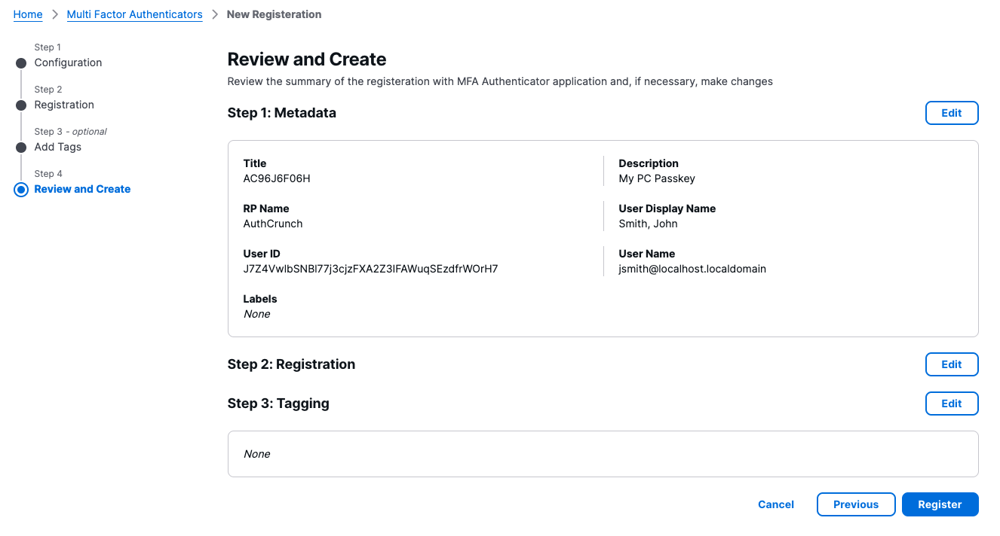](./images/user_profile_add_u2f_09.png)

<figcaption>Review relying-party and account metadata, then finalize registration.</figcaption>
</figure>

<figure className="doc-screenshot">

[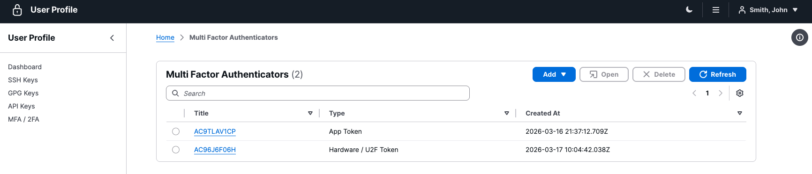](./images/user_profile_add_u2f_10.png)

<figcaption>The completed Hardware / U2F Token appears beside the App Token.</figcaption>
</figure>

</details>

For a `u2f` or compatible `mfa` checkpoint, send `challenge_response: "webauthn"`
with the current sandbox fields. The response's `next_challenge` begins with
`mfa:u2f:` followed by standard Base64-encoded JSON options. This issues a
challenge; it does **not** finish authentication.

Use the browser's WebAuthn API to produce the signed assertion. AuthCrunch
expects `challenge_response` to contain standard Base64-encoded JSON in its
[assertion request format](https://github.com/greenpau/go-authcrunch/blob/v1.3.8/pkg/identity/webauthn.go):
`id`, `type`, `auth_data_encoded`, `client_data_encoded`, and
`signature_encoded`. This is not the options object echoed back. The server
checks the challenge, public credential, origin, relying-party binding, and
signature before advancing. A curl-only client cannot simulate a hardware
assertion by copying the example's challenge text.

### Successful Authentication

Completion returns `authenticated: true` and an access token:

```json
{
  "authenticated":true,
  "access_token":"opaque-example-access-jwt",
  "access_token_name":"access_token"
}
```

The token name depends on configuration. Inspect the actual response and
cookie policy. Ordinary login does not automatically issue a refresh JWT.
When [refresh sessions](../30-refresh-token.md) are explicitly enabled, browser
and native transports have different credential delivery rules; refresh
credentials are opaque, rotating, and must not be used as access tokens.
Never infer refresh behavior from an older response example.

### Account API-key login

A provisioned local account can use a separate access-only exchange:

```json
{"realm":"local","api_key":"replace-with-the-private-account-key"}
```

Send this body to `POST /auth/login` with JSON selected. Do not include a
username, password, sandbox checkpoint, or body-refresh selection. The account
must have a configured [API key](../../authorize/api_key_auth.md) and satisfy
its direct authentication requirements; a key does not bypass explicit MFA.
Successful authentication returns an access credential, without a refresh
family, browser Profile session, or browser OIDC session. Use the returned
access-token name when constructing a header. The [Go client](../../operations/authclient.md)
implements this exchange; the [local management CLI](../../operations/local-client.md)
is a separate administrative interface.

## Beacon API

A JSON-selected **`GET /auth/beacon`** checks the access token. A valid identity
returns HTTP `200` with the literal body **`OK`**. An unauthenticated or invalid
credential is denied; the JSON error response is not the success format.

```bash
curl --fail-with-body --silent --show-error \
  "${AUTH_PORTAL_BASE_URL}/beacon" \
  -H 'Accept: application/json' \
  -H "Authorization: Bearer ${AUTHCRUNCH_ACCESS_TOKEN}"
```

This checks authentication, not an application's ACL or local Profile session
permissions. A successful beacon does not prove that a specific resource is
allowed.

## User Identity API

A JSON-selected **`GET /auth/whoami`** returns the validated portal identity.
Without a valid access token the request is denied. The HTML form of the route
is the portal's identity page.

### Standard Response

```bash
curl --fail-with-body --silent --show-error \
  "${AUTH_PORTAL_BASE_URL}/whoami?format=json" \
  -H "Authorization: Bearer ${AUTHCRUNCH_ACCESS_TOKEN}"
```

The result contains configured claims such as `sub`, `email`, `realm`, `roles`,
`iss`, `iat`, `nbf`, `exp`, and `jti`. Claim presence depends on the source and
transforms. It is not a mutable local account record.

### Probe Response

Add `probe=true` to include `authenticated` and `expires_in`, the remaining
seconds before the access token expires. This helps a client decide when to
reauthenticate or use a separately configured refresh flow. It does not extend
the token's lifetime. `probe=true` takes precedence over `id_token=true` if
both are supplied.

### Identity Token Response

An OAuth/OIDC provider can optionally enable a cookie for its upstream ID token:

```Caddyfile
# Inside the existing oauth identity provider block:
enable id token cookie id_token AUTHP_ID_TOKEN
```

With that configuration and cookie present, `whoami?format=json&id_token=true`
can add the original upstream `id_token` to the portal claim response. Without
it, the endpoint returns ordinary portal claims. This is not an upstream token
refresh or introspection call, and the ID token is not the portal access token.
Enabling it deliberately exposes that upstream credential to the authenticated
caller; use it only when the integration requires the original token.

<figure className="doc-screenshot">

[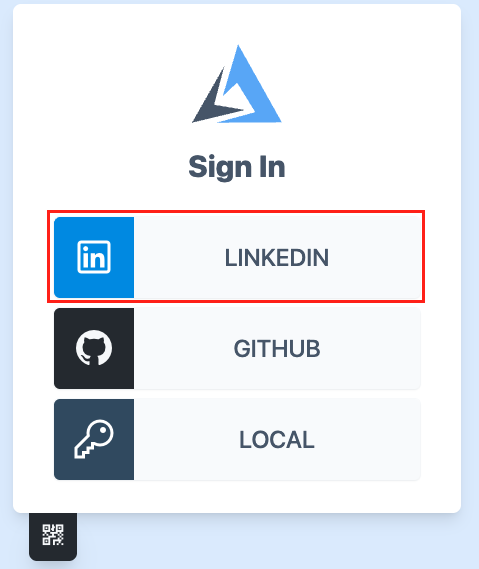](./images/user_login_linkedin_01.png)

<figcaption>An external-provider login starts at the configured provider button.</figcaption>
</figure>

<details className="screenshot-gallery">
<summary>Upstream ID-token inspection screens</summary>

<figure className="doc-screenshot">

[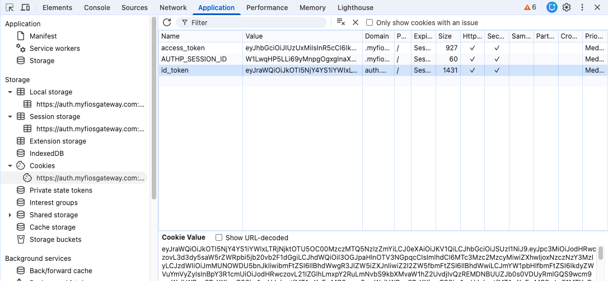](./images/user_login_linkedin_02.png)

<figcaption>Historical inspection of the separate portal access and upstream ID-token cookies.</figcaption>
</figure>

<figure className="doc-screenshot">

[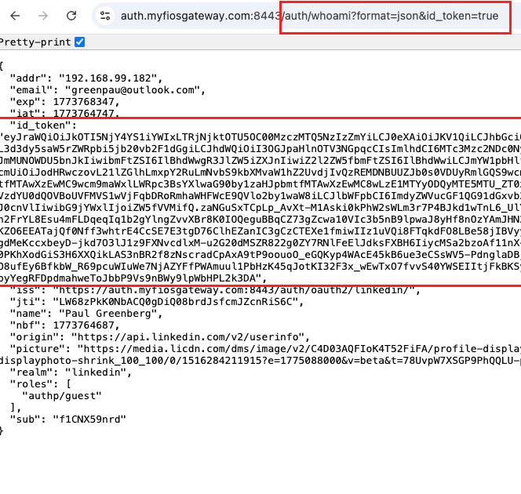](./images/user_login_linkedin_03.png)

<figcaption>The optional identity-token response contains portal claims plus the upstream credential.</figcaption>
</figure>

</details>

The LinkedIn screenshots are a preserved March 2026 example. Cookie names and
scopes must match your provider configuration; the screenshot shows `id_token`,
not the custom name in the fragment above. The visible tokens are historical
and must never be copied into an integration.
