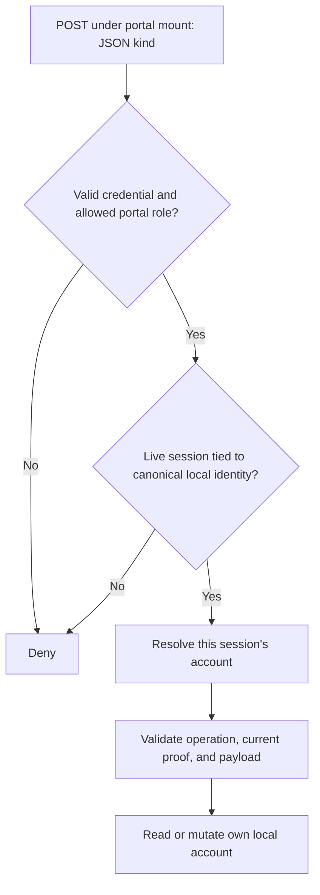

# Profile API

The [User Profile](../auth-portal.md#user-settings) calls **`POST /auth/api/profile`**
with a JSON `kind` selecting an operation. This API manages the current local
account. It does not accept an arbitrary target username, and it is not the
administrator's user-management API.




## Authentication and request format

A caller needs a valid portal token, `authp/user` or `authp/admin`, and the live
session that originally authenticated a local identity. A signed token without
that session is insufficient. Identity changes made by transforms do not let
a caller select another account. External-provider account management is not
implemented by this local API.

Send `Content-Type: application/json`; the body limit is 1 MiB. In a browser,
use a same-origin request and the portal cookie. A caller using a bearer credential still needs the token’s live browser portal
session. A native body-transport refresh login does not create that Profile
session; its valid token can pass `whoami` while Profile returns `401`. Prefer
the Profile UI for self-service. The diagnostic example assumes
`AUTHCRUNCH_ACCESS_TOKEN` identifies an existing live browser login:

```bash
curl --fail-with-body --silent --show-error \
  https://auth.example.com/auth/api/profile \
  -H 'Content-Type: application/json' \
  -H "Authorization: Bearer ${AUTHCRUNCH_ACCESS_TOKEN}" \
  --data '{"kind":"fetch_user_info"}'
```

Responses include a numeric `status`, a timestamp, and operation-specific
`entry`, `entries`, or `message` fields. Check HTTP status before using the
result. An unsupported kind or malformed field returns `400`. A missing allowed
role returns `403`; an invalid token returns `401`. A non-local account cannot
use the local credential backend.

## Password changes

```json
{
  "kind": "update_user_password",
  "old_password": "replace-with-current-password",
  "new_password": "replace-with-new-password"
}
```

The current password must verify and the new password must satisfy the local
store's policy. The handler trims leading and trailing whitespace from these
fields; do not design a password around surrounding whitespace. See
[password management](../local/30-password-management.md) for the UI and
administrator reset workflow.

## Authentication challenge policy

Fetch the account's effective policy:

```json
{"kind":"fetch_user_auth_challenges"}
```

The result includes `entries`, `registered_methods`, `effective_challenges`,
`additional_challenges`, and `policy_source`. This distinguishes account rules
from portal requirements and backend defaults.

Replace the account's ordered rules:

```json
{
  "kind": "overwrite_user_auth_challenges",
  "challenges": ["password", "u2f or totp"]
}
```

An empty array clears account overrides and restores the applicable defaults.
A missing field, `null`, mixed types, unsupported methods, or an unsatisfiable
policy returns `400` without partially writing the rule set. A successful
change returns `reauthentication_required: true`: complete a new login before
using the changed security state. Enrollment by itself does not prove that a
factor was used in the current login. See [challenge selection](../13-authentication-challenges.md).

## Operation reference

| Task | `kind` values |
| --- | --- |
| Account and dashboard | `fetch_user_info`, `fetch_user_dashboard_data`, `fetch_debug` |
| Password | `update_user_password` |
| List, inspect, or remove MFA authenticators | `fetch_user_multi_factor_authenticators`, `fetch_user_multi_factor_authenticator`, `delete_user_multi_factor_authenticator` |
| Application MFA enrollment and test | `fetch_user_app_multi_factor_authenticator_code`, `test_user_app_multi_factor_authenticator`, `add_user_app_multi_factor_authenticator`, `test_user_app_token_passcode` |
| WebAuthn enrollment and test | `fetch_user_u2f_reg_params`, `fetch_user_u2f_ver_params`, `test_user_u2f_reg`, `add_user_u2f_token`, `test_user_webauthn_token` |
| API keys | `fetch_user_api_keys`, `fetch_user_api_key`, `delete_user_api_key`, `add_user_api_key`, `test_user_api_key` |
| SSH public keys | `fetch_user_ssh_keys`, `fetch_user_ssh_key`, `delete_user_ssh_key`, `test_user_ssh_key`, `add_user_ssh_key` |
| GPG public keys | `fetch_user_gpg_keys`, `fetch_user_gpg_key`, `delete_user_gpg_key`, `test_user_gpg_key`, `add_user_gpg_key` |
| Challenge rules | `fetch_user_auth_challenges`, `overwrite_user_auth_challenges` |

Singular credential operations use the credential's `id`. Enrollment requires
additional type-specific fields and, for WebAuthn, the browser registration
and verification ceremonies. Use the [Profile UI](../auth-portal.md) for an
interactive enrollment; the exact payload contracts are in the
[released profile dispatcher and handlers](https://github.com/greenpau/go-authcrunch/blob/v1.3.8/pkg/authn/handle_api_profile.go).

An API-key addition supplies `content` (64–72 alphanumeric characters), `title`,
and `description`, with optional labels and tags. Generate a unique secret,
not a value copied from an example. Fetching keys or MFA details can return
credential material: these are private account responses, not a public
metadata service. Do not put their bodies in analytics, shared caches, or
application logs. SSH/GPG enrollment stores public keys; it does not grant
shell access or replace an application's own key policy.

## Agentic Prompts

Copy a prompt into your LLM to explore this topic. Each prompt prioritizes
upstream repository guidance and code over this page, and asks for version-aware
reasoning.

<div className="agentic-prompts">

<details>
<summary>Explain current-account authority</summary>

```text
Help me understand Profile API.

Primary authorities (take precedence over website documentation):
https://github.com/greenpau/caddy-security/blob/main/AGENTS.md
https://github.com/greenpau/caddy-security/tree/main/.codex/skills
https://github.com/greenpau/go-authcrunch/blob/main/AGENTS.md
https://github.com/greenpau/go-authcrunch/tree/main/.codex/skills
Read each repository's root AGENTS.md first, then any scoped AGENTS.md that
applies to inspected paths. Read the relevant SKILL.md files and follow their
implementation and test references.

Relevant skills to locate: authentication-portal-profile,
authentication-portal-mfa, authentication-portal-challenges.

Secondary reference:
https://docs.authcrunch.com/docs/authenticate/api/profile-api

If a source is inaccessible, ask me to paste its relevant text. Identify the
versions your answer applies to; main may be newer than my release. Resolve
disagreements using code and tests, and flag unverified claims. Use synthetic
credentials and redacted examples; explain proposed checks before any changes.

Explain why Profile requires a permitted local identity and live portal
session, and why it cannot select an arbitrary username. Compare external
identities, native body-refresh login, and a copied app JWT. Trace the
account-binding check independently of display transforms.
```

</details>

<details>
<summary>Read an operation request</summary>

```text
Help me understand Profile API.

Primary authorities (take precedence over website documentation):
https://github.com/greenpau/caddy-security/blob/main/AGENTS.md
https://github.com/greenpau/caddy-security/tree/main/.codex/skills
https://github.com/greenpau/go-authcrunch/blob/main/AGENTS.md
https://github.com/greenpau/go-authcrunch/tree/main/.codex/skills
Read each repository's root AGENTS.md first, then any scoped AGENTS.md that
applies to inspected paths. Read the relevant SKILL.md files and follow their
implementation and test references.

Relevant skills to locate: authentication-portal-profile,
authentication-portal-mfa, authentication-portal-challenges.

Secondary reference:
https://docs.authcrunch.com/docs/authenticate/api/profile-api

If a source is inaccessible, ask me to paste its relevant text. Identify the
versions your answer applies to; main may be newer than my release. Resolve
disagreements using code and tests, and flag unverified claims. Use synthetic
credentials and redacted examples; explain proposed checks before any changes.

Walk through POST, JSON kind dispatch, body limits, status, and
operation-specific fields. Compare fetch_user_info with a password mutation
using fake values. Explain old-password verification and whitespace behavior
without asking me for a password.
```

</details>

<details>
<summary>Understand challenge-policy replacement</summary>

```text
Help me understand Profile API.

Primary authorities (take precedence over website documentation):
https://github.com/greenpau/caddy-security/blob/main/AGENTS.md
https://github.com/greenpau/caddy-security/tree/main/.codex/skills
https://github.com/greenpau/go-authcrunch/blob/main/AGENTS.md
https://github.com/greenpau/go-authcrunch/tree/main/.codex/skills
Read each repository's root AGENTS.md first, then any scoped AGENTS.md that
applies to inspected paths. Read the relevant SKILL.md files and follow their
implementation and test references.

Relevant skills to locate: authentication-portal-profile,
authentication-portal-mfa, authentication-portal-challenges.

Secondary reference:
https://docs.authcrunch.com/docs/authenticate/api/profile-api

If a source is inaccessible, ask me to paste its relevant text. Identify the
versions your answer applies to; main may be newer than my release. Resolve
disagreements using code and tests, and flag unverified claims. Use synthetic
credentials and redacted examples; explain proposed checks before any changes.

Explain effective challenge metadata, an empty array, missing/null/mixed
values, unsatisfiable sequences, and reauthentication_required. Compare
account overrides with portal requirements. Show why an atomic rule change
must not be mistaken for completed new-factor evidence.
```

</details>

<details>
<summary>Diagnose a failed Profile call</summary>

```text
Help me understand Profile API.

Primary authorities (take precedence over website documentation):
https://github.com/greenpau/caddy-security/blob/main/AGENTS.md
https://github.com/greenpau/caddy-security/tree/main/.codex/skills
https://github.com/greenpau/go-authcrunch/blob/main/AGENTS.md
https://github.com/greenpau/go-authcrunch/tree/main/.codex/skills
Read each repository's root AGENTS.md first, then any scoped AGENTS.md that
applies to inspected paths. Read the relevant SKILL.md files and follow their
implementation and test references.

Relevant skills to locate: authentication-portal-profile,
authentication-portal-mfa, authentication-portal-challenges.

Secondary reference:
https://docs.authcrunch.com/docs/authenticate/api/profile-api

If a source is inaccessible, ask me to paste its relevant text. Identify the
versions your answer applies to; main may be newer than my release. Resolve
disagreements using code and tests, and flag unverified claims. Use synthetic
credentials and redacted examples; explain proposed checks before any changes.

Help me classify invalid token, missing allowed role, lost live session,
nonlocal identity, unsupported kind, malformed fields, and wrong origin/mount.
Ask for redacted response metadata. Contrast a successful whoami probe with
authorization for credential management.
```

</details>

<details>
<summary>Plan self-service mutation checks</summary>

```text
Help me understand Profile API.

Primary authorities (take precedence over website documentation):
https://github.com/greenpau/caddy-security/blob/main/AGENTS.md
https://github.com/greenpau/caddy-security/tree/main/.codex/skills
https://github.com/greenpau/go-authcrunch/blob/main/AGENTS.md
https://github.com/greenpau/go-authcrunch/tree/main/.codex/skills
Read each repository's root AGENTS.md first, then any scoped AGENTS.md that
applies to inspected paths. Read the relevant SKILL.md files and follow their
implementation and test references.

Relevant skills to locate: authentication-portal-profile,
authentication-portal-mfa, authentication-portal-challenges.

Secondary reference:
https://docs.authcrunch.com/docs/authenticate/api/profile-api

If a source is inaccessible, ask me to paste its relevant text. Identify the
versions your answer applies to; main may be newer than my release. Resolve
disagreements using code and tests, and flag unverified claims. Use synthetic
credentials and redacted examples; explain proposed checks before any changes.

Design a disposable-user test for password change, authenticator
enrollment/deletion, challenge policy replacement, and fresh login. Include a
tampered target identity and a stale session. Explain which secret-bearing
responses must remain private and what each observation establishes.
```

</details>

</div>

## Source Code References

Start with the code search, then follow the parser, runtime, and tests relevant
to this topic. These links target `main`; use GitHub's branch/tag selector to
compare them with your installed release.

1. [Search this topic in both repositories](https://github.com/search?q=%28repo%3Agreenpau%2Fgo-authcrunch%20OR%20repo%3Agreenpau%2Fcaddy-security%29%20%28handleAPIProfile%20OR%20overwrite_user_auth_challenges%20OR%20update_user_password%29&type=code)
   — searches topic-specific symbols and paths across both codebases.
2. [go-authcrunch: pkg/authn/handle_api_profile.go](https://github.com/greenpau/go-authcrunch/blob/main/pkg/authn/handle_api_profile.go)
   — checks local identity/session access and dispatches Profile operations.
3. [go-authcrunch: pkg/authn/api_update_user_password.go](https://github.com/greenpau/go-authcrunch/blob/main/pkg/authn/api_update_user_password.go)
   — validates and applies a signed-in local user’s password change.
4. [go-authcrunch: pkg/authn/profile_auth_challenges.go](https://github.com/greenpau/go-authcrunch/blob/main/pkg/authn/profile_auth_challenges.go)
   — reads and replaces the current local account’s challenge policy.
5. [go-authcrunch: pkg/authn/handle_api_profile_test.go](https://github.com/greenpau/go-authcrunch/blob/main/pkg/authn/handle_api_profile_test.go)
   — tests Profile body limits and malformed operation inputs.
6. [go-authcrunch: pkg/authn/profile_session_e2e_test.go](https://github.com/greenpau/go-authcrunch/blob/main/pkg/authn/profile_session_e2e_test.go)
   — tests the live-session boundary for profile access.
