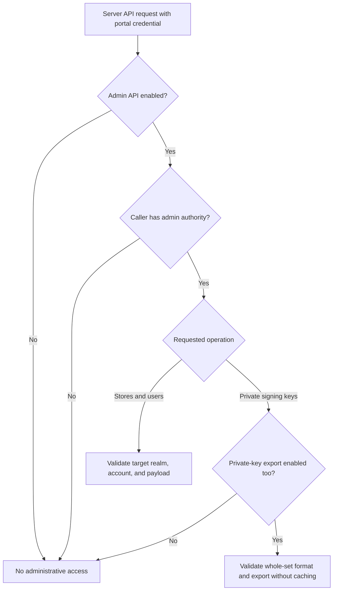

# Server API

The Server API administers the portal's configured identity stores. Enable it
inside the existing `authentication portal` block:

```Caddyfile
enable admin api
```

The default is disabled. Calls require an authenticated identity with the exact
reserved role **`authp/admin`**; a role named `admin` or an application role does
not qualify. Only grant this role through a trusted administrative provisioning
path. Use HTTPS and keep these routes behind the intended management boundary.

All paths below are relative to the portal mount. JSON POST bodies are limited
to 1 MiB. A native example with an administrator's access token:

```bash
curl --fail-with-body --silent --show-error \
  https://auth.example.com/auth/api/server/realms \
  -H 'Content-Type: application/json' \
  -H "Authorization: Bearer ${AUTHCRUNCH_ADMIN_ACCESS_TOKEN}" \
  --data '{"query":"all"}'
```




## Server State

### Metadata

**`GET /api/server/metadata`** returns AuthCrunch version, commit, and a server
timestamp. This describes the running library; also record the Caddy executable
and adapter version when checking a deployment.

### Realm Discovery

**`POST /api/server/realms`**, for example `{"query":"all"}`, lists configured
**identity stores** with realm, name, and kind. OAuth/SAML identity providers
are a separate configuration surface. Do not assume that a listed store
supports every local-user operation.

## Database Operations

### Database Info

**`POST /api/server/info`** takes `{"realm":"local"}` and optional `query`.
The result is backend-specific metadata, such as local storage and password
policy information. A missing realm returns `400`; an unknown realm returns
`404`. Protect responses that disclose filesystem paths or store configuration.

### List users

**`POST /api/server/users`** takes `{"realm":"local","query":"all"}`.
It returns a count, user metadata, and a timestamp. The released interface does
not supply a general pagination contract. Check that the requested store exists;
an empty result alone is not proof that the realm was selected correctly.

### Manage one user

**`POST /api/server/user`** requires `realm`, `operation`, and a `user` object.
Both `username` and `email` are required to identify the target:

```json
{
  "realm": "local",
  "operation": "info",
  "user": {"username":"alice","email":"alice@example.com"}
}
```

| `operation` | Purpose and extra data |
| --- | --- |
| `info` | Fetch account data |
| `add` | Provision an account; additionally supply `user.name` and nonempty `user.roles` |
| `delete` | Delete the selected account |
| `disable`, `enable` | Change account availability |
| `reset_password` | Generate a replacement password; handle the returned credential privately |
| `overwrite_roles`, `add_roles` | Supply `user.roles` to replace or extend roles |
| `overwrite_auth_challenges` | Supply `user.challenges` to replace ordered challenge rules |

Backend support and validation determine the outcome. Some mutation failures
return HTTP `200` with `status: "failure"` and an error. **Check the result body**;
a successful HTTP exchange does not prove a user changed. Account responses
may contain private credential data. Do not print administrative tokens or
reset results into shared logs.

Disabling an account prevents new authentication through that store. It is not
a distributed JWT revocation protocol: separately issued access tokens have
an expiry and validation lifecycle. See [token verification](../../authorize/token-verification.md)
and [persistent runtime state](../../operations/runtime-state.md).

### Reload a store

**`POST /api/server/reload`** takes `{"realm":"local"}`. It asks that store to
reload its data, not Caddy to reload its configuration. Require an explicit
`status: "success"`; an unknown realm may return a timestamp without a status.
Coordinate offline database edits with backups and the store's ownership rules.

## Private signing-key export

The independent opt-in is:

```Caddyfile
enable admin api
enable admin api private key export
```

**`GET /api/server/private_keys`** remains `404` unless both flags are enabled.
It also requires `authp/admin`. This endpoint exports signing credentials;
ordinary token verification should use the public **`/auth/jwks.json`** instead.

| Query | Result |
| --- | --- |
| No query, or `format=pkcs8` | JSON `keys` array containing PKCS#8 PEM keys |
| `format=pkcs8&encoding=der` | Base64 DER inside JSON |
| `format=pkcs1` | RSA keys only |
| `format=sec1` | EC keys only |
| `format=jwk` | Private JWKs with JSON encoding |

Unsupported, repeated, empty, or incompatible format/encoding parameters return
`400`. A key set incompatible with PKCS#1 or SEC1 fails the entire export rather
than silently omitting keys. The handler disables caching. Keep this opt-in
absent from routine deployments and perform backups through the private state
workflow when that meets the operational need.

## Agentic Prompts

Copy a prompt into your LLM to explore this topic. Each prompt prioritizes
upstream repository guidance and code over this page, and asks for version-aware
reasoning.

<div className="agentic-prompts">

<details>
<summary>Read the administrative boundary</summary>

```text
Help me understand Server API.

Primary authorities (take precedence over website documentation):
https://github.com/greenpau/caddy-security/blob/main/AGENTS.md
https://github.com/greenpau/caddy-security/tree/main/.codex/skills
https://github.com/greenpau/go-authcrunch/blob/main/AGENTS.md
https://github.com/greenpau/go-authcrunch/tree/main/.codex/skills
Read each repository's root AGENTS.md first, then any scoped AGENTS.md that
applies to inspected paths. Read the relevant SKILL.md files and follow their
implementation and test references.

Relevant skills to locate: authentication-portal-api,
configuration-authentication, local-identity-database.

Secondary reference:
https://docs.authcrunch.com/docs/authenticate/api/server-api

If a source is inaccessible, ask me to paste its relevant text. Identify the
versions your answer applies to; main may be newer than my release. Resolve
disagreements using code and tests, and flag unverified claims. Use synthetic
credentials and redacted examples; explain proposed checks before any changes.

Explain explicit admin API enablement and the exact authp/admin role. Compare
store discovery with OAuth/SAML provider configuration and local self-service.
Ask which management task I need and how administrator identity is
provisioned.
```

</details>

<details>
<summary>Interpret management results</summary>

```text
Help me understand Server API.

Primary authorities (take precedence over website documentation):
https://github.com/greenpau/caddy-security/blob/main/AGENTS.md
https://github.com/greenpau/caddy-security/tree/main/.codex/skills
https://github.com/greenpau/go-authcrunch/blob/main/AGENTS.md
https://github.com/greenpau/go-authcrunch/tree/main/.codex/skills
Read each repository's root AGENTS.md first, then any scoped AGENTS.md that
applies to inspected paths. Read the relevant SKILL.md files and follow their
implementation and test references.

Relevant skills to locate: authentication-portal-api,
configuration-authentication, local-identity-database.

Secondary reference:
https://docs.authcrunch.com/docs/authenticate/api/server-api

If a source is inaccessible, ask me to paste its relevant text. Identify the
versions your answer applies to; main may be newer than my release. Resolve
disagreements using code and tests, and flag unverified claims. Use synthetic
credentials and redacted examples; explain proposed checks before any changes.

Compare realm info, users, one-user operations, and store reload. Explain
required target fields and backend-dependent support. Work through HTTP 200
with a failure body and an unknown-realm reload result; identify what proves
an account mutation actually succeeded.
```

</details>

<details>
<summary>Diagnose a refused operation</summary>

```text
Help me understand Server API.

Primary authorities (take precedence over website documentation):
https://github.com/greenpau/caddy-security/blob/main/AGENTS.md
https://github.com/greenpau/caddy-security/tree/main/.codex/skills
https://github.com/greenpau/go-authcrunch/blob/main/AGENTS.md
https://github.com/greenpau/go-authcrunch/tree/main/.codex/skills
Read each repository's root AGENTS.md first, then any scoped AGENTS.md that
applies to inspected paths. Read the relevant SKILL.md files and follow their
implementation and test references.

Relevant skills to locate: authentication-portal-api,
configuration-authentication, local-identity-database.

Secondary reference:
https://docs.authcrunch.com/docs/authenticate/api/server-api

If a source is inaccessible, ask me to paste its relevant text. Identify the
versions your answer applies to; main may be newer than my release. Resolve
disagreements using code and tests, and flag unverified claims. Use synthetic
credentials and redacted examples; explain proposed checks before any changes.

Help me classify disabled API, wrong mount, non-admin role, unknown realm,
malformed user target, unsupported backend, and response-body failure. Use
redacted request shape and metadata. Do not recommend printing tokens, reset
passwords, or credential-bearing account responses.
```

</details>

<details>
<summary>Separate public and private key endpoints</summary>

```text
Help me understand Server API.

Primary authorities (take precedence over website documentation):
https://github.com/greenpau/caddy-security/blob/main/AGENTS.md
https://github.com/greenpau/caddy-security/tree/main/.codex/skills
https://github.com/greenpau/go-authcrunch/blob/main/AGENTS.md
https://github.com/greenpau/go-authcrunch/tree/main/.codex/skills
Read each repository's root AGENTS.md first, then any scoped AGENTS.md that
applies to inspected paths. Read the relevant SKILL.md files and follow their
implementation and test references.

Relevant skills to locate: authentication-portal-api,
configuration-authentication, local-identity-database.

Secondary reference:
https://docs.authcrunch.com/docs/authenticate/api/server-api

If a source is inaccessible, ask me to paste its relevant text. Identify the
versions your answer applies to; main may be newer than my release. Resolve
disagreements using code and tests, and flag unverified claims. Use synthetic
credentials and redacted examples; explain proposed checks before any changes.

Compare ordinary public JWKS with the independent private-key-export opt-in.
Explain export format/encoding constraints, entire-set failure, and cache
policy. Help me determine whether private state backup meets my need before
proposing any export request.
```

</details>

<details>
<summary>Design administrative change verification</summary>

```text
Help me understand Server API.

Primary authorities (take precedence over website documentation):
https://github.com/greenpau/caddy-security/blob/main/AGENTS.md
https://github.com/greenpau/caddy-security/tree/main/.codex/skills
https://github.com/greenpau/go-authcrunch/blob/main/AGENTS.md
https://github.com/greenpau/go-authcrunch/tree/main/.codex/skills
Read each repository's root AGENTS.md first, then any scoped AGENTS.md that
applies to inspected paths. Read the relevant SKILL.md files and follow their
implementation and test references.

Relevant skills to locate: authentication-portal-api,
configuration-authentication, local-identity-database.

Secondary reference:
https://docs.authcrunch.com/docs/authenticate/api/server-api

If a source is inaccessible, ask me to paste its relevant text. Identify the
versions your answer applies to; main may be newer than my release. Resolve
disagreements using code and tests, and flag unverified claims. Use synthetic
credentials and redacted examples; explain proposed checks before any changes.

Create a disposable-account plan for role overwrite/add, disable/enable,
challenge changes, and password reset. Include fresh-login denial and the
separate lifetime of already issued JWTs. Explain why uncertain mutations
should be reconciled before a retry rather than assumed idempotent.
```

</details>

</div>

## Source Code References

Start with the code search, then follow the parser, runtime, and tests relevant
to this topic. These links target `main`; use GitHub's branch/tag selector to
compare them with your installed release.

1. [Search this topic in both repositories](https://github.com/search?q=%28repo%3Agreenpau%2Fgo-authcrunch%20OR%20repo%3Agreenpau%2Fcaddy-security%29%20%28handleAPIAdmin%20OR%20AdminAPI%20OR%20private_keys%29&type=code)
   — searches topic-specific symbols and paths across both codebases.
2. [caddy-security: caddyfile_authn_admin_api.go](https://github.com/greenpau/caddy-security/blob/main/caddyfile_authn_admin_api.go)
   — parses independent admin-API and private-key-export opt-ins.
3. [caddy-security: caddyfile_authn_admin_api_test.go](https://github.com/greenpau/caddy-security/blob/main/caddyfile_authn_admin_api_test.go)
   — tests admin API switches and their adapted configuration.
4. [go-authcrunch: pkg/authn/respond_api.go](https://github.com/greenpau/go-authcrunch/blob/main/pkg/authn/respond_api.go)
   — dispatches API routes and enforces admin enablement and role checks.
5. [go-authcrunch: pkg/authn/handle_api_crud_user.go](https://github.com/greenpau/go-authcrunch/blob/main/pkg/authn/handle_api_crud_user.go)
   — validates administrative account targets and requested mutations.
6. [go-authcrunch: pkg/authn/handle_api_private_keys.go](https://github.com/greenpau/go-authcrunch/blob/main/pkg/authn/handle_api_private_keys.go)
   — handles explicitly enabled private signing-key export and format checks.
7. [go-authcrunch: pkg/authn/handle_api_admin_test.go](https://github.com/greenpau/go-authcrunch/blob/main/pkg/authn/handle_api_admin_test.go)
   — tests JSON request-body bounds for administrative handlers.
