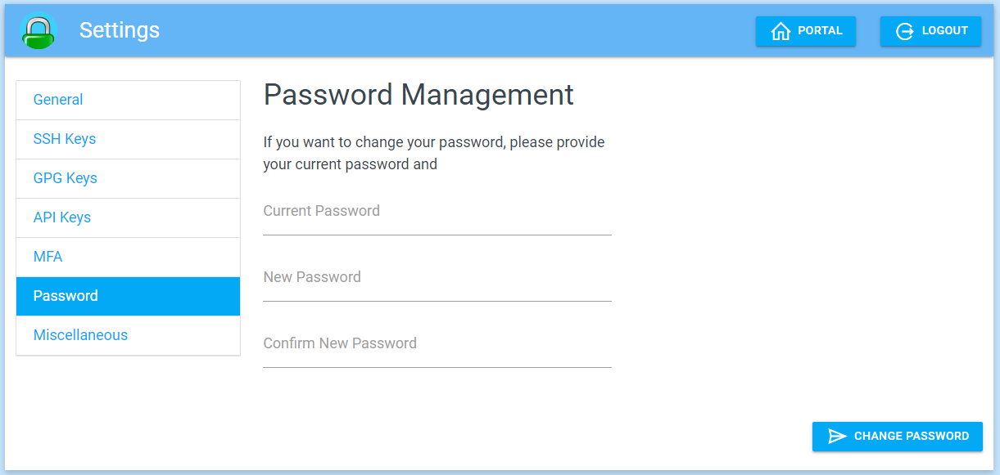
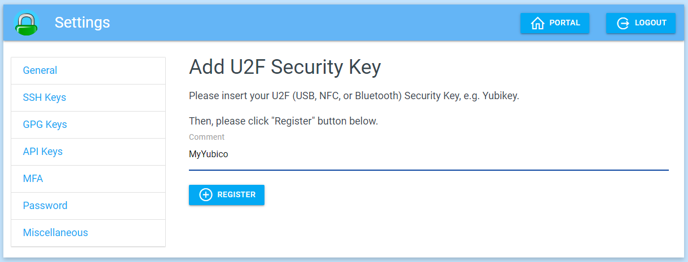
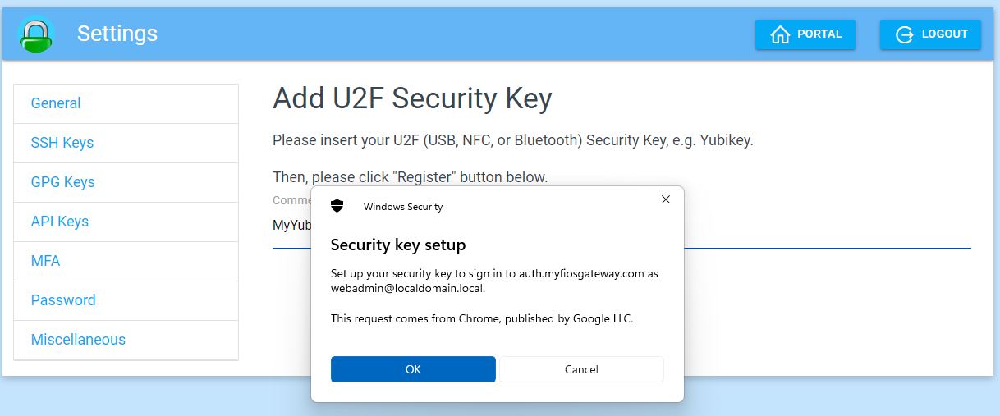
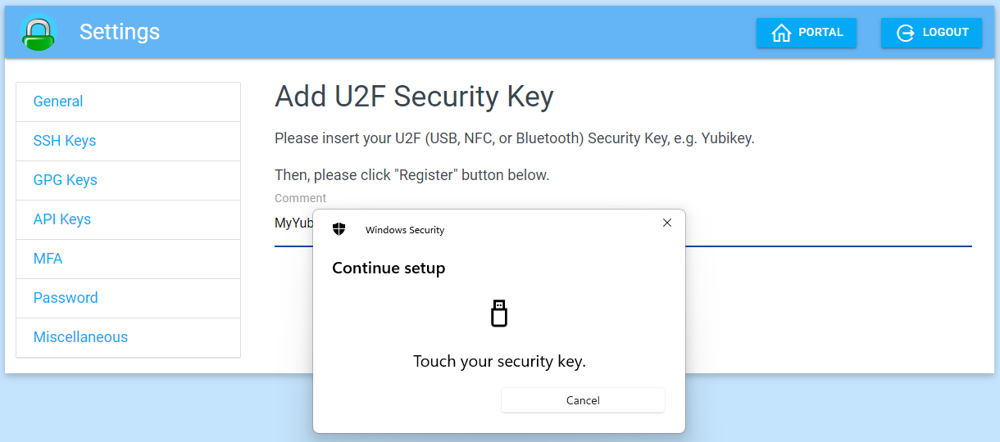
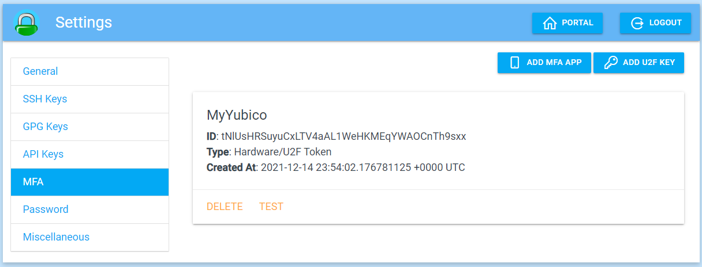
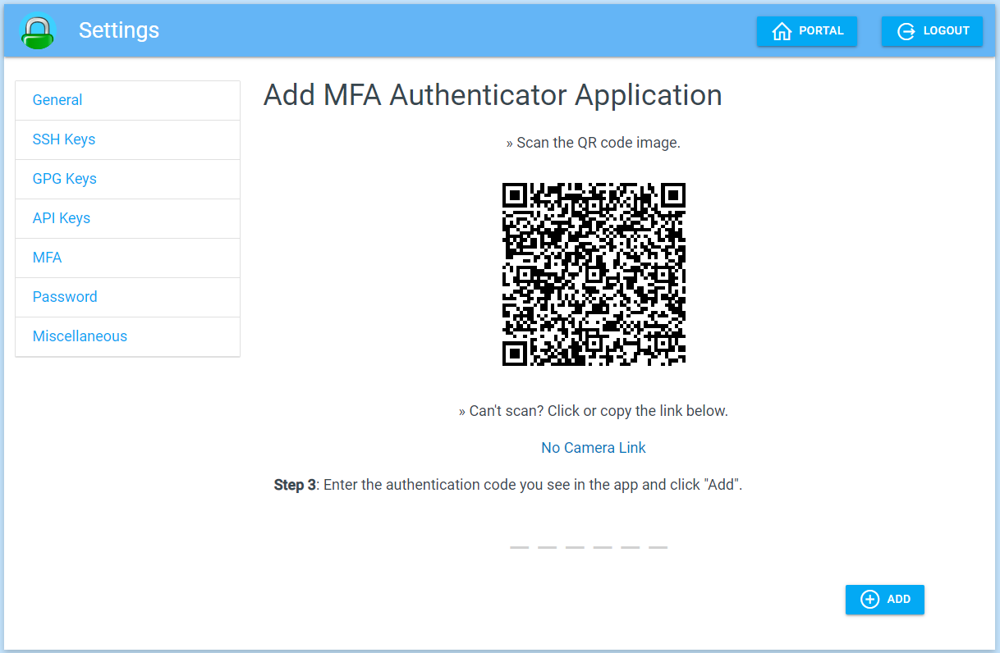
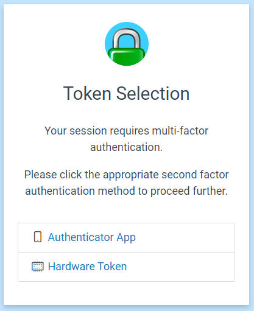

# User Interface

## User Login

## Portal

## User Identity (whoami)

## User Settings

### Password Management

### Add U2F Token (Yubico)

### Add Authenticator App

## Multi-Factor Authentication

