# Using the authentication portal

<span id="user-interface" />

The portal is the browser interface for signing in, opening application links,
and managing a local account. This guide follows a portal mounted at `/auth/`.
Replace that prefix if your deployment uses another mount.

The current screenshots were captured from **caddy-security v1.3.0 with
go-authcrunch v1.3.8**, using the [local learning example](../start/first-app.md)
and disposable demo accounts. Older screenshots remain beside each task as
historical references. Their lock logo, menus, and `/settings` URLs belong to an
earlier interface; **current account management is at `/auth/profile/`**.


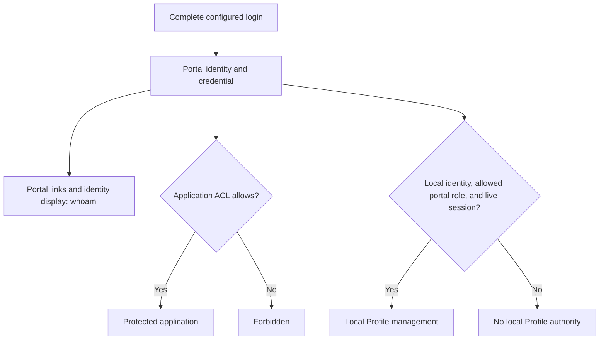
```mermaid
flowchart TD
  accTitle: Portal access, account management, and app membership are distinct
  accDescr: Completing login establishes a portal identity. Local Profile management also requires an allowed portal role and a live local session. Application routes require their own role/claim policy. External-provider users manage provider credentials at that provider rather than through the local Profile API.
  L["Complete configured login"] --> I["Portal identity and credential"]
  I --> P["Portal links and identity display: whoami"]
  I --> A{"Application ACL allows?"}
  A -->|Yes| APP["Protected application"]
  A -->|No| DENY["Forbidden"]
  I --> S{"Local identity, allowed portal role, and live session?"}
  S -->|Yes| PROFILE["Local Profile management"]
  S -->|No| NO["No local Profile authority"]
```

## User Login

Open `/auth/login`, or request an application protected by an authorization
policy. For a local account, enter your username or email and choose **Proceed**.
The next screen asks for your password. If the account requires more challenges,
complete those before the portal issues an access token.

For an external provider, choose its sign-in option. You authenticate on its
site and return through the configured OAuth or SAML callback. Its password and
MFA stay with that provider.

<figure className="doc-screenshot">

[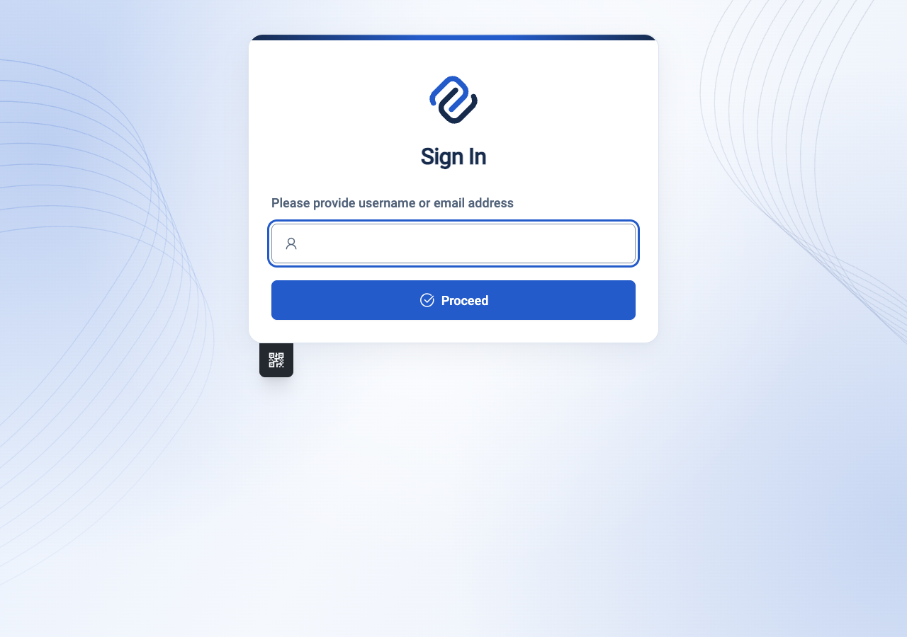](./images/portal-v1-3-0-login.png)

<figcaption>The released portal uses the current AuthCrunch branding. Attached identity sources determine the sign-in options.</figcaption>
</figure>
<figure className="doc-screenshot">

[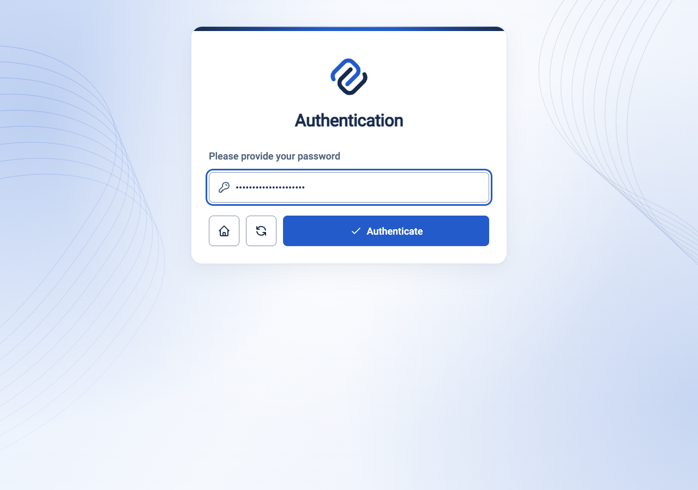](./images/portal-v1-3-0-password.png)

<figcaption>Identifying the account starts the local flow; login is complete only after all required checkpoints.</figcaption>
</figure>
<details className="screenshot-gallery">
<summary>Earlier sign-in and password screens</summary>

<figure className="doc-screenshot">

[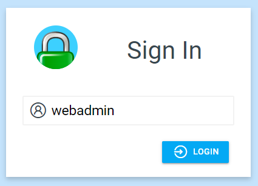](./images/authp_demo_01.png)

<figcaption>Earlier username step; the current action is Proceed.</figcaption>
</figure>

<figure className="doc-screenshot">

[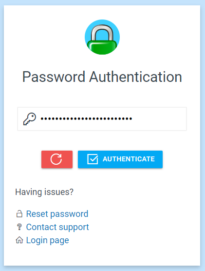](./images/authp_demo_02.png)

<figcaption>The historical reset-password link is not evidence of an implemented recovery workflow in the current release.</figcaption>
</figure>

</details>

## Portal

After login, `/auth/portal` displays configured application links. In the
learning example, choose **Example app**. A visible link is navigation, not an
access grant: the destination still needs its own authorization policy.

Administrators add links with [`ui links`](55-ui-features.md#portal-links), or add
identity-specific links with [transforms](42-user-transforms.md#add-ui-links).
The current default screen does not automatically add every profile or identity
link; visit those paths directly or ask your administrator to add them.

<figure className="doc-screenshot">

[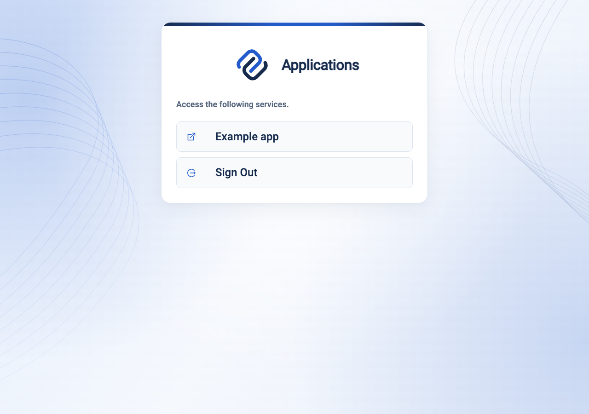](./images/portal-v1-3-0-applications.png)

<figcaption>Alice can use Example app. Bob sees the same link but receives 403 from its policy.</figcaption>
</figure>
<details className="screenshot-gallery">
<summary>Earlier portal landing page</summary>

<figure className="doc-screenshot">

[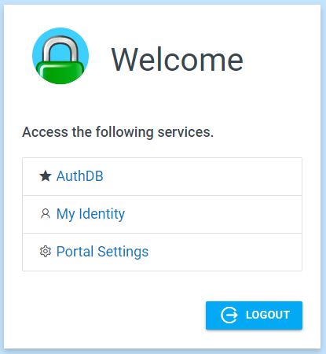](./images/authp_demo_03.png)

<figcaption>These links were part of the older example configuration; current links depend on your deployment.</figcaption>
</figure>

</details>

## User Identity (whoami)

Open `/auth/whoami` to inspect the current portal identity. Check its subject,
realm, roles, and expiry when diagnosing a policy denial. These are the claims
issued after portal mappings; they may differ from the original provider claims.
Treat identity data as private when sharing screenshots.

For programmatic access, see the [Portal API](api/20-portal-api.md). A successful
identity response alone does not prove that an application policy allows access.

<figure className="doc-screenshot">

[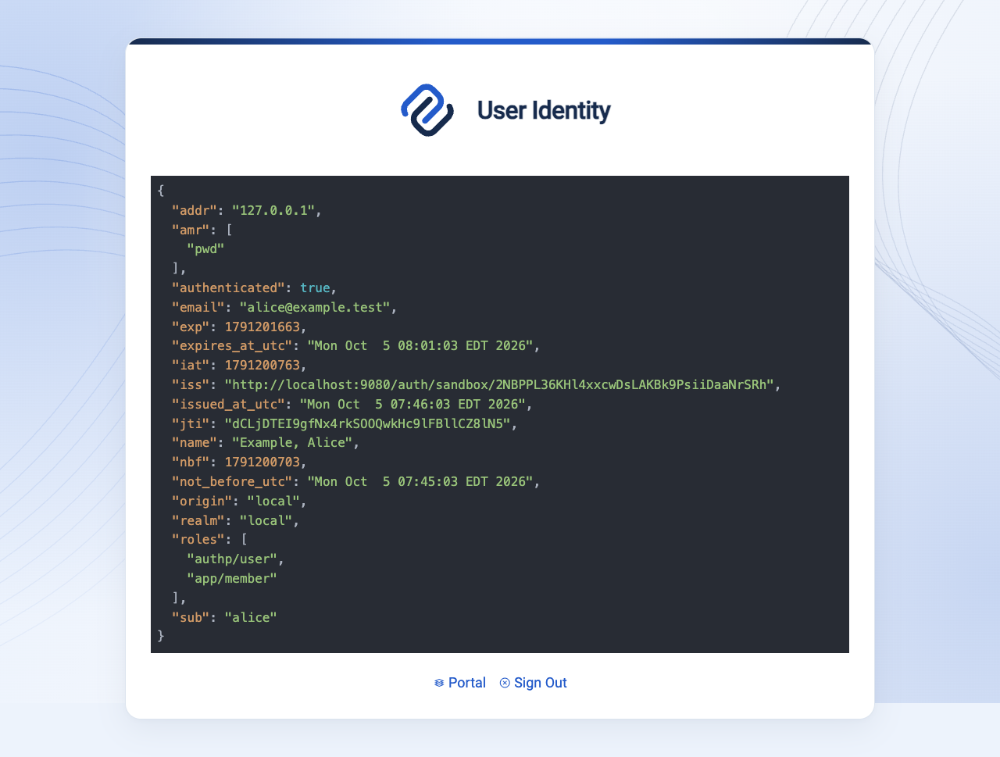](./images/portal-v1-3-0-identity.png)

<figcaption>This disposable identity includes the role required by the learning example.</figcaption>
</figure>
<details className="screenshot-gallery">
<summary>Earlier identity view</summary>

<figure className="doc-screenshot">

[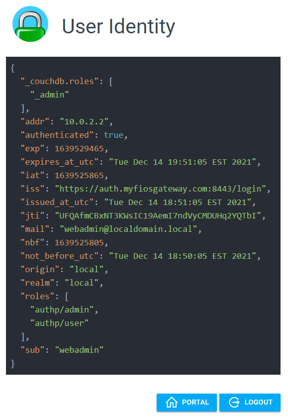](./images/authp_demo_04.png)

<figcaption>Historical claims from 2021. Do not grant administrator roles merely to make an application accessible.</figcaption>
</figure>

</details>

## User Settings

Open **`/auth/profile/`** for the current account dashboard. Local accounts with
`authp/user` or `authp/admin` can use the [Profile API](api/30-profile-api.md)
behind this interface to manage their password, authenticators, API keys, and
public SSH/GPG keys. A guest does not have profile-management permission.

An OAuth, SAML, or LDAP login does not turn into a local account. Manage those
credentials at their identity source; current profile-management operations
support local identities. The profile also depends on a live portal session,
not just possession of a signed token.

<figure className="doc-screenshot">

[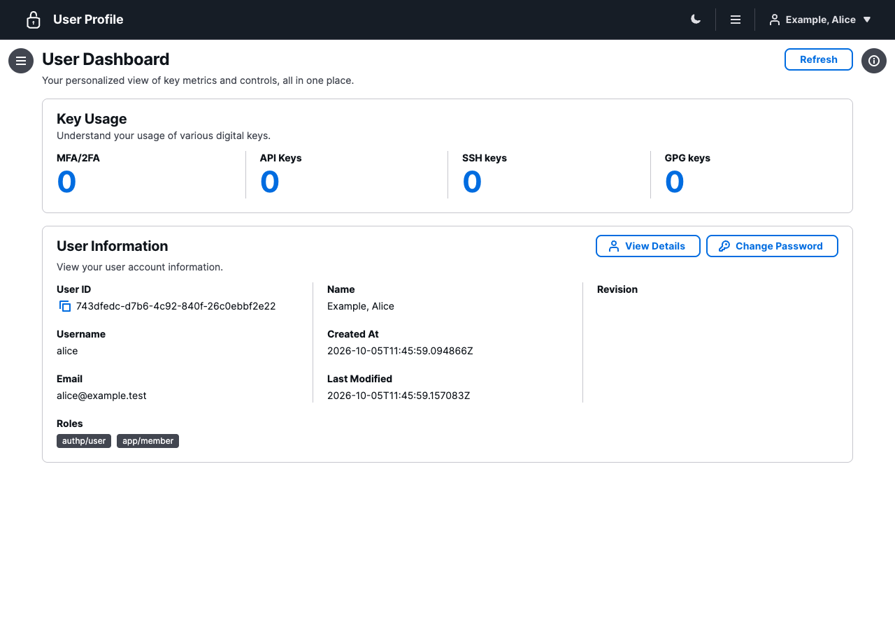](./images/portal-v1-3-0-profile.png)

<figcaption>The current User Profile replaces the earlier Settings interface.</figcaption>
</figure>

### Password Management

Choose **Change Password** in the local profile. Supply your current password
and confirm the new one, then verify it with a fresh login. Follow
[Local password management](local/30-password-management.md) for administrator
hash generation and password policy. Password changes and browser logout are
separate actions.

<details className="screenshot-gallery">
<summary>Earlier password form and authenticator list</summary>

<figure className="doc-screenshot">

[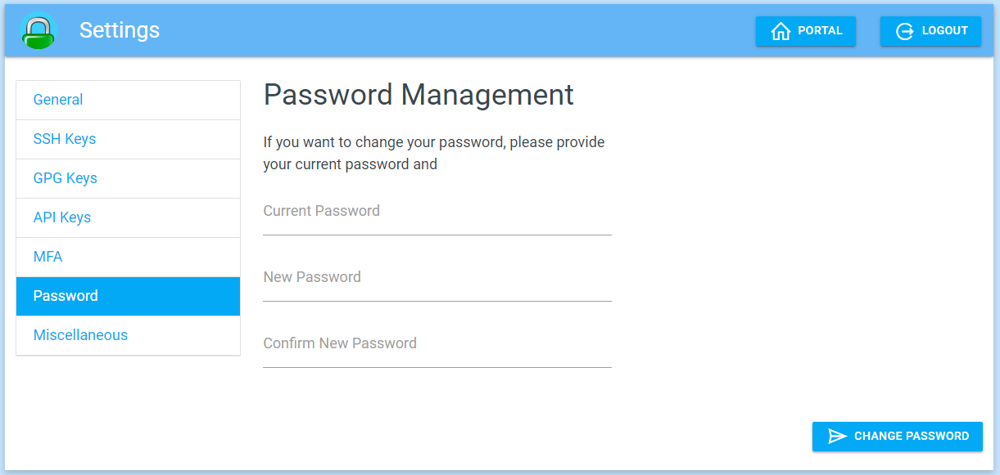](./images/authp_demo_05.png)

<figcaption>The old form illustrates the three inputs; use Change Password in the current profile.</figcaption>
</figure>

<figure className="doc-screenshot">

[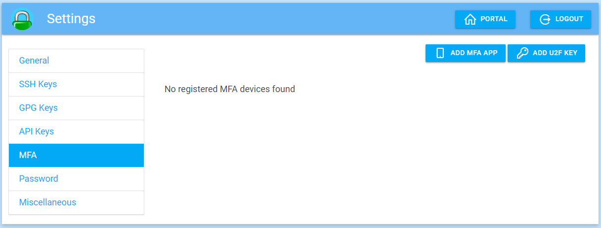](./images/authp_demo_06.png)

<figcaption>This is the authenticator list, despite its position in the old password gallery.</figcaption>
</figure>

</details>

### Add U2F Token (Yubico)

Use the profile's MFA controls to enroll a security key or supported WebAuthn
credential. Follow the browser or operating system prompt, confirm the credential
appears in the account, and test a fresh login. The earlier UI uses **U2F**;
current authentication also supports WebAuthn credentials. Enrollment alone does
not make login passwordless: [challenge rules](13-authentication-challenges.md)
determine the factors and their order.

<details className="screenshot-gallery">
<summary>Earlier security-key enrollment and operating system prompts</summary>

<figure className="doc-screenshot">

[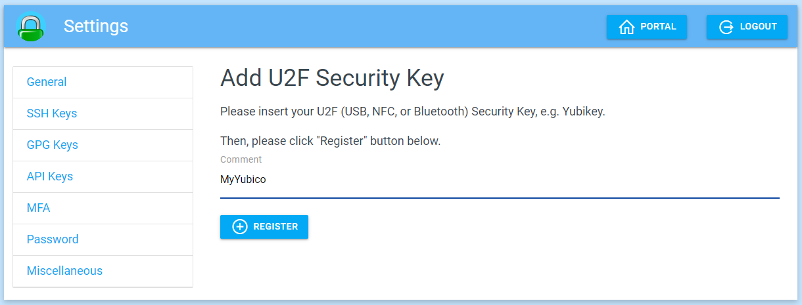](./images/authp_demo_07.png)

<figcaption>Name the credential before registration.</figcaption>
</figure>

<figure className="doc-screenshot">

[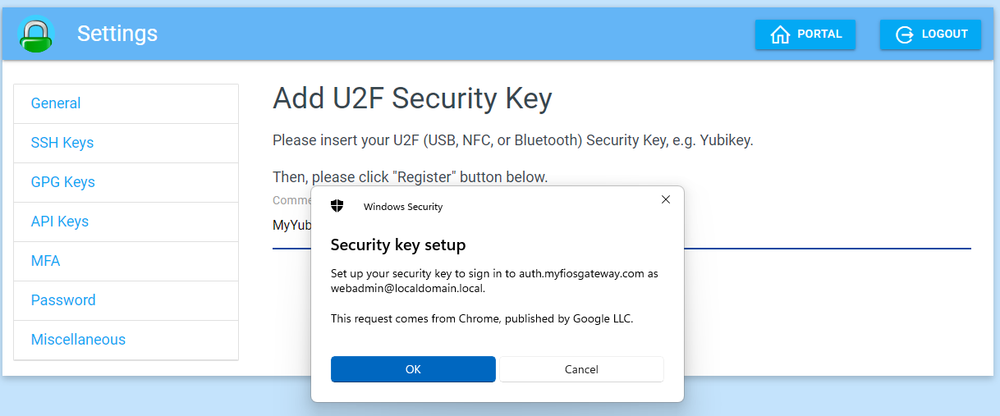](./images/authp_demo_08.png)

<figcaption>A historical system prompt; current prompts depend on the browser and authenticator.</figcaption>
</figure>

<figure className="doc-screenshot">

[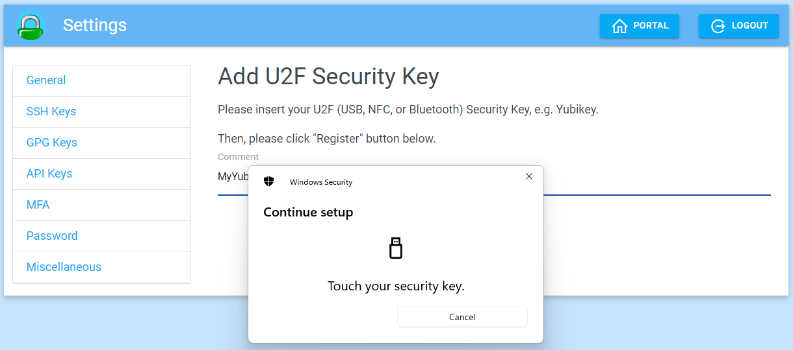](./images/authp_demo_09.png)

<figcaption>Complete the authenticator physical-presence prompt.</figcaption>
</figure>

<figure className="doc-screenshot">

[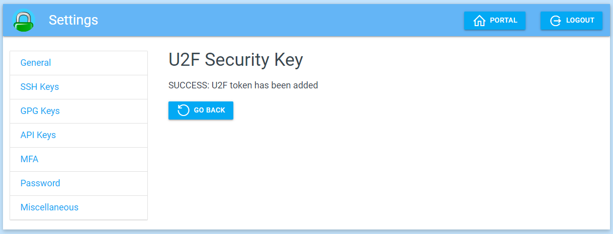](./images/authp_demo_10.png)

<figcaption>Successful enrollment precedes a separate login test.</figcaption>
</figure>

<figure className="doc-screenshot">

[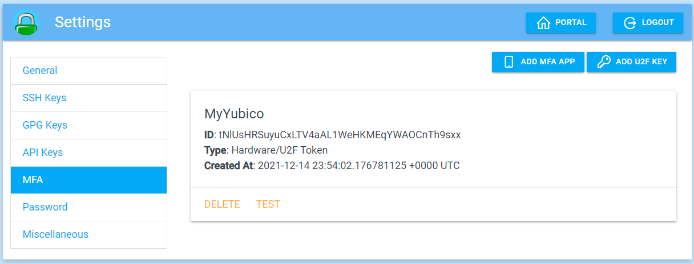](./images/authp_demo_11.png)

<figcaption>Identify the saved credential before testing or deleting it.</figcaption>
</figure>

</details>

### Add Authenticator App

Enroll a TOTP authenticator through the profile's MFA controls. Scan the QR code
from **your own account**, enter a current code to confirm enrollment, and verify
a fresh login. The QR code contains an authenticator secret and must be kept
private. The archived example is illustrative; do not scan it for your account.

See [Multi-factor authentication](11-mfa.md) for requirements and enrollment.

<details className="screenshot-gallery">
<summary>Earlier TOTP enrollment and Microsoft Authenticator examples</summary>

<figure className="doc-screenshot">

[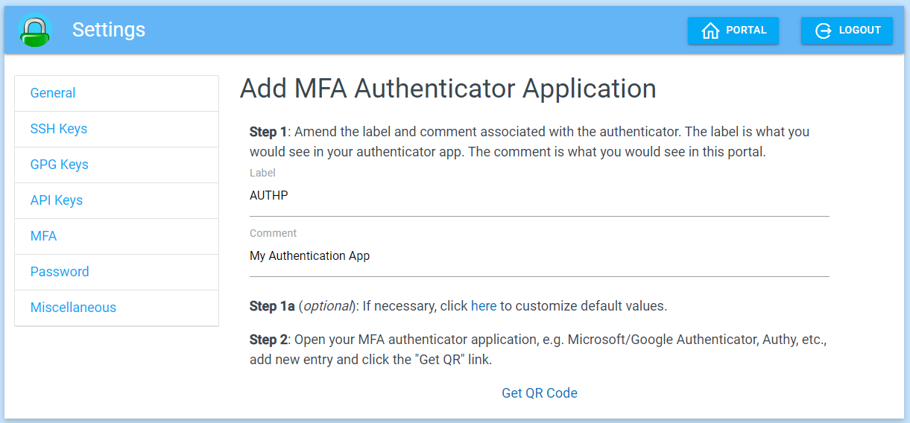](./images/authp_demo_12.png)

<figcaption>The label identifies this portal in the authenticator app.</figcaption>
</figure>

<figure className="doc-screenshot">

[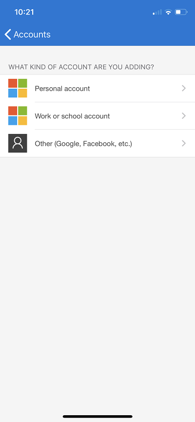](./images/ms_mfa_app_add_account.png)

<figcaption>Use a generic TOTP account flow; app menu wording changes across versions.</figcaption>
</figure>

<figure className="doc-screenshot">

[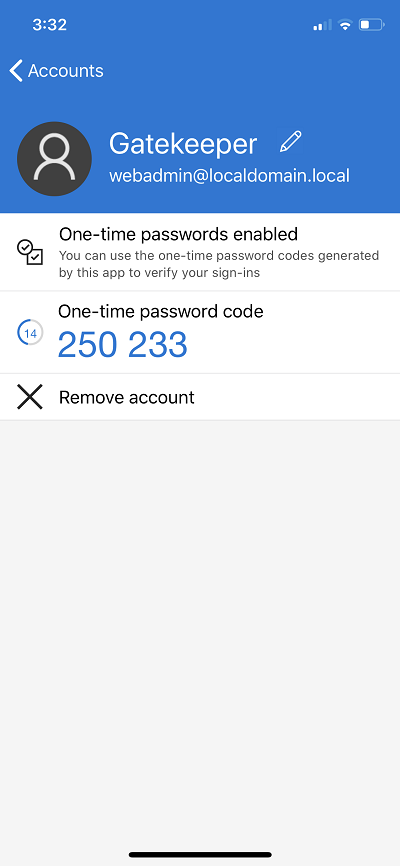](./images/ms_mfa_app_new_account.png)

<figcaption>The app generates a new code periodically. This expired example is not a code to reuse.</figcaption>
</figure>

<figure className="doc-screenshot">

[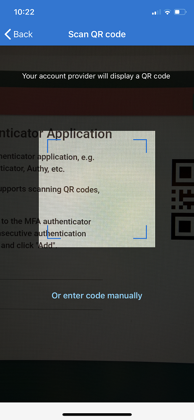](./images/ms_mfa_app_scan_qrcode.png)

<figcaption>Scan the code from your signed-in account.</figcaption>
</figure>

<figure className="doc-screenshot">

[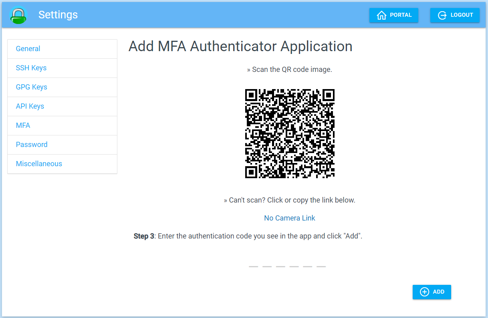](./images/authp_demo_13.png)

<figcaption>Historical demonstration only. Never share an enrollment QR code from a real account.</figcaption>
</figure>

<figure className="doc-screenshot">

[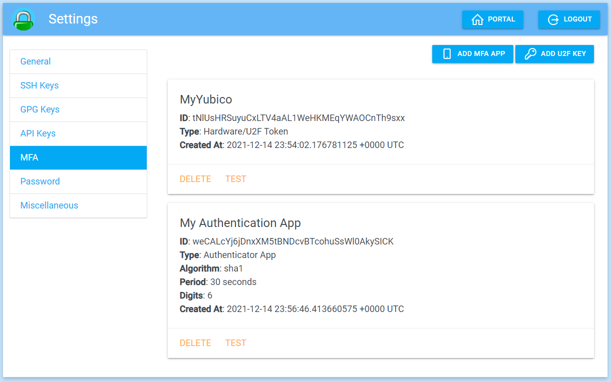](./images/authp_demo_14.png)

<figcaption>Registered factors and required login challenges are separate settings.</figcaption>
</figure>

</details>

## Multi-Factor Authentication

During a local login, the portal can ask for an authenticator code or a
security-key interaction after the password. If `require mfa` applies and the
account has no factor, login requires enrollment. Custom challenge rules can
change the sequence and fallbacks. For federated logins, configure MFA at the
upstream identity provider.

Read [MFA](11-mfa.md) and [Authentication challenges](13-authentication-challenges.md)
before changing a local account's requirements.

<details className="screenshot-gallery">
<summary>Earlier factor selection and verification prompts</summary>

<figure className="doc-screenshot">

[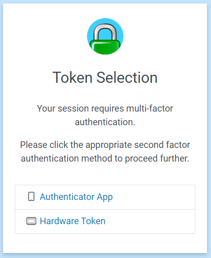](./images/authp_demo_15.png)

<figcaption>Choosing an available factor differs from passing every checkpoint in an explicit sequence.</figcaption>
</figure>

<figure className="doc-screenshot">

[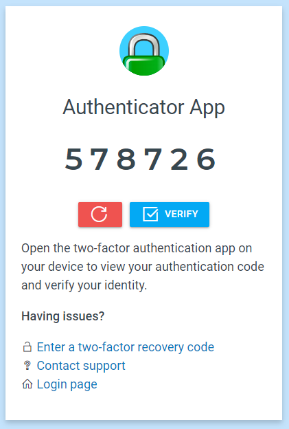](./images/authp_demo_16.png)

<figcaption>Use a current code from your own app. The historical recovery-code link does not establish a supported recovery workflow.</figcaption>
</figure>

<figure className="doc-screenshot">

[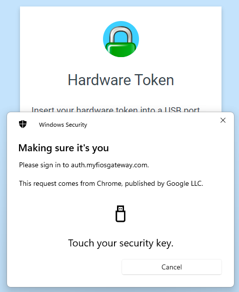](./images/authp_demo_17.png)

<figcaption>Complete the authenticator prompt on the expected portal origin.</figcaption>
</figure>

</details>

## Sign out and diagnose problems

Choose **Sign Out**, or open `/auth/logout`. In the learning example, a fresh
request to `/app` then requires login. This does not by itself end upstream SSO
or revoke every copy of an access token; see [Logout](15-logout.md).

| Symptom | Next check |
| --- | --- |
| Login repeatedly restarts | [Cookie scope and key consistency](../troubleshoot.md#the-browser-returns-to-login) |
| Login succeeds but app returns 403 | Compare roles with the [application policy](../troubleshoot.md#login-works-but-the-app-returns-403) |
| An old Settings link returns 404 | Update it to `/auth/profile/`, using your actual prefix |
| Profile data cannot load | Confirm local login, profile permission, and a live session; consult the [Profile API](api/30-profile-api.md) |
| Login ends on Applications instead of the requested page | Check [trusted redirects](100-trust-login-logout.md) |

## Agentic Prompts

Copy a prompt into your LLM to explore this topic. Each prompt prioritizes
upstream repository guidance and code over this page, and asks for version-aware
reasoning.

<div className="agentic-prompts">

<details>
<summary>Follow one complete login</summary>

```text
Help me understand Using the authentication portal.

Primary authorities (take precedence over website documentation):
https://github.com/greenpau/caddy-security/blob/main/AGENTS.md
https://github.com/greenpau/caddy-security/tree/main/.codex/skills
https://github.com/greenpau/go-authcrunch/blob/main/AGENTS.md
https://github.com/greenpau/go-authcrunch/tree/main/.codex/skills
Read each repository's root AGENTS.md first, then any scoped AGENTS.md that
applies to inspected paths. Read the relevant SKILL.md files and follow their
implementation and test references.

Relevant skills to locate: configuration-authentication,
authentication-portal-profile, authentication-portal-challenges.

Secondary reference:
https://docs.authcrunch.com/docs/authenticate/auth-portal

If a source is inaccessible, ask me to paste its relevant text. Identify the
versions your answer applies to; main may be newer than my release. Resolve
disagreements using code and tests, and flag unverified claims. Use synthetic
credentials and redacted examples; explain proposed checks before any changes.

Walk me through a local username/password login, required checkpoints,
Applications, whoami, and Profile using my actual portal prefix. Distinguish
identifying an account from completing authentication. Compare
external-provider login without implying its credentials become a local
account.
```

</details>

<details>
<summary>Read the current and historical screens</summary>

```text
Help me understand Using the authentication portal.

Primary authorities (take precedence over website documentation):
https://github.com/greenpau/caddy-security/blob/main/AGENTS.md
https://github.com/greenpau/caddy-security/tree/main/.codex/skills
https://github.com/greenpau/go-authcrunch/blob/main/AGENTS.md
https://github.com/greenpau/go-authcrunch/tree/main/.codex/skills
Read each repository's root AGENTS.md first, then any scoped AGENTS.md that
applies to inspected paths. Read the relevant SKILL.md files and follow their
implementation and test references.

Relevant skills to locate: configuration-authentication,
authentication-portal-profile, authentication-portal-challenges.

Secondary reference:
https://docs.authcrunch.com/docs/authenticate/auth-portal

If a source is inaccessible, ask me to paste its relevant text. Identify the
versions your answer applies to; main may be newer than my release. Resolve
disagreements using code and tests, and flag unverified claims. Use synthetic
credentials and redacted examples; explain proposed checks before any changes.

Explain how to use this page’s current screenshots and captioned historical
screens. Locate the current Profile route instead of an old Settings link.
Describe which menus depend on configuration and why a displayed application
link is not an authorization grant.
```

</details>

<details>
<summary>Diagnose Profile access</summary>

```text
Help me understand Using the authentication portal.

Primary authorities (take precedence over website documentation):
https://github.com/greenpau/caddy-security/blob/main/AGENTS.md
https://github.com/greenpau/caddy-security/tree/main/.codex/skills
https://github.com/greenpau/go-authcrunch/blob/main/AGENTS.md
https://github.com/greenpau/go-authcrunch/tree/main/.codex/skills
Read each repository's root AGENTS.md first, then any scoped AGENTS.md that
applies to inspected paths. Read the relevant SKILL.md files and follow their
implementation and test references.

Relevant skills to locate: configuration-authentication,
authentication-portal-profile, authentication-portal-challenges.

Secondary reference:
https://docs.authcrunch.com/docs/authenticate/auth-portal

If a source is inaccessible, ask me to paste its relevant text. Identify the
versions your answer applies to; main may be newer than my release. Resolve
disagreements using code and tests, and flag unverified claims. Use synthetic
credentials and redacted examples; explain proposed checks before any changes.

Help me investigate a user who can open an app but cannot load Profile. Ask
about identity source, portal roles, live session, token origin, and restart.
Distinguish valid app JWTs from the local browser session needed for account
management.
```

</details>

<details>
<summary>Plan an account-management exercise</summary>

```text
Help me understand Using the authentication portal.

Primary authorities (take precedence over website documentation):
https://github.com/greenpau/caddy-security/blob/main/AGENTS.md
https://github.com/greenpau/caddy-security/tree/main/.codex/skills
https://github.com/greenpau/go-authcrunch/blob/main/AGENTS.md
https://github.com/greenpau/go-authcrunch/tree/main/.codex/skills
Read each repository's root AGENTS.md first, then any scoped AGENTS.md that
applies to inspected paths. Read the relevant SKILL.md files and follow their
implementation and test references.

Relevant skills to locate: configuration-authentication,
authentication-portal-profile, authentication-portal-challenges.

Secondary reference:
https://docs.authcrunch.com/docs/authenticate/auth-portal

If a source is inaccessible, ask me to paste its relevant text. Identify the
versions your answer applies to; main may be newer than my release. Resolve
disagreements using code and tests, and flag unverified claims. Use synthetic
credentials and redacted examples; explain proposed checks before any changes.

Design a disposable-local-account exercise covering password change, TOTP or
WebAuthn enrollment, and a fresh login. Explain why enrollment is not
completed MFA evidence. Keep enrollment secrets and QR codes private, and mark
unsupported recovery assumptions.
```

</details>

<details>
<summary>Teach back the portal boundaries</summary>

```text
Help me understand Using the authentication portal.

Primary authorities (take precedence over website documentation):
https://github.com/greenpau/caddy-security/blob/main/AGENTS.md
https://github.com/greenpau/caddy-security/tree/main/.codex/skills
https://github.com/greenpau/go-authcrunch/blob/main/AGENTS.md
https://github.com/greenpau/go-authcrunch/tree/main/.codex/skills
Read each repository's root AGENTS.md first, then any scoped AGENTS.md that
applies to inspected paths. Read the relevant SKILL.md files and follow their
implementation and test references.

Relevant skills to locate: configuration-authentication,
authentication-portal-profile, authentication-portal-challenges.

Secondary reference:
https://docs.authcrunch.com/docs/authenticate/auth-portal

If a source is inaccessible, ask me to paste its relevant text. Identify the
versions your answer applies to; main may be newer than my release. Resolve
disagreements using code and tests, and flag unverified claims. Use synthetic
credentials and redacted examples; explain proposed checks before any changes.

Quiz me on a member and nonmember seeing the same app link, an external user
opening Profile, an old Settings URL, and copied-token access after logout.
Wait for each answer and ask me to identify the service making the decision.
```

</details>

</div>

## Source Code References

Start with the code search, then follow the parser, runtime, and tests relevant
to this topic. These links target `main`; use GitHub's branch/tag selector to
compare them with your installed release.

1. [Search this topic in both repositories](https://github.com/search?q=%28repo%3Agreenpau%2Fgo-authcrunch%20OR%20repo%3Agreenpau%2Fcaddy-security%29%20%28handleHTTPLogin%20OR%20handleAPIProfile%20OR%20handleHTTPWhoami%29&type=code)
   — searches topic-specific symbols and paths across both codebases.
2. [caddy-security: plugin_authn.go](https://github.com/greenpau/caddy-security/blob/main/plugin_authn.go)
   — mounts the portal in Caddy and delegates HTTP requests.
3. [go-authcrunch: pkg/authn/serve_http.go](https://github.com/greenpau/go-authcrunch/blob/main/pkg/authn/serve_http.go)
   — dispatches browser, API, and provider routes under the portal mount.
4. [go-authcrunch: pkg/authn/handle_http_login.go](https://github.com/greenpau/go-authcrunch/blob/main/pkg/authn/handle_http_login.go)
   — starts browser login and constructs the login view.
5. [go-authcrunch: pkg/authn/handle_http_sandbox.go](https://github.com/greenpau/go-authcrunch/blob/main/pkg/authn/handle_http_sandbox.go)
   — handles local browser authentication checkpoints.
6. [go-authcrunch: pkg/authn/handle_api_profile.go](https://github.com/greenpau/go-authcrunch/blob/main/pkg/authn/handle_api_profile.go)
   — checks local identity/session access and dispatches Profile operations.
7. [go-authcrunch: pkg/authn/profile_session_e2e_test.go](https://github.com/greenpau/go-authcrunch/blob/main/pkg/authn/profile_session_e2e_test.go)
   — tests the live-session boundary for profile access.
