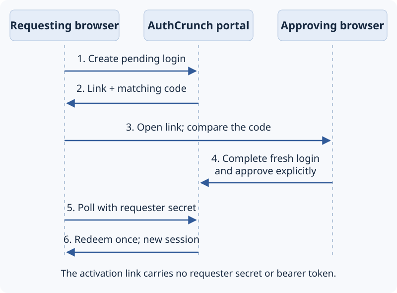
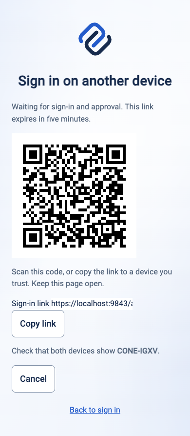
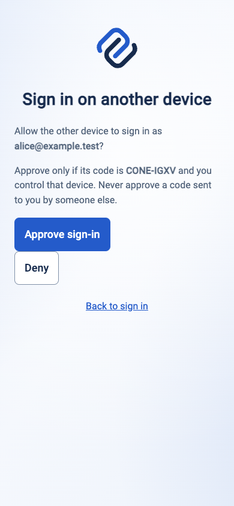
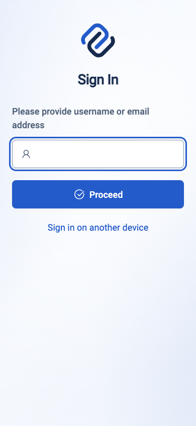
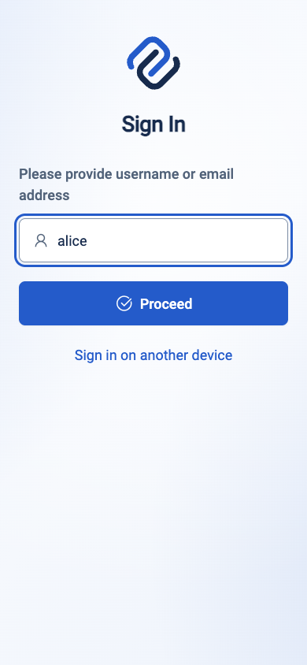
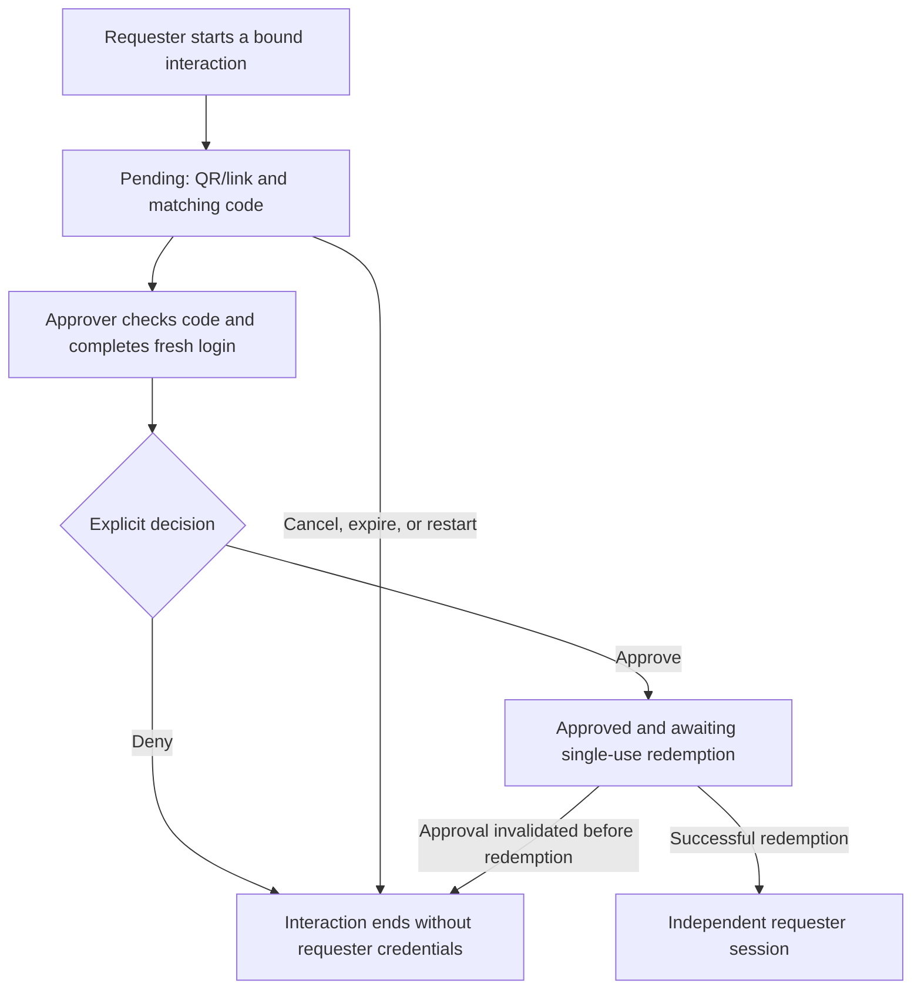

# Cross-device browser login

:::info[Version boundary]

The library feature is released in **go-authcrunch v1.3.11** and included in
the **caddy-security v1.4.0 source tag**. The downloadable v1.3.0 bundle does
not accept these directives. At the October 5 check, v1.4.0 binary assets are
not yet published; use a matching source build and check
[availability](../operations/versions.md).

:::

Cross-device login lets a browser request approval from another browser. It is
useful when entering credentials on the requesting device is inconvenient. The
approving browser completes ordinary login and explicitly approves the displayed
account and matching code. The requesting browser receives its own session.

<figure className="doc-screenshot">

[](./images/cross-device-flow.svg)

<figcaption>Two browser bindings, one explicit approval, and a separate requester session. Open the diagram for a larger view.</figcaption>
</figure>

<span id="enable-the-preview" />

## Enable cross-device login

Add this directive to an otherwise working portal in a compatible build:

```caddyfile
authentication portal myportal {
    enable identity store localdb
    enable cross-device login
}
```

Omission disables the feature, including its routes and login links. Explicit
opt-out uses `disable cross-device login`. Both are statements, not nested blocks.
Built-in templates display the option; a custom login template must add its own
opt-in link to the flow.

## Approve another browser

For a portal mounted at `/auth/`:

1. Open `/auth/cross-device` on the requesting device. It displays a QR/link and
   a short matching code.
2. Open that link on the approving device. Confirm that the matching code agrees
   with the request you initiated and that you recognize the requesting device.
3. Start and complete a **fresh** portal login, including required password/MFA
   or the configured OAuth/SAML flow.
4. Review the account and code, then choose approve or deny explicitly.
5. The requester polls serially and, after successful single-use redemption,
   receives independent credential cookies and continues to the portal.


### What each browser shows

These screens were captured from **caddy-security v1.4.0 source with
go-authcrunch v1.3.11**, using two isolated browsers and a disposable local
account. The example uses password login; your configured MFA or external
provider adds its normal steps. The codes shown belong to this completed test
interaction, not a code to enter into your portal.

<div className="doc-screen-pair">
<figure className="doc-screenshot">

[](./images/cross-device-v1-4-0-request.png)

<figcaption><strong>Requesting device.</strong> Choose sign-in on another device, then keep this screen open. Send or scan its link and compare the short matching code. Waiting alone does not authenticate this browser.</figcaption>
</figure>
<figure className="doc-screenshot">

[](./images/cross-device-v1-4-0-confirm.png)

<figcaption><strong>Approving device, after fresh login.</strong> Check both the displayed account and the same matching code, and approve only the request you initiated on a device you control. Choose Deny for a request you do not recognize.</figcaption>
</figure>
</div>

<details className="screenshot-gallery">
<summary>Follow the complete two-browser walkthrough</summary>

<figure className="doc-screenshot">

[](./images/cross-device-v1-4-0-login-option.png)

<figcaption><strong>1. Requester: choose the alternative.</strong> The option appears only when the portal enables cross-device login.</figcaption>
</figure>

<figure className="doc-screenshot">

[](./images/cross-device-v1-4-0-activate.png)

<figcaption><strong>2. Approver: check the request first.</strong> Opening the QR/link displays the same short code. It does not sign in either device; choose Sign in to continue only for your own request.</figcaption>
</figure>

<figure className="doc-screenshot">

[](./images/cross-device-v1-4-0-fresh-login.png)

<figcaption><strong>3. Approver: complete fresh login.</strong> Enter the intended account. An existing approving-browser token is not a substitute for this new HTML login.</figcaption>
</figure>

<figure className="doc-screenshot">

[](./images/cross-device-v1-4-0-password.png)

<figcaption><strong>4. Approver: satisfy the account's checkpoints.</strong> This test uses a password. Required TOTP, passkey, or provider steps must also finish before the account-and-code confirmation screen appears.</figcaption>
</figure>

<figure className="doc-screenshot">

[](./images/cross-device-v1-4-0-complete.png)

<figcaption><strong>5. Requester: continue in its own session.</strong> After approval, polling and single-use redemption complete sign-in. The requester receives independent credentials; this does not copy the approving browser's cookie.</figcaption>
</figure>

<figure className="doc-screenshot">

[](./images/cross-device-v1-4-0-cancelled.png)

<figcaption><strong>Alternative: cancel.</strong> Cancel ends the visible pending request and stops polling. Start a new interaction when you want to try again.</figcaption>
</figure>

</details>

The QR/link contains an activation code, not the requester secret or bearer
tokens. A link alone cannot authenticate either browser. Do not approve an
unsolicited request just because its link points to your legitimate portal.
An existing JWT, API-key/Basic request or JSON login cannot replace the required
fresh HTML completion.

This is a browser approval flow, **not an RFC 8628 device authorization endpoint**.
The older `/qrcode/login.png` merely points at ordinary portal navigation and
does not enable cross-device approval.




## Session and failure behavior

Requests expire after five minutes. The client polls every two seconds and
stops on cancellation, denial, expiry, navigation or uncertain network failure.
Reloading starts a new interaction. Redemption is single-use; a lost redeemed
response requires a new request, not a retry that issues another credential.

The approving account's current local identity and challenge policy are checked
again at redemption. Provider identities rerun their portal transforms for the
requesting device. Upstream ID/refresh tokens are not copied. A transfer does
not add upstream account introspection beyond the provider's existing contract.

When configured, refresh and OIDC create independent sessions on the requester.
Logging out or revoking the approving session/family invalidates outstanding
approvals, but cannot undo a transfer already completed. Test stronger challenge
policies and account changes as well as a happy path.

## Deployment checks

Use HTTPS and the exact portal origin/mount. POSTs require a matching Origin,
compatible Fetch Metadata, and a bounded URL-encoded form. The temporary
approving-browser cookie is Secure, HttpOnly, host-only, mount-scoped and
SameSite=None to accommodate signed SAML POST callbacks. It relies on explicit
origin, browser binding and approval checks.

Pending requests remain in memory even with [persistent state](../operations/runtime-state.md).
Restart discards them. Fixed limits are 1024 active requests total and eight
per trusted source address. Confirm trusted proxy normalization, both browser
paths, denial/cancellation, logout invalidation, and narrow mobile layout before
offering cross-device login to users.

Implementation references: [library v1.3.11](https://github.com/greenpau/go-authcrunch/tree/v1.3.11/pkg/authn),
[Caddy integration commit](https://github.com/greenpau/caddy-security/commit/a8f81c7).

## Agentic Prompts

Copy a prompt into your LLM to explore this topic. Each prompt prioritizes
upstream repository guidance and code over this page, and asks for version-aware
reasoning.

<div className="agentic-prompts">

<details>
<summary>Understand two independent browsers</summary>

```text
Help me understand Cross-device browser login.

Primary authorities (take precedence over website documentation):
https://github.com/greenpau/caddy-security/blob/main/AGENTS.md
https://github.com/greenpau/caddy-security/tree/main/.codex/skills
https://github.com/greenpau/go-authcrunch/blob/main/AGENTS.md
https://github.com/greenpau/go-authcrunch/tree/main/.codex/skills
Read each repository's root AGENTS.md first, then any scoped AGENTS.md that
applies to inspected paths. Read the relevant SKILL.md files and follow their
implementation and test references.

Relevant skills to locate: configuration-authentication-cross-device,
authentication-portal-cross-device.

Secondary reference:
https://docs.authcrunch.com/docs/authenticate/cross-device

If a source is inaccessible, ask me to paste its relevant text. Identify the
versions your answer applies to; main may be newer than my release. Resolve
disagreements using code and tests, and flag unverified claims. Use synthetic
credentials and redacted examples; explain proposed checks before any changes.

Draw the requester and approver flow, including QR/link, matching code, fresh
HTML login, explicit approve/deny, polling, and single-use redemption. Explain
what the link does not contain and why this is not RFC 8628 device
authorization. Check binary availability first.
```

</details>

<details>
<summary>Reason about approval consent</summary>

```text
Help me understand Cross-device browser login.

Primary authorities (take precedence over website documentation):
https://github.com/greenpau/caddy-security/blob/main/AGENTS.md
https://github.com/greenpau/caddy-security/tree/main/.codex/skills
https://github.com/greenpau/go-authcrunch/blob/main/AGENTS.md
https://github.com/greenpau/go-authcrunch/tree/main/.codex/skills
Read each repository's root AGENTS.md first, then any scoped AGENTS.md that
applies to inspected paths. Read the relevant SKILL.md files and follow their
implementation and test references.

Relevant skills to locate: configuration-authentication-cross-device,
authentication-portal-cross-device.

Secondary reference:
https://docs.authcrunch.com/docs/authenticate/cross-device

If a source is inaccessible, ask me to paste its relevant text. Identify the
versions your answer applies to; main may be newer than my release. Resolve
disagreements using code and tests, and flag unverified claims. Use synthetic
credentials and redacted examples; explain proposed checks before any changes.

Explain why an existing JWT, JSON login, Basic request, or API key cannot
replace the fresh approving-browser completion. Use an unsolicited-request
scenario to discuss account/code confirmation. Distinguish legitimate portal
origin from evidence that I intended this device request.
```

</details>

<details>
<summary>Diagnose a stopped transfer</summary>

```text
Help me understand Cross-device browser login.

Primary authorities (take precedence over website documentation):
https://github.com/greenpau/caddy-security/blob/main/AGENTS.md
https://github.com/greenpau/caddy-security/tree/main/.codex/skills
https://github.com/greenpau/go-authcrunch/blob/main/AGENTS.md
https://github.com/greenpau/go-authcrunch/tree/main/.codex/skills
Read each repository's root AGENTS.md first, then any scoped AGENTS.md that
applies to inspected paths. Read the relevant SKILL.md files and follow their
implementation and test references.

Relevant skills to locate: configuration-authentication-cross-device,
authentication-portal-cross-device.

Secondary reference:
https://docs.authcrunch.com/docs/authenticate/cross-device

If a source is inaccessible, ask me to paste its relevant text. Identify the
versions your answer applies to; main may be newer than my release. Resolve
disagreements using code and tests, and flag unverified claims. Use synthetic
credentials and redacted examples; explain proposed checks before any changes.

Help me classify denial, cancellation, expiry, incorrect origin/mount,
restart, and uncertain network failure. Ask for redacted state/status only.
Explain when a new interaction is required and why a lost redeemed response
must not be retried to issue another credential.
```

</details>

<details>
<summary>Test independent sessions</summary>

```text
Help me understand Cross-device browser login.

Primary authorities (take precedence over website documentation):
https://github.com/greenpau/caddy-security/blob/main/AGENTS.md
https://github.com/greenpau/caddy-security/tree/main/.codex/skills
https://github.com/greenpau/go-authcrunch/blob/main/AGENTS.md
https://github.com/greenpau/go-authcrunch/tree/main/.codex/skills
Read each repository's root AGENTS.md first, then any scoped AGENTS.md that
applies to inspected paths. Read the relevant SKILL.md files and follow their
implementation and test references.

Relevant skills to locate: configuration-authentication-cross-device,
authentication-portal-cross-device.

Secondary reference:
https://docs.authcrunch.com/docs/authenticate/cross-device

If a source is inaccessible, ask me to paste its relevant text. Identify the
versions your answer applies to; main may be newer than my release. Resolve
disagreements using code and tests, and flag unverified claims. Use synthetic
credentials and redacted examples; explain proposed checks before any changes.

Design cases for local policy change before redemption, provider transform
reapplication, approving-session logout, and requester refresh/OIDC
independence. Explain what invalidates outstanding approvals and what cannot
undo a completed transfer. Include replay and capacity cases.
```

</details>

<details>
<summary>Review the deployment boundary</summary>

```text
Help me understand Cross-device browser login.

Primary authorities (take precedence over website documentation):
https://github.com/greenpau/caddy-security/blob/main/AGENTS.md
https://github.com/greenpau/caddy-security/tree/main/.codex/skills
https://github.com/greenpau/go-authcrunch/blob/main/AGENTS.md
https://github.com/greenpau/go-authcrunch/tree/main/.codex/skills
Read each repository's root AGENTS.md first, then any scoped AGENTS.md that
applies to inspected paths. Read the relevant SKILL.md files and follow their
implementation and test references.

Relevant skills to locate: configuration-authentication-cross-device,
authentication-portal-cross-device.

Secondary reference:
https://docs.authcrunch.com/docs/authenticate/cross-device

If a source is inaccessible, ask me to paste its relevant text. Identify the
versions your answer applies to; main may be newer than my release. Resolve
disagreements using code and tests, and flag unverified claims. Use synthetic
credentials and redacted examples; explain proposed checks before any changes.

Review a redacted compatible portal for opt-in syntax, custom-template link,
HTTPS, trusted source-address normalization, fixed binding cookie, and both
mobile/browser paths. Explain what stays volatile with persistence, then quiz
me about a QR link seen by an unintended person.
```

</details>

</div>

## Source Code References

Start with the code search, then follow the parser, runtime, and tests relevant
to this topic. These links target `main`; use GitHub's branch/tag selector to
compare them with your installed release.

1. [Search this topic in both repositories](https://github.com/search?q=%28repo%3Agreenpau%2Fgo-authcrunch%20OR%20repo%3Agreenpau%2Fcaddy-security%29%20%28CrossDeviceLoginConfig%20OR%20crossDevice%20OR%20cross_device%29&type=code)
   — searches topic-specific symbols and paths across both codebases.
2. [caddy-security: caddyfile_authn_misc.go](https://github.com/greenpau/caddy-security/blob/main/caddyfile_authn_misc.go)
   — parses portal options, selections, and trusted redirect rules.
3. [caddy-security: caddyfile_authn_cross_device_test.go](https://github.com/greenpau/caddy-security/blob/main/caddyfile_authn_cross_device_test.go)
   — tests opt-in cross-device configuration and cookie-name adaptation.
4. [go-authcrunch: pkg/authn/cross_device_config.go](https://github.com/greenpau/go-authcrunch/blob/main/pkg/authn/cross_device_config.go)
   — defines opt-in cross-device login configuration.
5. [go-authcrunch: pkg/authn/cross_device_http.go](https://github.com/greenpau/go-authcrunch/blob/main/pkg/authn/cross_device_http.go)
   — handles requester, approver, polling, and redemption requests.
6. [go-authcrunch: pkg/authn/cross_device_store.go](https://github.com/greenpau/go-authcrunch/blob/main/pkg/authn/cross_device_store.go)
   — maintains bounded pending approvals and single-use transfer state.
7. [go-authcrunch: pkg/authn/cross_device_e2e_test.go](https://github.com/greenpau/go-authcrunch/blob/main/pkg/authn/cross_device_e2e_test.go)
   — tests approval, denial, authentication evidence, and independent requester sessions.
