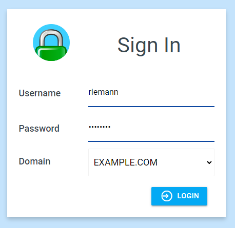
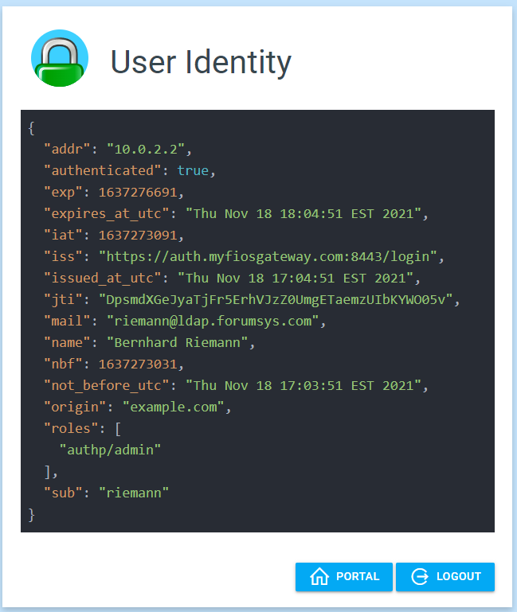

# LDAP Configuration

It is recommended reading the documentation for Local identity store, because
it outlines important principles of operation of all identity stores.

Additionally, the LDAP identity store works in conjunction with Local identity store.
As you will see later, the two can be used together by introducing a
dropdown in UI interface to choose local versus LDAP domain authentication.

## Configuration Examples

The reference configuration for the identity store is in the following files:

* [`assets/conf/ldap/Caddyfile`](https://github.com/greenpau/caddy-auth-docs/blob/main/assets/conf/ldap/Caddyfile):
  Microsoft AD LDAP integration
* [`assets/conf/ldap/posix/Caddyfile`](https://github.com/greenpau/caddy-auth-docs/blob/main/assets/conf/ldap/posix/Caddyfile):
  LDAP integration with POSIX groups
* [`assets/conf/ldap/glauth/Caddyfile`](https://github.com/greenpau/caddy-auth-docs/blob/main/assets/conf/ldap/glauth/Caddyfile):
  LDAP integration with GLAuth

The following Caddy endpoint at `/auth` authentications users
from `contoso.com` domain.

## Microsoft AD Integration

There is a single LDAP server associated with the domain: `ldaps://ldaps.contoso.com`.

The plugin DOES NOT ignore certificate errors when connecting to the servers.
However, one may ignore the errors by appending `ignore_cert_errors` to the
ldap server address.

```
          servers {
            ldaps://ldaps.contoso.com ignore_cert_errors
          }
```

As a better alternative to ignoring certificate errors, the plugin allows
adding trusted certificate authorities via `trusted_authority` Caddyfile directive:

```
          servers {
            ldaps://ldaps.contoso.com
          }
          trusted_authority /etc/gatekeeper/tls/trusted_authority/contoso_com_root1_ca_cert.pem
          trusted_authority /etc/gatekeeper/tls/trusted_authority/contoso_com_root2_ca_cert.pem
          trusted_authority /etc/gatekeeper/tls/trusted_authority/contoso_com_root3_ca_cert.pem
```

The following commands allow you connecting LDAPS server, e.g. `ldaps.localhost.local:636` and
collecting certificates for the `trusted_authority` directive.

```bash
mkdir -p certs && cd certs
openssl s_client -showcerts -verify 5 -connect ldaps.localhost.local:636 < /dev/null | \
    awk '/BEGIN/,/END/{ if(/BEGIN/){a++}; out="cert"a".crt"; print >out}' && \
    for cert in *.crt; do \
        newname=$(openssl x509 -noout -subject -in $cert | sed -n 's/^.*CN=\(.*\)$/\1/; s/[ ,.*]/_/g; s/__/_/g; s/^_//g;p').pem;
        mv $cert $newname;
    done
```

The LDAP attribute mapping to JWT fields is as follows. This is a typical Microsoft AD mapping.

| **JWT Token Field** | **LDAP Attribute** |
| --- | --- |
| `name` | `givenName` |
| `surname` | `sn` |
| `username` | `sAMAccountName` |
| `member_of` | `memberOf` |
| `email` | `mail` |

The plugin uses `authzsvc` domain user to perform LDAP bind.

The base search DN is `DC=CONTOSO,DC=COM`.

The plugin accepts username (`sAMAccountName`) or email address (`mail`)
and uses the following search filter: `(&(|(sAMAccountName=%s)(mail=%s))(objectclass=user))`.

For example:

```json
      {
        "Name": "sAMAccountName",
        "Values": [
          "jsmith"
        ]
      },
      {
        "Name": "mail",
        "Values": [
          "jsmith@contoso.com"
        ]
      }
```

Upon successful authentication, the plugin assign the following rules
to a user, provided the user is a member of a group:

| **JWT Role** | **LDAP Group Membership** |
| --- | --- |
| `admin` | `CN=Admins,OU=Security,OU=Groups,DC=CONTOSO,DC=COM` |
| `editor` | `CN=Editors,OU=Security,OU=Groups,DC=CONTOSO,DC=COM` |
| `viewer` | `CN=Viewers,OU=Security,OU=Groups,DC=CONTOSO,DC=COM` |

The security of the `password` could be improved by the following techniques:

* pass the password via environment variable `LDAP_USER_SECRET`
* store the password in a file and pass the file inside the `password`
  field with `file:` prefix, e.g. `file:/path/to/password`.

This [`Caddyfile`](https://github.com/greenpau/caddy-auth-docs/blob/main/assets/conf/ldap/Caddyfile)
secures Prometheus/Alertmanager services. Users may access using local and LDAP credentials.

## POSIX Groups Integration

The configuration in [`assets/conf/ldap/posix/Caddyfile`](https://github.com/greenpau/caddy-auth-docs/blob/main/assets/conf/ldap/posix/Caddyfile)
is for the integration with [Online LDAP Test Server](https://www.forumsys.com/tutorials/integration-how-to/ldap/online-ldap-test-server/).

The key differences of the configuration follow:

First, the `posix_groups` directive at the LDAP server level instructs the
plugin to make a secondary LDAP call to discover user memberships in groups.

The search similar to the command below:

```
ldapsearch -x -h ldap.forumsys.com -D "cn=read-only-admin,dc=example,dc=com" -w password -b "dc=example,dc=com" \
 "(&(uniqueMember=uid=riemann,dc=example,dc=com)(objectClass=groupOfUniqueNames))"
```

Second, the `search_group_filter` directive allows the modification of the
default `(&(uniqueMember=uid=` + USER_DN + `)(objectClass=groupOfUniqueNames))`
group search string.

Third, there are a number of attributes that would require modification.

The user object follows:

```
# riemann, example.com
dn: uid=riemann,dc=example,dc=com
objectClass: inetOrgPerson
objectClass: organizationalPerson
objectClass: person
objectClass: top
cn: Bernhard Riemann
sn: Riemann
uid: riemann
mail: riemann@ldap.forumsys.com
```

The comments in the below snippet explain the changes.

```
attributes {
    # The name us mapped to cn attribute, i.e. Bernhard Riemann
    name cn
    # Although surname is being kept in sn attribute, there is no
    # attribute for given name. Thus, it is useless in isolation.
    # Therefore, changing surname value to non-existing attribute foo.
    surname foo
    # The username is mapped to uid attribute, i.e. riemann
    username uid
    # The member_of is not being used.
    member_of uniqueMember
    email mail
}
```

The screenshots from the login, portal, and whoami pages follow.





