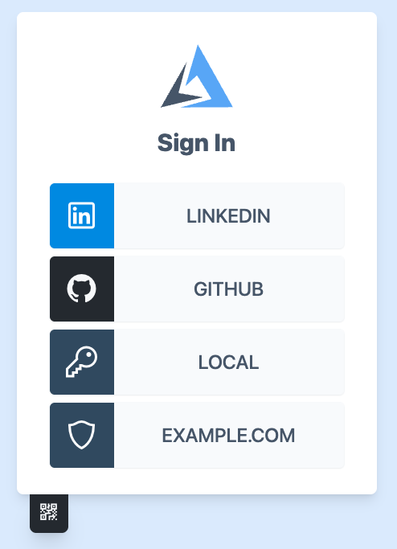
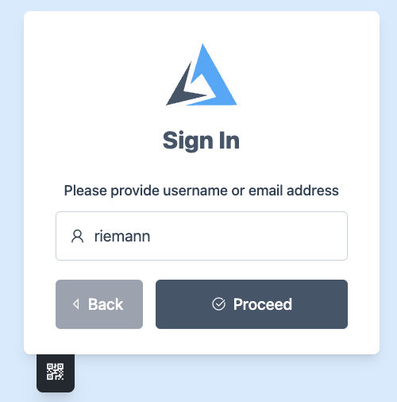
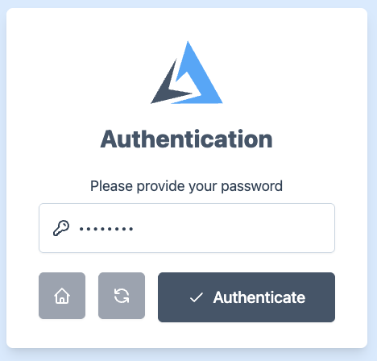
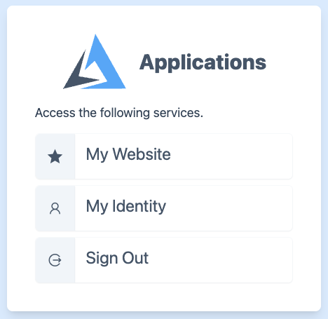
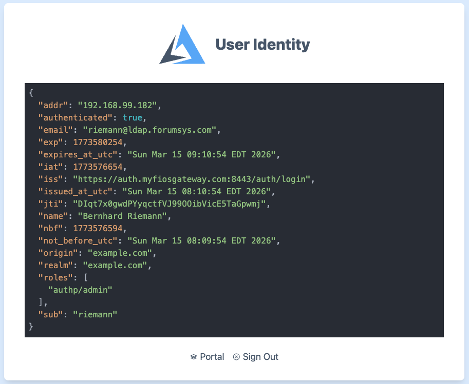
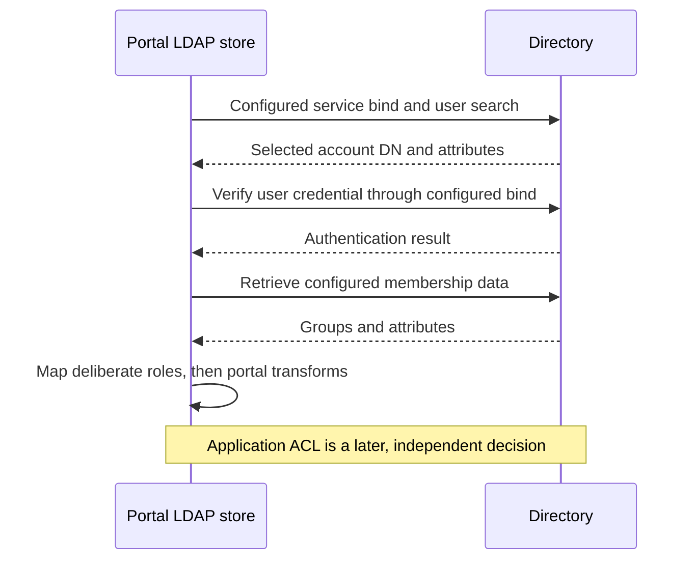

import CodeBlock from '@theme/CodeBlock';
import activeDirectory from '@site/assets/conf/ldap/Caddyfile?raw';
import secondaryGroups from '@site/assets/conf/ldap/posix/Caddyfile?raw';
import glauth from '@site/assets/conf/ldap/glauth/Caddyfile?raw';

# LDAP Configuration

An LDAP identity store authenticates an account against your directory and maps
its memberships to AuthCrunch roles. It can run **without a local store**.
Enable multiple stores only when users actually need a realm choice. LDAP
passwords and account lifecycle remain with the directory; the local Profile
password, MFA enrollment, and registration workflows do not manage LDAP accounts.

This guide targets [Caddy Security v1.3.0 / library v1.3.8](../../operations/versions.md).
Read [user search](20-search.md) for the service-bind, lookup, and password-bind
sequence. Directory authentication and application permission are separate:
`authp/user` is a portal role; `app/member` grants the example application access.

## Configuration Examples

Choose the example matching your membership schema:

| Directory behavior | Example |
| --- | --- |
| AD returns group DNs in the user's `memberOf` attribute | [Microsoft AD](#microsoft-ad-integration) |
| Membership requires a second search using the user's DN | [Secondary groups](#posix-groups-integration) |
| GLAuth returns configured group DNs in `memberOf` | [GLAuth](#glauth) |

Prepare a trusted HTTPS portal hostname, a reachable LDAPS server, a least
privilege service account that can search the required subtree/attributes, its
private bind-password file, and the directory's CA certificate obtained from
your administrator. Set a private, strong `AUTHCRUNCH_SIGNING_KEY`, and run the
example backend on `127.0.0.1:8080`. Change DNs and attribute names to match an
observed directory entry; the example paths are deployment prerequisites.

## Microsoft AD Integration

The service account searches by `sAMAccountName` or `mail`; exactly one user
must match. Explicit group DNs map to application roles. The portal adds
`authp/user` after directory identification, while the gatekeeper admits only
`app/member`. Do not map an ordinary directory group to `authp/admin` merely
to let it into an application: that reserved role can enable portal administration.

<CodeBlock language="caddyfile" title="assets/conf/ldap/Caddyfile">{activeDirectory}</CodeBlock>

`ldaps://` verifies the server certificate and hostname. Repeat
`trusted_authority` for additional required CA files. The released connector
does not upgrade `ldap://` with STARTTLS: that scheme sends simple-bind
credentials without TLS. `ignore_cert_errors` disables verification and belongs
only in a controlled disposable fixture, not a production example. Collecting a
certificate from an unverified network connection does not establish trust.

Use an owner-readable secret file for `password file:/etc/authcrunch/ldap-bind.secret`.
Its content is trimmed; a password that relies on leading/trailing whitespace
will not survive that loader. Alternatively omit `password` and supply
`LDAP_USER_SECRET` to the server process. Never commit the bind password or
expanded configuration to a public repository.

## POSIX Groups Integration

The `posix_groups` server option requests a **secondary group search**. Its
name does not imply support for every POSIX membership schema. The default
filter is `(&(uniqueMember=%s)(objectClass=groupOfUniqueNames))`; each `%s` is
replaced with the escaped **user DN**, not the login username or UID.

<CodeBlock language="caddyfile" title="assets/conf/ldap/posix/Caddyfile">{secondaryGroups}</CodeBlock>

Use `search_group_filter` for your directory's DN-valued membership attribute,
for example a `member` filter when the groups store full user DNs. A
`memberUid` schema containing bare usernames cannot be made equivalent simply
by substituting `memberUid` into this filter. Verify what your server actually
returns before choosing this mode. Search results use each group entry's DN.

Attribute names are compared to the configured strings. Use the directory's
actual spelling and casing. `givenName` plus `sn` suits entries with separate
name components; do not invent a nonexistent surname attribute to compensate
for an unrelated schema.

<figure className="doc-screenshot">

[](./images/ldap_demo_01.png)

<figcaption>The preserved training portal offered LDAP alongside local and OAuth providers. The configuration above intentionally enables one LDAP store.</figcaption>
</figure>

<details className="screenshot-gallery">
<summary>Preserved LDAP login, application, and identity screens</summary>

<figure className="doc-screenshot">

[](./images/ldap_demo_02.png)

<figcaption>Enter the directory login or email accepted by the configured user filter.</figcaption>
</figure>

<figure className="doc-screenshot">

[](./images/ldap_demo_03.png)

<figcaption>The directory validates the user's password; the search-service password is a separate server credential.</figcaption>
</figure>

<figure className="doc-screenshot">

[](./images/ldap_demo_04.png)

<figcaption>A configured application link leads to a separately protected route. Seeing the link does not prove authorization.</figcaption>
</figure>

<figure className="doc-screenshot">

[](./images/ldap_demo_05.png)

<figcaption>The March 2026 public-directory demo granted a portal administrator role. The current examples use app/member and must not copy that old administrator assignment.</figcaption>
</figure>

</details>

These screens used a public test directory with shared demo passwords. Keep
such accounts separate from your real services; the current examples require
your own private directory and verified TLS.

## Case Insensitive Matching of LDAP Groups

Explicit group DN mapping uses case-insensitive string comparison. For example,
`CN=App Members,OU=Groups,DC=CONTOSO,DC=COM` matches the same string in lowercase.
This is not complete DN canonicalization: changing escaping, spacing, or the
order of a multi-valued RDN can still matter. It does not make every attribute
name, user filter, role, or policy case-insensitive.



```mermaid
sequenceDiagram
  accTitle: Directory authentication and group-to-role mapping are separate steps
  accDescr: The store uses its configured directory connection and search/bind settings to resolve and authenticate the account. Returned memberships can map into explicit or automatic roles, but the application still requires its own grant. A group search or fallback role must not turn a missing membership into administrator authority.
  participant P as Portal LDAP store
  participant D as Directory
  P->>D: Configured service bind and user search
  D-->>P: Selected account DN and attributes
  P->>D: Verify user credential through configured bind
  D-->>P: Authentication result
  P->>D: Retrieve configured membership data
  D-->>P: Groups and attributes
  P->>P: Map deliberate roles, then portal transforms
  Note over P,D: Application ACL is a later, independent decision
```

## Dynamic Role Mapping from LDAP Groups

Automatic mapping applies to group entries returned by the **secondary search**,
not the ordinary `memberOf` mapping loop. Configure `posix_groups` on the server
and enable the required mode in the LDAP store:

```Caddyfile
enable short automatic group mapping
# Or, instead:
# enable full automatic group mapping
```

Short mapping parses the DN, extracts the first attribute value of its first
RDN, and lowercases it. It correctly handles escaped commas; it does not split
at the first literal comma. Full mapping lowercases the entire returned DN.

| Returned group DN | Short role | Full role |
| --- | --- | --- |
| `cn=App-Members,ou=Groups,dc=example,dc=com` | `app-members` | `cn=app-members,ou=groups,dc=example,dc=com` |
| `cn=Research\, West,ou=Groups,dc=example,dc=com` | `research, west` | `cn=research\, west,ou=groups,dc=example,dc=com` |

Treat automatically derived roles as directory-controlled input. Translate
only intended memberships into application roles with a narrow
[user transform](../42-user-transforms.md), or use explicit DN mappings for a
small, stable access boundary. Do not grant all authenticated directory accounts
application access merely because they receive a portal role.

## Fallback roles

Inside the LDAP store, `fallback roles authp/user directory/unmapped` assigns
those roles only when successful user lookup/mapping produces no roles. It
allows an identified, password-verified user into a limited portal workflow
without granting `app/member`. Mapped users do not also receive fallback roles.
Repeating the setting replaces the list.

Fallback does not bypass a failed bind, ambiguous user search, or secondary
group-search error. Secondary search with no entries or no resulting roles is
an error before fallback assignment. The store still requires an explicit
group mapping or an automatic mapping mode; fallback alone is not a complete
group configuration. Keep the application's gatekeeper restrictive.

## GLAuth

Configure GLAuth's LDAPS listener, certificate, and private key first, following
[GLAuth's server documentation](https://glauth.github.io/). The example chooses
port `3894`; it does not enable the GLAuth listener for you. Use a certificate
matching `directory.example.com` and a trusted CA.

<CodeBlock language="caddyfile" title="assets/conf/ldap/glauth/Caddyfile">{glauth}</CodeBlock>

Copy your actual service-account DN, object class, attributes, and returned
group DNs. GLAuth's schema and backends are configurable. The historical
plaintext loopback sample is not a production TLS configuration.

## Verify and troubleshoot

1. Confirm service-account bind, subtree access, and the exact attribute/DN
   response using an LDAP tool with verified TLS. Keep its password out of
   command-line arguments and logs.
2. Sign in as a mapped account; inspect `/auth/whoami?format=json` and confirm
   the intended realm, subject, and `app/member` role.
3. Confirm the protected `/app` route admits it. A second account without that
   role must fail; a fallback portal identity must not inherit application access.
4. Check wrong passwords, ambiguous user matches, certificate failures, and
   group-search errors. Review [diagnostic logging](../../operations/logging.md)
   without enabling sensitive data dumps.

Local fixtures can verify the released connector's bind/search/mapping behavior.
They do not establish your AD access controls, nested-group expansion, GLAuth
schema, production certificates, or directory availability.

## Agentic Prompts

Copy a prompt into your LLM to explore this topic. Each prompt prioritizes
upstream repository guidance and code over this page, and asks for version-aware
reasoning.

<div className="agentic-prompts">

<details>
<summary>Trace bind, search, and roles</summary>

```text
Help me understand LDAP Configuration.

Primary authorities (take precedence over website documentation):
https://github.com/greenpau/caddy-security/blob/main/AGENTS.md
https://github.com/greenpau/caddy-security/tree/main/.codex/skills
https://github.com/greenpau/go-authcrunch/blob/main/AGENTS.md
https://github.com/greenpau/go-authcrunch/tree/main/.codex/skills
Read each repository's root AGENTS.md first, then any scoped AGENTS.md that
applies to inspected paths. Read the relevant SKILL.md files and follow their
implementation and test references.

Relevant skills to locate: configuration-identity-stores,
local-password-authentication.

Secondary reference:
https://docs.authcrunch.com/docs/authenticate/ldap/ldap

If a source is inaccessible, ask me to paste its relevant text. Identify the
versions your answer applies to; main may be newer than my release. Resolve
disagreements using code and tests, and flag unverified claims. Use synthetic
credentials and redacted examples; explain proposed checks before any changes.

Explain service bind, exactly-one user lookup, password bind, group mapping,
portal identity, and app ACL. Compare directory credentials with local Profile
management. Ask for the actual directory schema and realm before recommending
filters.
```

</details>

<details>
<summary>Compare membership schemas</summary>

```text
Help me understand LDAP Configuration.

Primary authorities (take precedence over website documentation):
https://github.com/greenpau/caddy-security/blob/main/AGENTS.md
https://github.com/greenpau/caddy-security/tree/main/.codex/skills
https://github.com/greenpau/go-authcrunch/blob/main/AGENTS.md
https://github.com/greenpau/go-authcrunch/tree/main/.codex/skills
Read each repository's root AGENTS.md first, then any scoped AGENTS.md that
applies to inspected paths. Read the relevant SKILL.md files and follow their
implementation and test references.

Relevant skills to locate: configuration-identity-stores,
local-password-authentication.

Secondary reference:
https://docs.authcrunch.com/docs/authenticate/ldap/ldap

If a source is inaccessible, ask me to paste its relevant text. Identify the
versions your answer applies to; main may be newer than my release. Resolve
disagreements using code and tests, and flag unverified claims. Use synthetic
credentials and redacted examples; explain proposed checks before any changes.

Compare memberOf group DNs with secondary DN-valued group search and
username-valued memberUid. Explain the posix_groups option’s actual
substitution and returned group identity. Trace explicit, short, and full
automatic mappings without assuming every POSIX schema works.
```

</details>

<details>
<summary>Review transport and secrets</summary>

```text
Help me understand LDAP Configuration.

Primary authorities (take precedence over website documentation):
https://github.com/greenpau/caddy-security/blob/main/AGENTS.md
https://github.com/greenpau/caddy-security/tree/main/.codex/skills
https://github.com/greenpau/go-authcrunch/blob/main/AGENTS.md
https://github.com/greenpau/go-authcrunch/tree/main/.codex/skills
Read each repository's root AGENTS.md first, then any scoped AGENTS.md that
applies to inspected paths. Read the relevant SKILL.md files and follow their
implementation and test references.

Relevant skills to locate: configuration-identity-stores,
local-password-authentication.

Secondary reference:
https://docs.authcrunch.com/docs/authenticate/ldap/ldap

If a source is inaccessible, ask me to paste its relevant text. Identify the
versions your answer applies to; main may be newer than my release. Resolve
disagreements using code and tests, and flag unverified claims. Use synthetic
credentials and redacted examples; explain proposed checks before any changes.

Inspect LDAPS certificate/hostname verification, trusted CA, simple ldap://
behavior, bind-password file trimming, and environment fallback. Explain why
an unverified downloaded certificate or ignore_cert_errors is not production
trust. Keep directory passwords out of logs and command arguments.
```

</details>

<details>
<summary>Diagnose fallback versus search failure</summary>

```text
Help me understand LDAP Configuration.

Primary authorities (take precedence over website documentation):
https://github.com/greenpau/caddy-security/blob/main/AGENTS.md
https://github.com/greenpau/caddy-security/tree/main/.codex/skills
https://github.com/greenpau/go-authcrunch/blob/main/AGENTS.md
https://github.com/greenpau/go-authcrunch/tree/main/.codex/skills
Read each repository's root AGENTS.md first, then any scoped AGENTS.md that
applies to inspected paths. Read the relevant SKILL.md files and follow their
implementation and test references.

Relevant skills to locate: configuration-identity-stores,
local-password-authentication.

Secondary reference:
https://docs.authcrunch.com/docs/authenticate/ldap/ldap

If a source is inaccessible, ask me to paste its relevant text. Identify the
versions your answer applies to; main may be newer than my release. Resolve
disagreements using code and tests, and flag unverified claims. Use synthetic
credentials and redacted examples; explain proposed checks before any changes.

Help me classify failed bind, ambiguous user match, secondary-search error/no
entries, unmapped membership, and fallback roles. Explain why fallback cannot
rescue earlier search/authentication errors or grant app/member to every
identified account.
```

</details>

<details>
<summary>Test directory boundaries</summary>

```text
Help me understand LDAP Configuration.

Primary authorities (take precedence over website documentation):
https://github.com/greenpau/caddy-security/blob/main/AGENTS.md
https://github.com/greenpau/caddy-security/tree/main/.codex/skills
https://github.com/greenpau/go-authcrunch/blob/main/AGENTS.md
https://github.com/greenpau/go-authcrunch/tree/main/.codex/skills
Read each repository's root AGENTS.md first, then any scoped AGENTS.md that
applies to inspected paths. Read the relevant SKILL.md files and follow their
implementation and test references.

Relevant skills to locate: configuration-identity-stores,
local-password-authentication.

Secondary reference:
https://docs.authcrunch.com/docs/authenticate/ldap/ldap

If a source is inaccessible, ask me to paste its relevant text. Identify the
versions your answer applies to; main may be newer than my release. Resolve
disagreements using code and tests, and flag unverified claims. Use synthetic
credentials and redacted examples; explain proposed checks before any changes.

Create mapped member, nonmember, fallback-only, escaped DN, wrong password,
bad certificate, and ambiguous-user cases. Include fresh identity inspection
and app 403. Explain what local fixtures cannot establish about production
nested groups, schema, and directory ACLs.
```

</details>

</div>

## Source Code References

Start with the code search, then follow the parser, runtime, and tests relevant
to this topic. These links target `main`; use GitHub's branch/tag selector to
compare them with your installed release.

1. [Search this topic in both repositories](https://github.com/search?q=%28repo%3Agreenpau%2Fgo-authcrunch%20OR%20repo%3Agreenpau%2Fcaddy-security%29%20%28posix_groups%20OR%20LDAP_USER_SECRET%20OR%20uniqueMember%29&type=code)
   — searches topic-specific symbols and paths across both codebases.
2. [caddy-security: caddyfile_identity_store.go](https://github.com/greenpau/caddy-security/blob/main/caddyfile_identity_store.go)
   — adapts local and LDAP store declarations.
3. [go-authcrunch: pkg/ids/ldap/store.go](https://github.com/greenpau/go-authcrunch/blob/main/pkg/ids/ldap/store.go)
   — validates LDAP store configuration and initializes directory connectivity.
4. [go-authcrunch: pkg/ids/ldap/authenticator.go](https://github.com/greenpau/go-authcrunch/blob/main/pkg/ids/ldap/authenticator.go)
   — binds/searches the directory and maps returned memberships into identity roles.
5. [go-authcrunch: pkg/ids/ldap/parse_dn.go](https://github.com/greenpau/go-authcrunch/blob/main/pkg/ids/ldap/parse_dn.go)
   — parses group DNs for short automatic role mapping.
6. [go-authcrunch: pkg/ids/ldap/parse_dn_test.go](https://github.com/greenpau/go-authcrunch/blob/main/pkg/ids/ldap/parse_dn_test.go)
   — tests escaped and compound DN parsing.
7. [go-authcrunch: pkg/ids/ldap/store_test.go](https://github.com/greenpau/go-authcrunch/blob/main/pkg/ids/ldap/store_test.go)
   — tests LDAP store setup and configuration cases.
