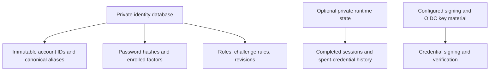

# Local identity store format

`users.json` is the file-backed local identity database. AuthCrunch creates and
maintains it; it is not a list of plaintext passwords or a replacement Caddyfile.
Treat it as private credential storage and retain the full schema when backing it up.




## Database structure

The document contains version/revision metadata, policy and user records:

```json
{
  "version": "<database schema version>",
  "revision": 1,
  "last_modified": "<timestamp>",
  "policy": {"password": {}, "user": {}},
  "users": []
}
```

This is an explanatory outline, **not a database to copy into a deployment**.
Actual policy objects contain password length/history/reuse and username rules.
User records contain immutable IDs, canonical and additional email addresses,
roles, password records, registered credentials, security revisions and optional
challenge rules. Fields change with the schema; preserve unknown fields rather
than reconstructing an account from this outline.

| Data | Meaning |
| --- | --- |
| User `id` | Immutable account identity; deleting/recreating a username changes it |
| `username`, `email_address`, `email_addresses` | Canonical account and aliases; aliases must resolve to the same account |
| `roles` | Role objects, including organization/name components |
| `passwords` | Hash algorithm, encoded hash, creation and disabled/expired state |
| `auth_challenge_rules` | Ordered local authentication policy |
| Database/security revisions | Mutation and authentication-evidence tracking |

Password records support bcrypt and Argon2id in the released bundle. A Caddyfile
import such as `bcrypt:COST:HASH` or `argon2:PHC` is **not** the JSON hash field's
entire value. Use [password management](30-password-management.md) to generate and
apply credentials through the supported boundary.

## Manage accounts through supported interfaces

Use [static users](50-static-users.md) for controlled initial provisioning and
[Server API](../api/40-server-api.md) or a compatible `authdbctl` for account CRUD.
Local users manage their own passwords/MFA through `/auth/profile/` with an
allowed role and live portal session. The older claim that users can only be
added by manually editing JSON is no longer accurate.

<figure className="doc-screenshot">
  <a href={require('../images/basic_login.png').default}></a>
  <figcaption>Historical login screen retained as a visual reference. Use the current portal's username and password steps; database management is a separate task.</figcaption>
</figure>

## Protect changes and backups

Do not edit the file while a process is writing it. If manual repair is necessary,
stop the writer, take a coherent private backup and preserve IDs, schema,
credentials and revision data. Do not infer that replacing a hash in a live file
will trigger every security invalidation the supported mutation API performs.

Application signing keys, OIDC private keys and encrypted runtime state are
separate artifacts. Restore the appropriate coherent set and test fresh login,
role changes, disabled accounts and old-session invalidation. Never publish the
database or use it as a browser-downloadable debugging artifact.

## Agentic Prompts

Copy a prompt into your LLM to explore this topic. Each prompt prioritizes
upstream repository guidance and code over this page, and asks for version-aware
reasoning.

<div className="agentic-prompts">

<details>
<summary>Read the database as a model</summary>

```text
Help me understand Local identity store format.

Primary authorities (take precedence over website documentation):
https://github.com/greenpau/caddy-security/blob/main/AGENTS.md
https://github.com/greenpau/caddy-security/tree/main/.codex/skills
https://github.com/greenpau/go-authcrunch/blob/main/AGENTS.md
https://github.com/greenpau/go-authcrunch/tree/main/.codex/skills
Read each repository's root AGENTS.md first, then any scoped AGENTS.md that
applies to inspected paths. Read the relevant SKILL.md files and follow their
implementation and test references.

Relevant skills to locate: local-identity-database,
configuration-identity-stores, authdbctl.

Secondary reference:
https://docs.authcrunch.com/docs/authenticate/local/identity-store

If a source is inaccessible, ask me to paste its relevant text. Identify the
versions your answer applies to; main may be newer than my release. Resolve
disagreements using code and tests, and flag unverified claims. Use synthetic
credentials and redacted examples; explain proposed checks before any changes.

Explain schema version/revision, policy, user IDs, email aliases, roles,
passwords, MFA credentials, and security revisions. Use an explanatory outline
with fake values rather than a replacement database. Distinguish an immutable
ID from a reusable username.
```

</details>

<details>
<summary>Compare hash representations</summary>

```text
Help me understand Local identity store format.

Primary authorities (take precedence over website documentation):
https://github.com/greenpau/caddy-security/blob/main/AGENTS.md
https://github.com/greenpau/caddy-security/tree/main/.codex/skills
https://github.com/greenpau/go-authcrunch/blob/main/AGENTS.md
https://github.com/greenpau/go-authcrunch/tree/main/.codex/skills
Read each repository's root AGENTS.md first, then any scoped AGENTS.md that
applies to inspected paths. Read the relevant SKILL.md files and follow their
implementation and test references.

Relevant skills to locate: local-identity-database,
configuration-identity-stores, authdbctl.

Secondary reference:
https://docs.authcrunch.com/docs/authenticate/local/identity-store

If a source is inaccessible, ask me to paste its relevant text. Identify the
versions your answer applies to; main may be newer than my release. Resolve
disagreements using code and tests, and flag unverified claims. Use synthetic
credentials and redacted examples; explain proposed checks before any changes.

Explain why a Caddyfile bcrypt/Argon2 import string is not an entire JSON
password record. Compare trusted import, encoded hash, algorithm metadata, and
account-security state. Ask which supported management interface should apply
a credential instead of reconstructing a record.
```

</details>

<details>
<summary>Diagnose alias identity</summary>

```text
Help me understand Local identity store format.

Primary authorities (take precedence over website documentation):
https://github.com/greenpau/caddy-security/blob/main/AGENTS.md
https://github.com/greenpau/caddy-security/tree/main/.codex/skills
https://github.com/greenpau/go-authcrunch/blob/main/AGENTS.md
https://github.com/greenpau/go-authcrunch/tree/main/.codex/skills
Read each repository's root AGENTS.md first, then any scoped AGENTS.md that
applies to inspected paths. Read the relevant SKILL.md files and follow their
implementation and test references.

Relevant skills to locate: local-identity-database,
configuration-identity-stores, authdbctl.

Secondary reference:
https://docs.authcrunch.com/docs/authenticate/local/identity-store

If a source is inaccessible, ask me to paste its relevant text. Identify the
versions your answer applies to; main may be newer than my release. Resolve
disagreements using code and tests, and flag unverified claims. Use synthetic
credentials and redacted examples; explain proposed checks before any changes.

Help me reason about username and email aliases resolving one local account.
Include deleting/recreating a username and display transforms. Explain what
stable identity and account binding must be preserved for Profile and captured
authentication evidence.
```

</details>

<details>
<summary>Plan backup and repair</summary>

```text
Help me understand Local identity store format.

Primary authorities (take precedence over website documentation):
https://github.com/greenpau/caddy-security/blob/main/AGENTS.md
https://github.com/greenpau/caddy-security/tree/main/.codex/skills
https://github.com/greenpau/go-authcrunch/blob/main/AGENTS.md
https://github.com/greenpau/go-authcrunch/tree/main/.codex/skills
Read each repository's root AGENTS.md first, then any scoped AGENTS.md that
applies to inspected paths. Read the relevant SKILL.md files and follow their
implementation and test references.

Relevant skills to locate: local-identity-database,
configuration-identity-stores, authdbctl.

Secondary reference:
https://docs.authcrunch.com/docs/authenticate/local/identity-store

If a source is inaccessible, ask me to paste its relevant text. Identify the
versions your answer applies to; main may be newer than my release. Resolve
disagreements using code and tests, and flag unverified claims. Use synthetic
credentials and redacted examples; explain proposed checks before any changes.

Describe a stopped-writer, coherent private backup/restore exercise preserving
unknown fields, IDs, schema, credential metadata, and revisions. Compare
users.json, signing keys, OIDC keys, and encrypted runtime state. Do not
propose publishing the database for debugging.
```

</details>

<details>
<summary>Test restored security state</summary>

```text
Help me understand Local identity store format.

Primary authorities (take precedence over website documentation):
https://github.com/greenpau/caddy-security/blob/main/AGENTS.md
https://github.com/greenpau/caddy-security/tree/main/.codex/skills
https://github.com/greenpau/go-authcrunch/blob/main/AGENTS.md
https://github.com/greenpau/go-authcrunch/tree/main/.codex/skills
Read each repository's root AGENTS.md first, then any scoped AGENTS.md that
applies to inspected paths. Read the relevant SKILL.md files and follow their
implementation and test references.

Relevant skills to locate: local-identity-database,
configuration-identity-stores, authdbctl.

Secondary reference:
https://docs.authcrunch.com/docs/authenticate/local/identity-store

If a source is inaccessible, ask me to paste its relevant text. Identify the
versions your answer applies to; main may be newer than my release. Resolve
disagreements using code and tests, and flag unverified claims. Use synthetic
credentials and redacted examples; explain proposed checks before any changes.

Design disposable-account checks for fresh password/MFA login, role changes,
disabled account, old-session invalidation, and alias consistency after
restoration. Explain what a supported mutation performs that editing a live
hash may bypass.
```

</details>

</div>

## Source Code References

Start with the code search, then follow the parser, runtime, and tests relevant
to this topic. These links target `main`; use GitHub's branch/tag selector to
compare them with your installed release.

1. [Search this topic in both repositories](https://github.com/search?q=%28repo%3Agreenpau%2Fgo-authcrunch%20OR%20repo%3Agreenpau%2Fcaddy-security%29%20%28Database%20OR%20auth_challenge_rules%20OR%20email_addresses%29&type=code)
   — searches topic-specific symbols and paths across both codebases.
2. [caddy-security: caddyfile_identity_store.go](https://github.com/greenpau/caddy-security/blob/main/caddyfile_identity_store.go)
   — adapts local and LDAP store declarations.
3. [go-authcrunch: pkg/identity/database.go](https://github.com/greenpau/go-authcrunch/blob/main/pkg/identity/database.go)
   — defines the local database model and account operations.
4. [go-authcrunch: pkg/identity/user.go](https://github.com/greenpau/go-authcrunch/blob/main/pkg/identity/user.go)
   — defines local account identity, credentials, and security state.
5. [go-authcrunch: pkg/identity/database_atomic_write.go](https://github.com/greenpau/go-authcrunch/blob/main/pkg/identity/database_atomic_write.go)
   — writes database changes using a coherent atomic replacement.
6. [go-authcrunch: pkg/identity/user_test.go](https://github.com/greenpau/go-authcrunch/blob/main/pkg/identity/user_test.go)
   — tests local user construction and account data.
