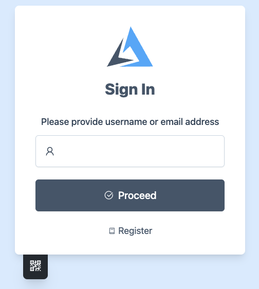
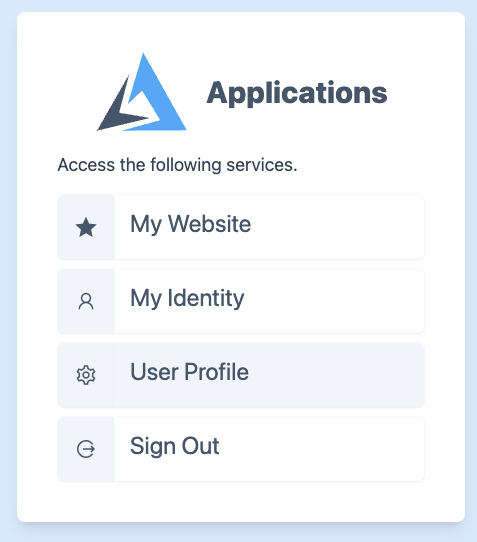
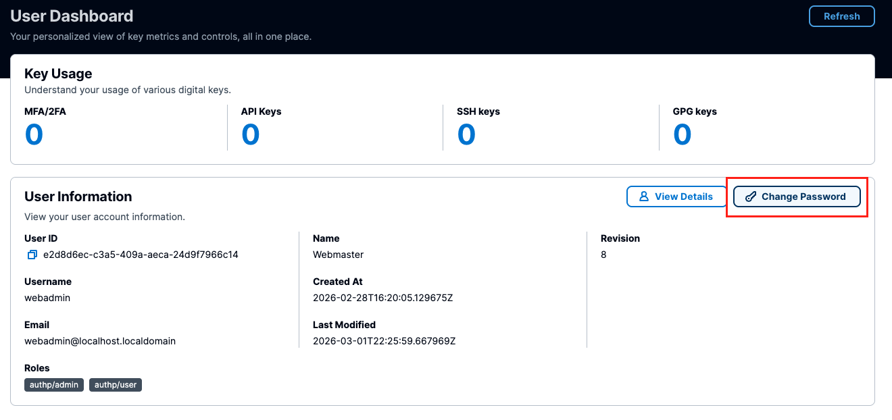

# Password Management

## Manually

An administrator may change the password directly in `users.json` file.

First, download `bcrypt-tool` from https://github.com/shoenig/bcrypt-tool/releases

Extract it to the directory of your choice. Usage is:

```bash
./bcrypt-tool hash SomeFunkyPassword 10
```

Finally, replace the newly generated password in the user database file.

## Settings Page

Any non-guest user could reset a password by browsing to `/settings`
endpoint.

First, login to the portal.



Next, browse to "Settings" page.



Finally, navigate to "Password" and change it.


