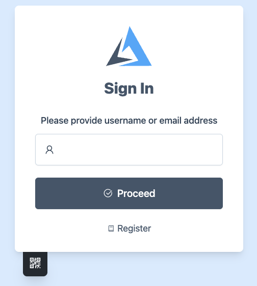
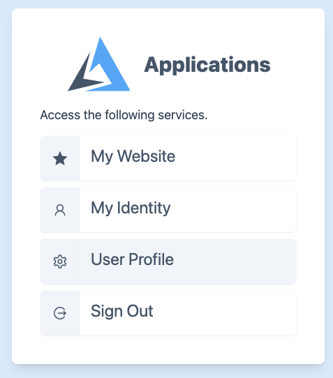
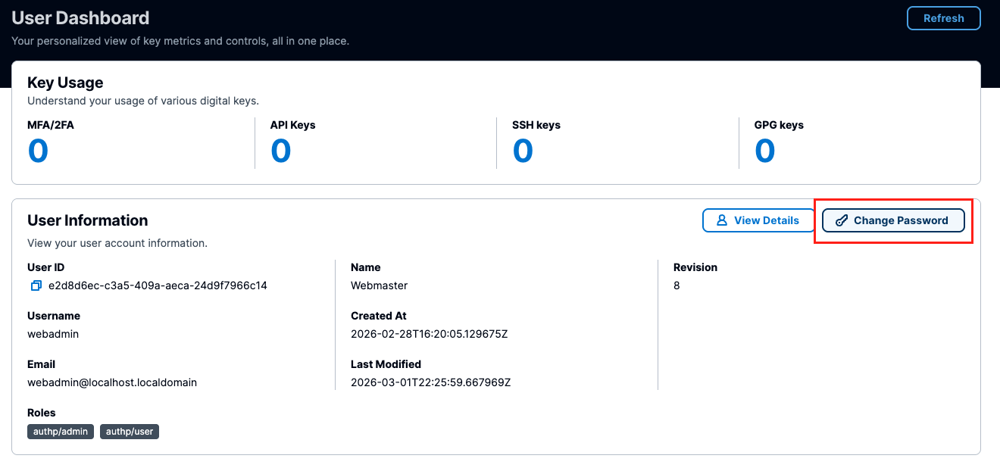
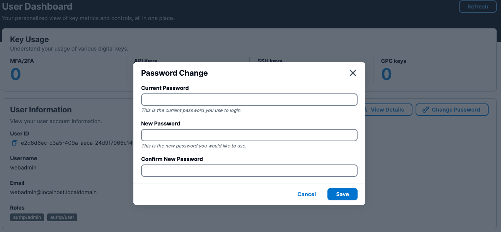

# Password Management

## Manually

An administrator may change the password directly in `users.json` file or
with `authdbctl`. To learn more about `authdbctl`
go [here](https://github.com/greenpau/go-authcrunch/blob/main/cmd/authdbctl/README.md).

First, download `go-authcrunch` files from [releases](https://github.com/greenpau/go-authcrunch/releases).
When you unpack, there will be `authdbctl` utility in `bin/` directory.

Alternatively, you can install it with `go`:

```bash
go install github.com/greenpau/go-authcrunch/cmd/authdbctl@latest
```

Generate password hash. The tool prompts you to provide a password to hash.

```bash
authdbctl generate password hash
```

Finally, replace the newly generated password in the user database file.

## Settings Page

Any non-guest user could reset a password by browsing to `/auth/profile/`
endpoint.

First, login to the portal.



Next, browse to "Settings" page.



Press "Change Password" button.



Finally, change the password.

