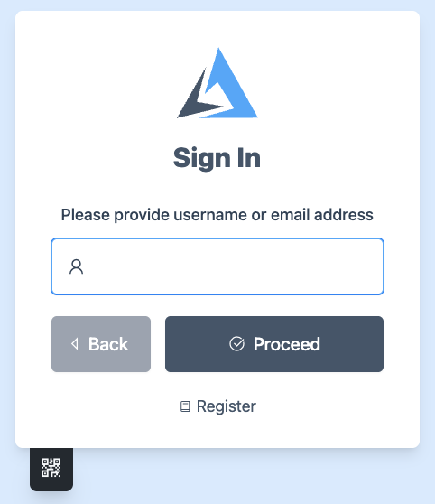
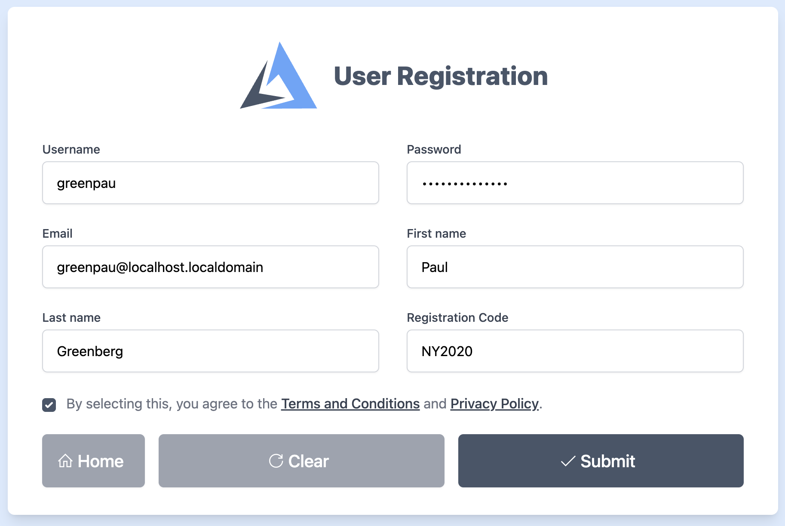
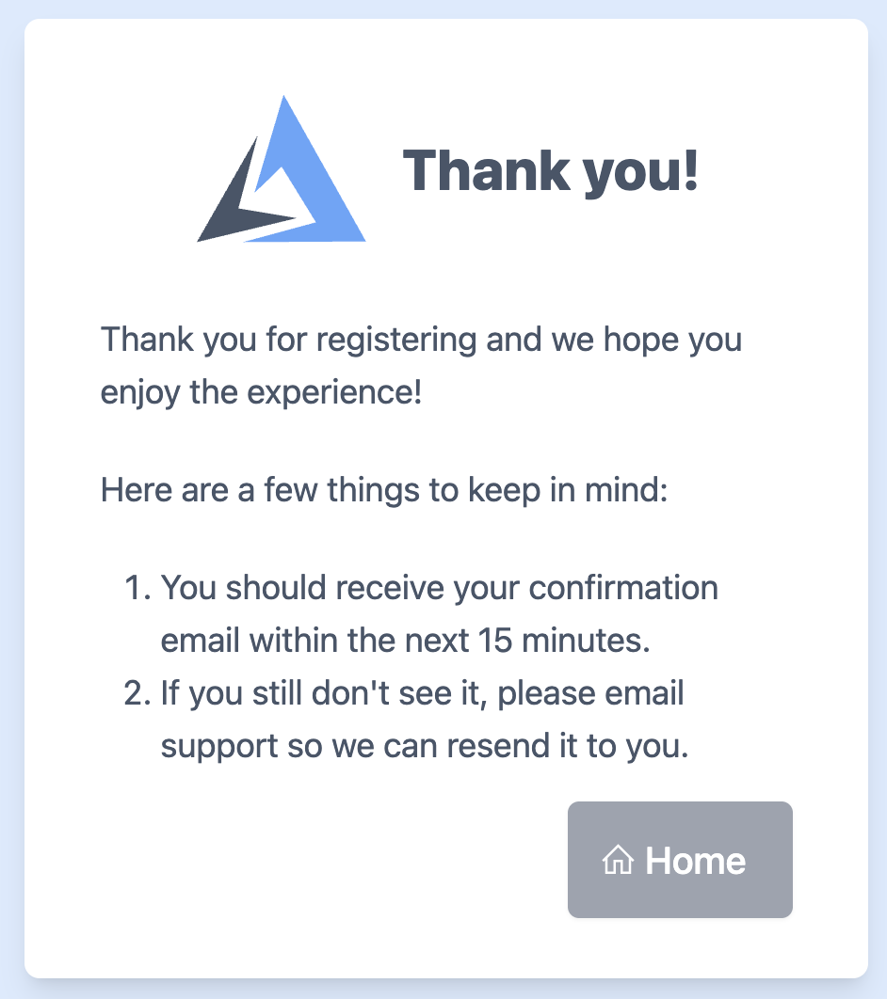
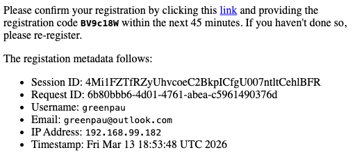
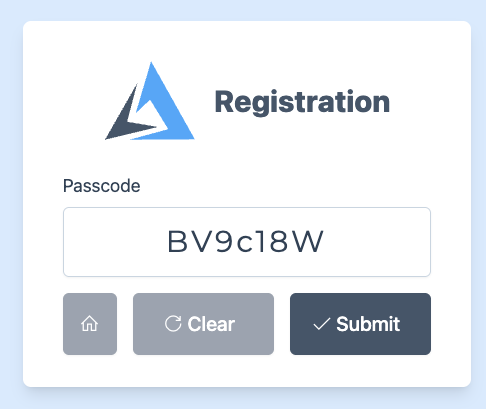
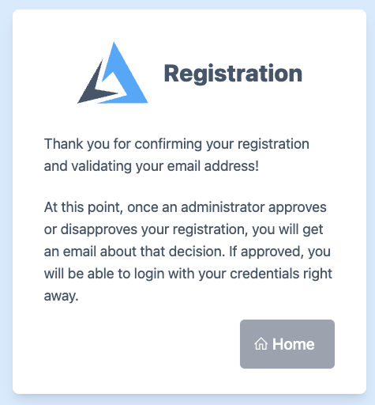

# User Registration

## Configuration

The provided configuration defines the security and communication backbone for the
registration workflow, specifically linking the user interface to the backend services.

It establishes a local email provider named `localhost-smtp-server` operating
on `127.0.0.1:1025`, which handles the delivery of the verification passcodes seen
in the registration process.

The `user registration` block, labeled `localdbRegistry`, configures the specific
behavior of the form: it enforces the "NY2020" registration code, requires users to
accept terms, and validates email domains via MX records. Furthermore, it
designates `localdb` as the identity store for saving user credentials and specifies
that registration data should be backed up to a JSON "dropbox" file.

```text
	security {
		credentials root@localhost {
			username root
			password foobar
		}

		messaging email provider localhost-smtp-server {
			address 127.0.0.1:1025
			protocol smtp
			passwordless
			sender root@localhost "My Auth Portal"
			bcc greenpau@localhost
		}

		user registration localdbRegistry {
			dropbox assets/config/registrations.json
			title "User Registration"
			code "NY2020"
			require accept terms
			require domain mx
			email provider localhost-smtp-server
			admin email admin@localhost
			identity store localdb
		}

	}
```

The newly registered users will appear in the `registrations.json` file.
An administrator must manually move entries from `registrations.json`
to `users.json` file.

The parameters are:

* `dropbox`: The file path pointing to registration database.
* `code`: The registration code. A user must know what that code is to
  successfully submit a registration request.
* `require accept terms`: A user must accept terms and conditions, as well
  as privacy policy to proceed
* `disabled on`: disables user registration
* `title`: changes the title of the registration page
* `require domain mx`: forces the check of domain MX record
* `admin email`: defines the email recipients after a registrant clicked
  email confirmation link and provided valid code

## Email Domain Restrictions

### Domain Restrictions Syntax

The `allow` and `deny` directives support various matching strategies to provide flexibility
when defining domain boundaries. By default, the system performs an **exact** match, but
you can specify different modes to handle subdomains or complex patterns.

```text
<allow|deny> [exact|partial|prefix|suffix|regex] domain <domain>
```

The domain matching strategies are:

* `exact` (Default): The domain must match the input string precisely, e.g. `allow exact domain foo.com` will
  not match `user@sub.foo.com`.
* `partial`: Matches if the specified string appears anywhere within the domain name.
* `prefix`: Matches if the domain starts with the specified string, e.g. `deny prefix domain dev-` would
  block `dev-portal.com` and `dev-testing.org`.
* `suffix`: Useful for capturing all subdomains, e.g. `allow suffix domain .edu` would permit
  any educational institution, while `allow suffix domain .foo.com` would permit `a.foo.com` and `b.foo.com`.
* `regex`: Allows for complex pattern matching using regular expressions. This is powerful for advanced
  filtering needs where standard string matching is insufficient.


```text
user registration localdbRegistry {
    # Allow any subdomain of microsoft.com
    allow suffix domain .microsoft.com
    
    # Block any domain starting with "gmail" or "outlook"
    deny regex domain ^(gmail|outlook).*
}
```

### Trusted Email Domains

The registration system allows administrators to restrict sign-ups to specific, trusted email
providers. This is achieved using the `allow domain` directive, which creates
a **permit-only list** of approved domains.

When these directives are present in the `user registration` block, the system enforces a strict
validation check on the user's provided email address. Any registration attempt using a domain not
explicitly listed—such as a personal or unauthorized address—will be automatically blocked. This
ensures that only users from designated organizations (e.g., `foo.com` or `bar.com`) can
access the registration form, streamlining the onboarding process for corporate or private
environments and reducing the volume of unauthorized requests for administrators to review.

```text
    user registration localdbRegistry {
        allow domain foo.com
        allow domain bar.com
    }
```

If there are no `deny` statements, then the registration system applies **default deny**.

### Untrusted Email Domains

In addition to permitting specific domains, you can explicitly block untrusted or high-risk
email providers using the `deny domain` directive. This creates an **exclusion list** that
prevents registrations from specific sources, such as known disposable email services or
competitors, while potentially leaving the rest of the internet open for registration.

```text
    user registration localdbRegistry {
        deny domain anonymous-mail.com
        deny domain temporary-inbox.org
    }
```

When a user attempts to register, the system cross-references their email domain against
this list. If a match is found, the registration is immediately halted with an error message. This
is an effective first line of defense against spam and bot registrations, ensuring that only
legitimate email providers can reach the verification stage.

If there are no `allow` statements, then the registration system applies **default allow**.

## Registration Worflow

### Accessing the Registration Page

On the initial Sign In screen, users who do not yet have an account can initiate
the process by clicking the Register link located at the bottom of the login card.



### Filling Out the Registration Form

The user is directed to the User Registration form. Here, they must provide a unique username,
password, email address, and their first and last name. Additionally, a specific Registration
Code (e.g., "NY2020") is required to proceed. The user must also agree to the Terms and
Conditions before clicking Submit.



### Initial Confirmation

Upon submission, a "Thank you" screen appears. This informs the user that the first part of
the registration is successful and instructs them to check their email for a confirmation
link within the next 15 minutes.



### Receiving the Verification Email

The system sends an email containing the registration metadata (e.g. Session ID and IP Address). Importantly, this
email includes a link to verify the account and a unique 7-character alphanumeric passcode (e.g., `BV9c18W`)
that expires in 45 minutes.



### Entering the Passcode

After clicking the link in the email, the user is brought to a Passcode verification
screen. They must enter the exact code provided in the email and click Submit to
validate their email address.



### Administrative Approval

Once the email is validated, the user receives a final confirmation message. The account
is not yet active; it now requires an administrator to approve or disapprove the request. The
user will receive a final notification via email once the decision is made.



> There is no email message to an administrator. Rather, there should be some process
> that watches the changes to `registrations.json` file.