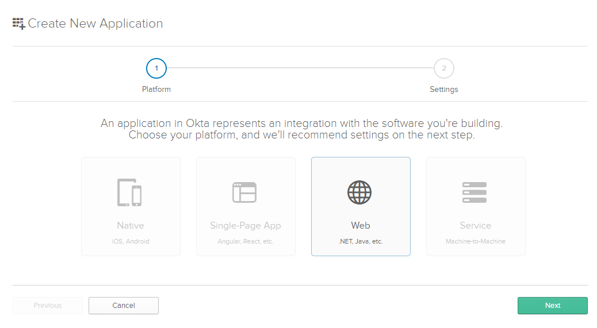
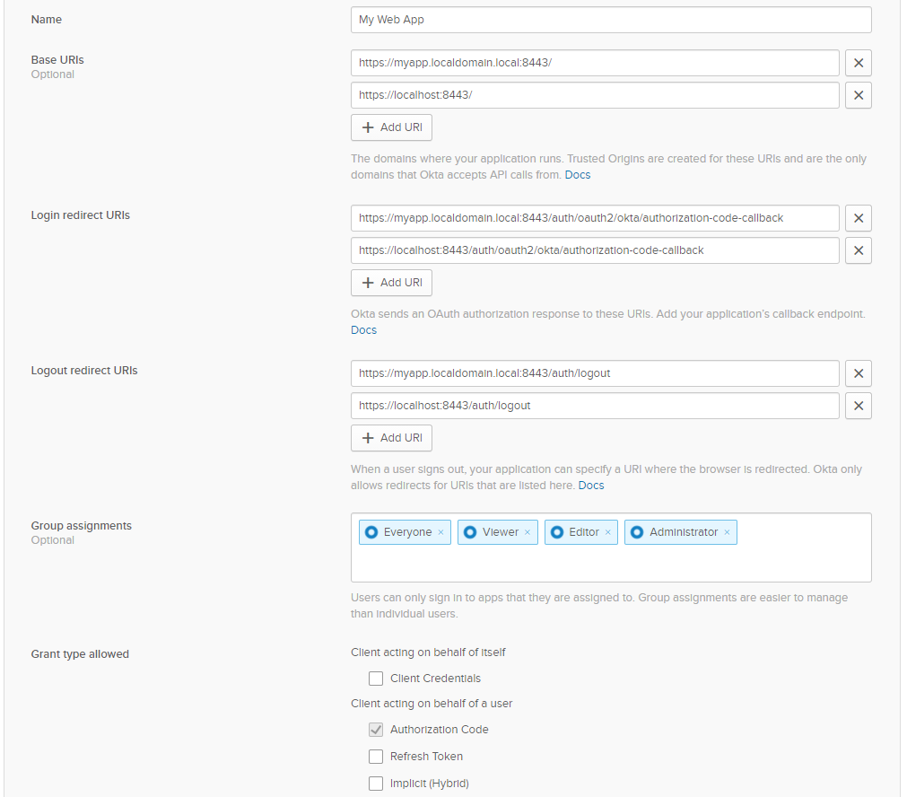
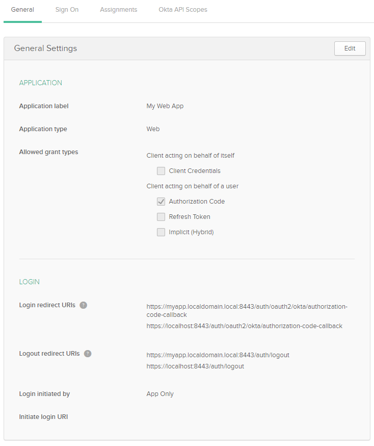
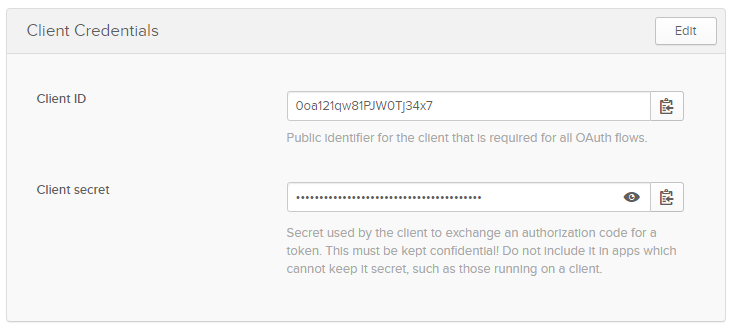
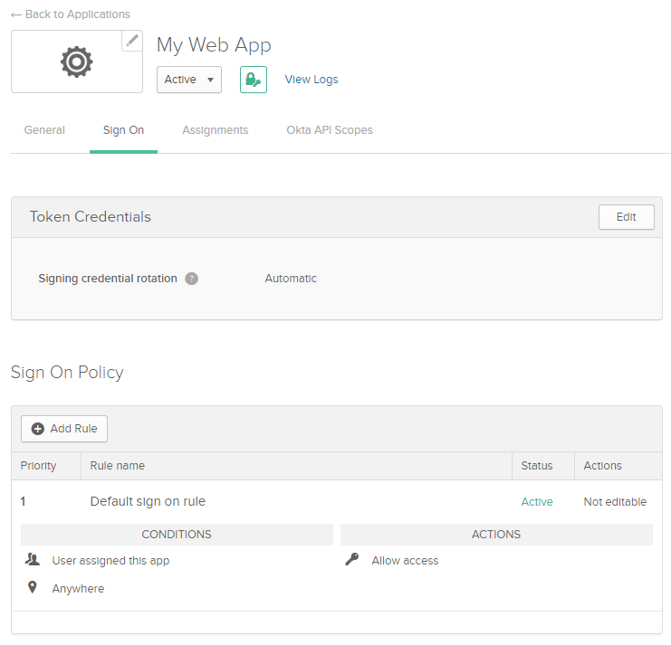
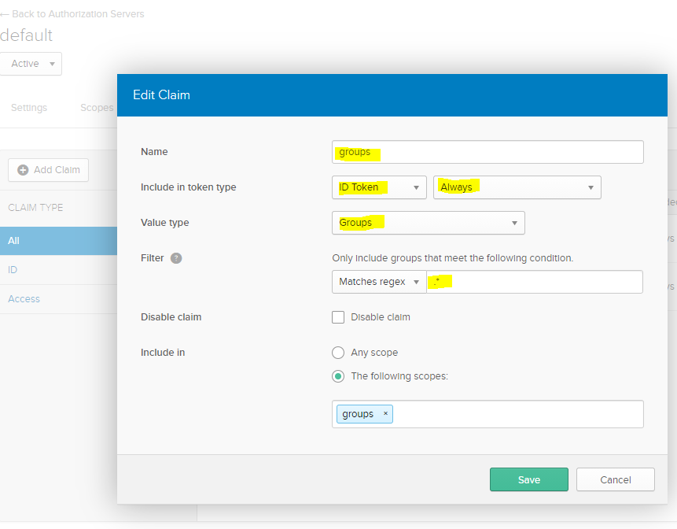
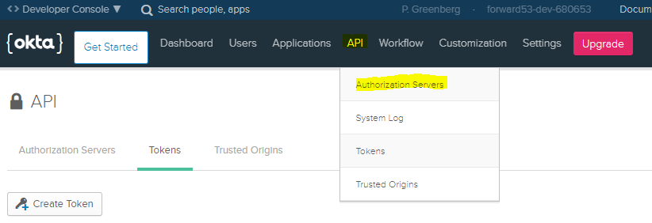
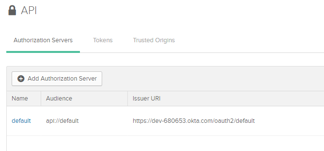
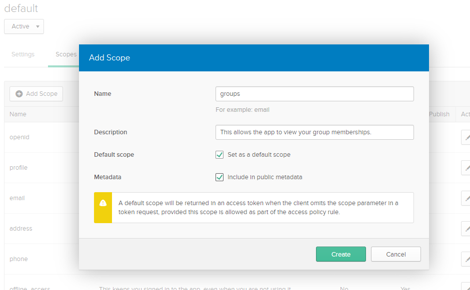

import CodeBlock from '@theme/CodeBlock';
import caddyfile from '@site/assets/conf/oauth/okta/Caddyfile?raw';

# Okta

Sign in through Okta and allow an `app-members` group to reach a protected
application. The example separates Okta app assignment, authorization-server
policy, and AuthCrunch's application policy so each can be checked independently.

This guide targets **caddy-security v1.3.0** with **go-authcrunch v1.3.8**.
Local OIDC fixtures verify the released configuration, token checks, and
allow/deny behavior. Live Okta assignment, policies, and consent must still be
verified in your organization.

## Before you start

Complete [Install and verify](../../start/install.md). Have an Okta administrator,
a group named `app-members`, and two test accounts: one member and one nonmember.
Use a public AuthCrunch hostname with ports 80 and 443 available for HTTPS.
Replace `auth.example.com` in the example and app registration.

The named `okta` driver builds URLs for a **custom authorization server** and
requires a `server_id`, such as `default`. Okta's built-in **org authorization server**
has a different issuer and endpoint layout. Custom authorization servers require
API Access Management in production; test organizations may include them. The
`default` server can exist without an access policy, so check the policy rather
than assuming the name makes the server ready. See
[Okta's authorization-server types](https://developer.okta.com/docs/concepts/auth-servers/).

## Register a web application

In the Admin Console, open **Applications and Resources → Applications →
Create App Integration**. Choose **OIDC – OpenID Connect** and **Web Application**.
Older consoles may label the first section simply **Applications**. Follow
[Okta's web app registration guidance](https://developer.okta.com/docs/guides/sign-into-web-app-redirect/go/main/#create-an-app-integration-in-the-admin-console)
with these values:

| Setting | Value |
| --- | --- |
| Sign-in redirect URI | `https://auth.example.com/auth/oauth2/okta/authorization-code-callback` |
| Grant type | Authorization Code |
| Client authentication | Client secret; token endpoint method `client_secret_post` |
| Assignments | The users or groups intended to sign in through this portal |

AuthCrunch sends the client ID and secret in the token request's form body.
Configure `token_endpoint_auth_method` as `client_secret_post`; an API-created
client can default to `client_secret_basic`. If the console does not expose
this setting, have your administrator verify it through Okta's client API. See
[Okta client authentication methods](https://developer.okta.com/docs/api/openapi/okta-oauth/guides/client-auth).

Save the **Client ID** and **Client secret** for the server environment. The
released driver sends S256 PKCE with the authorization-code flow. This example
does not request an Okta refresh token or use implicit/client-credentials grants.

<figure className="doc-screenshot">

[](../images/oauth2_okta_new_app_choice.png)

<figcaption>Earlier developer console: Web corresponds to the current OIDC Web Application choice. Select the image to view it at full size.</figcaption>
</figure>

<details className="screenshot-gallery">
<summary>Screenshots: earlier Okta web app settings</summary>

These screens use old localhost callbacks, example groups, and the earlier console layout. Apply the callback, assignments, and token authentication method documented above.

<figure className="doc-screenshot">

[](../images/oauth2_okta_new_app.png)

<figcaption>Use your public sign-in callback and intended assignments. A configured logout redirect alone does not end Okta SSO. Select the image to view it at full size.</figcaption>
</figure>

<figure className="doc-screenshot">

[](../images/oauth2_okta_app_settings_01.png)

<figcaption>Review Authorization Code and your exact sign-in redirect URI. Select the image to view it at full size.</figcaption>
</figure>

<figure className="doc-screenshot">

[](../images/oauth2_okta_app_settings_02.png)

<figcaption>The secret remains masked in this capture. Keep your own credentials in the server environment. Select the image to view it at full size.</figcaption>
</figure>

<figure className="doc-screenshot">

[](../images/oauth2_okta_app_settings_03.png)

<figcaption>Check your actual sign-on policy; this historical default rule does not define the right access policy for your organization. Select the image to view it at full size.</figcaption>
</figure>

</details>

App assignment controls who may attempt Okta sign-in. To test AuthCrunch's
nonmember denial separately, assign both test users to the app while keeping
only one in `app-members`. If you assign only that group, Okta rejects the
nonmember before AuthCrunch gets a token.

## Configure the authorization server

In **Security → API → Authorization Servers**, select your server. This guide
uses `default`; another server ID is valid when its scopes, claims, and policies
are configured consistently.

### Add the groups scope and ID-token claim

Create a scope named `groups` if it is absent. The example explicitly requests
it, so it need not be a default scope. Then create this claim:

| Claim setting | Value |
| --- | --- |
| Name | `groups` |
| Include in token type | ID Token, **Always** |
| Value type | Groups |
| Filter | Matches regex: `^app-members$` |
| Include in | The `groups` scope |
| Disable claim | Off |

**Always** matters: the named driver does not fetch UserInfo to fill in missing
ID-token groups. A claim available only through UserInfo does not grant the
application role in this example. See
[Okta's claim inclusion settings](https://help.okta.com/oie/en-us/content/topics/security/api-config-claims.htm)
and [groups claim guidance](https://developer.okta.com/docs/guides/customize-tokens-groups-claim/main/).

Ensure the returned ID token also contains `email`, as required by the driver's
default email-presence check. If your authorization-server configuration only
releases email through UserInfo, configure its email claim for ID-token
inclusion. The app's access rule remains group based.

<figure className="doc-screenshot">

[](../images/okta_configure_scope_04.png)

<figcaption>ID Token and Always are the key controls. Replace the historical match-all regex with ^app-members$ for this walkthrough. Select the image to view it at full size.</figcaption>
</figure>

<details className="screenshot-gallery">
<summary>Screenshots: authorization server and groups scope</summary>

Current navigation is Security → API → Authorization Servers. These earlier console images show the corresponding server and scope settings.

<figure className="doc-screenshot">

[](../images/okta_configure_scope_01.png)

<figcaption>Select the authorization server before editing its scopes and claims. Select the image to view it at full size.</figcaption>
</figure>

<figure className="doc-screenshot">

[](../images/okta_configure_scope_02.png)

<figcaption>The default custom server has an issuer ending in /oauth2/default; it differs from the org authorization server. Select the image to view it at full size.</figcaption>
</figure>

<figure className="doc-screenshot">

[](../images/okta_configure_scope_03.png)

<figcaption>The current example requests groups explicitly; the older Default scope checkbox is not required. Select the image to view it at full size.</figcaption>
</figure>

</details>

### Add an access policy and rule

Under the server's **Access Policies**, select or create a policy for this client.
Add a rule allowing **Authorization Code**, the intended assigned users, and
the requested `openid email profile groups` scopes. Review rule ordering and
the existing policies in your organization. See
[Okta's access-policy setup](https://help.okta.com/oie/en-us/content/topics/security/api-config-access-policies.htm).

These controls serve separate purposes:

| Control | Decision |
| --- | --- |
| Okta app assignment and sign-on policy | May this user sign in to this client? |
| Authorization-server access policy | May this client/user obtain tokens for these scopes? |
| ID-token claim filter | Which of the user's group names are included? |
| AuthCrunch transform and policy | Does the resulting identity receive `app/member` and reach `/app`? |

## Configure AuthCrunch

Save this as `Caddyfile`. The source is the
[canonical Okta example](https://github.com/authcrunch/authcrunch.github.io/blob/main/assets/conf/oauth/okta/Caddyfile).

<CodeBlock language="text" title="Caddyfile">{caddyfile}</CodeBlock>

The first transform grants portal access; the second grants `app/member` when
the token supplies the exact `app-members` role. The portal maps the token's
`groups` into roles before applying these transforms. A signed-in user without
that group can enter the portal but receives **403** from `/app` and its children.

Set these variables for the process that runs AuthCrunch:

```sh
export OKTA_DOMAIN='YOUR_ORG.okta.com'
export OKTA_SERVER_ID='default'
export OKTA_CLIENT_ID='YOUR_CLIENT_ID'
export OKTA_CLIENT_SECRET='YOUR_CLIENT_SECRET'
export JWT_SHARED_KEY="$(openssl rand -hex 32)"
```

Use your actual Okta hostname without `https://` or a trailing slash; your
organization may use a different Okta domain or a configured custom domain.
`OKTA_SERVER_ID` is the authorization-server ID, not the app's client ID.

`{$OKTA_DOMAIN}` and `{$OKTA_SERVER_ID}` expand during Caddyfile parsing.
Credentials and the signing key use runtime `{env.VARIABLE}` placeholders.
Protect the environment file and reuse the signing key across restarts.

The driver's discovery URL has this shape:

```text
https://YOUR_ORG.okta.com/oauth2/default/.well-known/openid-configuration?client_id=YOUR_CLIENT_ID
```

Verify it returns metadata for the intended issuer and reachable endpoints.
With the installed binary, check and run:

```sh
./bin/authcrunch adapt --adapter caddyfile --config Caddyfile >/dev/null
./bin/authcrunch run --config Caddyfile
```

Adaptation checks configuration syntax; startup and a real login check the
provider. The example disables the admin endpoint, so use **Ctrl+C** and restart
after changes. Replace the protected `respond` with your application's
`reverse_proxy` when the allow/deny checks pass.

## Verify sign-in and access

1. Open `https://auth.example.com/app`, choose **Okta**, and sign in as the member.
2. Select **Example app** from the portal if you are not sent there automatically.
   Expect `You reached the Okta-protected app.`
3. Open **My identity** at `/auth/whoami`. Confirm `realm: okta`, `app-members`,
   and `app/member` in the roles.
4. In a fresh browser session, use the assigned nonmember. Login should complete,
   but `/app` must return **403**. A group with a similar name is not sufficient.
5. Remove the member from the group and repeat with a fresh portal session to
   confirm the policy no longer admits that user.

Existing portal tokens retain their recorded roles; this example uses a
900-second lifetime. `/auth/logout` ends the portal session, not the Okta SSO
session. Listing that URL as an Okta logout redirect does not make AuthCrunch
call Okta's end-session endpoint.

## Using the org authorization server

For an org authorization server, use the
[generic OIDC driver](81-backend-oauth2-0000-generic.md) with issuer
`https://YOUR_ORG.okta.com` and its root
`/.well-known/openid-configuration` metadata. Do not invent a `server_id` to
make the named driver generate those endpoints. Configure the app's ID-token
group claim using Okta's org-server instructions, then verify the returned
email and groups with your actual authorization-code flow.

## Troubleshoot

| Symptom | Check |
| --- | --- |
| `invalid_client` during token exchange | Client ID, secret, and `client_secret_post` authentication method |
| Scope or policy error in Okta | Selected custom server, `groups` scope, app assignment, and a matching access-policy rule |
| Email missing during callback | Include email in the ID token; this driver does not fill it from UserInfo |
| Portal login works but `/app` is 403 | ID Token → Always, exact `groups` claim name and group value, and a fresh login |
| Issuer validation fails | Keep org/custom server and custom-domain issuer settings consistent with discovery |
| Logout seems to sign the user straight back in | The browser's Okta SSO session is separate from its AuthCrunch portal session |
