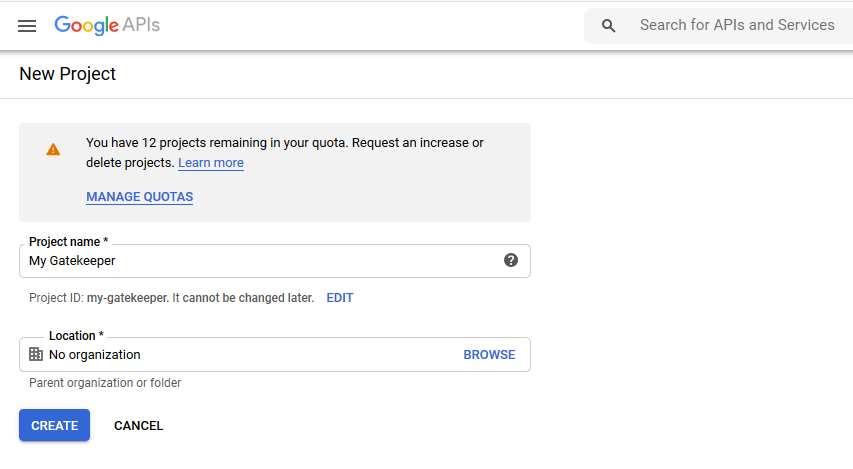
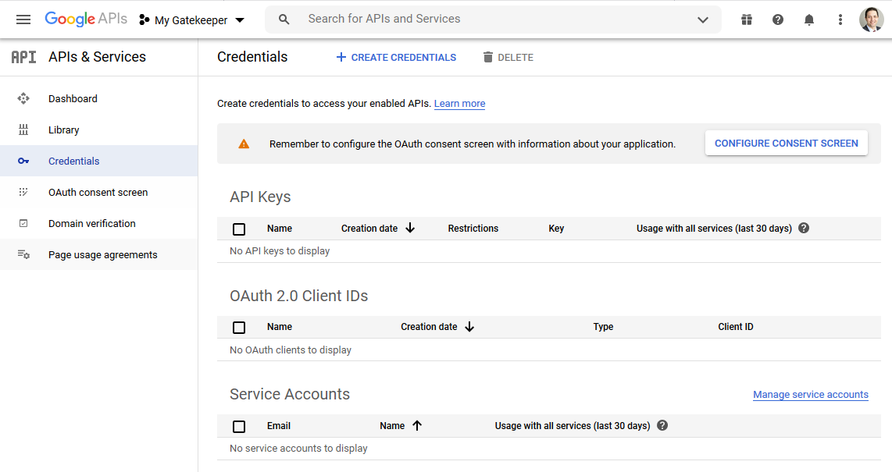
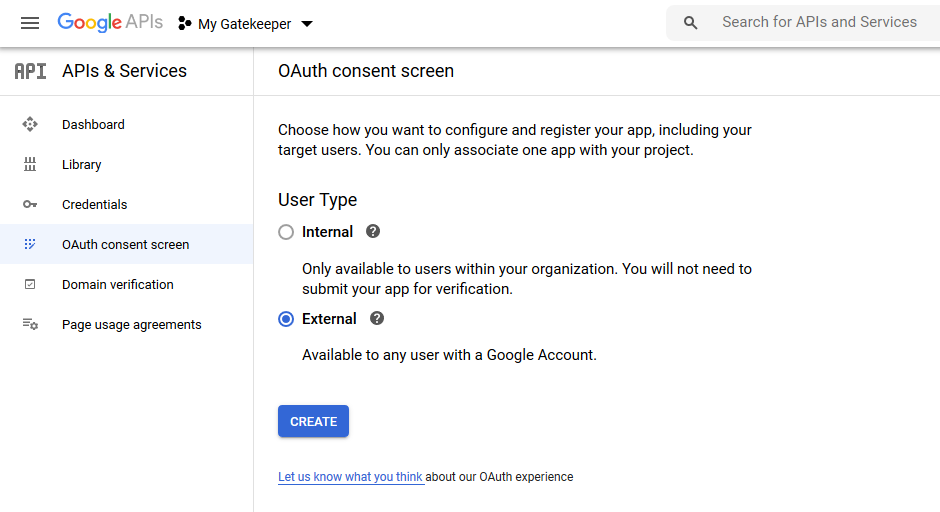
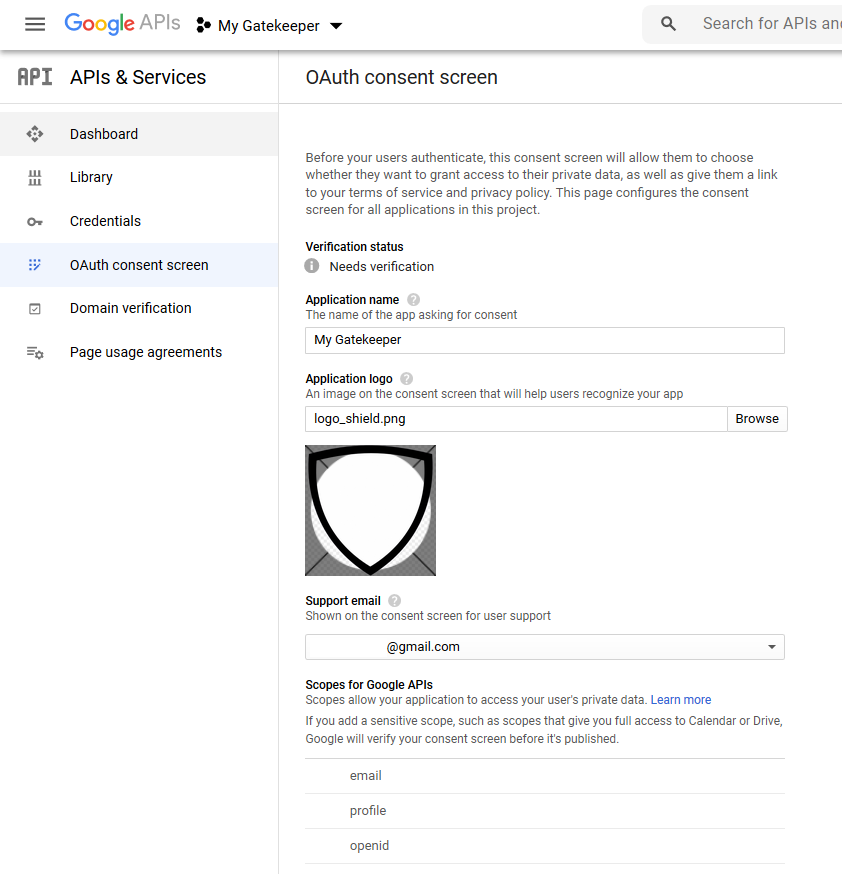
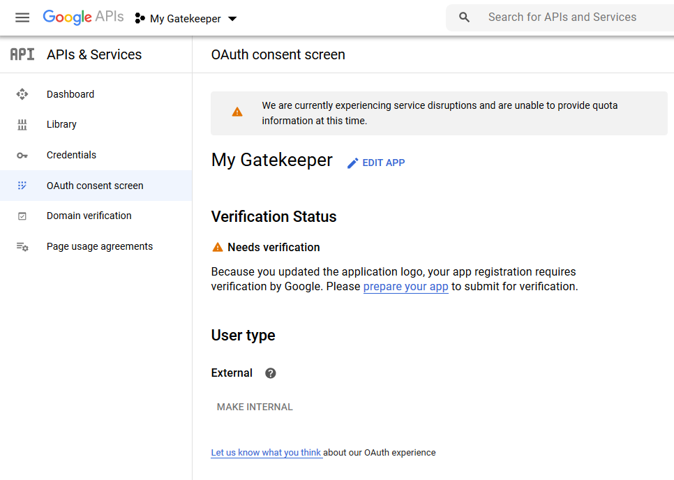
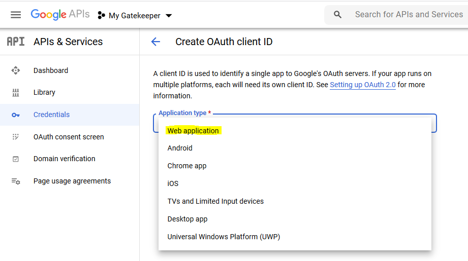
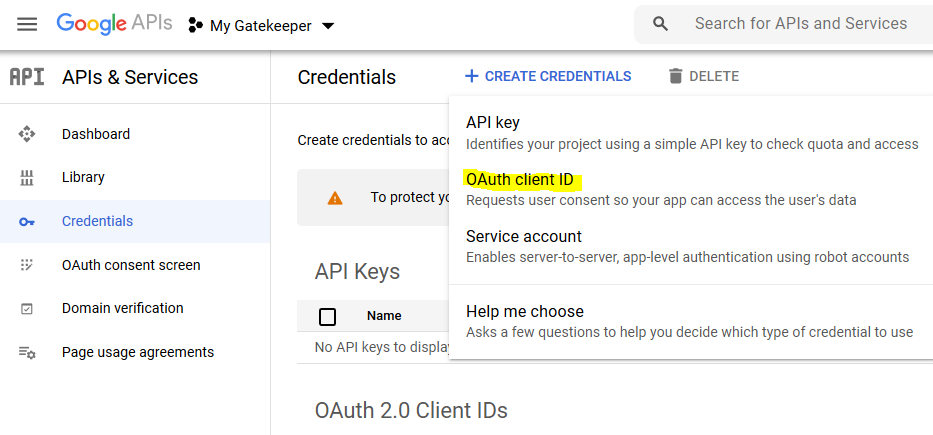
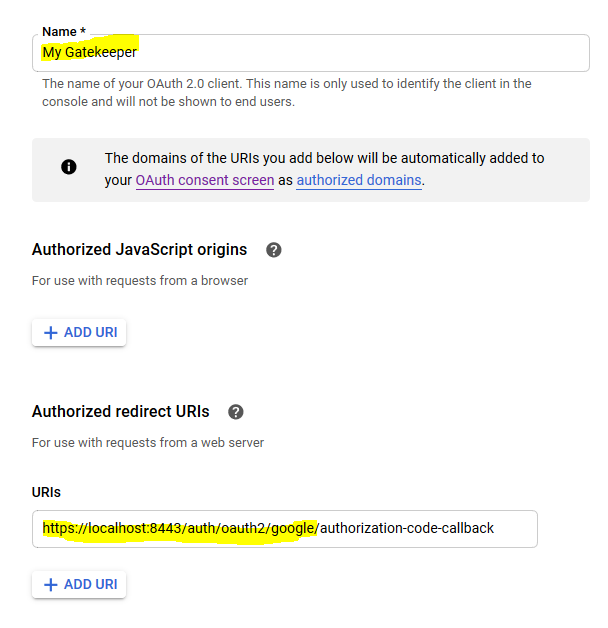
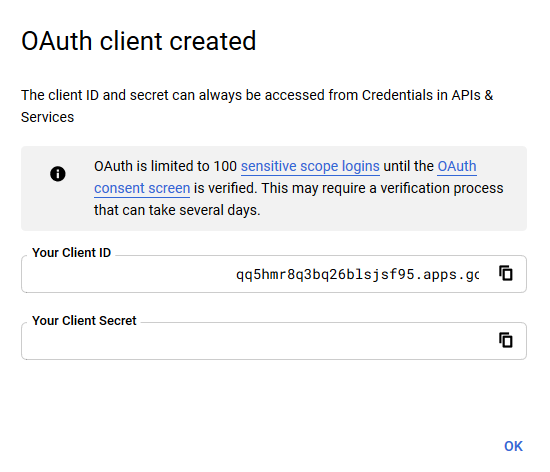

import CodeBlock from '@theme/CodeBlock';
import caddyfile from '@site/assets/conf/oauth/google/Caddyfile?raw';

<span id="google-identity-platform" />

# Google sign-in

Sign in with a Google account and give selected accounts access to your
application. This walkthrough uses Google's account ID (`sub`) to grant
`app/member`; other Google users can reach the portal but not the protected app.

The configuration targets **caddy-security v1.3.0**, containing
**go-authcrunch v1.3.8**. Local OIDC fixtures check the released driver's code
exchange and access rules. Complete the final login checks with your own Google
client; local fixtures do not verify Google's consent or organization policies.

## Before you start

Complete [Install and verify](../../start/install.md). You need a Google Cloud
project where you can manage OAuth clients, two Google accounts for access tests,
and a public HTTPS portal. This guide uses `https://auth.example.com/auth/` and
protects `/app`; replace the hostname throughout.

For the provider/portal/policy relationship, see the
[OAuth and OIDC overview](10-oauth2.md).

## Configure Google Auth Platform

In the [Google Cloud console](https://console.cloud.google.com/), choose your
project and open **Google Auth Platform**. Complete **Branding** with your app's
name, support contact, and required website information. Configure **Audience**
for the accounts you intend to support:

| Audience | Use it for |
| --- | --- |
| Internal | Accounts in the project's Google Workspace or Cloud Identity organization, when available |
| External | Google accounts outside that organization, including personal accounts |

Review **Data Access** for the basic identity scopes: `openid`, email, and
profile. The Caddyfile requests `openid email profile`. It does not need Gmail,
Drive, or Cloud Identity group permissions for the account-ID example. See
[Google's consent setup](https://developers.google.com/workspace/guides/configure-oauth-consent).

For an External app, review **Audience → Publishing status** and **Test users**.
Google makes an exception to its usual testing restrictions for basic
name/email/profile sign-in. Do not treat the test-user list as the app's access
policy, or assume a seven-day testing expiry applies to these scopes. Extra
scopes change the requirements; follow
[Google's audience rules](https://support.google.com/cloud/answer/15549945).
The AuthCrunch policy below is what restricts `/app`.

<details className="screenshot-gallery">
<summary>Screenshots: project and consent setup in the earlier Google console</summary>

These retained screenshots show the earlier APIs & Services interface. In the current console, use Google Auth Platform and the Branding, Audience, and Data Access pages described above. Example names and verification status belong to the original capture.

<figure className="doc-screenshot">

[](../images/oauth2_google_new_app.png)

<figcaption>Create or select the project that owns the OAuth client. Select the image to view it at full size.</figcaption>
</figure>
<figure className="doc-screenshot">

[](../images/oauth2_google_credentials.png)

<figcaption>The earlier Credentials page linked to consent setup; current consent settings live in Google Auth Platform. Select the image to view it at full size.</figcaption>
</figure>
<figure className="doc-screenshot">

[](../images/oauth2_google_consent_screen.png)

<figcaption>Choose the audience appropriate to your accounts; this screenshot illustrates the External option. Select the image to view it at full size.</figcaption>
</figure>
<figure className="doc-screenshot">

[](../images/oauth2_google_consent_screen_config.png)

<figcaption>Supply your own app identity, contact details, and website information. Select the image to view it at full size.</figcaption>
</figure>
<figure className="doc-screenshot">

[](../images/oauth2_google_consent_screen_verification.png)

<figcaption>An earlier verification screen. Follow the current requirements for your audience and scopes rather than copying this status. Select the image to view it at full size.</figcaption>
</figure>

</details>

## Register a web client

Open **Clients → Create client** and choose **Web application**. Register:

<figure className="doc-screenshot">

[](../images/oauth2_google_new_credentials_type_choice.png)

<figcaption>Earlier console: select Web application. Current navigation starts at Google Auth Platform → Clients. Select the image to view it at full size.</figcaption>
</figure>


| Setting | Value |
| --- | --- |
| Authorized redirect URI | `https://auth.example.com/auth/oauth2/google/authorization-code-callback` |
| Client ID | Copy the complete value, including `.apps.googleusercontent.com` |
| Client secret | Save the secret for the AuthCrunch server |

The callback includes the portal's `/auth/` mount and realm `google`. Match its
scheme, host, path, and trailing slash exactly. The portal exchanges the code
on the server; this example does not use a browser JavaScript client or require
an Authorized JavaScript origin. See
[Google's web-client instructions](https://developers.google.com/workspace/guides/create-credentials#web-application).

<details className="screenshot-gallery">
<summary>Screenshots: OAuth client creation and callback</summary>

These earlier screens show the same client type and callback concepts. Use the exact HTTPS callback from the table above, not the localhost address in the old capture. The client secret is blank in the retained confirmation image.

<figure className="doc-screenshot">

[](../images/oauth2_google_new_credentials.png)

<figcaption>Earlier entry point for creating an OAuth client ID. Select the image to view it at full size.</figcaption>
</figure>
<figure className="doc-screenshot">

[](../images/oauth2_google_new_credentials_uri_choice.png)

<figcaption>Enter your public portal callback under Authorized redirect URIs. Select the image to view it at full size.</figcaption>
</figure>
<figure className="doc-screenshot">

[](../images/oauth2_google_new_credentials_confirm.png)

<figcaption>Store your own client credentials securely; the example identifier is not a value to reuse. Select the image to view it at full size.</figcaption>
</figure>

</details>

## Configure AuthCrunch

Save the following as `Caddyfile`. Change `auth.example.com` in both the site
address and policy URL. The complete file is embedded from the
[canonical Google example](https://github.com/authcrunch/authcrunch.github.io/blob/main/assets/conf/oauth/google/Caddyfile).

<CodeBlock language="text" title="Caddyfile">{caddyfile}</CodeBlock>

The first transform clears provider-derived `authp/*` and `app/member` roles.
The following transforms grant portal access and check the selected subject.
Keep that order so provider roles cannot grant portal administration or bypass
the account rule. Other group roles remain available for the optional
Cloud Identity variant below.

Set the environment before starting the process:

```sh
export GOOGLE_CLIENT_ID='YOUR_COMPLETE_CLIENT_ID.apps.googleusercontent.com'
export GOOGLE_CLIENT_SECRET='YOUR_GOOGLE_CLIENT_SECRET'
export GOOGLE_ALLOWED_SUB='REPLACE_WITH_GOOGLE_SUB'
export JWT_SHARED_KEY="$(openssl rand -hex 32)"
```

Use your actual client credentials. Leave the subject placeholder for the first
login, then replace it as described below. `GOOGLE_ALLOWED_SUB` is an account ID,
not an email address or the OAuth client ID.

`{$GOOGLE_ALLOWED_SUB}` expands when the Caddyfile is parsed. The client ID,
client secret, and signing key use runtime `{env.VARIABLE}` placeholders. Supply
the **whole** Google client ID; do not append its suffix again in the Caddyfile.
For a managed service, use its protected environment and keep the signing key
stable across restarts.

```sh
./bin/authcrunch adapt --adapter caddyfile --config Caddyfile >/dev/null
./bin/authcrunch run --config Caddyfile
```

Adaptation checks parsing. Startup loads Google's discovery document and
signing keys; the host needs outbound HTTPS connectivity. Public DNS and
certificate issuance must work for your portal hostname. The example disables
the admin endpoint, so stop with **Ctrl+C** and restart after configuration or
environment changes.

## Select the account and verify access

1. Open `/auth/` and choose **Google**. Sign in with the account that should
   have application access.
2. Open **My identity** (`/auth/whoami`) and copy that account's `sub` value.
   Confirm you are using the intended Google account. This login has
   `authp/user`; the unconfigured subject does not grant `app/member`.
3. Set `GOOGLE_ALLOWED_SUB` to that exact value, stop AuthCrunch, and start it
   again with the updated environment.
4. Sign out of the portal and sign in again to issue a token with the new role.
   Select **Example app** or open `/app`.
5. In a separate browser session, sign in as a second Google user and verify
   that the app denies access.

| Check | Selected account | Other account |
| --- | --- | --- |
| Portal identity | Has `authp/user` and `app/member` | Has `authp/user` only |
| `/app`, `/app/`, `/app/nested` | 200, protected response | 403, no protected response |

If your Google audience prevents the second account from signing in, that tests
Google's boundary. Use another account eligible for the same audience to test
the AuthCrunch denial rule.

Google documents `sub` as stable across email changes. An email suffix does
not establish Workspace membership. This release checks ID-token email
presence but does not enforce `email_verified` or expose `hd` to transforms;
the example therefore grants access by the selected `sub`. See
[Google's identity claims](https://developers.google.com/identity/openid-connect/openid-connect#an-id-tokens-payload)
and the [released claim parser](https://github.com/greenpau/go-authcrunch/blob/v1.3.8/pkg/idp/oauth/claim_parser.go).

The Google driver discovers its endpoints and sends state, nonce, and S256
PKCE. Keep these checks enabled. The example uses a 900-second portal token;
changing the allowlist does not rewrite an already issued token. Portal logout
clears the portal session and does not sign the browser out of Google. Use a
separate browser profile when testing another account.

After the allow/deny checks pass, replace the protected `respond` with your
application's `reverse_proxy`, keeping `authorize` before it.

## Workspace domains and groups

### Organization access

For an organization-only application, use Google's **Internal** audience when
your project supports it. The `hd` authorization parameter is a login hint;
requesting it is not an access check. This release does not copy the ID token's
`hd` or `email_verified` into the portal claims, so an email-domain transform is
not a substitute for validating Workspace membership. Keep the account allowlist
or use an independently verified group-based policy.

### Optional Cloud Identity groups

The released Google driver can query the Cloud Identity membership graph when
its scopes include:

```text
scopes openid email profile https://www.googleapis.com/auth/cloud-identity.groups.readonly
```

Replace the existing `scopes` line inside `oauth identity provider google`.
Enable the Cloud Identity API, authorize the additional scope, and verify the
signed-in user can read the relevant memberships. Google's
[membership query guidance](https://docs.cloud.google.com/identity/docs/how-to/query-memberships)
explains permissions. The
[graph endpoint](https://docs.cloud.google.com/identity/docs/reference/rest/v1/groups.memberships/getMembershipGraph)
requires a supported Workspace Enterprise/Education edition or Cloud Identity
Premium; ordinary personal accounts are not sufficient.

The driver's [group lookup](https://github.com/greenpau/go-authcrunch/blob/v1.3.8/pkg/idp/oauth/user_groups.go)
uses the user's email and access token. It reads `response.groups[].displayName`
from the returned operation and adds those **display names** to portal roles.
It does not use immutable group IDs, filter on your configured application
role, or poll an unfinished operation. A renamed group changes the match, and
identical display names cannot distinguish groups.

Only after confirming the returned roles at `/auth/whoami`, replace the
account-granting transform with one matching your group's exact display name:

```text
transform user {
    match realm google
    match role "Example App Members"
    action add role app/member
}
```

Keep the separate portal-access transform. Replacing the account rule makes
the group required; retaining both rules allows either to grant access. A group
lookup failure is logged and login continues, so test an API failure or missing
group as well as a member. Without the required role, `/app` must remain denied.
This optional integration needs validation against your organization's licenses,
permissions, naming controls, and actual API responses.

## Troubleshoot

| Symptom | Check |
| --- | --- |
| `redirect_uri_mismatch` | Compare the registered callback with the public host, `/auth/` mount, and realm `google`. |
| `invalid_client` | Use the complete client ID once and the corresponding current secret. |
| Google blocks consent | Check Internal/External audience, publishing status, requested scopes, and organization policy. |
| Selected user gets 403 | Compare `sub` with `GOOGLE_ALLOWED_SUB`, restart after changing the environment, then obtain a new portal token. |
| Another user reaches the app | Check for another transform granting `app/member` and ensure the policy does not allow `authp/user`. |
| Issuer validation fails | Compare the ID token's issuer with discovery; this release uses exact equality, including Google's HTTPS prefix. Do not disable key or nonce checks. |
| Workspace group is absent | Check the extra scope, API enablement, account edition, membership permissions, returned operation, and exact display name. |
| Sign-in resumes after logout | The Google session still exists; use a separate browser session for another account. |

For token validation and claim extraction details, continue to
[Generic OpenID Connect](81-backend-oauth2-0000-generic.md).

## Agentic Prompts

Copy a prompt into your LLM to explore this topic. Each prompt prioritizes
upstream repository guidance and code over this page, and asks for version-aware
reasoning.

<div className="agentic-prompts">

<details>
<summary>Trace Google account identity</summary>

```text
Help me understand Google sign-in.

Primary authorities (take precedence over website documentation):
https://github.com/greenpau/caddy-security/blob/main/AGENTS.md
https://github.com/greenpau/caddy-security/tree/main/.codex/skills
https://github.com/greenpau/go-authcrunch/blob/main/AGENTS.md
https://github.com/greenpau/go-authcrunch/tree/main/.codex/skills
Read each repository's root AGENTS.md first, then any scoped AGENTS.md that
applies to inspected paths. Read the relevant SKILL.md files and follow their
implementation and test references.

Relevant skills to locate: configuration-oauth-providers,
oauth-identity-provider.

Secondary reference:
https://docs.authcrunch.com/docs/authenticate/oauth/backend-oauth2-0002-google

If a source is inaccessible, ask me to paste its relevant text. Identify the
versions your answer applies to; main may be newer than my release. Resolve
disagreements using code and tests, and flag unverified claims. Use synthetic
credentials and redacted examples; explain proposed checks before any changes.

Explain server-side Google sign-in and the account subject used for a narrow
application allowlist. Separate consent/audience/test-user settings from
AuthCrunch permissions. Ask for the exact callback and release, and use
current official Google guidance for console details.
```

</details>

<details>
<summary>Compare Workspace and groups</summary>

```text
Help me understand Google sign-in.

Primary authorities (take precedence over website documentation):
https://github.com/greenpau/caddy-security/blob/main/AGENTS.md
https://github.com/greenpau/caddy-security/tree/main/.codex/skills
https://github.com/greenpau/go-authcrunch/blob/main/AGENTS.md
https://github.com/greenpau/go-authcrunch/tree/main/.codex/skills
Read each repository's root AGENTS.md first, then any scoped AGENTS.md that
applies to inspected paths. Read the relevant SKILL.md files and follow their
implementation and test references.

Relevant skills to locate: configuration-oauth-providers,
oauth-identity-provider.

Secondary reference:
https://docs.authcrunch.com/docs/authenticate/oauth/backend-oauth2-0002-google

If a source is inaccessible, ask me to paste its relevant text. Identify the
versions your answer applies to; main may be newer than my release. Resolve
disagreements using code and tests, and flag unverified claims. Use synthetic
credentials and redacted examples; explain proposed checks before any changes.

Compare an exact subject, hosted-domain data, and optional Cloud Identity
membership mapping. Explain why an email suffix or consent scope is not
automatically organization authorization. Identify which group API, scope,
permission, and filter the implementation actually consumes.
```

</details>

<details>
<summary>Diagnose a Google callback</summary>

```text
Help me understand Google sign-in.

Primary authorities (take precedence over website documentation):
https://github.com/greenpau/caddy-security/blob/main/AGENTS.md
https://github.com/greenpau/caddy-security/tree/main/.codex/skills
https://github.com/greenpau/go-authcrunch/blob/main/AGENTS.md
https://github.com/greenpau/go-authcrunch/tree/main/.codex/skills
Read each repository's root AGENTS.md first, then any scoped AGENTS.md that
applies to inspected paths. Read the relevant SKILL.md files and follow their
implementation and test references.

Relevant skills to locate: configuration-oauth-providers,
oauth-identity-provider.

Secondary reference:
https://docs.authcrunch.com/docs/authenticate/oauth/backend-oauth2-0002-google

If a source is inaccessible, ask me to paste its relevant text. Identify the
versions your answer applies to; main may be newer than my release. Resolve
disagreements using code and tests, and flag unverified claims. Use synthetic
credentials and redacted examples; explain proposed checks before any changes.

Help me classify redirect_uri_mismatch, consent restriction, missing email,
wrong issuer/client, and login followed by app denial. Ask for redacted
registration/claim metadata rather than tokens. Explain why an Authorized
JavaScript origin does not replace a server-side callback registration.
```

</details>

<details>
<summary>Review minimal identity scopes</summary>

```text
Help me understand Google sign-in.

Primary authorities (take precedence over website documentation):
https://github.com/greenpau/caddy-security/blob/main/AGENTS.md
https://github.com/greenpau/caddy-security/tree/main/.codex/skills
https://github.com/greenpau/go-authcrunch/blob/main/AGENTS.md
https://github.com/greenpau/go-authcrunch/tree/main/.codex/skills
Read each repository's root AGENTS.md first, then any scoped AGENTS.md that
applies to inspected paths. Read the relevant SKILL.md files and follow their
implementation and test references.

Relevant skills to locate: configuration-oauth-providers,
oauth-identity-provider.

Secondary reference:
https://docs.authcrunch.com/docs/authenticate/oauth/backend-oauth2-0002-google

If a source is inaccessible, ask me to paste its relevant text. Identify the
versions your answer applies to; main may be newer than my release. Resolve
disagreements using code and tests, and flag unverified claims. Use synthetic
credentials and redacted examples; explain proposed checks before any changes.

Help me decide whether ordinary openid/email/profile is enough or group
lookups are truly required. Compare basic identity data with expanded Google
API access and missing membership results. Keep a restrictive application
policy when supplementary group data is unavailable.
```

</details>

<details>
<summary>Test membership and lifecycle</summary>

```text
Help me understand Google sign-in.

Primary authorities (take precedence over website documentation):
https://github.com/greenpau/caddy-security/blob/main/AGENTS.md
https://github.com/greenpau/caddy-security/tree/main/.codex/skills
https://github.com/greenpau/go-authcrunch/blob/main/AGENTS.md
https://github.com/greenpau/go-authcrunch/tree/main/.codex/skills
Read each repository's root AGENTS.md first, then any scoped AGENTS.md that
applies to inspected paths. Read the relevant SKILL.md files and follow their
implementation and test references.

Relevant skills to locate: configuration-oauth-providers,
oauth-identity-provider.

Secondary reference:
https://docs.authcrunch.com/docs/authenticate/oauth/backend-oauth2-0002-google

If a source is inaccessible, ask me to paste its relevant text. Identify the
versions your answer applies to; main may be newer than my release. Resolve
disagreements using code and tests, and flag unverified claims. Use synthetic
credentials and redacted examples; explain proposed checks before any changes.

Create cases for intended subject, another valid account, wrong hosted domain,
selected versus lookalike group, group-fetch failure, and a fresh login after
removal. Explain portal token lifetime and upstream SSO separately, and ask me
to justify the chosen membership boundary.
```

</details>

</div>

## Source Code References

Start with the code search, then follow the parser, runtime, and tests relevant
to this topic. These links target `main`; use GitHub's branch/tag selector to
compare them with your installed release.

1. [Search this topic in both repositories](https://github.com/search?q=%28repo%3Agreenpau%2Fgo-authcrunch%20OR%20repo%3Agreenpau%2Fcaddy-security%29%20%28google%20OR%20cloudidentity%20OR%20fetchUserGroups%29&type=code)
   — searches topic-specific symbols and paths across both codebases.
2. [caddy-security: caddyfile_identity_provider_oauth.go](https://github.com/greenpau/caddy-security/blob/main/caddyfile_identity_provider_oauth.go)
   — adapts OAuth/OIDC provider settings, scopes, endpoints, and trust options.
3. [go-authcrunch: pkg/idp/oauth/config.go](https://github.com/greenpau/go-authcrunch/blob/main/pkg/idp/oauth/config.go)
   — validates generic and named-driver defaults and endpoint settings.
4. [go-authcrunch: pkg/idp/oauth/claim_parser.go](https://github.com/greenpau/go-authcrunch/blob/main/pkg/idp/oauth/claim_parser.go)
   — maps supported token claims into the normalized provider identity.
5. [go-authcrunch: pkg/idp/oauth/user_groups.go](https://github.com/greenpau/go-authcrunch/blob/main/pkg/idp/oauth/user_groups.go)
   — retrieves and filters provider-specific group membership data.
6. [go-authcrunch: pkg/idp/oauth/user_groups_test.go](https://github.com/greenpau/go-authcrunch/blob/main/pkg/idp/oauth/user_groups_test.go)
   — tests provider group extraction and filtering.
