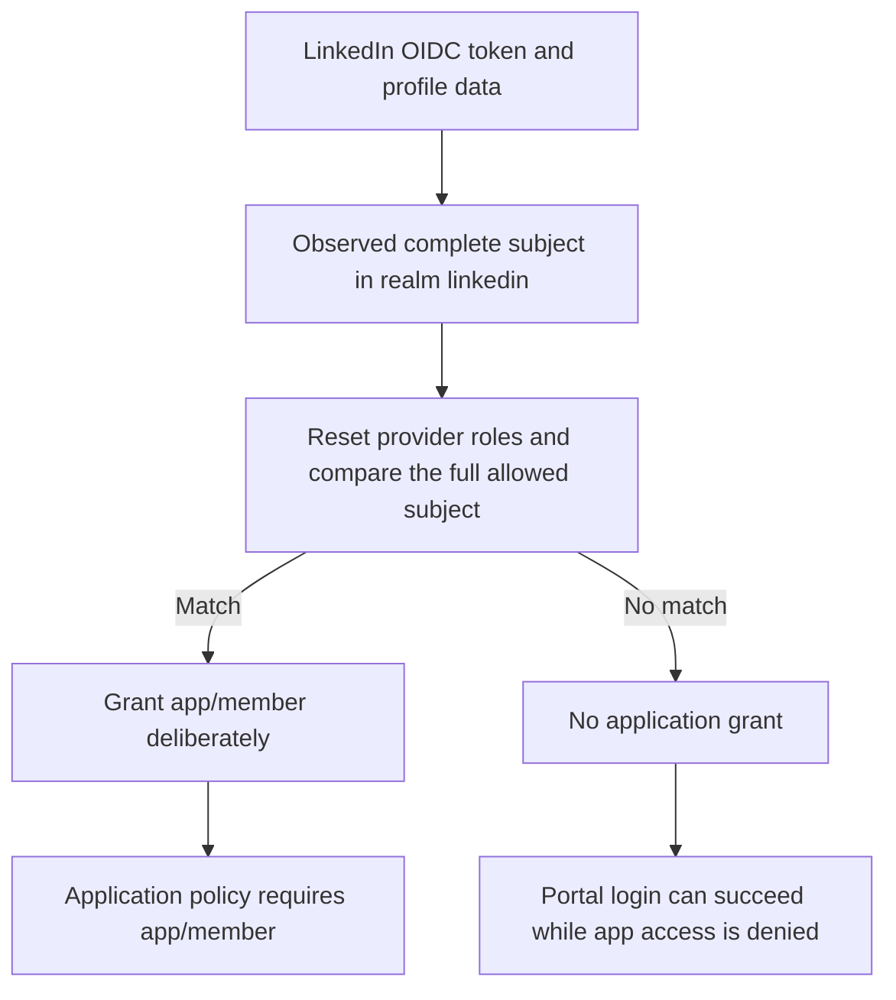

import CodeBlock from '@theme/CodeBlock';
import example from '@site/assets/conf/oauth/linkedin/Caddyfile?raw';

# LinkedIn

Use **Sign In with LinkedIn using OpenID Connect**, not the older profile/email
permission product. The named driver in [released v1.3.0](../../operations/versions.md)
uses LinkedIn discovery and validates the returned identity token. LinkedIn's
sign-in product identifies an account; it does not verify a person's real-world
identity. See [LinkedIn's current OIDC guide](https://learn.microsoft.com/en-us/linkedin/consumer/integrations/self-serve/sign-in-with-linkedin-v2).

## Register the application

Create an application in the [developer portal](https://www.linkedin.com/developers/apps),
complete its required organization/application details, and request the **Sign
In with LinkedIn using OpenID Connect** product. Copy your application's client
ID and private secret into the server's `LINKEDIN_CLIENT_ID` and
`LINKEDIN_CLIENT_SECRET`. Never put the secret into browser code.

Register exactly:

```text
https://auth.example.com/auth/oauth2/linkedin/authorization-code-callback
```

Request `openid profile email`. The older screenshots below show where
application credentials, redirects, and products were configured; current
product names differ. Their localhost callback is historical, not the callback
used by the example.

<figure className="doc-screenshot">

[](../images/oauth2_linkedin_redirect_url.png)

<figcaption>Historical LinkedIn redirect registration; use the exact public callback above.</figcaption>
</figure>
<details className="screenshot-gallery">
<summary>Preserved LinkedIn application screens</summary>

<figure className="doc-screenshot">

[](../images/oauth2_linkedin_new_app.png)

<figcaption>Historical application creation and organization details.</figcaption>
</figure>

<figure className="doc-screenshot">

[](../images/oauth2_linkedin_auth_screen.png)

<figcaption>Historical Auth tab; keep your own client secret private.</figcaption>
</figure>

<figure className="doc-screenshot">

[](../images/oauth2_linkedin_products_screen.png)

<figcaption>The old Sign In product has been replaced by Sign In with LinkedIn using OpenID Connect.</figcaption>
</figure>

</details>



## Configure AuthCrunch

<CodeBlock language="caddyfile" title="assets/conf/oauth/linkedin/Caddyfile">{example}</CodeBlock>
Set `AUTHCRUNCH_SIGNING_KEY` privately. `LINKEDIN_ALLOWED_SUB` expands before
parsing and must equal the entire observed LinkedIn subject. The example resets
provider roles and grants only that account application access. A matching email
or portal role is insufficient. LinkedIn can omit email; the bundled parser's
default email requirement can then reject login. If your application identifies
users by subject, `disable email claim check` is a deliberate provider option;
review the application's identity requirements before enabling it.

The named driver disables PKCE and nonce generation in this release while
retaining its state-bound callback and signature/issuer/audience checks. Do not
claim it has the same defaults as the generic OIDC driver. It fetches LinkedIn
UserInfo for profile data; it does not return arbitrary organization memberships
as application permissions.

## Verify and troubleshoot

Sign in through `/auth/oauth2/linkedin`, inspect `/auth/whoami?format=json`, and
record the exact subject and realm without logging access tokens. Confirm that
an intended member reaches `/app` and another valid identity is denied. A
successful provider login alone does not establish application authorization.

Check callback scheme, hostname, port, mount, and realm literally; inspect
provider errors and [diagnostic logs](../../operations/logging.md). Keep client
secrets on the server. These examples are parser-verified against the released
bundle; console registration, live provider login, consent, and production TLS
require verification in your own organization.

## Agentic Prompts

Copy a prompt into your LLM to explore this topic. Each prompt prioritizes
upstream repository guidance and code over this page, and asks for version-aware
reasoning.

<div className="agentic-prompts">

<details>
<summary>Understand the LinkedIn driver</summary>

```text
Help me understand LinkedIn.

Primary authorities (take precedence over website documentation):
https://github.com/greenpau/caddy-security/blob/main/AGENTS.md
https://github.com/greenpau/caddy-security/tree/main/.codex/skills
https://github.com/greenpau/go-authcrunch/blob/main/AGENTS.md
https://github.com/greenpau/go-authcrunch/tree/main/.codex/skills
Read each repository's root AGENTS.md first, then any scoped AGENTS.md that
applies to inspected paths. Read the relevant SKILL.md files and follow their
implementation and test references.

Relevant skills to locate: configuration-oauth-providers,
oauth-identity-provider.

Secondary reference:
https://docs.authcrunch.com/docs/authenticate/oauth/backend-oauth2-0003-linkedin

If a source is inaccessible, ask me to paste its relevant text. Identify the
versions your answer applies to; main may be newer than my release. Resolve
disagreements using code and tests, and flag unverified claims. Use synthetic
credentials and redacted examples; explain proposed checks before any changes.

Explain the current OIDC sign-in product, driver-specific profile retrieval,
and portal identity mapping. Distinguish account authentication from
real-world identity verification. Use official LinkedIn documentation for
product setup instead of treating old console screenshots as current.
```

</details>

<details>
<summary>Compare named and generic defaults</summary>

```text
Help me understand LinkedIn.

Primary authorities (take precedence over website documentation):
https://github.com/greenpau/caddy-security/blob/main/AGENTS.md
https://github.com/greenpau/caddy-security/tree/main/.codex/skills
https://github.com/greenpau/go-authcrunch/blob/main/AGENTS.md
https://github.com/greenpau/go-authcrunch/tree/main/.codex/skills
Read each repository's root AGENTS.md first, then any scoped AGENTS.md that
applies to inspected paths. Read the relevant SKILL.md files and follow their
implementation and test references.

Relevant skills to locate: configuration-oauth-providers,
oauth-identity-provider.

Secondary reference:
https://docs.authcrunch.com/docs/authenticate/oauth/backend-oauth2-0003-linkedin

If a source is inaccessible, ask me to paste its relevant text. Identify the
versions your answer applies to; main may be newer than my release. Resolve
disagreements using code and tests, and flag unverified claims. Use synthetic
credentials and redacted examples; explain proposed checks before any changes.

Inspect the named driver’s PKCE, nonce, state, signature, issuer, and audience
behavior for my release. Explain why its compatibility defaults must not be
copied to generic OIDC. Ask what guarantees the application requires.
```

</details>

<details>
<summary>Review callback and membership</summary>

```text
Help me understand LinkedIn.

Primary authorities (take precedence over website documentation):
https://github.com/greenpau/caddy-security/blob/main/AGENTS.md
https://github.com/greenpau/caddy-security/tree/main/.codex/skills
https://github.com/greenpau/go-authcrunch/blob/main/AGENTS.md
https://github.com/greenpau/go-authcrunch/tree/main/.codex/skills
Read each repository's root AGENTS.md first, then any scoped AGENTS.md that
applies to inspected paths. Read the relevant SKILL.md files and follow their
implementation and test references.

Relevant skills to locate: configuration-oauth-providers,
oauth-identity-provider.

Secondary reference:
https://docs.authcrunch.com/docs/authenticate/oauth/backend-oauth2-0003-linkedin

If a source is inaccessible, ask me to paste its relevant text. Identify the
versions your answer applies to; main may be newer than my release. Resolve
disagreements using code and tests, and flag unverified claims. Use synthetic
credentials and redacted examples; explain proposed checks before any changes.

Trace the LinkedIn realm callback, server-side credentials, returned subject,
and exact realm/subject transform. Explain why profile data or arbitrary
organization claims do not automatically become app permissions. Keep
application and portal roles separate.
```

</details>

<details>
<summary>Diagnose a provider failure</summary>

```text
Help me understand LinkedIn.

Primary authorities (take precedence over website documentation):
https://github.com/greenpau/caddy-security/blob/main/AGENTS.md
https://github.com/greenpau/caddy-security/tree/main/.codex/skills
https://github.com/greenpau/go-authcrunch/blob/main/AGENTS.md
https://github.com/greenpau/go-authcrunch/tree/main/.codex/skills
Read each repository's root AGENTS.md first, then any scoped AGENTS.md that
applies to inspected paths. Read the relevant SKILL.md files and follow their
implementation and test references.

Relevant skills to locate: configuration-oauth-providers,
oauth-identity-provider.

Secondary reference:
https://docs.authcrunch.com/docs/authenticate/oauth/backend-oauth2-0003-linkedin

If a source is inaccessible, ask me to paste its relevant text. Identify the
versions your answer applies to; main may be newer than my release. Resolve
disagreements using code and tests, and flag unverified claims. Use synthetic
credentials and redacted examples; explain proposed checks before any changes.

Help me investigate product entitlement, callback mismatch, wrong scopes,
profile fetching, or a missing mapped subject. Ask for redacted
request/response shape and current product settings. Separate successful
upstream sign-in from downstream 403.
```

</details>

<details>
<summary>Build an access exercise</summary>

```text
Help me understand LinkedIn.

Primary authorities (take precedence over website documentation):
https://github.com/greenpau/caddy-security/blob/main/AGENTS.md
https://github.com/greenpau/caddy-security/tree/main/.codex/skills
https://github.com/greenpau/go-authcrunch/blob/main/AGENTS.md
https://github.com/greenpau/go-authcrunch/tree/main/.codex/skills
Read each repository's root AGENTS.md first, then any scoped AGENTS.md that
applies to inspected paths. Read the relevant SKILL.md files and follow their
implementation and test references.

Relevant skills to locate: configuration-oauth-providers,
oauth-identity-provider.

Secondary reference:
https://docs.authcrunch.com/docs/authenticate/oauth/backend-oauth2-0003-linkedin

If a source is inaccessible, ask me to paste its relevant text. Identify the
versions your answer applies to; main may be newer than my release. Resolve
disagreements using code and tests, and flag unverified claims. Use synthetic
credentials and redacted examples; explain proposed checks before any changes.

Design intended-account and other-valid-account checks, modified role mapping,
expired portal token, and local logout followed by upstream SSO. Explain which
observations prove this driver works with my live registration and which only
prove parsing.
```

</details>

</div>

## Source Code References

Start with the code search, then follow the parser, runtime, and tests relevant
to this topic. These links target `main`; use GitHub's branch/tag selector to
compare them with your installed release.

1. [Search this topic in both repositories](https://github.com/search?q=%28repo%3Agreenpau%2Fgo-authcrunch%20OR%20repo%3Agreenpau%2Fcaddy-security%29%20%28linkedin%20OR%20fetchClaims%29&type=code)
   — searches topic-specific symbols and paths across both codebases.
2. [caddy-security: caddyfile_identity_provider_oauth.go](https://github.com/greenpau/caddy-security/blob/main/caddyfile_identity_provider_oauth.go)
   — adapts OAuth/OIDC provider settings, scopes, endpoints, and trust options.
3. [go-authcrunch: pkg/idp/oauth/config.go](https://github.com/greenpau/go-authcrunch/blob/main/pkg/idp/oauth/config.go)
   — validates generic and named-driver defaults and endpoint settings.
4. [go-authcrunch: pkg/idp/oauth/authenticate.go](https://github.com/greenpau/go-authcrunch/blob/main/pkg/idp/oauth/authenticate.go)
   — handles authorization callbacks, token exchange, and identity completion.
5. [go-authcrunch: pkg/idp/oauth/jwt.go](https://github.com/greenpau/go-authcrunch/blob/main/pkg/idp/oauth/jwt.go)
   — checks upstream token signatures, issuer, audience, and transaction trust.
6. [go-authcrunch: pkg/idp/oauth/user.go](https://github.com/greenpau/go-authcrunch/blob/main/pkg/idp/oauth/user.go)
   — fetches and normalizes named-provider profile, membership, and identity data.
7. [go-authcrunch: pkg/idp/oauth/config_test.go](https://github.com/greenpau/go-authcrunch/blob/main/pkg/idp/oauth/config_test.go)
   — tests generic/named provider configuration and validation.
