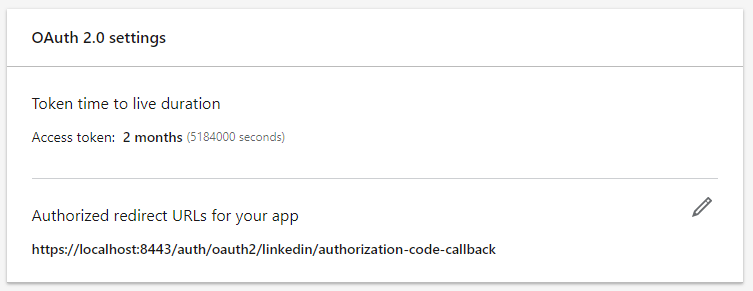
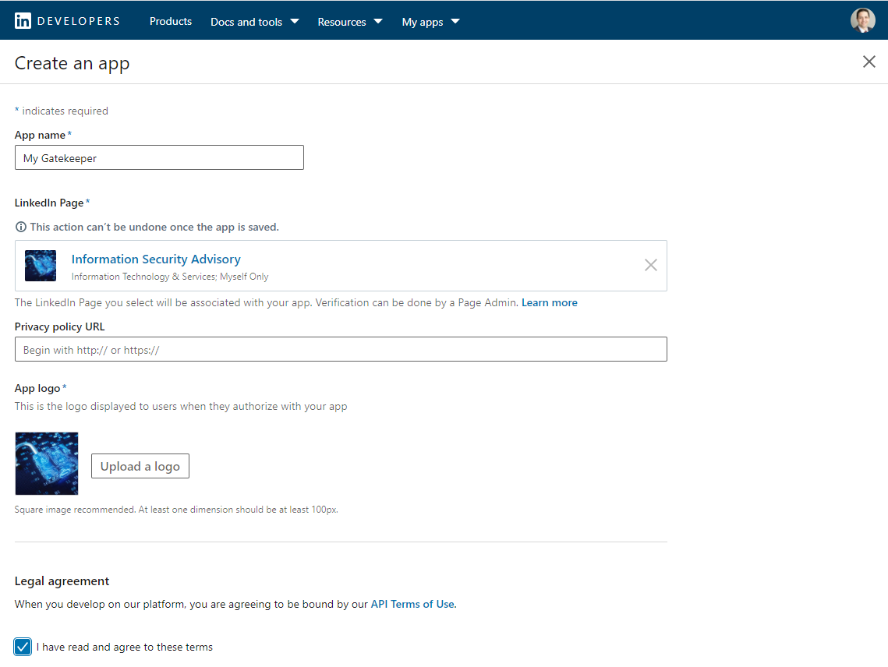
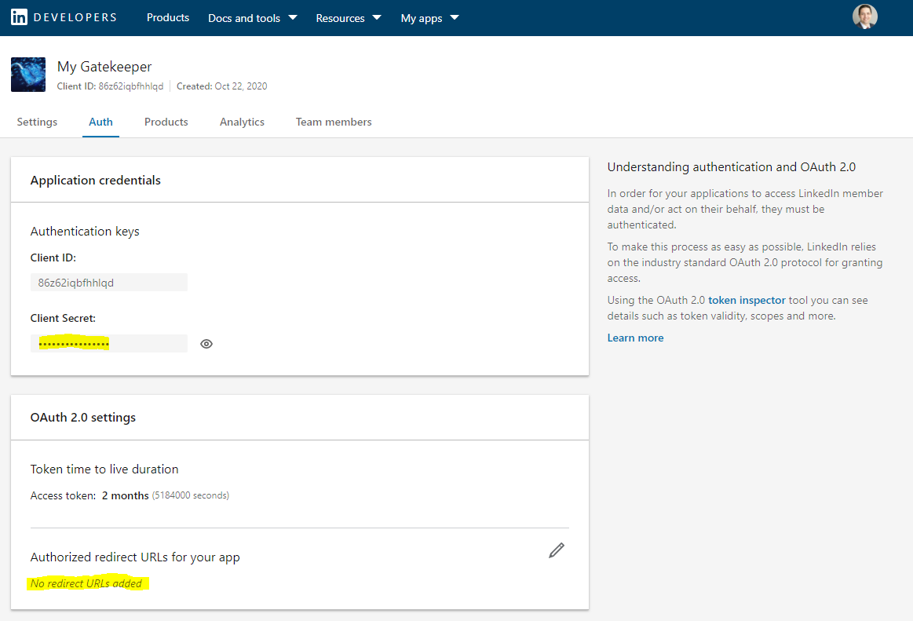
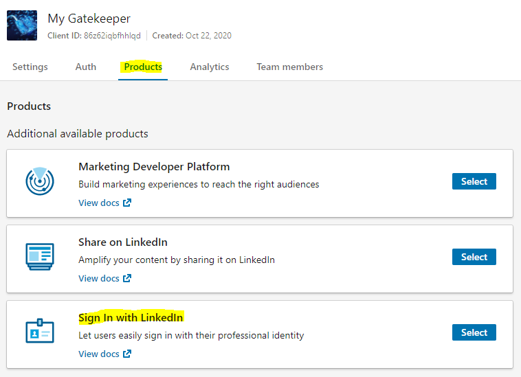

import CodeBlock from '@theme/CodeBlock';
import example from '@site/assets/conf/oauth/linkedin/Caddyfile?raw';

# LinkedIn

Use **Sign In with LinkedIn using OpenID Connect**, not the older profile/email
permission product. The named driver in [released v1.3.0](../../operations/versions.md)
uses LinkedIn discovery and validates the returned identity token. LinkedIn's
sign-in product identifies an account; it does not verify a person's real-world
identity. See [LinkedIn's current OIDC guide](https://learn.microsoft.com/en-us/linkedin/consumer/integrations/self-serve/sign-in-with-linkedin-v2).

## Register the application

Create an application in the [developer portal](https://www.linkedin.com/developers/apps),
complete its required organization/application details, and request the **Sign
In with LinkedIn using OpenID Connect** product. Copy your application's client
ID and private secret into the server's `LINKEDIN_CLIENT_ID` and
`LINKEDIN_CLIENT_SECRET`. Never put the secret into browser code.

Register exactly:

```text
https://auth.example.com/auth/oauth2/linkedin/authorization-code-callback
```

Request `openid profile email`. The older screenshots below show where
application credentials, redirects, and products were configured; current
product names differ. Their localhost callback is historical, not the callback
used by the example.

<figure className="doc-screenshot">

[](../images/oauth2_linkedin_redirect_url.png)

<figcaption>Historical LinkedIn redirect registration; use the exact public callback above.</figcaption>
</figure>
<details className="screenshot-gallery">
<summary>Preserved LinkedIn application screens</summary>

<figure className="doc-screenshot">

[](../images/oauth2_linkedin_new_app.png)

<figcaption>Historical application creation and organization details.</figcaption>
</figure>

<figure className="doc-screenshot">

[](../images/oauth2_linkedin_auth_screen.png)

<figcaption>Historical Auth tab; keep your own client secret private.</figcaption>
</figure>

<figure className="doc-screenshot">

[](../images/oauth2_linkedin_products_screen.png)

<figcaption>The old Sign In product has been replaced by Sign In with LinkedIn using OpenID Connect.</figcaption>
</figure>

</details>
## Configure AuthCrunch

<CodeBlock language="caddyfile" title="assets/conf/oauth/linkedin/Caddyfile">{example}</CodeBlock>
Set `AUTHCRUNCH_SIGNING_KEY` privately. `LINKEDIN_ALLOWED_SUB` expands before
parsing and must equal the entire observed LinkedIn subject. The example resets
provider roles and grants only that account application access. A matching email
or portal role is insufficient. LinkedIn can omit email; the bundled parser's
default email requirement can then reject login. If your application identifies
users by subject, `disable email claim check` is a deliberate provider option;
review the application's identity requirements before enabling it.

The named driver disables PKCE and nonce generation in this release while
retaining its state-bound callback and signature/issuer/audience checks. Do not
claim it has the same defaults as the generic OIDC driver. It fetches LinkedIn
UserInfo for profile data; it does not return arbitrary organization memberships
as application permissions.

## Verify and troubleshoot

Sign in through `/auth/oauth2/linkedin`, inspect `/auth/whoami?format=json`, and
record the exact subject and realm without logging access tokens. Confirm that
an intended member reaches `/app` and another valid identity is denied. A
successful provider login alone does not establish application authorization.

Check callback scheme, hostname, port, mount, and realm literally; inspect
provider errors and [diagnostic logs](../../operations/logging.md). Keep client
secrets on the server. These examples are parser-verified against the released
bundle; console registration, live provider login, consent, and production TLS
require verification in your own organization.
