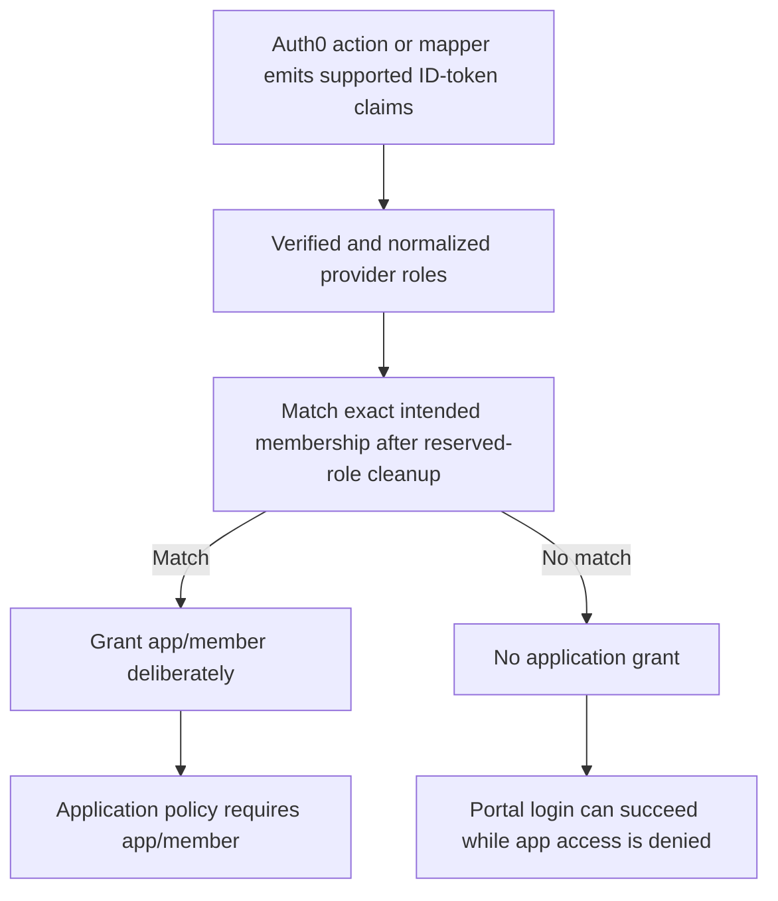

import CodeBlock from '@theme/CodeBlock';
import caddyfile from '@site/assets/conf/oauth/auth0/Caddyfile?raw';

# Auth0

Use Auth0 for sign-in and give a selected account access to your application.
This walkthrough uses the generic OIDC driver with `realm auth0`. Its exact
subject rule grants `app/member`; other eligible Auth0 users can reach the
portal but receive 403 at the protected app.

The example targets **caddy-security v1.3.0**, containing **go-authcrunch
v1.3.8**. Local OIDC fixtures verify the released executable's code exchange,
token checks, and access rules. Complete the final checks with your own Auth0
tenant; fixtures do not verify live connections, consent, or tenant policies.

## Before you start

Complete [Install and verify](../../start/install.md). You need an Auth0 tenant
where you can register applications, two test accounts in an enabled connection,
and a public HTTPS portal. This guide uses `https://auth.example.com/auth/` and
protects `/app`; replace the hostname throughout.

For the relationship between the provider, portal, and policy, see
[OAuth and OIDC providers](10-oauth2.md). Auth0 authenticates the account;
AuthCrunch's application policy decides who can reach `/app`.

## Register an Auth0 application

In the [Auth0 Dashboard](https://manage.auth0.com/), open **Applications →
Applications → Create Application**. Choose **Regular Web Applications**.
AuthCrunch exchanges the authorization code on the server using a client secret.
Follow [Auth0's application settings](https://auth0.com/docs/get-started/applications/application-settings)
with these values:

| Setting | Value |
| --- | --- |
| Application type | Regular Web Application |
| Allowed Callback URLs | `https://auth.example.com/auth/oauth2/auth0/authorization-code-callback` |
| Grant type | Authorization Code |
| ID-token signing algorithm | RS256 |
| OIDC Conformant | Enabled |

On the application's **Credentials** tab, select **Client Secret (Post)**.
The bundled driver sends `client_id` and `client_secret` in the token request's
form body (`client_secret_post`). Auth0 also offers Basic and private-key
authentication; choose Post for this configuration. See
[Auth0's credential settings](https://auth0.com/docs/get-started/applications/credentials).

Save the **Domain**, **Client ID**, and **Client Secret** for the server
environment. In the application's **Connections** settings, enable the
connection containing both test accounts. The example requests `openid email
profile`; ensure the accounts have email available to the ID token.

Use the exact HTTPS issuer from the chosen domain's
`/.well-known/openid-configuration` document. The canonical example uses a
tenant domain such as `example.us.auth0.com` and an issuer ending in `/`.
If you use a configured custom domain, fetch discovery there and use the
matching issuer consistently. The released validator compares issuer strings
literally, including the final slash. Do not mix a custom-domain login with a
different tenant-domain issuer. See
[Auth0's custom-domain configuration](https://auth0.com/docs/customize/custom-domains/configure-features-to-use-custom-domains).

## Configure AuthCrunch

Save the following as `Caddyfile`. Replace `auth.example.com` in the site
address and policy URL. The file is embedded from the
[canonical Auth0 example](https://github.com/authcrunch/authcrunch.github.io/blob/main/assets/conf/oauth/auth0/Caddyfile).

<CodeBlock language="text" title="Caddyfile">{caddyfile}</CodeBlock>

Set the environment before starting AuthCrunch:

```sh
export AUTH0_DOMAIN='YOUR_TENANT.us.auth0.com'
export AUTH0_CLIENT_ID='YOUR_AUTH0_CLIENT_ID'
export AUTH0_CLIENT_SECRET='YOUR_AUTH0_CLIENT_SECRET'
export AUTH0_ALLOWED_SUB='REPLACE_WITH_AUTH0_SUB'
export JWT_SHARED_KEY="$(openssl rand -hex 32)"
```

Use your actual domain and credentials. `AUTH0_DOMAIN` contains the hostname
only, without `https://` or a trailing slash. Leave the subject placeholder for
the first sign-in, then select the account as described below.

`{$AUTH0_DOMAIN}` and `{$AUTH0_ALLOWED_SUB}` expand while the Caddyfile is
parsed. Credentials and the shared signing key use runtime `{env.VARIABLE}`
placeholders. For a managed service, supply its protected environment and keep
the signing key stable across restarts. Keep the portal's signing key and the
policy's verification key identical.

```sh
./bin/authcrunch adapt --adapter caddyfile --config Caddyfile >/dev/null
./bin/authcrunch run --config Caddyfile
```

Adaptation checks parsing. Startup loads discovery and signing keys, requiring
outbound HTTPS connectivity. Public DNS and certificate issuance must work for
the portal hostname. The admin endpoint is disabled in this example; stop with
**Ctrl+C** and restart after changing the file or environment.

## Select the account and verify access

1. Open `/auth/`, choose **Auth0**, and sign in with the intended account.
2. Open **My identity** (`/auth/whoami`) and copy its `sub`. Confirm the account
   and `realm auth0`. The initial placeholder grants no application access.
3. Set `AUTH0_ALLOWED_SUB` to the **entire** subject. For example,
   `export AUTH0_ALLOWED_SUB='auth0|YOUR_USER_ID'` retains the connection prefix
   and pipe. Use the value from your identity page, not this illustration.
4. Stop and restart AuthCrunch, then sign out and sign in again. Select
   **Example app** or open `/app`.
5. In a separate browser session, sign in as a second eligible account and
   verify that the app denies access.

| Check | Selected account | Other eligible account |
| --- | --- | --- |
| Portal roles | `authp/user` and `app/member` | `authp/user` only |
| `/app`, `/app/`, `/app/nested` | 200, protected response | 403, no protected response |
| After portal logout | A fresh app request redirects to login | A fresh app request redirects to login |

`match sub` uses an exact comparison. A matching email, a subject prefix, or a
similarly named account does not satisfy it. Account linking or changing the
connection can change which identity is returned; review the actual subject
before updating the allowlist. Auth0's app connections and login policies are
separate from this application grant.

The first transform overwrites provider-derived roles with `authp/user`.
Only the subsequent subject rule grants `app/member`. Keep that order: an
upstream claim named `app/member` must not bypass the account allowlist or
grant portal administrator privileges.

The driver sends state, nonce, and S256 PKCE. It validates the ID token's
signature, issuer, audience, and nonce. The default email check requires email
presence; it does not enforce `email_verified`. The application grant therefore
uses `sub`, not an email-domain rule.

The portal token lasts 900 seconds in this example. Updating the allowlist does
not rewrite an already issued token; obtain a fresh token for access tests.
Portal logout clears the portal session and does not end Auth0 SSO. Use a
separate browser profile to test a different account.

After the allow/deny checks pass, replace the protected `respond` with your
application's `reverse_proxy`, keeping `authorize` before it.




## Auth0 roles and custom claims

Auth0 API permissions and a successful sign-in do not automatically grant an
AuthCrunch application role. Auth0 recommends namespaced custom claims, and
restricts names including `groups` and `roles`. See
[Auth0's custom-claim rules](https://auth0.com/docs/secure/tokens/json-web-tokens/create-custom-claims).

The bundled generic parser does not map arbitrary namespaced keys such as
`https://example.com/roles` into portal roles. Adding such a claim with an Auth0
Action, requesting an API audience, or writing `match role app-members` does
not make it an effective access rule. The example deliberately uses the exact
account subject and discards provider roles. For a larger deployment, verify
the supported claim path and its actual portal output before replacing the
subject rule and adjusting the role reset; consult
[the generic driver's claim reference](81-backend-oauth2-0000-generic.md#map-claims-to-application-permissions).

## Troubleshoot

| Symptom | Check |
| --- | --- |
| Callback mismatch | Compare Allowed Callback URLs with the public HTTPS origin, `/auth/` mount, and realm `auth0`. |
| `invalid_client` | Check the application credentials and Client Secret (Post) method. |
| No eligible connection | Enable the intended connection for the application and check its login policy. |
| Issuer validation fails | Compare discovery and ID-token `iss` with the configured issuer, including the domain and final slash. |
| Missing email rejects login | Request `email` and check the connection's account data and ID-token claims. UserInfo runs too late to satisfy this check. |
| Selected account gets 403 | Compare the complete `sub`, restart after the environment change, and sign in again. |
| A different account reaches the app | Check for another transform granting `app/member`; the policy must not allow `authp/user`. |
| Auth0 roles are absent | Check the released parser's supported claim paths; arbitrary namespaced custom claims are not extracted. |
| Sign-in resumes after logout | The upstream Auth0 session remains active. Test another account in a separate browser session. |

For token validation, optional UserInfo, and claim extraction, continue to
[Generic OpenID Connect](81-backend-oauth2-0000-generic.md).

## Agentic Prompts

Copy a prompt into your LLM to explore this topic. Each prompt prioritizes
upstream repository guidance and code over this page, and asks for version-aware
reasoning.

<div className="agentic-prompts">

<details>
<summary>Map an Auth0 identity</summary>

```text
Help me understand Auth0.

Primary authorities (take precedence over website documentation):
https://github.com/greenpau/caddy-security/blob/main/AGENTS.md
https://github.com/greenpau/caddy-security/tree/main/.codex/skills
https://github.com/greenpau/go-authcrunch/blob/main/AGENTS.md
https://github.com/greenpau/go-authcrunch/tree/main/.codex/skills
Read each repository's root AGENTS.md first, then any scoped AGENTS.md that
applies to inspected paths. Read the relevant SKILL.md files and follow their
implementation and test references.

Relevant skills to locate: configuration-oauth-providers,
oauth-identity-provider.

Secondary reference:
https://docs.authcrunch.com/docs/authenticate/oauth/backend-oauth2-0004-auth0

If a source is inaccessible, ask me to paste its relevant text. Identify the
versions your answer applies to; main may be newer than my release. Resolve
disagreements using code and tests, and flag unverified claims. Use synthetic
credentials and redacted examples; explain proposed checks before any changes.

Explain a generic OIDC Auth0 realm, tenant/custom-domain issuer, callback, and
exact subject allowlist. Compare connection/login policy with app/member
authorization. Ask for my intended account and redacted actual subject rather
than matching an email or subject prefix.
```

</details>

<details>
<summary>Review client authentication</summary>

```text
Help me understand Auth0.

Primary authorities (take precedence over website documentation):
https://github.com/greenpau/caddy-security/blob/main/AGENTS.md
https://github.com/greenpau/caddy-security/tree/main/.codex/skills
https://github.com/greenpau/go-authcrunch/blob/main/AGENTS.md
https://github.com/greenpau/go-authcrunch/tree/main/.codex/skills
Read each repository's root AGENTS.md first, then any scoped AGENTS.md that
applies to inspected paths. Read the relevant SKILL.md files and follow their
implementation and test references.

Relevant skills to locate: configuration-oauth-providers,
oauth-identity-provider.

Secondary reference:
https://docs.authcrunch.com/docs/authenticate/oauth/backend-oauth2-0004-auth0

If a source is inaccessible, ask me to paste its relevant text. Identify the
versions your answer applies to; main may be newer than my release. Resolve
disagreements using code and tests, and flag unverified claims. Use synthetic
credentials and redacted examples; explain proposed checks before any changes.

Read a confidential web-app registration for authorization code, Client Secret
Post, exact callback, and intended connections. Explain form-body token
authentication and issuer consistency. Consult current official Auth0 settings
when identifying console controls.
```

</details>

<details>
<summary>Explore roles and custom claims</summary>

```text
Help me understand Auth0.

Primary authorities (take precedence over website documentation):
https://github.com/greenpau/caddy-security/blob/main/AGENTS.md
https://github.com/greenpau/caddy-security/tree/main/.codex/skills
https://github.com/greenpau/go-authcrunch/blob/main/AGENTS.md
https://github.com/greenpau/go-authcrunch/tree/main/.codex/skills
Read each repository's root AGENTS.md first, then any scoped AGENTS.md that
applies to inspected paths. Read the relevant SKILL.md files and follow their
implementation and test references.

Relevant skills to locate: configuration-oauth-providers,
oauth-identity-provider.

Secondary reference:
https://docs.authcrunch.com/docs/authenticate/oauth/backend-oauth2-0004-auth0

If a source is inaccessible, ask me to paste its relevant text. Identify the
versions your answer applies to; main may be newer than my release. Resolve
disagreements using code and tests, and flag unverified claims. Use synthetic
credentials and redacted examples; explain proposed checks before any changes.

Compare Auth0 API permissions, namespaced custom claims, and the generic
parser’s supported role paths. Explain what this release extracts instead of
assuming a namespaced claim becomes a role. Keep raw-claim evidence and
controlled portal transformations separate.
```

</details>

<details>
<summary>Diagnose missing identity data</summary>

```text
Help me understand Auth0.

Primary authorities (take precedence over website documentation):
https://github.com/greenpau/caddy-security/blob/main/AGENTS.md
https://github.com/greenpau/caddy-security/tree/main/.codex/skills
https://github.com/greenpau/go-authcrunch/blob/main/AGENTS.md
https://github.com/greenpau/go-authcrunch/tree/main/.codex/skills
Read each repository's root AGENTS.md first, then any scoped AGENTS.md that
applies to inspected paths. Read the relevant SKILL.md files and follow their
implementation and test references.

Relevant skills to locate: configuration-oauth-providers,
oauth-identity-provider.

Secondary reference:
https://docs.authcrunch.com/docs/authenticate/oauth/backend-oauth2-0004-auth0

If a source is inaccessible, ask me to paste its relevant text. Identify the
versions your answer applies to; main may be newer than my release. Resolve
disagreements using code and tests, and flag unverified claims. Use synthetic
credentials and redacted examples; explain proposed checks before any changes.

Help me investigate connection eligibility, missing ID-token email, wrong
issuer/client, and custom roles absent from the portal. Ask for redacted claim
names/types and source version. Do not recommend accepting unsigned tokens or
broadening the app allowlist.
```

</details>

<details>
<summary>Test subject and account changes</summary>

```text
Help me understand Auth0.

Primary authorities (take precedence over website documentation):
https://github.com/greenpau/caddy-security/blob/main/AGENTS.md
https://github.com/greenpau/caddy-security/tree/main/.codex/skills
https://github.com/greenpau/go-authcrunch/blob/main/AGENTS.md
https://github.com/greenpau/go-authcrunch/tree/main/.codex/skills
Read each repository's root AGENTS.md first, then any scoped AGENTS.md that
applies to inspected paths. Read the relevant SKILL.md files and follow their
implementation and test references.

Relevant skills to locate: configuration-oauth-providers,
oauth-identity-provider.

Secondary reference:
https://docs.authcrunch.com/docs/authenticate/oauth/backend-oauth2-0004-auth0

If a source is inaccessible, ask me to paste its relevant text. Identify the
versions your answer applies to; main may be newer than my release. Resolve
disagreements using code and tests, and flag unverified claims. Use synthetic
credentials and redacted examples; explain proposed checks before any changes.

Build cases for selected subject, another account, similar subject prefix,
account-linking/connection changes, fresh login after allowlist edits, and
logout while Auth0 SSO remains. Explain what an existing portal token retains
and why a successful sign-in alone is insufficient.
```

</details>

</div>

## Source Code References

Start with the code search, then follow the parser, runtime, and tests relevant
to this topic. These links target `main`; use GitHub's branch/tag selector to
compare them with your installed release.

1. [Search this topic in both repositories](https://github.com/search?q=%28repo%3Agreenpau%2Fgo-authcrunch%20OR%20repo%3Agreenpau%2Fcaddy-security%29%20%28generic%20OR%20app_metadata%20OR%20claim_parser%29&type=code)
   — searches topic-specific symbols and paths across both codebases.
2. [caddy-security: caddyfile_identity_provider_oauth.go](https://github.com/greenpau/caddy-security/blob/main/caddyfile_identity_provider_oauth.go)
   — adapts OAuth/OIDC provider settings, scopes, endpoints, and trust options.
3. [go-authcrunch: pkg/idp/oauth/config.go](https://github.com/greenpau/go-authcrunch/blob/main/pkg/idp/oauth/config.go)
   — validates generic and named-driver defaults and endpoint settings.
4. [go-authcrunch: pkg/idp/oauth/provider.go](https://github.com/greenpau/go-authcrunch/blob/main/pkg/idp/oauth/provider.go)
   — loads discovery metadata, provider readiness, and driver setup.
5. [go-authcrunch: pkg/idp/oauth/authenticate.go](https://github.com/greenpau/go-authcrunch/blob/main/pkg/idp/oauth/authenticate.go)
   — handles authorization callbacks, token exchange, and identity completion.
6. [go-authcrunch: pkg/idp/oauth/claim_parser.go](https://github.com/greenpau/go-authcrunch/blob/main/pkg/idp/oauth/claim_parser.go)
   — maps supported token claims into the normalized provider identity.
7. [go-authcrunch: pkg/idp/oauth/claim_parser_test.go](https://github.com/greenpau/go-authcrunch/blob/main/pkg/idp/oauth/claim_parser_test.go)
   — tests supported claim paths and rejected value shapes.
