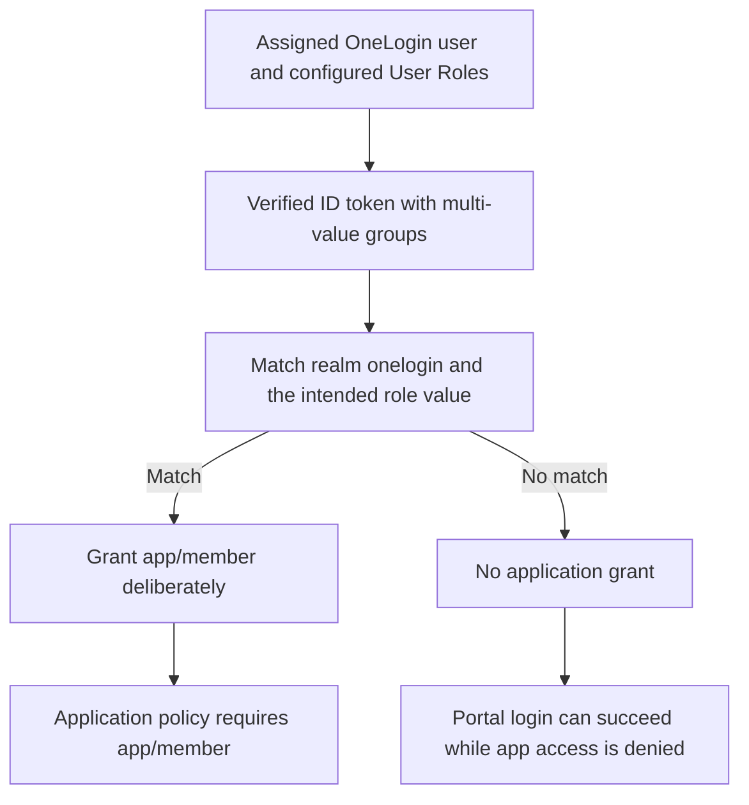

import CodeBlock from '@theme/CodeBlock';
import caddyfile from '@site/assets/conf/oauth/onelogin/Caddyfile?raw';

# OneLogin

Sign in through OneLogin and allow an `app-members` role to reach your
application. OneLogin publishes the role through an OIDC `groups` claim;
AuthCrunch turns it into `app/member`. App assignment permits sign-in, while
the AuthCrunch policy requires the application role.

This guide targets **caddy-security v1.3.0**, containing **go-authcrunch
v1.3.8**, and OneLogin's **v2 OIDC endpoints**. Local fixtures verify the released
executable's code exchange, claim extraction, and allow/deny rules. Complete
the final checks with your organization to verify actual assignment, group
mapping, and login policies.

## Before you start

Complete [Install and verify](../../start/install.md). You need a OneLogin
administrator, a role named `app-members`, and two test accounts: a member
and a nonmember. Use a public HTTPS portal at `https://auth.example.com/auth/`
and replace that hostname throughout the configuration and registration.

Read [OAuth and OIDC providers](10-oauth2.md) for the provider, portal, and
policy relationship. This integration uses `driver generic` and
`realm onelogin`; the realm determines the callback path.

## Register an OIDC web application

In the OneLogin administration panel, open **Applications → Applications →
Add App**. Find **OpenId Connect (OIDC)**, choose a display name, and save it.
Configure the application with these values:

| Setting | Value |
| --- | --- |
| Configuration → Login URL | `https://auth.example.com/auth/` |
| Configuration → Redirect URIs | `https://auth.example.com/auth/oauth2/onelogin/authorization-code-callback` |
| SSO → Application Type | Web |
| SSO → Token Endpoint Authentication Method | POST (`client_secret_post`) |
| Flow used by AuthCrunch | Authorization Code with S256 PKCE |

On **SSO**, save the client ID and client secret for the server environment.
Select POST because AuthCrunch sends both credentials in the form body. The
[OneLogin connector walkthrough](https://developers.onelogin.com/docs/quickstart/authentication/nodejs/)
shows this registration pattern; use this guide's callback and v2 discovery
URL rather than its older v1 sample endpoints.

Assign both test users to the application, directly or through your intended
OneLogin roles. Keep only one in `app-members`. This lets the nonmember reach
AuthCrunch so you can test its denial rule separately from OneLogin's assignment
boundary. A user who cannot sign in to the OneLogin app never reaches that test.

### Use the v2 discovery document

Open **OpenID Provider Configuration Information** on the application's SSO
tab. For a tenant such as `example.onelogin.com`, the v2 discovery URL is:

```text
https://example.onelogin.com/oidc/2/.well-known/openid-configuration
```

Copy the document's exact `issuer`; the usual v2 value is
`https://example.onelogin.com/oidc/2`, without a final slash. The generic driver
discovers authorization, token, and signing-key endpoints from that document.
Use your tenant's values consistently. The older regional
`openid-connect.onelogin.com/oidc` examples describe a different endpoint
layout. See [OneLogin's v2 discovery reference](https://developers.onelogin.com/docs/openid-connect/api/provider-config/).




## Map OneLogin roles to groups

The Caddyfile requests `openid email profile groups`. Configure the app's
**Parameters → Groups** mapping so the token actually contains the role:

1. Set **Default if no value** to **User Roles**.
2. Select **Semicolon Delimited input (Multi-value output)** alongside it.
3. Save, then ensure your member belongs to `app-members`.

OneLogin documents this mapping in its
[groups scope reference](https://developers.onelogin.com/docs/openid-connect/scopes/).
It emits an array of role names. For the selected account, the ID token should
include a value such as:

```json
{
  "sub": "12345678",
  "email": "alice@example.com",
  "groups": ["app-members"]
}
```

This is a claim illustration, not a complete token. Verify email and groups
in the **ID token**, not just UserInfo. The canonical example does not enable
a UserInfo fetch. The generic parser combines ID-token groups into portal
roles before the transforms run. Group matching is exact and case sensitive:
`App-Members` or `app-members-extra` does not match `app-members`.

The first transform clears provider-derived `authp/*` and `app/member` roles.
The following transforms grant portal access and, only for `app-members`, the
application role. Keep this order so a OneLogin role named `app/member` cannot
bypass group membership and a role named `authp/admin` cannot grant portal
administrator access. The required `app-members` group remains available.

The default email-presence check also requires `email` in the ID token. Confirm
the accounts have email data and that the app releases it for the requested
scopes. The access rule uses groups; it does not rely on an email-domain match
or on the `email_verified` flag.

## Configure AuthCrunch

Save the following as `Caddyfile`. Replace `auth.example.com` in the site
address and policy URL. The file is embedded from the
[canonical OneLogin example](https://github.com/authcrunch/authcrunch.github.io/blob/main/assets/conf/oauth/onelogin/Caddyfile).

<CodeBlock language="text" title="Caddyfile">{caddyfile}</CodeBlock>

Set the environment before starting AuthCrunch:

```sh
export ONELOGIN_DOMAIN='YOUR_TENANT.onelogin.com'
export ONELOGIN_CLIENT_ID='YOUR_ONELOGIN_CLIENT_ID'
export ONELOGIN_CLIENT_SECRET='YOUR_ONELOGIN_CLIENT_SECRET'
export JWT_SHARED_KEY="$(openssl rand -hex 32)"
```

Use your actual tenant and credentials. `ONELOGIN_DOMAIN` is a hostname only,
without `https://`, `/oidc/2`, or a trailing slash. It expands at Caddyfile
parse time through `{$ONELOGIN_DOMAIN}`. Credentials and the signing key use
runtime `{env.VARIABLE}` placeholders. For a managed service, use its protected
environment and keep the signing key stable across restarts.

```sh
./bin/authcrunch adapt --adapter caddyfile --config Caddyfile >/dev/null
./bin/authcrunch run --config Caddyfile
```

Adaptation checks parsing. Startup loads discovery and signing keys, requiring
outbound HTTPS connectivity. Public DNS and certificate issuance must work for
the portal hostname. The example disables the admin endpoint; stop with
**Ctrl+C** and restart after configuration or environment changes.

## Verify member and nonmember access

1. Open `/app`, follow the login redirect, and choose **OneLogin**.
2. Sign in as the assigned member. Open **My identity** (`/auth/whoami`), and
   confirm `realm onelogin` with `app-members`, `authp/user`, and `app/member`
   in the portal roles.
3. Select **Example app**, then test `/app/` and `/app/nested` as well.
4. In a separate browser session, sign in as the assigned nonmember. Confirm
   portal access and a denied app request.
5. Sign out through `/auth/logout`. A fresh app request should redirect to
   login; OneLogin SSO may still sign the account in without another prompt.

| Check | Assigned member | Assigned nonmember |
| --- | --- | --- |
| Portal roles | Includes `app-members`, `authp/user`, `app/member` | Has `authp/user`, lacks `app/member` |
| `/app`, `/app/`, `/app/nested` | 200, protected response | 403, no protected response |
| Missing application group | No `app/member`; app denied | No `app/member`; app denied |

The driver validates ID-token signature, issuer, audience, and nonce, and sends
state and S256 PKCE. A missing or mismatched group must leave the app denied.
Adding `user_info_fields groups` changes the claim source: nonempty roles
returned by UserInfo replace token-derived roles in this release. Verify that
variant separately; see the [generic driver's UserInfo reference](81-backend-oauth2-0000-generic.md#email-and-userinfo).

The example issues a 900-second portal token. Removing a OneLogin role or
changing the mapping does not rewrite an already issued token. Sign out and
sign in again when testing a change. Portal logout clears the portal session;
it does not invoke OneLogin's upstream logout endpoint.

After the allow/deny checks pass, replace the protected `respond` with your
application's `reverse_proxy`, keeping `authorize` before it. Restrict OneLogin
app assignment to the intended sign-in population and retain the explicit
AuthCrunch application policy.

## Troubleshoot

| Symptom | Check |
| --- | --- |
| Redirect URI rejected | Compare the public HTTPS origin, `/auth/` mount, and realm `onelogin` with the app's Redirect URIs. |
| `invalid_client` | Check the client credentials and Token Endpoint Authentication Method POST. |
| OneLogin denies sign-in | Check app assignment and the user's OneLogin policy before investigating AuthCrunch. |
| Discovery or issuer fails | Use the tenant's v2 discovery and exact `issuer`, including `/oidc/2` and slash placement. |
| Groups missing from portal roles | Request `groups`, map Groups to User Roles with multi-value output, and inspect the ID token. |
| A member gets 403 | Compare the exact role spelling, check the transform's realm, and obtain a fresh portal token. |
| A nonmember reaches the app | Check every transform granting `app/member`; keep `authp/user` out of the policy's allow list. |
| Missing email rejects login | Verify email in the ID token; a later UserInfo response does not satisfy the earlier presence check. |
| Sign-in resumes after logout | The upstream OneLogin SSO session remains active; use a separate browser profile for another account. |

For supported claims, PKCE, and token validation, continue to
[Generic OpenID Connect](81-backend-oauth2-0000-generic.md).

## Agentic Prompts

Copy a prompt into your LLM to explore this topic. Each prompt prioritizes
upstream repository guidance and code over this page, and asks for version-aware
reasoning.

<div className="agentic-prompts">

<details>
<summary>Trace OneLogin role mapping</summary>

```text
Help me understand OneLogin.

Primary authorities (take precedence over website documentation):
https://github.com/greenpau/caddy-security/blob/main/AGENTS.md
https://github.com/greenpau/caddy-security/tree/main/.codex/skills
https://github.com/greenpau/go-authcrunch/blob/main/AGENTS.md
https://github.com/greenpau/go-authcrunch/tree/main/.codex/skills
Read each repository's root AGENTS.md first, then any scoped AGENTS.md that
applies to inspected paths. Read the relevant SKILL.md files and follow their
implementation and test references.

Relevant skills to locate: configuration-oauth-providers,
oauth-identity-provider.

Secondary reference:
https://docs.authcrunch.com/docs/authenticate/oauth/backend-oauth2-0005-onelogin

If a source is inaccessible, ask me to paste its relevant text. Identify the
versions your answer applies to; main may be newer than my release. Resolve
disagreements using code and tests, and flag unverified claims. Use synthetic
credentials and redacted examples; explain proposed checks before any changes.

Explain OneLogin app assignment, provider roles emitted as OIDC groups, portal
transforms, and app access. Use one assigned member and one assigned
nonmember. Distinguish OneLogin role names from reserved AuthCrunch roles.
```

</details>

<details>
<summary>Compare discovery layouts</summary>

```text
Help me understand OneLogin.

Primary authorities (take precedence over website documentation):
https://github.com/greenpau/caddy-security/blob/main/AGENTS.md
https://github.com/greenpau/caddy-security/tree/main/.codex/skills
https://github.com/greenpau/go-authcrunch/blob/main/AGENTS.md
https://github.com/greenpau/go-authcrunch/tree/main/.codex/skills
Read each repository's root AGENTS.md first, then any scoped AGENTS.md that
applies to inspected paths. Read the relevant SKILL.md files and follow their
implementation and test references.

Relevant skills to locate: configuration-oauth-providers,
oauth-identity-provider.

Secondary reference:
https://docs.authcrunch.com/docs/authenticate/oauth/backend-oauth2-0005-onelogin

If a source is inaccessible, ask me to paste its relevant text. Identify the
versions your answer applies to; main may be newer than my release. Resolve
disagreements using code and tests, and flag unverified claims. Use synthetic
credentials and redacted examples; explain proposed checks before any changes.

Review the exact OneLogin v2 issuer/discovery document against older regional
layouts. Explain trailing-slash equality, callback realm, confidential client,
Client Secret Post, and S256 PKCE. Use current official OneLogin configuration
material for registration controls.
```

</details>

<details>
<summary>Understand claim-source choice</summary>

```text
Help me understand OneLogin.

Primary authorities (take precedence over website documentation):
https://github.com/greenpau/caddy-security/blob/main/AGENTS.md
https://github.com/greenpau/caddy-security/tree/main/.codex/skills
https://github.com/greenpau/go-authcrunch/blob/main/AGENTS.md
https://github.com/greenpau/go-authcrunch/tree/main/.codex/skills
Read each repository's root AGENTS.md first, then any scoped AGENTS.md that
applies to inspected paths. Read the relevant SKILL.md files and follow their
implementation and test references.

Relevant skills to locate: configuration-oauth-providers,
oauth-identity-provider.

Secondary reference:
https://docs.authcrunch.com/docs/authenticate/oauth/backend-oauth2-0005-onelogin

If a source is inaccessible, ask me to paste its relevant text. Identify the
versions your answer applies to; main may be newer than my release. Resolve
disagreements using code and tests, and flag unverified claims. Use synthetic
credentials and redacted examples; explain proposed checks before any changes.

Compare groups and email in the ID token with enabling generic UserInfo
groups. Inspect replacement/merge behavior in my release before predicting
roles. Explain why requesting a groups scope does not itself produce the
intended values.
```

</details>

<details>
<summary>Diagnose sign-in and denial</summary>

```text
Help me understand OneLogin.

Primary authorities (take precedence over website documentation):
https://github.com/greenpau/caddy-security/blob/main/AGENTS.md
https://github.com/greenpau/caddy-security/tree/main/.codex/skills
https://github.com/greenpau/go-authcrunch/blob/main/AGENTS.md
https://github.com/greenpau/go-authcrunch/tree/main/.codex/skills
Read each repository's root AGENTS.md first, then any scoped AGENTS.md that
applies to inspected paths. Read the relevant SKILL.md files and follow their
implementation and test references.

Relevant skills to locate: configuration-oauth-providers,
oauth-identity-provider.

Secondary reference:
https://docs.authcrunch.com/docs/authenticate/oauth/backend-oauth2-0005-onelogin

If a source is inaccessible, ask me to paste its relevant text. Identify the
versions your answer applies to; main may be newer than my release. Resolve
disagreements using code and tests, and flag unverified claims. Use synthetic
credentials and redacted examples; explain proposed checks before any changes.

Help me separate assignment rejection, token-authentication mismatch, wrong
discovery issuer, missing group/email, and AuthCrunch 403. Ask for redacted
normalized roles and configuration. Preserve issuer/audience/signature/nonce
checks while identifying the mismatched boundary.
```

</details>

<details>
<summary>Verify changes with fresh identity</summary>

```text
Help me understand OneLogin.

Primary authorities (take precedence over website documentation):
https://github.com/greenpau/caddy-security/blob/main/AGENTS.md
https://github.com/greenpau/caddy-security/tree/main/.codex/skills
https://github.com/greenpau/go-authcrunch/blob/main/AGENTS.md
https://github.com/greenpau/go-authcrunch/tree/main/.codex/skills
Read each repository's root AGENTS.md first, then any scoped AGENTS.md that
applies to inspected paths. Read the relevant SKILL.md files and follow their
implementation and test references.

Relevant skills to locate: configuration-oauth-providers,
oauth-identity-provider.

Secondary reference:
https://docs.authcrunch.com/docs/authenticate/oauth/backend-oauth2-0005-onelogin

If a source is inaccessible, ask me to paste its relevant text. Identify the
versions your answer applies to; main may be newer than my release. Resolve
disagreements using code and tests, and flag unverified claims. Use synthetic
credentials and redacted examples; explain proposed checks before any changes.

Create tests for intended role, nonmember, similarly named role, reserved-role
injection, removed membership, and portal versus provider logout. Explain why
old portal credentials retain issued claims until their validation lifecycle
ends.
```

</details>

</div>

## Source Code References

Start with the code search, then follow the parser, runtime, and tests relevant
to this topic. These links target `main`; use GitHub's branch/tag selector to
compare them with your installed release.

1. [Search this topic in both repositories](https://github.com/search?q=%28repo%3Agreenpau%2Fgo-authcrunch%20OR%20repo%3Agreenpau%2Fcaddy-security%29%20%28generic%20OR%20groups%20OR%20user_info_fields%29&type=code)
   — searches topic-specific symbols and paths across both codebases.
2. [caddy-security: caddyfile_identity_provider_oauth.go](https://github.com/greenpau/caddy-security/blob/main/caddyfile_identity_provider_oauth.go)
   — adapts OAuth/OIDC provider settings, scopes, endpoints, and trust options.
3. [go-authcrunch: pkg/idp/oauth/provider.go](https://github.com/greenpau/go-authcrunch/blob/main/pkg/idp/oauth/provider.go)
   — loads discovery metadata, provider readiness, and driver setup.
4. [go-authcrunch: pkg/idp/oauth/jwt.go](https://github.com/greenpau/go-authcrunch/blob/main/pkg/idp/oauth/jwt.go)
   — checks upstream token signatures, issuer, audience, and transaction trust.
5. [go-authcrunch: pkg/idp/oauth/claim_parser.go](https://github.com/greenpau/go-authcrunch/blob/main/pkg/idp/oauth/claim_parser.go)
   — maps supported token claims into the normalized provider identity.
6. [go-authcrunch: pkg/idp/oauth/user_info.go](https://github.com/greenpau/go-authcrunch/blob/main/pkg/idp/oauth/user_info.go)
   — fetches explicitly selected generic UserInfo fields and roles.
7. [go-authcrunch: pkg/idp/oauth/claim_parser_test.go](https://github.com/greenpau/go-authcrunch/blob/main/pkg/idp/oauth/claim_parser_test.go)
   — tests supported claim paths and rejected value shapes.
