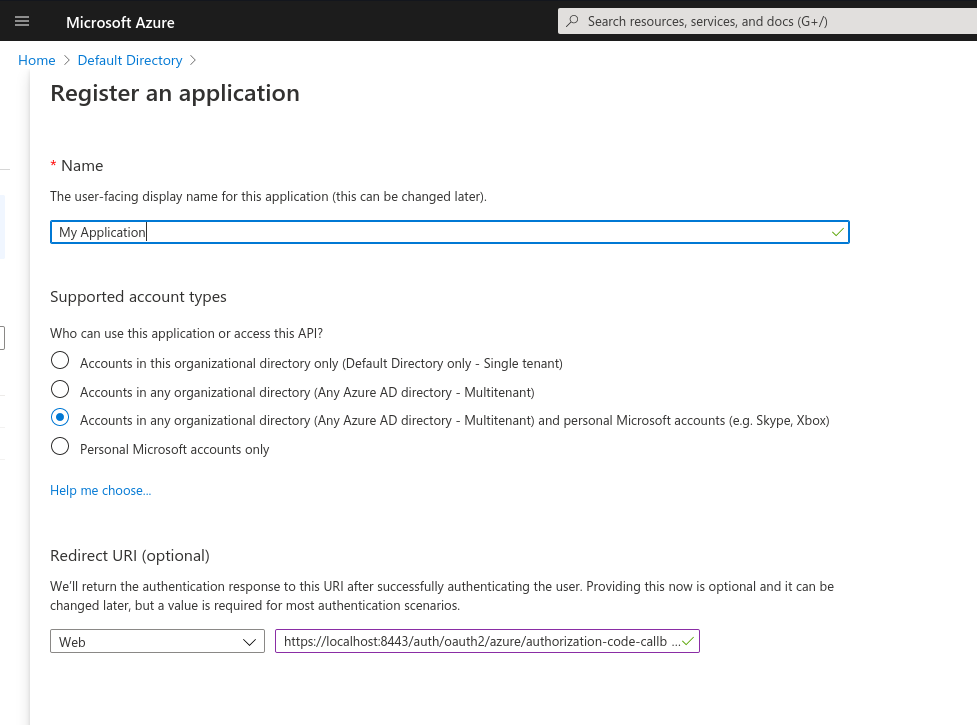
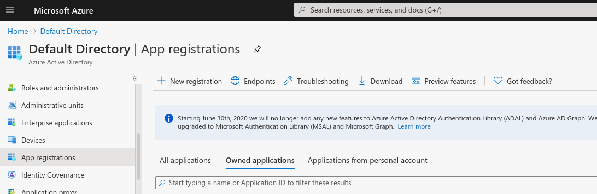
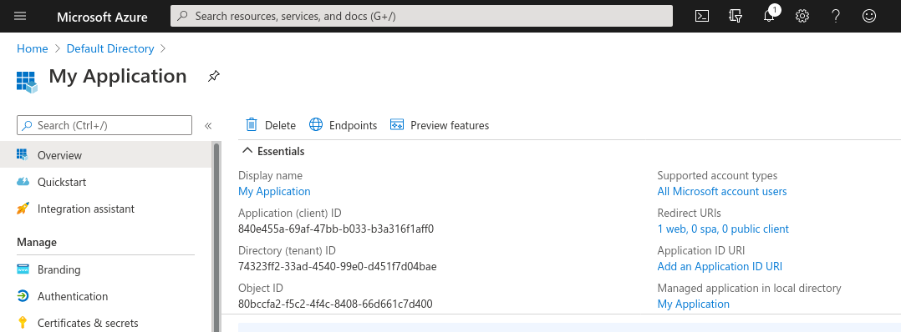
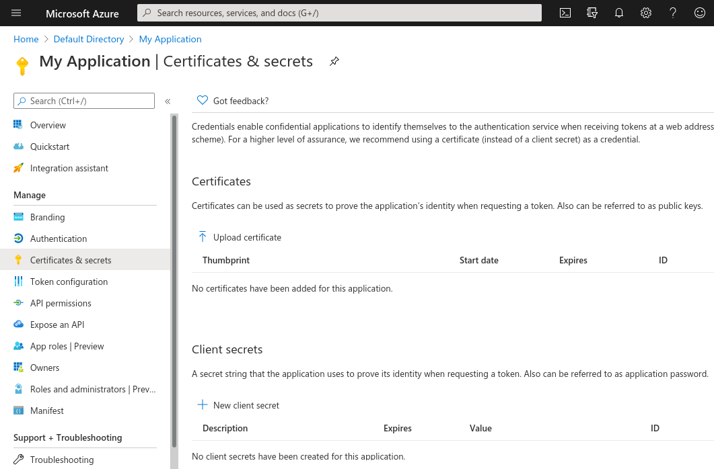
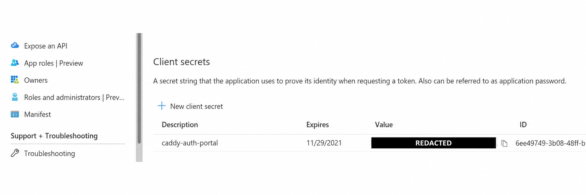

import CodeBlock from '@theme/CodeBlock';
import caddyfile from '@site/assets/conf/oauth/azure/Caddyfile?raw';

<span id="microsoft-oauth" />

# Microsoft Entra ID

Use an Entra app role to decide who can reach your application. This walkthrough
connects one workforce tenant, grants ordinary portal access to signed-in users,
and requires the `App.Access` role for `/app`.

It targets **caddy-security v1.3.0** with **go-authcrunch v1.3.8**. The configuration
keyword remains `driver azure`. Local OIDC fixtures check the released driver
and policies; complete the login tests in your own tenant to verify consent,
assignments, and Conditional Access.

## Before you start

Complete [Install and verify](../../start/install.md). You need permission to
register an application and manage its enterprise application's assignments,
two test users, and a public HTTPS portal. This example uses
`https://auth.example.com/auth/`; replace the hostname throughout.

The main walkthrough uses one Microsoft Entra workforce tenant in the public
cloud. [Other account types](#other-account-types) have different requirements.
The [OAuth and OIDC overview](10-oauth2.md) explains how the provider, portal, and
application policy fit together.

## Register the application

In the [Microsoft Entra admin center](https://entra.microsoft.com/), select the
correct directory, then open **Entra ID → App registrations → New registration**.
Use these settings:

| Setting | Value |
| --- | --- |
| Name | A recognizable application name, such as AuthCrunch Example |
| Supported account types | Accounts in this organizational directory only |
| Redirect platform | Web |
| Redirect URI | `https://auth.example.com/auth/oauth2/azure/authorization-code-callback` |

<figure className="doc-screenshot">

[](../images/oauth2_azure_new_application_details.png)

<figcaption>Earlier Azure portal: this capture selected a broader account population. For the workforce walkthrough, choose Accounts in this organizational directory only and use the public callback above. Select the image to view it at full size.</figcaption>
</figure>


After registration, copy **Application (client) ID** and **Directory (tenant) ID**
from **Overview**. Use the directory's GUID for `ENTRA_TENANT_ID`. The callback's
`azure` is the AuthCrunch realm, not the tenant ID. See
[Microsoft's app registration guide](https://learn.microsoft.com/en-us/entra/identity-platform/quickstart-register-app).

<details className="screenshot-gallery">
<summary>Screenshots: locate app registration identifiers</summary>

Microsoft now calls Azure Active Directory Microsoft Entra ID. The earlier screens remain useful for locating app registrations and distinguishing the application ID from the directory ID.

<figure className="doc-screenshot">

[](../images/oauth2_azure_new_app.png)

<figcaption>Select the intended directory and create or open the application registration. Select the image to view it at full size.</figcaption>
</figure>
<figure className="doc-screenshot">

[](../images/oauth2_azure_application_id.png)

<figcaption>Copy your Application (client) ID and Directory (tenant) ID; these identifiers are not client secrets. Select the image to view it at full size.</figcaption>
</figure>

</details>

Under **Certificates & secrets → Client secrets**, create a secret and store its
**Value**, not its Secret ID. Supply that value only to the AuthCrunch server.
Track its expiration in your deployment's credential process. The example uses
server-side authorization code flow with a client secret and S256 PKCE; it does
not require the implicit-grant checkboxes or a public-client flow. See
[Microsoft's authorization code flow](https://learn.microsoft.com/en-us/entra/identity-platform/v2-oauth2-auth-code-flow).

<details className="screenshot-gallery">
<summary>Screenshots: create and save a client secret</summary>

The credential value in the second screenshot has been redacted. Copy the Value of your newly created credential into the server environment, rather than its Secret ID.

<figure className="doc-screenshot">

[](../images/oauth2_azure_secrets.png)

<figcaption>Create a client secret for the registered application. Select the image to view it at full size.</figcaption>
</figure>
<figure className="doc-screenshot">

[](../images/oauth2_azure_client_secret-redacted.png)

<figcaption>Earlier client secret list, with the credential value redacted. The Value and ID columns serve different purposes. Select the image to view it at full size.</figcaption>
</figure>

</details>

## Define and assign application access

In this app registration, open **App roles → Create app role**:

| Field | Value |
| --- | --- |
| Display name | Example app member |
| Allowed member types | Users/Groups |
| Value | `App.Access` |
| Description | Can use the example application |
| Enabled | Yes |

The role's **Value** is the string matched by AuthCrunch. Its display name and
generated role ID are different values.

Open **Entra ID → Enterprise apps**, select the corresponding enterprise
application, then **Users and groups → Add user/group**. Assign Alice to
**Example app member** and leave Bob without that role. For this sign-in app,
Entra emits the assigned value in the **ID token's `roles` claim**. See
[Microsoft's app role guide](https://learn.microsoft.com/en-us/entra/identity-platform/howto-add-app-roles-in-apps).

| Stage | Value |
| --- | --- |
| Entra ID token | `roles: ["App.Access"]` |
| Portal transform | Matches realm `azure` and role `App.Access` |
| AuthCrunch token | Adds `app/member` |
| Application policy | Requires `app/member` |

Review the enterprise application's **Properties → Assignment required?**.
When it is **Yes**, Entra can reject an unassigned user before AuthCrunch receives
a token. When it is **No**, an otherwise eligible user can sign in without an
app role, letting you verify AuthCrunch's 403 response. Keep your organization's
intended setting; do not broaden sign-in just to reproduce a test. A separate
non-access role can admit a test user without granting `App.Access` when
assignment is required. Use ordinary test accounts rather than tenant admins.
See [Entra assignment behavior](https://learn.microsoft.com/en-us/entra/identity/enterprise-apps/what-is-access-management).

## Configure AuthCrunch

Save this as `Caddyfile` and replace `auth.example.com` in the site address and
policy URL. The complete file is embedded from the
[canonical Entra example](https://github.com/authcrunch/authcrunch.github.io/blob/main/assets/conf/oauth/azure/Caddyfile).

<CodeBlock language="text" title="Caddyfile">{caddyfile}</CodeBlock>

The first transform removes provider-derived `authp/*` and `app/member` roles.
The following transforms grant portal access and translate `App.Access` into
app access. Keep that order so another Entra app role named `app/member` cannot
bypass the intended assignment and `authp/admin` cannot grant portal
administration. The required `App.Access` role remains available.

Set the environment:

```sh
export ENTRA_TENANT_ID='YOUR_DIRECTORY_TENANT_GUID'
export ENTRA_CLIENT_ID='YOUR_APPLICATION_CLIENT_ID'
export ENTRA_CLIENT_SECRET='YOUR_CLIENT_SECRET_VALUE'
export JWT_SHARED_KEY="$(openssl rand -hex 32)"
```

`{$ENTRA_TENANT_ID}` expands when the Caddyfile is parsed. The credentials and
shared signing key use runtime `{env.VARIABLE}` placeholders. For a managed
service, use its protected environment and preserve the signing key across
restarts. Never put a real client secret in the Caddyfile or browser code.

The tenant ID selects the discovery document at
`https://login.microsoftonline.com/TENANT_GUID/v2.0/.well-known/openid-configuration`.
Inspect that document from the AuthCrunch host and confirm its issuer identifies
your directory. The driver discovers the authorization, token, and signing-key
endpoints and validates the ID token against the client ID and exact issuer.

```sh
./bin/authcrunch adapt --adapter caddyfile --config Caddyfile >/dev/null
./bin/authcrunch run --config Caddyfile
```

Adaptation verifies syntax; startup contacts the discovery/key endpoints. The
host needs outbound HTTPS, public DNS, and working certificate issuance for the
portal. The example disables the admin endpoint; stop with **Ctrl+C** and
restart after edits.

### Why email is optional here

Entra does not guarantee an `email` claim for every account. The example requests
`openid email profile` but uses **app roles**, not email, to authorize access.
It therefore includes `email claim check disabled` in the provider block.
Signature, issuer, audience, state, nonce, and PKCE checks remain enabled.

An optional email claim can improve display information, but requesting it cannot
create an address the account does not have. `preferred_username` is not a
substitute for a verified email, and this driver's claim parser does not copy it,
`oid`, or `tid` into the portal token. The portal `sub` comes from the provider's
app-specific subject. See [Entra's ID-token claims](https://learn.microsoft.com/en-us/entra/identity-platform/id-token-claims-reference)
and the [released parser](https://github.com/greenpau/go-authcrunch/blob/v1.3.8/pkg/idp/oauth/claim_parser.go).

If another portal feature or transform requires email, configure and verify that
claim separately. Removing `email claim check disabled` restores the driver's
email-presence requirement; it does not verify ownership of an address.

## Verify sign-in and denial

1. Open `https://auth.example.com/app` and choose **Microsoft Entra ID**.
2. Sign in as Alice and complete any tenant consent or Conditional Access steps.
3. Open **My identity** (`/auth/whoami`). Confirm realm `azure` and roles
   `App.Access`, `authp/user`, and `app/member`.
4. Select **Example app** or reopen `/app`. Expect the protected response.
5. Use a separate browser session for Bob. If Entra admits him without
   `App.Access`, verify a 403 on `/app`, `/app/`, and `/app/nested`. An Entra
   assignment rejection is a separate, earlier boundary.

Removing an assignment does not rewrite an existing AuthCrunch token. This
example uses a 900-second token lifetime; obtain a new token when testing changed
roles. Portal sign-out does not end the Microsoft SSO session in this
configuration, so use isolated browser sessions to test different users.

After these checks, replace the protected `respond` with your application's
`reverse_proxy`, keeping `authorize` before it and both `/app` matchers.

## Group claims as an alternative

If your deployment uses group IDs, configure the app registration's
**Token configuration → Add groups claim** and include the needed groups in the
ID token. With the default format, values are **group object IDs**, not display
names. Replace the `App.Access` transform with a matcher for the exact emitted ID:

```text
transform user {
    match realm azure
    match role "YOUR_GROUP_OBJECT_ID"
    action add role app/member
}
```

AuthCrunch combines the ID token's `groups` into portal roles. Keeping both the
group and app-role transforms grants access through either rule. To require
both, put both matchers in one transform. See
[Microsoft's group-claim configuration](https://learn.microsoft.com/en-us/entra/identity-platform/optional-claims#configure-groups-optional-claims).

Microsoft limits group lists in JWTs to 200 entries, including nested groups.
Over that limit, the token can contain an overage indicator instead of the
list. **This release does not resolve Entra group overage through Microsoft
Graph.** A missing group must not grant app access; prefer the explicit app role
or a suitably limited group claim. Adding Graph permissions alone does not
implement the missing lookup.

## Other account types

| Account population | Configuration boundary |
| --- | --- |
| One workforce tenant | Use the directory GUID as in this walkthrough. Guest users still need the intended assignment and app role. |
| Multiple workforce tenants | `organizations` and `common` discovery return a templated issuer. This release compares issuer strings literally and does not implement tenant-template validation. Do not use the driver's default `common` as a working multitenant configuration. |
| Personal Microsoft accounts (Live, Xbox, Outlook.com) | Register an app that supports personal accounts and use `tenant_id consumers`. Use an explicit account policy, not the workforce app-role setup above. |

The public `consumers` discovery document supplies the fixed Microsoft-account
issuer. To adapt the example for personal accounts, replace `{$ENTRA_TENANT_ID}`
with `consumers` and replace the `App.Access` transform with:

```text
transform user {
    match realm azure
    match sub "REPLACE_WITH_PERSONAL_ACCOUNT_SUB"
    action add role app/member
}
```

Sign in to the portal first, copy the intended account's `sub` from
`/auth/whoami`, update the matcher, restart, and log in again. Entra subjects are
specific to the app registration. Check an unselected account is denied. Keep
the email-presence exception if the account does not supply email.

Microsoft documents [tenant and issuer validation](https://learn.microsoft.com/en-us/entra/identity-platform/access-tokens#validate-the-issuer);
the release's [validator](https://github.com/greenpau/go-authcrunch/blob/v1.3.8/pkg/idp/oauth/validator.go)
explains the exact-match limit. An app registration accepting more account types
does not add multitenant validation to this driver. External ID customer tenants,
B2C policies, sovereign clouds, and live personal-account consent are outside the
validated walkthrough.

## Troubleshoot

| Symptom | Check |
| --- | --- |
| `AADSTS50011` / redirect mismatch | Register the exact Web callback, including `/auth/` and realm `azure`. |
| Client authentication fails | Use the secret Value rather than Secret ID, the correct client ID, and an unexpired credential. |
| Issuer contains `{tenantid}` | Set a concrete directory GUID instead of `common` or `organizations`; do not disable token checks. |
| Alice gets 403 | Verify her assignment to this enterprise application, role Value `App.Access`, and a fresh ID token for this client. |
| Bob is blocked by Entra | Check Assignment required and tenant policy; this is earlier than AuthCrunch's app policy. |
| An unassigned user reaches `/app` | Check for another grant of `app/member` or a policy that allows `authp/user`. |
| Email is missing | Expected for some accounts; the example does not authorize by email. Check dependent portal features separately. |
| A group member gets 403 | Inspect the ID token for the group object ID or overage, and confirm the claim is included in the ID token. |
| Sign-in resumes after portal logout | The Microsoft SSO session survives; use a separate browser session for another user. |

Continue to [Generic OpenID Connect](81-backend-oauth2-0000-generic.md) for
claim extraction and discovery details.

## Agentic Prompts

Copy a prompt into your LLM to explore this topic. Each prompt prioritizes
upstream repository guidance and code over this page, and asks for version-aware
reasoning.

<div className="agentic-prompts">

<details>
<summary>Separate Entra identifiers</summary>

```text
Help me understand Microsoft Entra ID.

Primary authorities (take precedence over website documentation):
https://github.com/greenpau/caddy-security/blob/main/AGENTS.md
https://github.com/greenpau/caddy-security/tree/main/.codex/skills
https://github.com/greenpau/go-authcrunch/blob/main/AGENTS.md
https://github.com/greenpau/go-authcrunch/tree/main/.codex/skills
Read each repository's root AGENTS.md first, then any scoped AGENTS.md that
applies to inspected paths. Read the relevant SKILL.md files and follow their
implementation and test references.

Relevant skills to locate: configuration-oauth-providers,
oauth-identity-provider.

Secondary reference:
https://docs.authcrunch.com/docs/authenticate/oauth/backend-oauth2-0006-microsoft

If a source is inaccessible, ask me to paste its relevant text. Identify the
versions your answer applies to; main may be newer than my release. Resolve
disagreements using code and tests, and flag unverified claims. Use synthetic
credentials and redacted examples; explain proposed checks before any changes.

Explain tenant ID, client ID, secret Value, AuthCrunch realm azure, role
Value, and group object ID. Trace one workforce-tenant login and app-role
assignment. Distinguish registration from enterprise-app assignment and
AuthCrunch permission.
```

</details>

<details>
<summary>Review issuer population</summary>

```text
Help me understand Microsoft Entra ID.

Primary authorities (take precedence over website documentation):
https://github.com/greenpau/caddy-security/blob/main/AGENTS.md
https://github.com/greenpau/caddy-security/tree/main/.codex/skills
https://github.com/greenpau/go-authcrunch/blob/main/AGENTS.md
https://github.com/greenpau/go-authcrunch/tree/main/.codex/skills
Read each repository's root AGENTS.md first, then any scoped AGENTS.md that
applies to inspected paths. Read the relevant SKILL.md files and follow their
implementation and test references.

Relevant skills to locate: configuration-oauth-providers,
oauth-identity-provider.

Secondary reference:
https://docs.authcrunch.com/docs/authenticate/oauth/backend-oauth2-0006-microsoft

If a source is inaccessible, ask me to paste its relevant text. Identify the
versions your answer applies to; main may be newer than my release. Resolve
disagreements using code and tests, and flag unverified claims. Use synthetic
credentials and redacted examples; explain proposed checks before any changes.

Compare an exact workforce tenant, common/organizations templated issuers, and
consumer accounts using my release’s issuer validator. Do not assume accepted
tenant_id syntax establishes multitenant support. Use current official
Microsoft guidance for account population and registration.
```

</details>

<details>
<summary>Understand roles and missing email</summary>

```text
Help me understand Microsoft Entra ID.

Primary authorities (take precedence over website documentation):
https://github.com/greenpau/caddy-security/blob/main/AGENTS.md
https://github.com/greenpau/caddy-security/tree/main/.codex/skills
https://github.com/greenpau/go-authcrunch/blob/main/AGENTS.md
https://github.com/greenpau/go-authcrunch/tree/main/.codex/skills
Read each repository's root AGENTS.md first, then any scoped AGENTS.md that
applies to inspected paths. Read the relevant SKILL.md files and follow their
implementation and test references.

Relevant skills to locate: configuration-oauth-providers,
oauth-identity-provider.

Secondary reference:
https://docs.authcrunch.com/docs/authenticate/oauth/backend-oauth2-0006-microsoft

If a source is inaccessible, ask me to paste its relevant text. Identify the
versions your answer applies to; main may be newer than my release. Resolve
disagreements using code and tests, and flag unverified claims. Use synthetic
credentials and redacted examples; explain proposed checks before any changes.

Explain roles and groups mapping, the deliberate email-presence override, and
which optional identity fields the parser actually retains. Separate
preferred_username from verified email and app-specific subject from other
Entra IDs. Inspect group-overage support rather than assuming Graph
permissions implement it.
```

</details>

<details>
<summary>Diagnose an Entra failure</summary>

```text
Help me understand Microsoft Entra ID.

Primary authorities (take precedence over website documentation):
https://github.com/greenpau/caddy-security/blob/main/AGENTS.md
https://github.com/greenpau/caddy-security/tree/main/.codex/skills
https://github.com/greenpau/go-authcrunch/blob/main/AGENTS.md
https://github.com/greenpau/go-authcrunch/tree/main/.codex/skills
Read each repository's root AGENTS.md first, then any scoped AGENTS.md that
applies to inspected paths. Read the relevant SKILL.md files and follow their
implementation and test references.

Relevant skills to locate: configuration-oauth-providers,
oauth-identity-provider.

Secondary reference:
https://docs.authcrunch.com/docs/authenticate/oauth/backend-oauth2-0006-microsoft

If a source is inaccessible, ask me to paste its relevant text. Identify the
versions your answer applies to; main may be newer than my release. Resolve
disagreements using code and tests, and flag unverified claims. Use synthetic
credentials and redacted examples; explain proposed checks before any changes.

Help me classify wrong secret Value/expiry, callback mismatch, tenant issuer,
Conditional Access/assignment rejection, missing role, and downstream 403. Ask
for redacted metadata and actual ID-token claim shapes. Preserve token-trust
and transaction checks.
```

</details>

<details>
<summary>Test app-role provenance</summary>

```text
Help me understand Microsoft Entra ID.

Primary authorities (take precedence over website documentation):
https://github.com/greenpau/caddy-security/blob/main/AGENTS.md
https://github.com/greenpau/caddy-security/tree/main/.codex/skills
https://github.com/greenpau/go-authcrunch/blob/main/AGENTS.md
https://github.com/greenpau/go-authcrunch/tree/main/.codex/skills
Read each repository's root AGENTS.md first, then any scoped AGENTS.md that
applies to inspected paths. Read the relevant SKILL.md files and follow their
implementation and test references.

Relevant skills to locate: configuration-oauth-providers,
oauth-identity-provider.

Secondary reference:
https://docs.authcrunch.com/docs/authenticate/oauth/backend-oauth2-0006-microsoft

If a source is inaccessible, ask me to paste its relevant text. Identify the
versions your answer applies to; main may be newer than my release. Resolve
disagreements using code and tests, and flag unverified claims. Use synthetic
credentials and redacted examples; explain proposed checks before any changes.

Build member, nonmember, provider-unassigned, lookalike-role, group-overage,
and reserved-role injection cases. Include fresh login after assignment
changes. Explain how combining separate transforms can create OR grants and
how to express a deliberate combined requirement.
```

</details>

</div>

## Source Code References

Start with the code search, then follow the parser, runtime, and tests relevant
to this topic. These links target `main`; use GitHub's branch/tag selector to
compare them with your installed release.

1. [Search this topic in both repositories](https://github.com/search?q=%28repo%3Agreenpau%2Fgo-authcrunch%20OR%20repo%3Agreenpau%2Fcaddy-security%29%20%28azure%20OR%20tenant_id%20OR%20groups%29&type=code)
   — searches topic-specific symbols and paths across both codebases.
2. [caddy-security: caddyfile_identity_provider_oauth.go](https://github.com/greenpau/caddy-security/blob/main/caddyfile_identity_provider_oauth.go)
   — adapts OAuth/OIDC provider settings, scopes, endpoints, and trust options.
3. [go-authcrunch: pkg/idp/oauth/config.go](https://github.com/greenpau/go-authcrunch/blob/main/pkg/idp/oauth/config.go)
   — validates generic and named-driver defaults and endpoint settings.
4. [go-authcrunch: pkg/idp/oauth/provider.go](https://github.com/greenpau/go-authcrunch/blob/main/pkg/idp/oauth/provider.go)
   — loads discovery metadata, provider readiness, and driver setup.
5. [go-authcrunch: pkg/idp/oauth/jwt.go](https://github.com/greenpau/go-authcrunch/blob/main/pkg/idp/oauth/jwt.go)
   — checks upstream token signatures, issuer, audience, and transaction trust.
6. [go-authcrunch: pkg/idp/oauth/claim_parser.go](https://github.com/greenpau/go-authcrunch/blob/main/pkg/idp/oauth/claim_parser.go)
   — maps supported token claims into the normalized provider identity.
7. [go-authcrunch: pkg/idp/oauth/config_test.go](https://github.com/greenpau/go-authcrunch/blob/main/pkg/idp/oauth/config_test.go)
   — tests generic/named provider configuration and validation.
