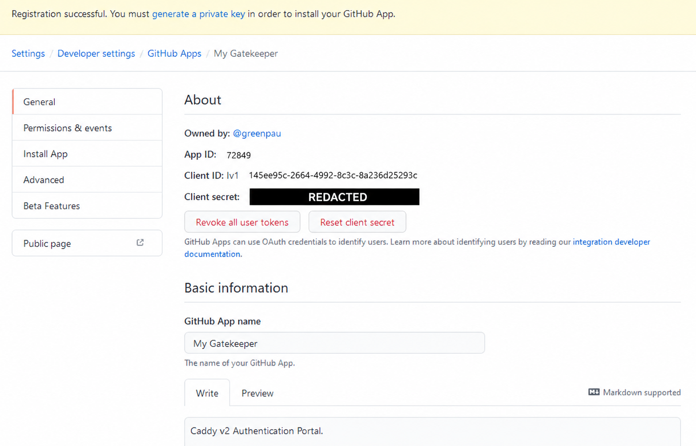
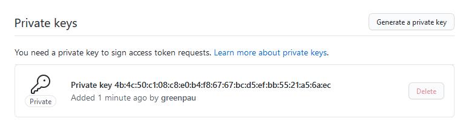
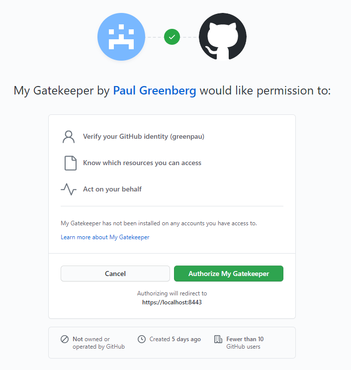
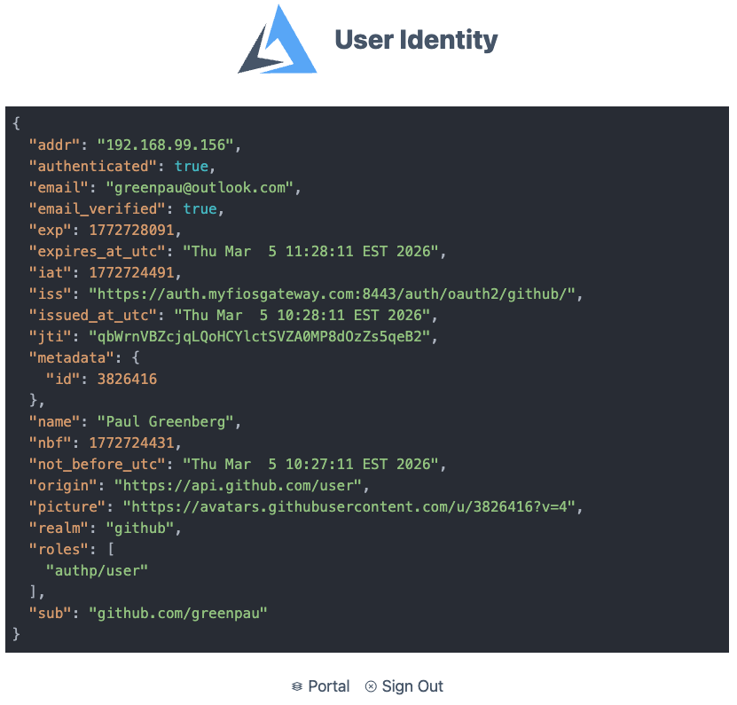
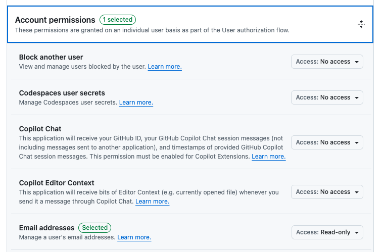
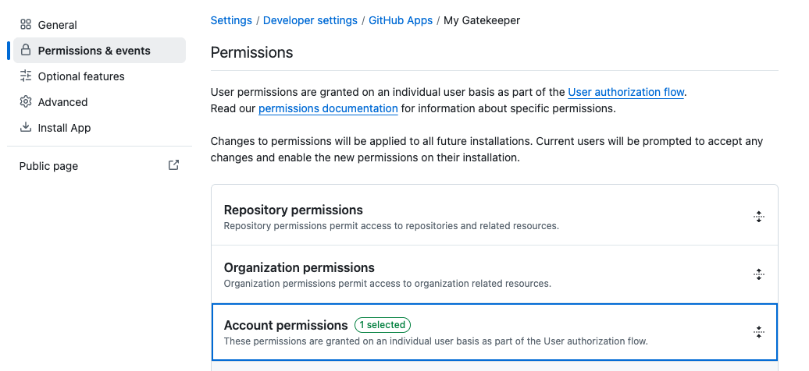
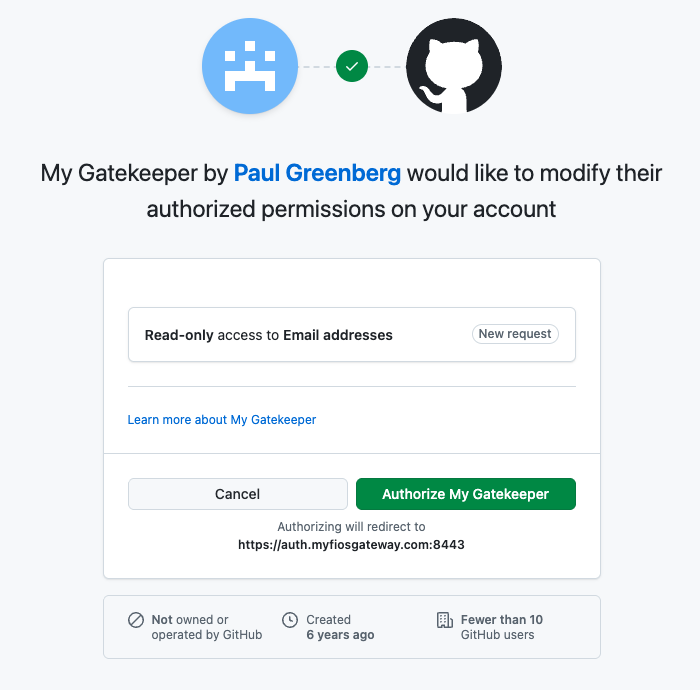

import CodeBlock from '@theme/CodeBlock';
import caddyfile from '@site/assets/conf/oauth/github/Caddyfile?raw';

# GitHub

Use GitHub to sign in to a portal, then grant access to your application by
numeric GitHub account ID. This guide includes a complete Caddyfile and an
optional rule for public organization membership.

The example has three destinations on one HTTPS host:

| Destination | Purpose |
| --- | --- |
| `/auth/` | Sign in through GitHub |
| `/auth/whoami` | Inspect your identity after login |
| `/app` and `/app/*` | Protected application, requiring `app/member` |

The configuration targets **caddy-security v1.3.0** with **go-authcrunch v1.3.8**.
The published binary accepts the example; login and access decisions are also
checked with local GitHub API fixtures. A live GitHub account and your app
registration are needed to verify your deployment end to end.

## Before you start

Complete [Install and verify](../../start/install.md). Have a public hostname
pointing to the server, with ports 80 and 443 available for Caddy's automatic
HTTPS. Substitute that hostname for **both occurrences** of `auth.example.com`
in the Caddyfile and in the GitHub registration below.

You also need permission to register an OAuth app and the numeric GitHub ID
of the person who should reach `/app`. The example serves a protected message,
so an upstream application server is optional.

New to portals and policies? Work through the
[local example](../../start/first-app.md) first, or read the
[OAuth/OIDC flow](10-oauth2.md#oauth-20-flow).

## Register a GitHub OAuth app

Open **Settings → Developer settings → OAuth Apps → New OAuth App**. You can
register it under your account or an organization you administer. Follow
[GitHub's OAuth app registration instructions](https://docs.github.com/en/apps/oauth-apps/building-oauth-apps/creating-an-oauth-app)
and use these values, with your real hostname:

| Registration field | Value |
| --- | --- |
| Application name | A recognizable name, such as `Example team portal` |
| Homepage URL | `https://auth.example.com/auth/` |
| Authorization callback URL | `https://auth.example.com/auth/oauth2/github/authorization-code-callback` |

Save the **client ID** and generate a **client secret**. This setup uses the
web authorization code flow and those two credentials. Device flow, repository
permissions, installation webhooks, and a GitHub App signing private key are
not used by this example.

:::note[Already using a GitHub App?]

GitHub Apps can also use a
[user authorization flow](https://docs.github.com/en/apps/creating-github-apps/authenticating-with-a-github-app/authenticating-with-a-github-app-on-behalf-of-a-user).
Their permission setup differs from OAuth Apps. In particular, reading private
email addresses requires the **Email addresses: read** user permission rather
than an OAuth scope. This walkthrough and its scope settings are for an OAuth
App; do not substitute an installation token for its client secret.

:::

<details className="screenshot-gallery">
<summary>Screenshots: an existing GitHub App and its authorization screen</summary>

These retained images are from the earlier GitHub App walkthrough, not the OAuth App registration used above. They help identify the app type and user authorization screen. The client secret is redacted. A GitHub App private signing key is for app/installation authentication and is not required by this portal example.

<figure className="doc-screenshot">

[](../images/oauth2_github_new_app-redacted.png)

<figcaption>Earlier GitHub App overview: the GitHub Apps breadcrumb identifies this as a different app type from OAuth Apps. Select the image to view it at full size.</figcaption>
</figure>
<figure className="doc-screenshot">

[](../images/oauth2_github_sign_keys.png)

<figcaption>GitHub App key management, shown for comparison. This fingerprint is not a private key; the OAuth App example does not use this screen. Select the image to view it at full size.</figcaption>
</figure>
<figure className="doc-screenshot">

[](../images/oauth2_github_accept_screen.png)

<figcaption>Earlier user authorization prompt for a GitHub App. Review the actual application and permissions in your own flow. Select the image to view it at full size.</figcaption>
</figure>

</details>

## Configure AuthCrunch

Save the following as `Caddyfile` in your working directory. It is embedded
directly from the repository's
[GitHub example](https://github.com/authcrunch/authcrunch.github.io/blob/main/assets/conf/oauth/github/Caddyfile).

<CodeBlock language="text" title="Caddyfile">{caddyfile}</CodeBlock>

The first transform gives GitHub users ordinary portal access (`authp/user`).
The second gives **only the selected numeric account ID** the `app/member`
role. The policy requires `app/member`; another GitHub user can sign in but
cannot reach the protected response.

The outer `route` preserves handler order. `authorize` runs before `respond`
for both `/app` and paths underneath it. When ready, replace that protected
`respond` with your application's `reverse_proxy` handler.

### Set the environment

Find the account's numeric `id` using GitHub's
[Get a user endpoint](https://docs.github.com/en/rest/users/users#get-a-user).
For a public profile, replace `YOUR_GITHUB_LOGIN` in this request and look for
the top-level `id` field:

```sh
curl --fail --silent --show-error https://api.github.com/users/YOUR_GITHUB_LOGIN
```

Use `id`, not the login name or `node_id`. Supply the following variables to
the process that starts AuthCrunch, replacing every `YOUR_…` value:

```sh
export GITHUB_CLIENT_ID='YOUR_OAUTH_APP_CLIENT_ID'
export GITHUB_CLIENT_SECRET='YOUR_OAUTH_APP_CLIENT_SECRET'
export GITHUB_ALLOWED_USER_ID='YOUR_NUMERIC_GITHUB_ID'
export JWT_SHARED_KEY="$(openssl rand -hex 32)"
```

For a managed service, store the credentials and signing key in its protected
environment configuration and reuse the signing key across restarts. Keep the
client secret and signing key out of version control.

`{$GITHUB_ALLOWED_USER_ID}` expands when Caddy parses the Caddyfile. It must be
one positive decimal account ID, without leading zeros. The other three
variables use `{env.VARIABLE}` and are resolved by AuthCrunch during startup.
The portal signs and the policy verifies with the **same** `JWT_SHARED_KEY`.

### Check and run

Use the binary path from your installation:

```sh
./bin/authcrunch adapt --adapter caddyfile --config Caddyfile >/dev/null
./bin/authcrunch run --config Caddyfile
```

Adaptation checks configuration syntax; it does not validate GitHub credentials.
The running server obtains its HTTPS certificate and serves the portal. This
example disables the admin endpoint and configuration persistence. Stop the
foreground process with **Ctrl+C** and start it again after configuration
changes; `caddy reload` is unavailable with `admin off`.

### Verify login and access

1. Open `https://auth.example.com/app` and follow the redirect to the portal.
2. Choose **GitHub**, sign in, and approve the requested permissions.
3. After returning to the portal, open **Example app** if you are not sent
   there automatically. The selected account should see
   `You reached the GitHub-protected app.`
4. Open **My identity** (`/auth/whoami`). Check `github_id`, `realm`, and the
   `app/member` role.
5. Use a separate browser session with a different GitHub account. It should
   be able to sign in, but `/app` must return **403** without the protected
   message. If only one account is available, temporarily configure a different
   ID, restart, and sign in again to check denial.

Use a fresh login when testing a changed transform. Roles are recorded in the
issued AuthCrunch token; changing a rule does not rewrite a token already in
use. This example gives those tokens a 900-second lifetime.

## Choose who can use the app

### Match a numeric account ID

The GitHub driver exposes `github_id` as a decimal **string** and retains the
numeric ID in `metadata.id`. The `sub` claim is `github.com/LOGIN` and changes
when the account is renamed. An ID rule continues matching the same account
through a login-name change.

Inside the portal, the rule for one account is:

```text
transform user {
    match realm github
    match github id exact 12345678
    action add role app/member
}
```

For a small allowlist, replace the exact-ID matcher with an anchored regex:

```text
match github id regex "^(12345678|87654321)$"
```

Replace these illustrative IDs with your own. Matchers in one transform use
**AND** semantics; separate matching transforms can each add roles. Two exact
ID matchers in one block do not create an allowlist.

### Match public organization membership

The driver fetches organizations only when `user_org_filters` is configured.
Add this directive inside `oauth identity provider github`, using your actual
organization login:

```text
user_org_filters ^example-team$
```

Then **replace the app-granting ID transform** with:

```text
transform user {
    match realm github
    match github org exact example-team
    action add role app/member
}
```

This grants access to members of the selected organization who appear in the
API response. To require **both** the selected account and that membership,
keep the ID matcher and add the organization matcher in the **same** transform.
Leaving separate ID and organization transforms in place would allow either
one to grant the role.

:::warning[Public memberships only]

This release follows the profile's `organizations_url`, normally
`/users/LOGIN/orgs`. GitHub documents that endpoint as returning **only public
memberships, regardless of authentication**. Adding `read:org` does not change
that endpoint into a private-membership check. See
[GitHub's organization API](https://docs.github.com/en/rest/orgs/orgs#list-organizations-for-a-user).

Use the numeric ID rule if an account's membership must stay private. The
bundled implementation makes one organization-list request and does not follow
pagination; membership outside the returned page cannot match.

:::

`user_org_filters` selects which organization logins are retained. It does not
itself deny login or grant the application role. Retained names appear in
`github_orgs`; they also produce the existing
`github.com/ORGANIZATION/members` roles.

Both the filter and `match github org regex` use Go regular expressions;
anchor them with `^` and `$` to match whole names. `exact` matches are case
sensitive. An absent, filtered-out, or unavailable organization claim cannot
satisfy the organization matcher. With the organization-only grant above,
the user gets no `app/member` role in that case.

Organization membership is evaluated during login, not on each application
request. A later membership change does not immediately remove claims from an
already issued token.

<figure className="doc-screenshot">

[](./images/github/github_app_whoami.png)

<figcaption>Earlier portal identity view. In the current example, also verify github_id and app/member; the old roles and example account are not the access policy. Select the image to view it at full size.</figcaption>
</figure>

## Email Claims

The example requests `read:user user:email`. GitHub's
[scope reference](https://docs.github.com/en/apps/oauth-apps/building-oauth-apps/scopes-for-oauth-apps)
defines these as profile and email read access. `user:email` allows the
[authenticated user's email-list request](https://docs.github.com/en/rest/users/emails#list-email-addresses-for-the-authenticated-user)
when the profile has no email. The driver's default `read:user` scope alone
is insufficient for that fallback with an OAuth App.

In the bundled implementation:

1. A non-empty email in the profile response is used directly. This branch
   does not add `email_verified`.
2. If the profile email is absent or `null`, the driver fetches the email list.
   It prefers a primary verified address, then a verified address, then the
   first entry. It adds `email_verified: true` only for a verified selection.
3. An email API failure is logged. It does not by itself reject GitHub login;
   an email-dependent rule can still fail because the claim is missing.

Inspect `/auth/whoami` after a new login to check the result. The presence of
`email` alone is not proof that this branch supplied a verified address. The
example uses `github_id` to grant access so an email change does not select a
different account. The exact selection logic is in the
[released email extractor](https://github.com/greenpau/go-authcrunch/blob/v1.3.8/pkg/idp/oauth/github_email.go).

<figure className="doc-screenshot">

[](./images/github/github_app_permissions_02.png)

<figcaption>For an existing GitHub App, Email addresses is a user permission. The OAuth App walkthrough above requests user:email instead. Select the image to view it at full size.</figcaption>
</figure>

<details className="screenshot-gallery">
<summary>Screenshots: GitHub App email permissions and renewed consent</summary>

These images accompany the GitHub App variant discussed in Email Claims. Changes to permissions may require another user authorization; inspect the newly issued portal identity afterward.

<figure className="doc-screenshot">

[](./images/github/github_app_permissions_01.png)

<figcaption>Locate Account permissions in an existing GitHub App. Select the image to view it at full size.</figcaption>
</figure>
<figure className="doc-screenshot">

[](./images/github/github_app_consent.png)

<figcaption>The user reviews the app’s request for email access before continuing. Select the image to view it at full size.</figcaption>
</figure>

</details>

## Troubleshoot

| Symptom | Check |
| --- | --- |
| GitHub button is missing | `enable identity provider github` references the provider's configured name inside the mounted portal. |
| GitHub rejects the callback | Compare the complete registered URL with the browser request's `redirect_uri`, including `/auth/`, the realm, and the HTTPS hostname. |
| Code exchange fails | Verify that the client ID and secret belong to the same OAuth App and are present in the running service's environment. Start a new login attempt instead of replaying a callback URL. |
| Adaptation rejects the ID matcher | Export `GITHUB_ALLOWED_USER_ID` as a positive decimal ID before running `adapt` or `run`. |
| Login succeeds but `/app` returns 403 | Inspect `github_id` and roles in `/auth/whoami`; verify that the transform grants `app/member` and sign in again after changing rules. |
| Organization matching fails | Check public membership visibility, `user_org_filters`, exact spelling/case, the returned page, and provider API errors. A private membership is not returned by this endpoint. |
| Email is missing | Check `user:email` consent and email API errors. For an existing GitHub App, check its separate Email addresses read permission. |
| Access survives an account or membership rule change | Test with a fresh login; existing token claims remain until that token expires or is otherwise rejected. |

For PKCE, the bundled GitHub driver forces it off even though GitHub supports
it. See the [release-specific PKCE table](10-oauth2.md#pkce) before changing
that setting. This guide covers GitHub.com; it does not establish GitHub
Enterprise Server compatibility.
