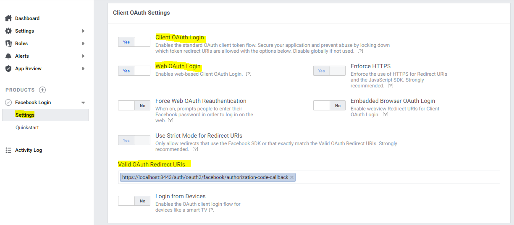
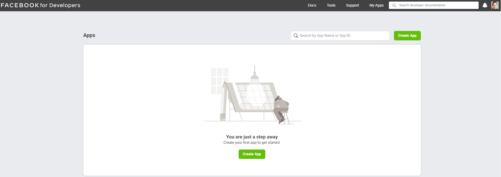
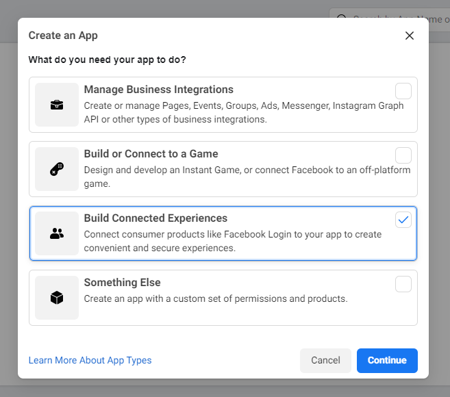
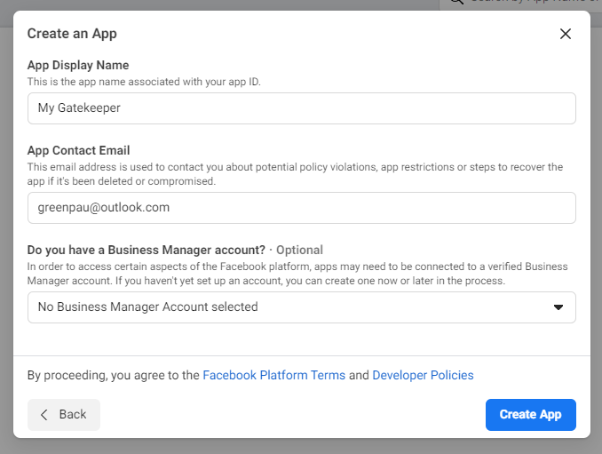
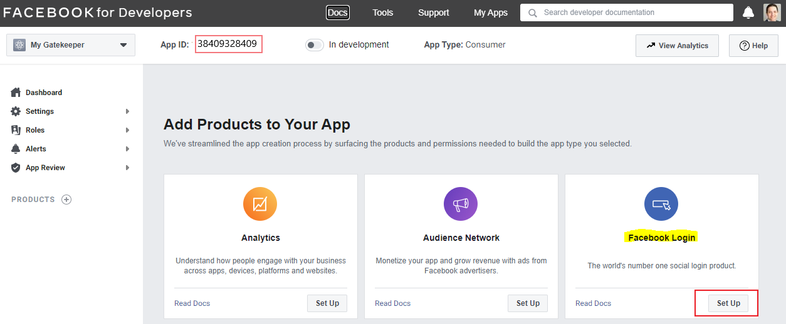
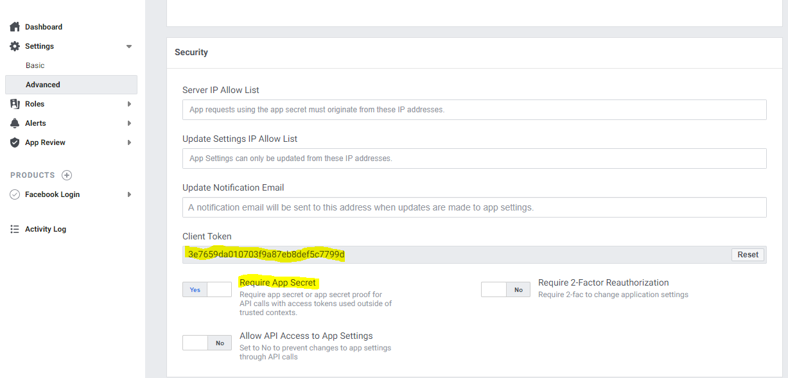
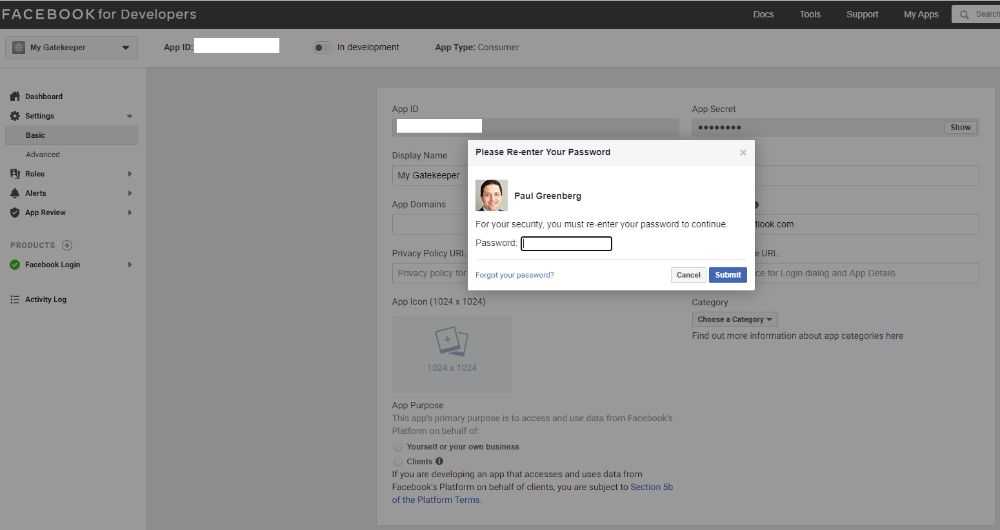
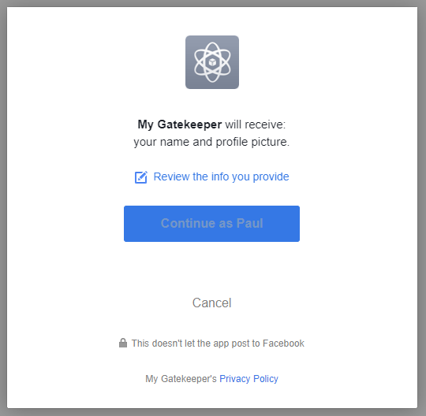

import CodeBlock from '@theme/CodeBlock';
import example from '@site/assets/conf/oauth/facebook/Caddyfile?raw';

# Facebook

:::warning[Released driver compatibility limit]

The bundled Facebook driver hard-codes `v12.0` authorization, token, and Graph
profile endpoints. Its configuration overwrites the authorization/token URLs;
changing `base_auth_url` does not upgrade those calls. This page preserves the
integration reference, but it does **not** establish compatibility with Meta's
current Graph API. Verify support with Meta before relying on it for a new
production deployment. A parser check cannot resolve this upstream limitation.

:::

## Application and callback reference

For a compatible deployment, register a server-side Facebook Login application
in the [Meta developer dashboard](https://developers.facebook.com/apps/), keep
its App Secret on the server, and use the exact authorized redirect:

```text
https://auth.example.com/auth/oauth2/facebook/authorization-code-callback
```

The App Secret is the confidential OAuth credential. A Client Token or browser
SDK app identifier is not a substitute. The named driver calculates an
`appsecret_proof` for the Graph profile request. Consult
[Meta's web login guide](https://developers.facebook.com/docs/facebook-login/web/)
and [API version policy](https://developers.facebook.com/docs/graph-api/changelog/versions/)
for current application, permission, and version requirements. The old wizard's
app-type labels are historical.

<figure className="doc-screenshot">

[](../images/oauth2_facebook_app_login_settings_screen.png)

<figcaption>Historical valid OAuth redirect field; the current example uses the public /auth mount.</figcaption>
</figure>
<details className="screenshot-gallery">
<summary>Preserved Facebook setup and consent screens</summary>

<figure className="doc-screenshot">

[](../images/oauth2_facebook_apps_screen.png)

<figcaption>Historical developer application list.</figcaption>
</figure>

<figure className="doc-screenshot">

[](../images/oauth2_facebook_apps_type_choice_screen.png)

<figcaption>Historical connected-experiences app-type wizard; current app selection can differ.</figcaption>
</figure>

<figure className="doc-screenshot">

[](../images/oauth2_facebook_apps_name_choice_screen.png)

<figcaption>Historical application name and contact fields.</figcaption>
</figure>

<figure className="doc-screenshot">

[](../images/oauth2_facebook_app_screen.png)

<figcaption>Historical Facebook Login product selection.</figcaption>
</figure>

<figure className="doc-screenshot">

[](../images/oauth2_facebook_app_settings_advanced_screen.png)

<figcaption>Historical App Secret proof requirement and client-token fields; do not reuse pictured values.</figcaption>
</figure>

<figure className="doc-screenshot">

[](../images/oauth2_facebook_app_settings_basic_screen.png)

<figcaption>Historical private App Secret access with an account confirmation prompt.</figcaption>
</figure>

<figure className="doc-screenshot">

[](../images/oauth2_facebook_user_login_screen.png)

<figcaption>Historical user consent screen; consent does not grant AuthCrunch application roles.</figcaption>
</figure>

</details>
## Released configuration reference

<CodeBlock language="caddyfile" title="assets/conf/oauth/facebook/Caddyfile">{example}</CodeBlock>
Replace the client values and private signing key in the server environment.
`FACEBOOK_ALLOWED_SUB` expands at parse time and must be the exact app-scoped
account ID returned by this integration. The example resets provider roles and
grants `app/member` only to that subject. It does not grant portal administration
by email or allow every Facebook identity into the application.

Facebook access tokens are opaque to this driver; it retrieves the profile
through the provider rather than treating them as signed OIDC ID tokens. PKCE
and nonce are disabled for this named driver. Email can be absent even when
requested, so decide explicitly whether the application's subject-based identity
permits disabling the default email claim check.

## Compatibility verification

Before deployment, test code exchange, Graph profile retrieval, application
assignment/permissions, exact subject mapping, and a nonmember's rejection.
If a retired endpoint or provider permission blocks the flow, a Caddyfile
rewrite is not evidence of a repaired upstream implementation. Use another
[documented provider](10-oauth2.md) that meets your deployment requirements.
