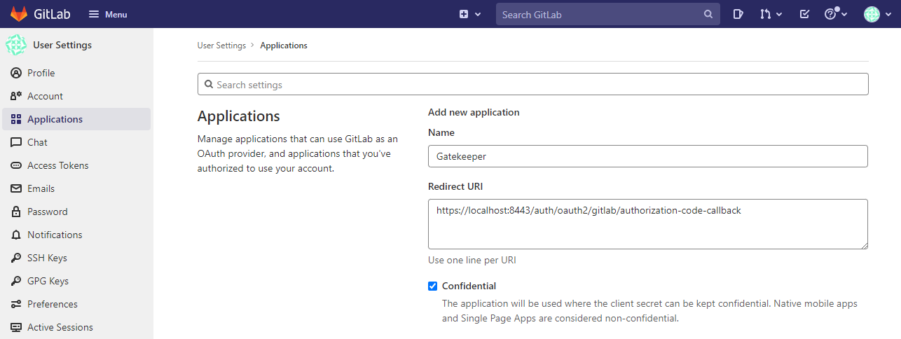
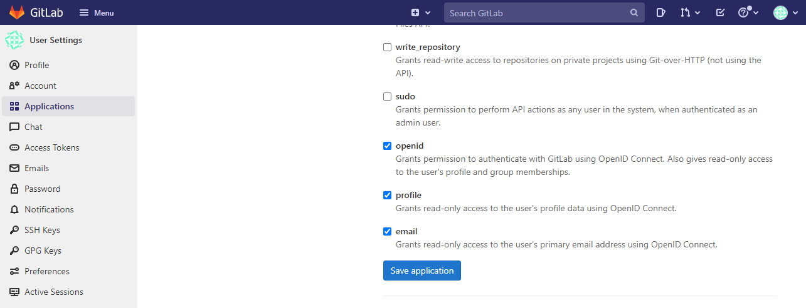
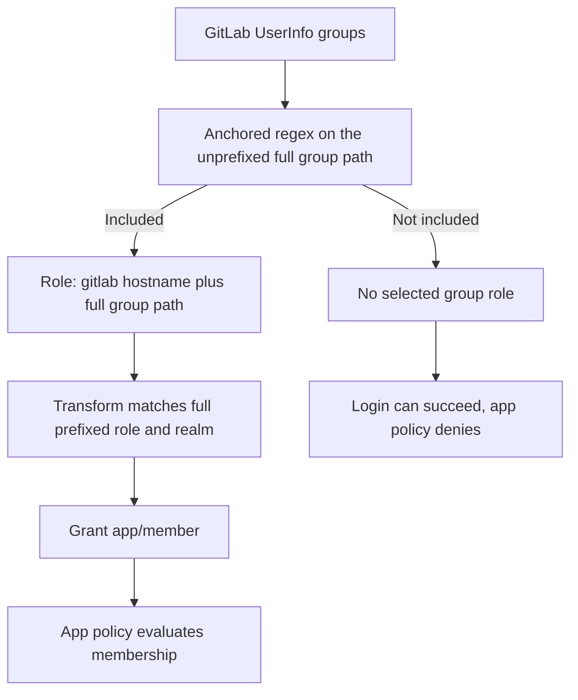
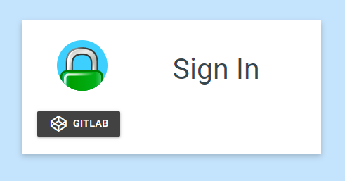
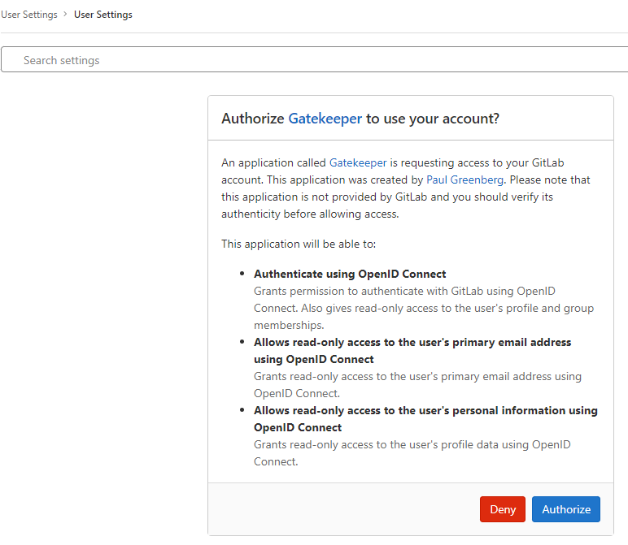
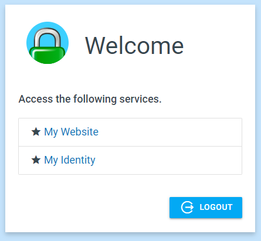
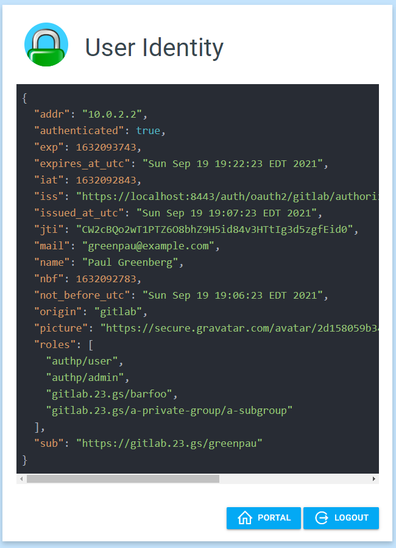

import CodeBlock from '@theme/CodeBlock';
import caddyfile from '@site/assets/conf/oauth/gitlab/Caddyfile?raw';

# GitLab

Let GitLab authenticate your users, then require membership in a selected group
to reach your application. This guide works with GitLab.com or a GitLab instance
you administer. It uses the named `gitlab` driver and its UserInfo group filter.

The example targets **caddy-security v1.3.0**, which bundles
**go-authcrunch v1.3.8**. Configuration and local provider fixtures verify the
released driver's behavior; your GitLab registration and consent flow still
need an end-to-end check in your environment.

## Before you start

Complete [Install and verify](../../start/install.md). Choose a public hostname
for AuthCrunch, with ports 80 and 443 available for automatic HTTPS. The example
uses `auth.example.com`; replace both occurrences in the Caddyfile and the
callback below.

Have permission to register a GitLab OAuth application and select a group whose
members should reach the protected app. This guide uses the full group path
`example-team/app-members`. Use an existing path or create a group for your app.
Plan a member and a nonmember account for testing.

## Register the application

In GitLab, open your profile's **Access → Applications → Add new application**,
or visit `https://gitlab.com/-/profile/applications`. For Self-Managed, use your
GitLab hostname instead. Group-owned applications are another option; see
[GitLab's application registration instructions](https://docs.gitlab.com/integration/oauth_provider/#create-a-user-owned-application).

| Setting | Value for this walkthrough |
| --- | --- |
| Name | A recognizable name, such as `Example team portal` |
| Redirect URI | `https://auth.example.com/auth/oauth2/gitlab/authorization-code-callback` |
| Confidential | Enabled; the portal keeps the secret on the server |
| Scopes | `openid`, `email`, `profile` |

Save the **Application ID** and **Secret** for the server environment. This
login uses an OAuth application secret, not a personal access token. Repository
write access and the broad `api` scope are unnecessary for this walkthrough.

<figure className="doc-screenshot">

[](../images/oauth_gitlab_new_app_1.png)

<figcaption>Earlier GitLab application screen. Use the public HTTPS callback above instead of the localhost value in this capture. Select the image to view it at full size.</figcaption>
</figure>

<figure className="doc-screenshot">

[](../images/oauth_gitlab_new_app_2.png)

<figcaption>The three selected identity scopes support this walkthrough; broader repository and API permissions are unnecessary. Select the image to view it at full size.</figcaption>
</figure>

## Configure AuthCrunch

Save this complete configuration as `Caddyfile`. It is embedded from the
[canonical GitLab example](https://github.com/authcrunch/authcrunch.github.io/blob/main/assets/conf/oauth/gitlab/Caddyfile).

<CodeBlock language="text" title="Caddyfile">{caddyfile}</CodeBlock>

The first transform grants ordinary portal access. The second grants
`app/member` only when the filtered GitLab group is present. The policy requires
that application role for `/app` and every path underneath it. Replace the
protected `respond` with `reverse_proxy` when connecting your own application.

### Set the environment

```sh
export GITLAB_DOMAIN='gitlab.com'
export GITLAB_CLIENT_ID='YOUR_APPLICATION_ID'
export GITLAB_CLIENT_SECRET='YOUR_APPLICATION_SECRET'
export JWT_SHARED_KEY="$(openssl rand -hex 32)"
```

For Self-Managed, set `GITLAB_DOMAIN` to your GitLab hostname, such as
`gitlab.example.com`, without `https://` or a trailing slash. The provider
constructs its HTTPS discovery URL from that hostname. The AuthCrunch server
must reach it and trust its TLS certificate.

`{$GITLAB_DOMAIN}` expands when Caddy parses the configuration, including the
group-role prefix. The credentials and shared signing key use runtime
`{env.VARIABLE}` placeholders. Keep those secrets in the protected environment
of the process or service, and reuse the signing key across restarts.

Replace `example-team/app-members` in **both** the group filter and role matcher
with your group's full path. Escape regex metacharacters in the filter if your
path contains them. Retain the `^` and `$` anchors for an exact path match.

### Check and run

Using your installed binary:

```sh
./bin/authcrunch adapt --adapter caddyfile --config Caddyfile >/dev/null
./bin/authcrunch run --config Caddyfile
```

Adaptation checks syntax, not your credentials or membership. The foreground
process starts the portal and provisions HTTPS. This example disables the admin
endpoint; stop it with **Ctrl+C** and restart after configuration changes.




## Understand the group filter

The `gitlab` driver exchanges the authorization code, then calls the discovered
UserInfo endpoint with the access token. It takes group paths from that
response's **`groups` array**. GitLab documents this array as including direct
membership and membership through an ancestor group. It differs from the
ID token's `groups_direct` claim. See
[GitLab's OIDC claims](https://docs.gitlab.com/integration/openid_connect_provider/#shared-information).

The path passes through two checks:

| Stage | Example |
| --- | --- |
| GitLab UserInfo group | `example-team/app-members` |
| Filter applied to the unprefixed path | `^example-team/app-members$` |
| Role exposed to the portal | `gitlab.com/example-team/app-members` |
| Transform grants application access | `app/member` |

With no `user_group_filters`, the named driver omits GitLab groups. The filter
selects claims to retain; it does not itself deny sign-in. The application policy
is the final access check. A subgroup such as `example-team/app-members/child`
does not match this example's anchored filter.

For multiple accepted paths, put the regexes on one directive:

```text
user_group_filters ^example-team/app-members$ ^example-team/app-operators$
```

Then add the corresponding role-granting transform for each path you intend to
authorize. Multiple role-granting transforms are additive. Avoid broad filters
such as `.*` unless every returned group is intended to become a portal role.

### Identity fields

The named driver uses the UserInfo **`profile` URL** as the AuthCrunch `sub`,
not GitLab's numeric OIDC subject. A renamed GitLab username can change that
profile URL. This walkthrough authorizes by the selected group, not username
or email.

GitLab may omit email depending on the requested scope and the user's public
email setting. The named GitLab path can still sign in without it; the group
policy continues to apply. The generic driver's default ID-token email check
is a different behavior. An ID-token `groups_direct` claim, or a group present
only in the ID token, does not supply this named driver's group roles.

## Verify login and denial

1. Open `https://auth.example.com/app` in a fresh browser session.
2. Choose **GitLab**, sign in, and authorize the registered application.
3. Open **Example app** from the portal. A group member should see
   `You reached the GitLab-protected app.`
4. Open **My identity** at `/auth/whoami`. Check `realm: gitlab`, the prefixed
   group role, and `app/member`.
5. In a separate session, sign in as a nonmember. Portal login can succeed, but
   `/app` must return **403** without the protected response.

<details className="screenshot-gallery">
<summary>Screenshots: GitLab consent and the earlier portal</summary>

These captures retain the earlier portal branding and example identities. In the current walkthrough, use Example app and My identity, and expect the selected group plus app/member rather than the historical administrator role.

<figure className="doc-screenshot">

[](../images/oauth_gitlab_init.png)

<figcaption>Choose the GitLab provider to begin the redirect flow. Select the image to view it at full size.</figcaption>
</figure>

<figure className="doc-screenshot">

[](../images/oauth_gitlab_authorize_app_1.png)

<figcaption>Review the registered app and the requested identity permissions before authorizing it. Select the image to view it at full size.</figcaption>
</figure>

<figure className="doc-screenshot">

[](../images/oauth_gitlab_portal.png)

<figcaption>The current example names the protected link Example app and keeps My identity under /auth/whoami. Select the image to view it at full size.</figcaption>
</figure>

<figure className="doc-screenshot">

[](../images/oauth_gitlab_user_identity.png)

<figcaption>The retained identity capture illustrates the profile URL subject and prefixed group roles. Its historical role grants are not the current access policy. Select the image to view it at full size.</figcaption>
</figure>

</details>

Use a fresh login after changing group membership, filters, or transforms.
Existing AuthCrunch tokens retain their recorded roles until they expire; this
example uses a 900-second lifetime. Portal logout clears the portal session,
while an existing GitLab browser session can still make the next login seamless.

## Troubleshoot

| Symptom | Check |
| --- | --- |
| Provider fails to initialize | Hostname, discovery response, network access, and TLS trust for the GitLab instance |
| Callback rejected | Exact HTTPS host and `/auth/oauth2/gitlab/authorization-code-callback` path in the OAuth application |
| Login succeeds but `/app` is 403 | Full group path, anchored filter, hostname prefix, and the user's actual UserInfo membership |
| Group appears in an ID token but not My identity | This driver consumes UserInfo `groups`, not ID-token `groups_direct` |
| Login fails while fetching claims | UserInfo must succeed and contain a `profile` field; a failed response is not a successful login |
| Access persists after removing membership | Test a new portal session; membership changes do not rewrite already-issued tokens |

For explicit issuer/discovery configuration and ID-token claim handling, see
the [generic OIDC reference](81-backend-oauth2-0000-generic.md). Switching drivers
changes the subject and group source; recheck your transforms before migrating.

## Agentic Prompts

Copy a prompt into your LLM to explore this topic. Each prompt prioritizes
upstream repository guidance and code over this page, and asks for version-aware
reasoning.

<div className="agentic-prompts">

<details>
<summary>Trace GitLab group provenance</summary>

```text
Help me understand GitLab.

Primary authorities (take precedence over website documentation):
https://github.com/greenpau/caddy-security/blob/main/AGENTS.md
https://github.com/greenpau/caddy-security/tree/main/.codex/skills
https://github.com/greenpau/go-authcrunch/blob/main/AGENTS.md
https://github.com/greenpau/go-authcrunch/tree/main/.codex/skills
Read each repository's root AGENTS.md first, then any scoped AGENTS.md that
applies to inspected paths. Read the relevant SKILL.md files and follow their
implementation and test references.

Relevant skills to locate: configuration-oauth-providers,
oauth-identity-provider.

Secondary reference:
https://docs.authcrunch.com/docs/authenticate/oauth/backend-oauth2-0009-gitlab

If a source is inaccessible, ask me to paste its relevant text. Identify the
versions your answer applies to; main may be newer than my release. Resolve
disagreements using code and tests, and flag unverified claims. Use synthetic
credentials and redacted examples; explain proposed checks before any changes.

Explain the named GitLab driver’s UserInfo group source versus ID-token
groups_direct. Compare GitLab.com with self-managed metadata and realm
callbacks. Separate app registration/scopes from the final application ACL.
```

</details>

<details>
<summary>Read a group filter</summary>

```text
Help me understand GitLab.

Primary authorities (take precedence over website documentation):
https://github.com/greenpau/caddy-security/blob/main/AGENTS.md
https://github.com/greenpau/caddy-security/tree/main/.codex/skills
https://github.com/greenpau/go-authcrunch/blob/main/AGENTS.md
https://github.com/greenpau/go-authcrunch/tree/main/.codex/skills
Read each repository's root AGENTS.md first, then any scoped AGENTS.md that
applies to inspected paths. Read the relevant SKILL.md files and follow their
implementation and test references.

Relevant skills to locate: configuration-oauth-providers,
oauth-identity-provider.

Secondary reference:
https://docs.authcrunch.com/docs/authenticate/oauth/backend-oauth2-0009-gitlab

If a source is inaccessible, ask me to paste its relevant text. Identify the
versions your answer applies to; main may be newer than my release. Resolve
disagreements using code and tests, and flag unverified claims. Use synthetic
credentials and redacted examples; explain proposed checks before any changes.

Compare anchored group-path regex, subgroup descendants, an unanchored
expression, and no filter. Explain which claims are retained and why filtering
alone does not deny login. Use synthetic group paths and map only the intended
role to app/member.
```

</details>

<details>
<summary>Diagnose missing groups</summary>

```text
Help me understand GitLab.

Primary authorities (take precedence over website documentation):
https://github.com/greenpau/caddy-security/blob/main/AGENTS.md
https://github.com/greenpau/caddy-security/tree/main/.codex/skills
https://github.com/greenpau/go-authcrunch/blob/main/AGENTS.md
https://github.com/greenpau/go-authcrunch/tree/main/.codex/skills
Read each repository's root AGENTS.md first, then any scoped AGENTS.md that
applies to inspected paths. Read the relevant SKILL.md files and follow their
implementation and test references.

Relevant skills to locate: configuration-oauth-providers,
oauth-identity-provider.

Secondary reference:
https://docs.authcrunch.com/docs/authenticate/oauth/backend-oauth2-0009-gitlab

If a source is inaccessible, ask me to paste its relevant text. Identify the
versions your answer applies to; main may be newer than my release. Resolve
disagreements using code and tests, and flag unverified claims. Use synthetic
credentials and redacted examples; explain proposed checks before any changes.

Help me inspect redacted UserInfo field names/types, scopes, filter regex,
inherited membership, and provider base URL. Distinguish optional email
behavior in the named path from the generic ID-token email check. Do not
assume a group present only in a different token supplies the same roles.
```

</details>

<details>
<summary>Test member and subgroup boundaries</summary>

```text
Help me understand GitLab.

Primary authorities (take precedence over website documentation):
https://github.com/greenpau/caddy-security/blob/main/AGENTS.md
https://github.com/greenpau/caddy-security/tree/main/.codex/skills
https://github.com/greenpau/go-authcrunch/blob/main/AGENTS.md
https://github.com/greenpau/go-authcrunch/tree/main/.codex/skills
Read each repository's root AGENTS.md first, then any scoped AGENTS.md that
applies to inspected paths. Read the relevant SKILL.md files and follow their
implementation and test references.

Relevant skills to locate: configuration-oauth-providers,
oauth-identity-provider.

Secondary reference:
https://docs.authcrunch.com/docs/authenticate/oauth/backend-oauth2-0009-gitlab

If a source is inaccessible, ask me to paste its relevant text. Identify the
versions your answer applies to; main may be newer than my release. Resolve
disagreements using code and tests, and flag unverified claims. Use synthetic
credentials and redacted examples; explain proposed checks before any changes.

Build cases for exact intended group, unrelated group, child path,
ancestor-derived membership, no filter, and provider API failure. Explain the
actual driver output and restrictive app denial. Include fresh login after
membership changes.
```

</details>

<details>
<summary>Review lifecycle and trust</summary>

```text
Help me understand GitLab.

Primary authorities (take precedence over website documentation):
https://github.com/greenpau/caddy-security/blob/main/AGENTS.md
https://github.com/greenpau/caddy-security/tree/main/.codex/skills
https://github.com/greenpau/go-authcrunch/blob/main/AGENTS.md
https://github.com/greenpau/go-authcrunch/tree/main/.codex/skills
Read each repository's root AGENTS.md first, then any scoped AGENTS.md that
applies to inspected paths. Read the relevant SKILL.md files and follow their
implementation and test references.

Relevant skills to locate: configuration-oauth-providers,
oauth-identity-provider.

Secondary reference:
https://docs.authcrunch.com/docs/authenticate/oauth/backend-oauth2-0009-gitlab

If a source is inaccessible, ask me to paste its relevant text. Identify the
versions your answer applies to; main may be newer than my release. Resolve
disagreements using code and tests, and flag unverified claims. Use synthetic
credentials and redacted examples; explain proposed checks before any changes.

Review a redacted GitLab provider and transforms for reserved-role removal,
exact realm matching, and stable identity mapping. Compare portal logout,
upstream SSO, and issued token lifetime. Quiz me on the difference between
retaining a group and granting access.
```

</details>

</div>

## Source Code References

Start with the code search, then follow the parser, runtime, and tests relevant
to this topic. These links target `main`; use GitHub's branch/tag selector to
compare them with your installed release.

1. [Search this topic in both repositories](https://github.com/search?q=%28repo%3Agreenpau%2Fgo-authcrunch%20OR%20repo%3Agreenpau%2Fcaddy-security%29%20%28gitlab%20OR%20user_group_filters%20OR%20fetchClaims%29&type=code)
   — searches topic-specific symbols and paths across both codebases.
2. [caddy-security: caddyfile_identity_provider_oauth.go](https://github.com/greenpau/caddy-security/blob/main/caddyfile_identity_provider_oauth.go)
   — adapts OAuth/OIDC provider settings, scopes, endpoints, and trust options.
3. [go-authcrunch: pkg/idp/oauth/config.go](https://github.com/greenpau/go-authcrunch/blob/main/pkg/idp/oauth/config.go)
   — validates generic and named-driver defaults and endpoint settings.
4. [go-authcrunch: pkg/idp/oauth/user.go](https://github.com/greenpau/go-authcrunch/blob/main/pkg/idp/oauth/user.go)
   — fetches and normalizes named-provider profile, membership, and identity data.
5. [go-authcrunch: pkg/idp/oauth/authenticate.go](https://github.com/greenpau/go-authcrunch/blob/main/pkg/idp/oauth/authenticate.go)
   — handles authorization callbacks, token exchange, and identity completion.
6. [go-authcrunch: pkg/idp/oauth/user_groups_test.go](https://github.com/greenpau/go-authcrunch/blob/main/pkg/idp/oauth/user_groups_test.go)
   — tests provider group extraction and filtering.
