import CodeBlock from '@theme/CodeBlock';
import example from '@site/assets/conf/oauth/pingid/Caddyfile?raw';

# Ping Identity

This guide connects a **PingOne OIDC web application** with the generic driver.
The historical realm name `pingid` remains in the callback for compatibility;
it does not implement the separate PingID mobile authentication API. PingOne
can enforce its own sign-on/MFA policy before returning an OIDC identity.

## Register a confidential web application

Create an OIDC web application in the intended PingOne environment, enable
**authorization code**, register the callback below, and configure token endpoint
authentication as **Client Secret Post**. PingOne web applications can default
to Client Secret Basic; the bundled generic exchange sends the secret in the
form body. See [PingOne application settings](https://developer.pingidentity.com/pingone-api/platform/application-management.html).

```text
https://auth.example.com/auth/oauth2/pingid/authorization-code-callback
```

Copy the actual issuer and OIDC discovery URL from your environment/application.
Use the region or custom domain PingOne provides. The environment ID and OAuth
client ID are different values; do not construct the issuer from an application
ID. Supply `PINGONE_ISSUER`, `PINGONE_DISCOVERY_URL`, `PINGONE_CLIENT_ID`,
`PINGONE_CLIENT_SECRET`, and the private `AUTHCRUNCH_SIGNING_KEY`.
The issuer/discovery values expand before Caddyfile parsing.

<figure className="doc-screenshot">

[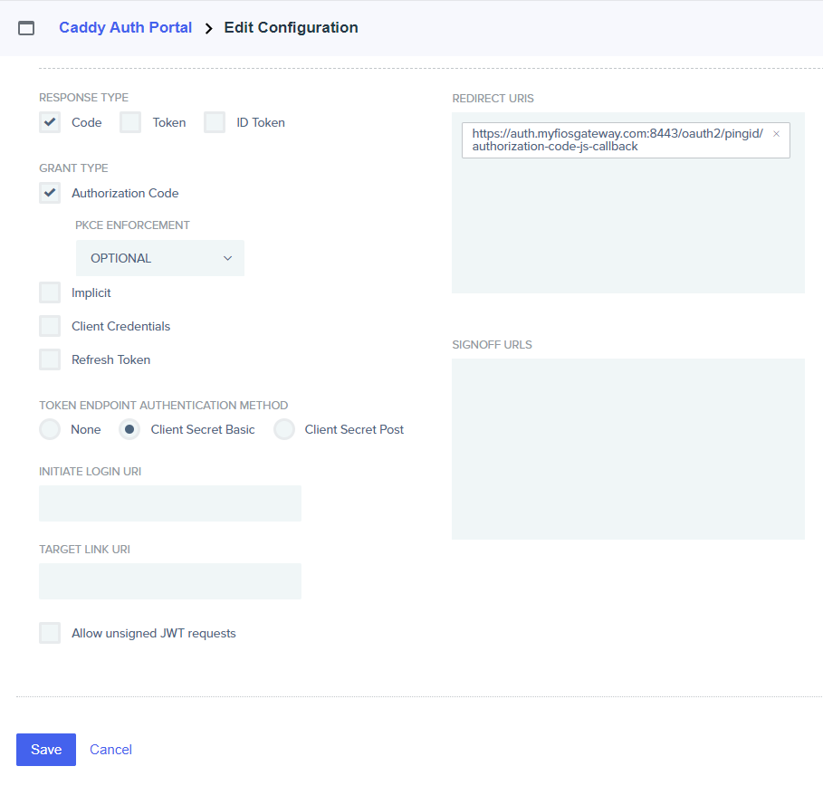](./images/ping_identity_16.png)

<figcaption>Historical authorization-code settings; choose Client Secret Post for this example, not the pictured Basic option.</figcaption>
</figure>
<details className="screenshot-gallery">
<summary>Preserved PingOne setup sequence</summary>

<figure className="doc-screenshot">

[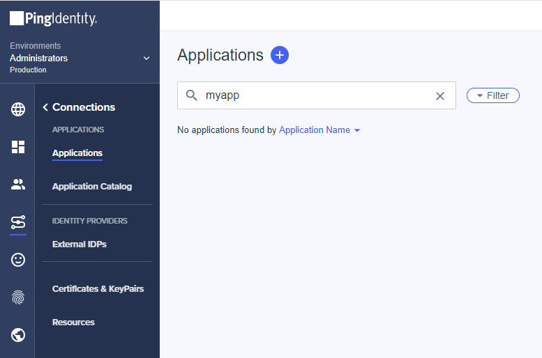](./images/ping_identity_01.png)

<figcaption>Historical Applications list.</figcaption>
</figure>

<figure className="doc-screenshot">

[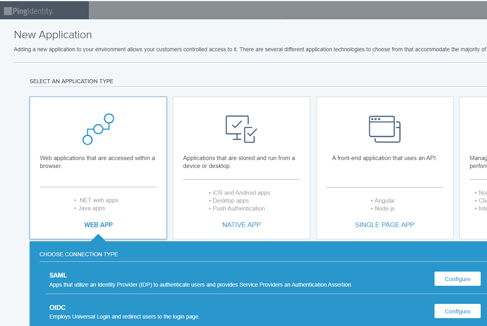](./images/ping_identity_02.png)

<figcaption>Historical OIDC web application selection.</figcaption>
</figure>

<figure className="doc-screenshot">

[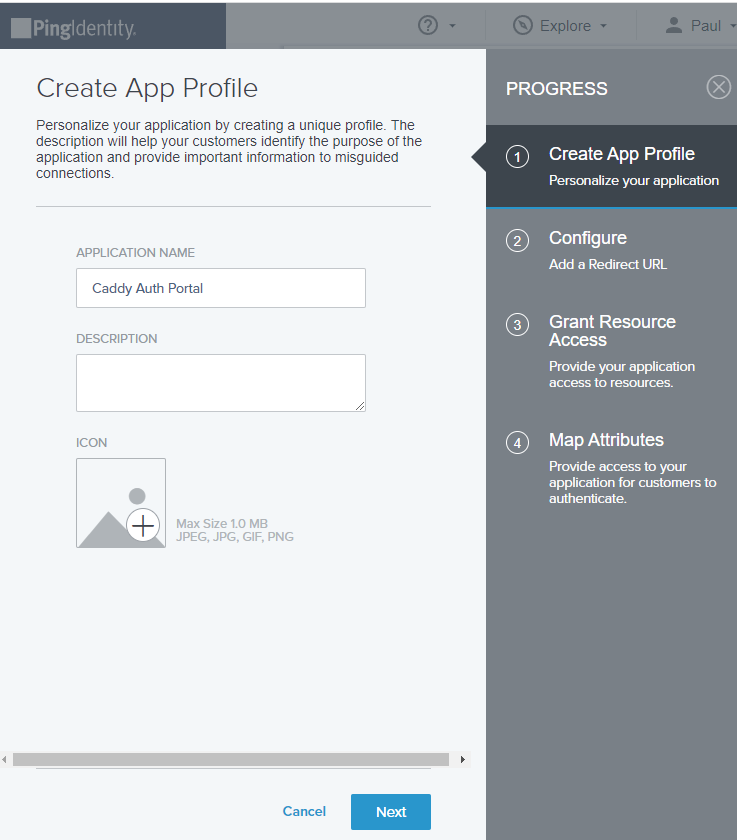](./images/ping_identity_03.png)

<figcaption>Historical application profile.</figcaption>
</figure>

<figure className="doc-screenshot">

[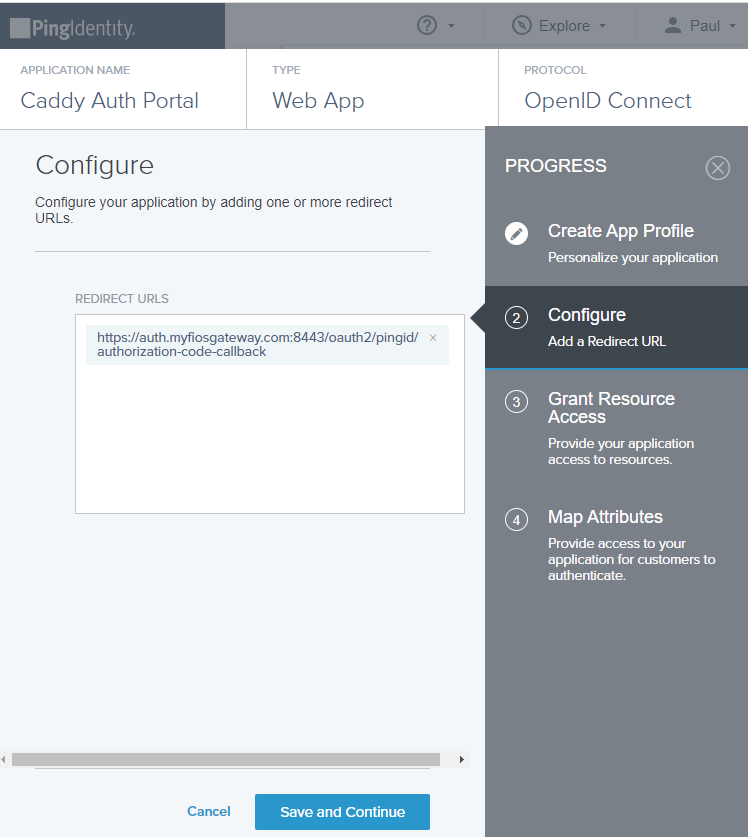](./images/ping_identity_04.png)

<figcaption>Historical redirect registration; replace its old mount and hostname.</figcaption>
</figure>

<figure className="doc-screenshot">

[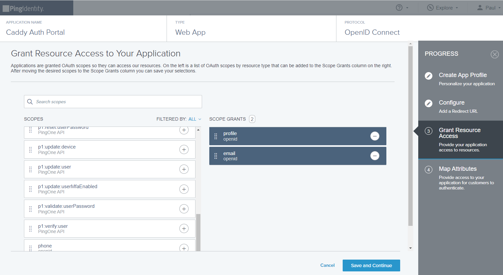](./images/ping_identity_05.png)

<figcaption>Historical openid/profile/email resource grants.</figcaption>
</figure>

<figure className="doc-screenshot">

[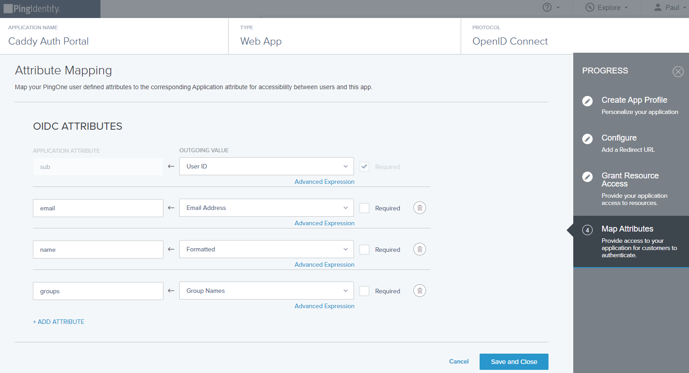](./images/ping_identity_06.png)

<figcaption>Historical OIDC attribute mapping.</figcaption>
</figure>

<figure className="doc-screenshot">

[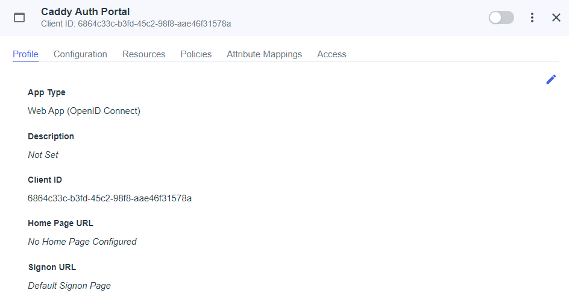](./images/ping_identity_07.png)

<figcaption>Historical application overview and client ID.</figcaption>
</figure>

<figure className="doc-screenshot">

[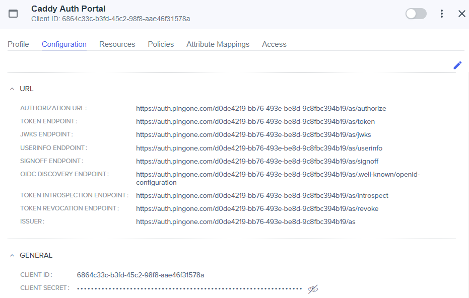](./images/ping_identity_08.png)

<figcaption>Historical endpoint list and discovery URL; copy your current environment values.</figcaption>
</figure>

<figure className="doc-screenshot">

[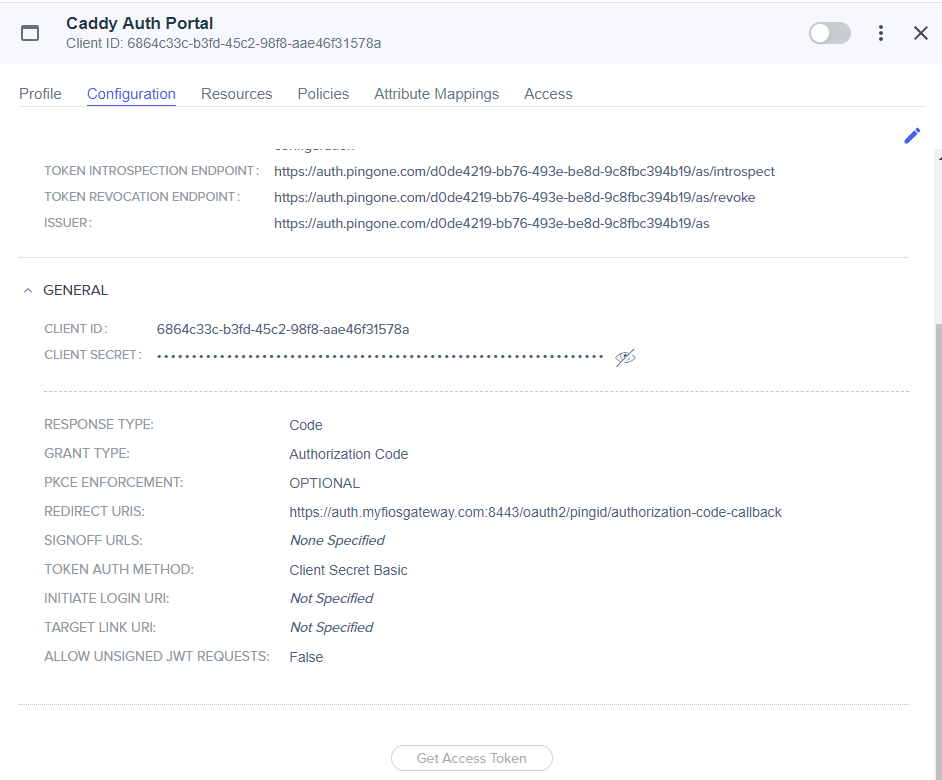](./images/ping_identity_09.png)

<figcaption>Historical token authentication settings defaulted to Client Secret Basic; use Post here.</figcaption>
</figure>

<figure className="doc-screenshot">

[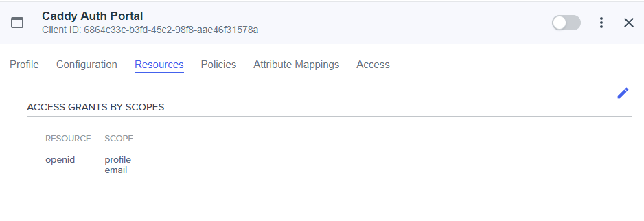](./images/ping_identity_10.png)

<figcaption>Historical scope grants.</figcaption>
</figure>

<figure className="doc-screenshot">

[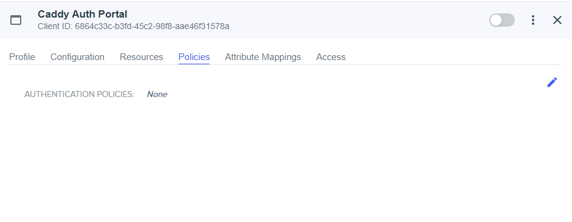](./images/ping_identity_11.png)

<figcaption>Historical sign-on policy assignment; apply your own organization policy.</figcaption>
</figure>

<figure className="doc-screenshot">

[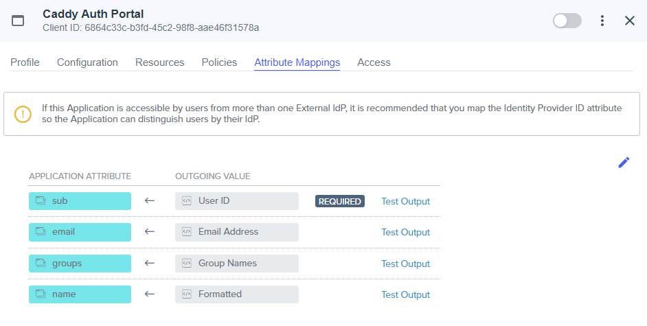](./images/ping_identity_12.png)

<figcaption>Historical group/name/email attribute mapping; this subject-based example does not require groups.</figcaption>
</figure>

<figure className="doc-screenshot">

[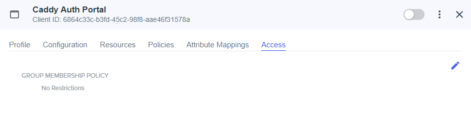](./images/ping_identity_13.png)

<figcaption>Historical application access policy; assignment and AuthCrunch authorization differ.</figcaption>
</figure>

<figure className="doc-screenshot">

[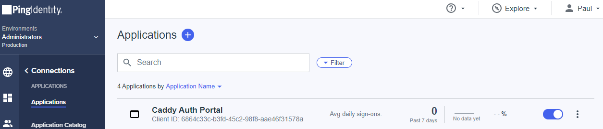](./images/ping_identity_14.png)

<figcaption>Historical application enable switch.</figcaption>
</figure>

<figure className="doc-screenshot">

[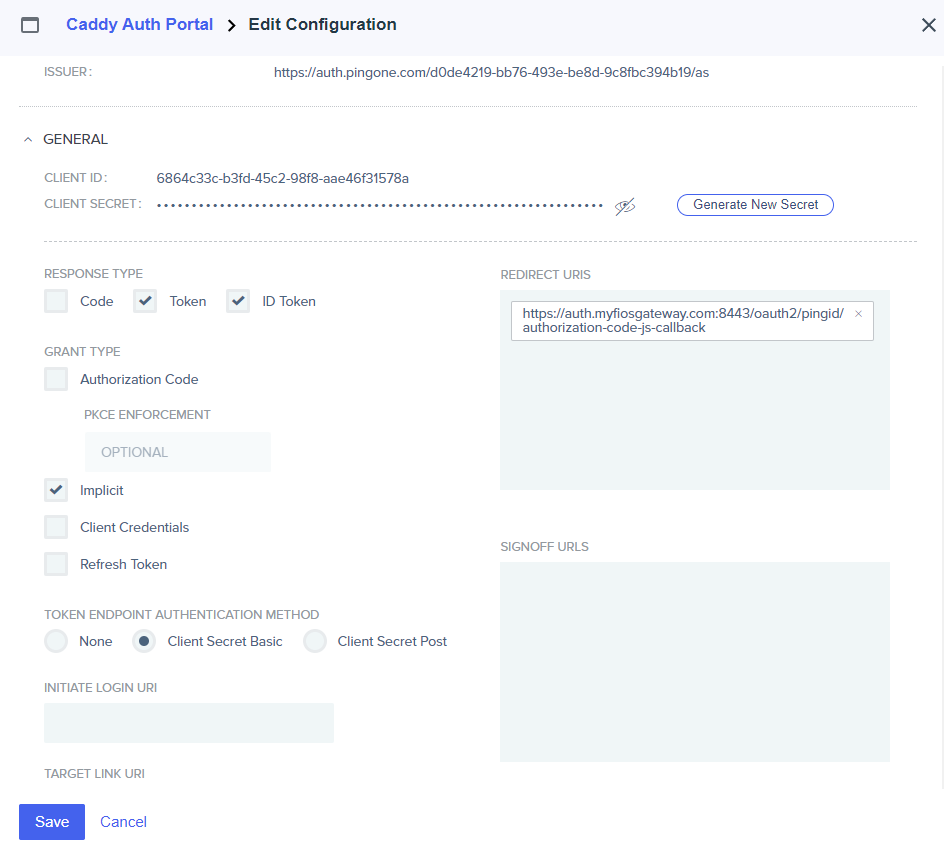](./images/ping_identity_15.png)

<figcaption>Historical implicit-flow selection; the current example uses authorization code.</figcaption>
</figure>

</details>
## Configure AuthCrunch

<CodeBlock language="caddyfile" title="assets/conf/oauth/pingid/Caddyfile">{example}</CodeBlock>
`PINGONE_ALLOWED_SUB` must be the entire exact observed subject. The transform
resets provider roles before granting the selected identity `app/member`.
PKCE is enabled by the generic driver; keep the application's PKCE policy
compatible. Never enable the old JS callback or implicit `token id_token` flow
merely to reproduce a screenshot.

If group-based access is preferable, emit a string-array `groups` claim in the
**ID token**, inspect its exact values, clear reserved roles, and map only the
intended group to `app/member`. The [generic OIDC guide](81-backend-oauth2-0000-generic.md)
explains claim sources and UserInfo limits.

## Verify and troubleshoot

Sign in through `/auth/oauth2/pingid`, inspect `/auth/whoami?format=json`, and
record the exact subject and realm without logging access tokens. Confirm that
an intended member reaches `/app` and another valid identity is denied. A
successful provider login alone does not establish application authorization.

Check callback scheme, hostname, port, mount, and realm literally; inspect
provider errors and [diagnostic logs](../../operations/logging.md). Keep client
secrets on the server. These examples are parser-verified against the released
bundle; console registration, live provider login, consent, and production TLS
require verification in your own organization.

## Agentic Prompts

Copy a prompt into your LLM to explore this topic. Each prompt prioritizes
upstream repository guidance and code over this page, and asks for version-aware
reasoning.

<div className="agentic-prompts">

<details>
<summary>Identify the Ping integration</summary>

```text
Help me understand Ping Identity.

Primary authorities (take precedence over website documentation):
https://github.com/greenpau/caddy-security/blob/main/AGENTS.md
https://github.com/greenpau/caddy-security/tree/main/.codex/skills
https://github.com/greenpau/go-authcrunch/blob/main/AGENTS.md
https://github.com/greenpau/go-authcrunch/tree/main/.codex/skills
Read each repository's root AGENTS.md first, then any scoped AGENTS.md that
applies to inspected paths. Read the relevant SKILL.md files and follow their
implementation and test references.

Relevant skills to locate: configuration-oauth-providers,
oauth-identity-provider.

Secondary reference:
https://docs.authcrunch.com/docs/authenticate/oauth/backend-oauth2-0010-pingid

If a source is inaccessible, ask me to paste its relevant text. Identify the
versions your answer applies to; main may be newer than my release. Resolve
disagreements using code and tests, and flag unverified claims. Use synthetic
credentials and redacted examples; explain proposed checks before any changes.

Explain PingOne OIDC with the historical pingid realm separately from the
PingID mobile authentication API. Trace provider sign-on/MFA policy, returned
identity, portal transform, and app ACL. Do not infer a dedicated mobile API
from the page’s old route name.
```

</details>

<details>
<summary>Review environment endpoints</summary>

```text
Help me understand Ping Identity.

Primary authorities (take precedence over website documentation):
https://github.com/greenpau/caddy-security/blob/main/AGENTS.md
https://github.com/greenpau/caddy-security/tree/main/.codex/skills
https://github.com/greenpau/go-authcrunch/blob/main/AGENTS.md
https://github.com/greenpau/go-authcrunch/tree/main/.codex/skills
Read each repository's root AGENTS.md first, then any scoped AGENTS.md that
applies to inspected paths. Read the relevant SKILL.md files and follow their
implementation and test references.

Relevant skills to locate: configuration-oauth-providers,
oauth-identity-provider.

Secondary reference:
https://docs.authcrunch.com/docs/authenticate/oauth/backend-oauth2-0010-pingid

If a source is inaccessible, ask me to paste its relevant text. Identify the
versions your answer applies to; main may be newer than my release. Resolve
disagreements using code and tests, and flag unverified claims. Use synthetic
credentials and redacted examples; explain proposed checks before any changes.

Read a confidential PingOne client’s environment/issuer discovery, exact
callback, authorization code, and Client Secret Post setting. Explain browser
versus server reachability and form-body client authentication. Consult
current official PingOne settings rather than assuming a console default.
```

</details>

<details>
<summary>Choose a membership claim</summary>

```text
Help me understand Ping Identity.

Primary authorities (take precedence over website documentation):
https://github.com/greenpau/caddy-security/blob/main/AGENTS.md
https://github.com/greenpau/caddy-security/tree/main/.codex/skills
https://github.com/greenpau/go-authcrunch/blob/main/AGENTS.md
https://github.com/greenpau/go-authcrunch/tree/main/.codex/skills
Read each repository's root AGENTS.md first, then any scoped AGENTS.md that
applies to inspected paths. Read the relevant SKILL.md files and follow their
implementation and test references.

Relevant skills to locate: configuration-oauth-providers,
oauth-identity-provider.

Secondary reference:
https://docs.authcrunch.com/docs/authenticate/oauth/backend-oauth2-0010-pingid

If a source is inaccessible, ask me to paste its relevant text. Identify the
versions your answer applies to; main may be newer than my release. Resolve
disagreements using code and tests, and flag unverified claims. Use synthetic
credentials and redacted examples; explain proposed checks before any changes.

Compare a realm-scoped exact subject allowlist with an
administrator-controlled ID-token groups array. Explain supported generic
claim paths and optional UserInfo limitations. Keep application membership
distinct from provider MFA completion.
```

</details>

<details>
<summary>Diagnose a PingOne failure</summary>

```text
Help me understand Ping Identity.

Primary authorities (take precedence over website documentation):
https://github.com/greenpau/caddy-security/blob/main/AGENTS.md
https://github.com/greenpau/caddy-security/tree/main/.codex/skills
https://github.com/greenpau/go-authcrunch/blob/main/AGENTS.md
https://github.com/greenpau/go-authcrunch/tree/main/.codex/skills
Read each repository's root AGENTS.md first, then any scoped AGENTS.md that
applies to inspected paths. Read the relevant SKILL.md files and follow their
implementation and test references.

Relevant skills to locate: configuration-oauth-providers,
oauth-identity-provider.

Secondary reference:
https://docs.authcrunch.com/docs/authenticate/oauth/backend-oauth2-0010-pingid

If a source is inaccessible, ask me to paste its relevant text. Identify the
versions your answer applies to; main may be newer than my release. Resolve
disagreements using code and tests, and flag unverified claims. Use synthetic
credentials and redacted examples; explain proposed checks before any changes.

Help me separate wrong environment discovery, Basic-versus-Post client
authentication, callback mismatch, missing ID-token email/group, and
post-login 403. Ask for redacted metadata and claim shapes. Preserve state,
PKCE, nonce, and signature trust.
```

</details>

<details>
<summary>Verify the intended access boundary</summary>

```text
Help me understand Ping Identity.

Primary authorities (take precedence over website documentation):
https://github.com/greenpau/caddy-security/blob/main/AGENTS.md
https://github.com/greenpau/caddy-security/tree/main/.codex/skills
https://github.com/greenpau/go-authcrunch/blob/main/AGENTS.md
https://github.com/greenpau/go-authcrunch/tree/main/.codex/skills
Read each repository's root AGENTS.md first, then any scoped AGENTS.md that
applies to inspected paths. Read the relevant SKILL.md files and follow their
implementation and test references.

Relevant skills to locate: configuration-oauth-providers,
oauth-identity-provider.

Secondary reference:
https://docs.authcrunch.com/docs/authenticate/oauth/backend-oauth2-0010-pingid

If a source is inaccessible, ask me to paste its relevant text. Identify the
versions your answer applies to; main may be newer than my release. Resolve
disagreements using code and tests, and flag unverified claims. Use synthetic
credentials and redacted examples; explain proposed checks before any changes.

Create cases for selected subject/member, another valid identity, wrong group,
reserved-role injection, and fresh login after mapping changes. Include portal
logout versus PingOne SSO. Explain what live registration checks add beyond
local OIDC fixtures.
```

</details>

</div>

## Source Code References

Start with the code search, then follow the parser, runtime, and tests relevant
to this topic. These links target `main`; use GitHub's branch/tag selector to
compare them with your installed release.

1. [Search this topic in both repositories](https://github.com/search?q=%28repo%3Agreenpau%2Fgo-authcrunch%20OR%20repo%3Agreenpau%2Fcaddy-security%29%20%28generic%20OR%20metadata_url%20OR%20client_secret_post%29&type=code)
   — searches topic-specific symbols and paths across both codebases.
2. [caddy-security: caddyfile_identity_provider_oauth.go](https://github.com/greenpau/caddy-security/blob/main/caddyfile_identity_provider_oauth.go)
   — adapts OAuth/OIDC provider settings, scopes, endpoints, and trust options.
3. [go-authcrunch: pkg/idp/oauth/config.go](https://github.com/greenpau/go-authcrunch/blob/main/pkg/idp/oauth/config.go)
   — validates generic and named-driver defaults and endpoint settings.
4. [go-authcrunch: pkg/idp/oauth/provider.go](https://github.com/greenpau/go-authcrunch/blob/main/pkg/idp/oauth/provider.go)
   — loads discovery metadata, provider readiness, and driver setup.
5. [go-authcrunch: pkg/idp/oauth/authenticate.go](https://github.com/greenpau/go-authcrunch/blob/main/pkg/idp/oauth/authenticate.go)
   — handles authorization callbacks, token exchange, and identity completion.
6. [go-authcrunch: pkg/idp/oauth/claim_parser.go](https://github.com/greenpau/go-authcrunch/blob/main/pkg/idp/oauth/claim_parser.go)
   — maps supported token claims into the normalized provider identity.
7. [go-authcrunch: pkg/idp/oauth/claim_parser_test.go](https://github.com/greenpau/go-authcrunch/blob/main/pkg/idp/oauth/claim_parser_test.go)
   — tests supported claim paths and rejected value shapes.
