# Keycloak

Find Keycloak integration example in the following [`Caddyfile`](https://github.com/greenpau/caddy-auth-docs/blob/main/assets/conf/oauth/keycloak/Caddyfile).

## Realm Roles

Create a set of roles that will be later mapped to group memberships.

* `authp/admin`
* `authp/user`
* `authp/guest`

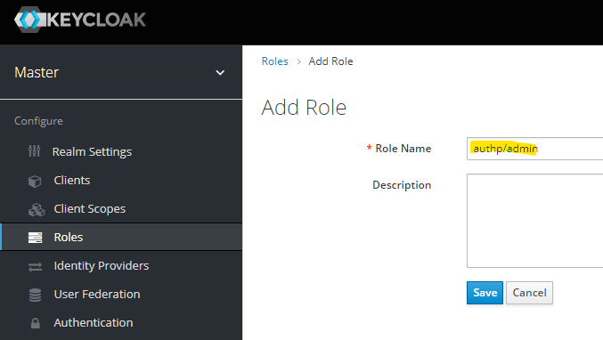

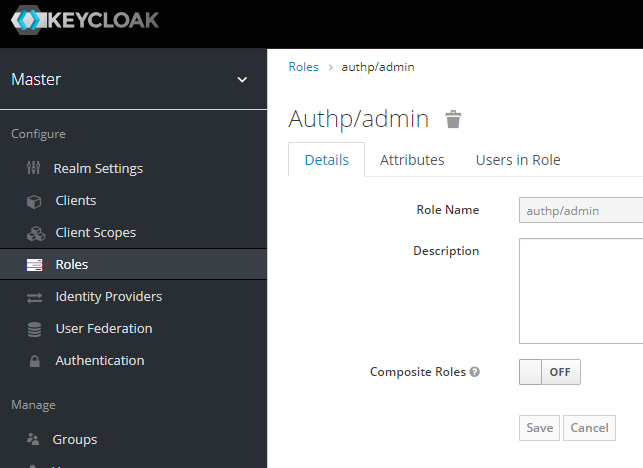

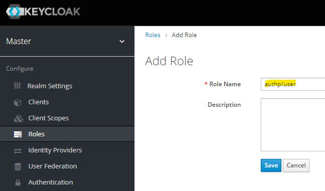


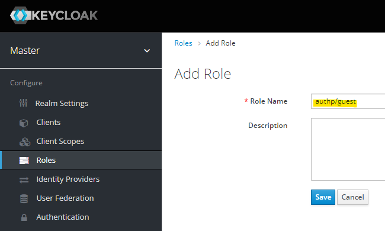

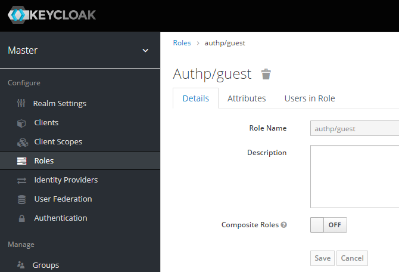

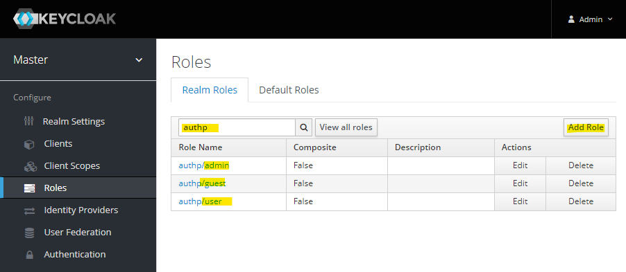

## Groups

First, create "Admins", "Editors", and "Viewer" groups under "Manage", "Groups".

Create "Admins" group:


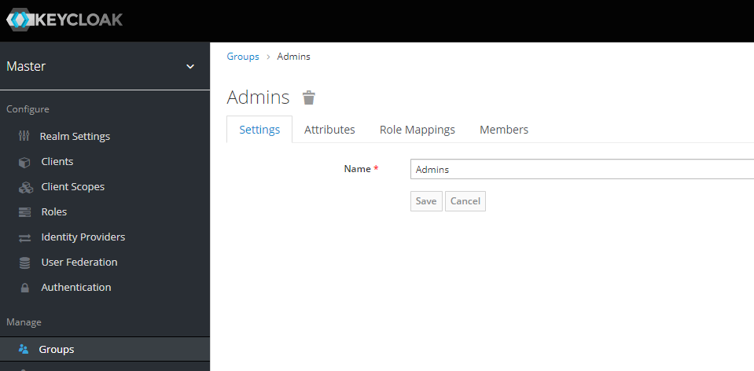

Assign the previously created `authp/admin` role to "Admins" group:


Create "Editors" group:

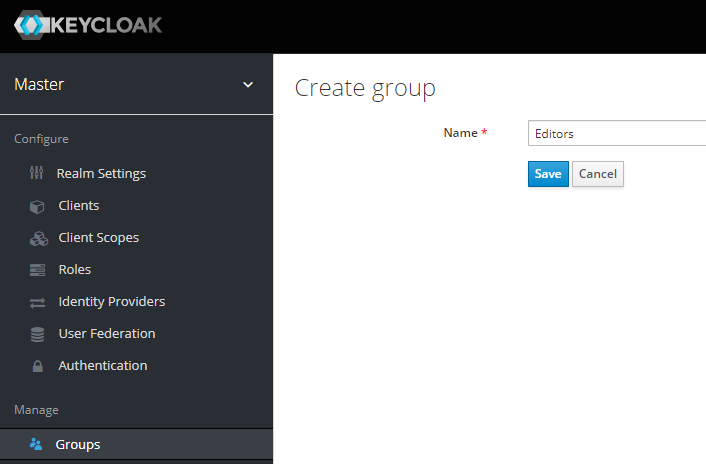

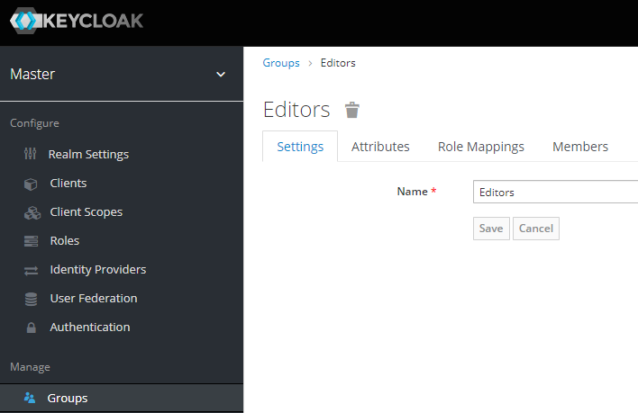

Assign the previously created `authp/user` role to "Editors" group:

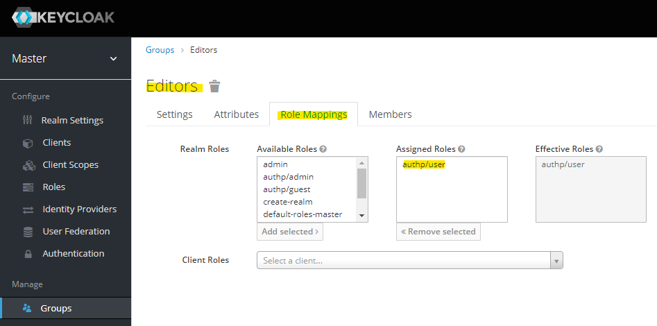

Create "Viewers" group:

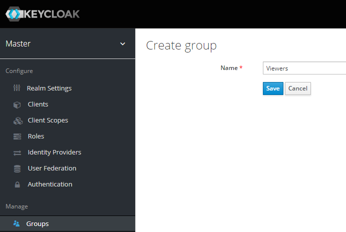


Assign the previously created `authp/guest` role to "Viewers" group:


The list of realm roles follows.


## Users

Next, create a new user under "Manage", "Users". As part of the process assign
the newly created groups to the user.


Then, click "View all users" and click on the ID of the newly created user:


Browse to "Credentials" tab and set user password.


Browser to "Role Mappings" tab and see that the "Effective Roles".

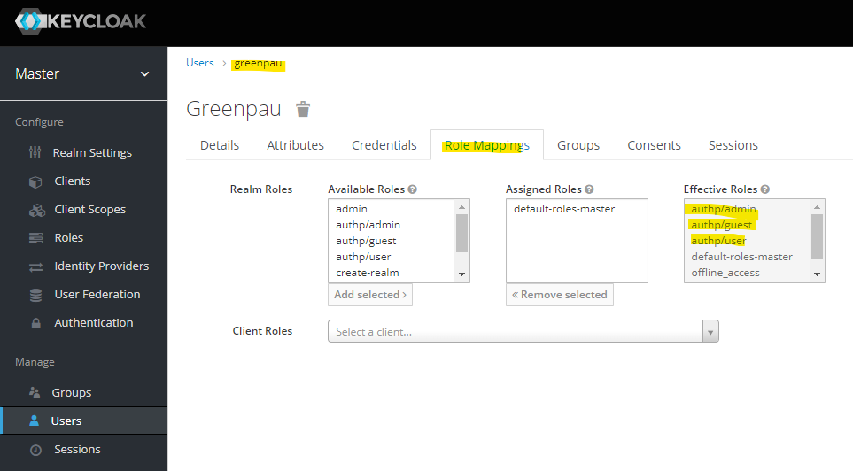

Test the login by the user. The URL is `https://keycloak/auth/realms/master/account/`.


## Realm

Disable a number of providers under "Configure", "Realm Settings", "Keys", and "Providers".


At the end, you should have `rsa-generated` provider only.


## Client

Add client configuration. See screenshots.

Set "Valid Redirect URIs" to your callback endpoint,
e.g. `https://auth.myfiosgateway.com:8443/oauth2/keycloak/authorization-code-callback`.

Set "Base URL" to the authentication portal, e.g. `https://auth.myfiosgateway.com:8443/`.

The "well-known" configuration URL would be:

```
http://keycloak/auth/realms/{realm}/.well-known/openid-configuration
https://keycloak.axi92.at/auth/realms/master/.well-known/openid-configuration
```


Confirm the configuration.


Browse to "Mappers" tab of the client config.

Click "Create" and add `email` property.


Next, click "Add Builtin" and add "groups" property.


Review the created mappers.

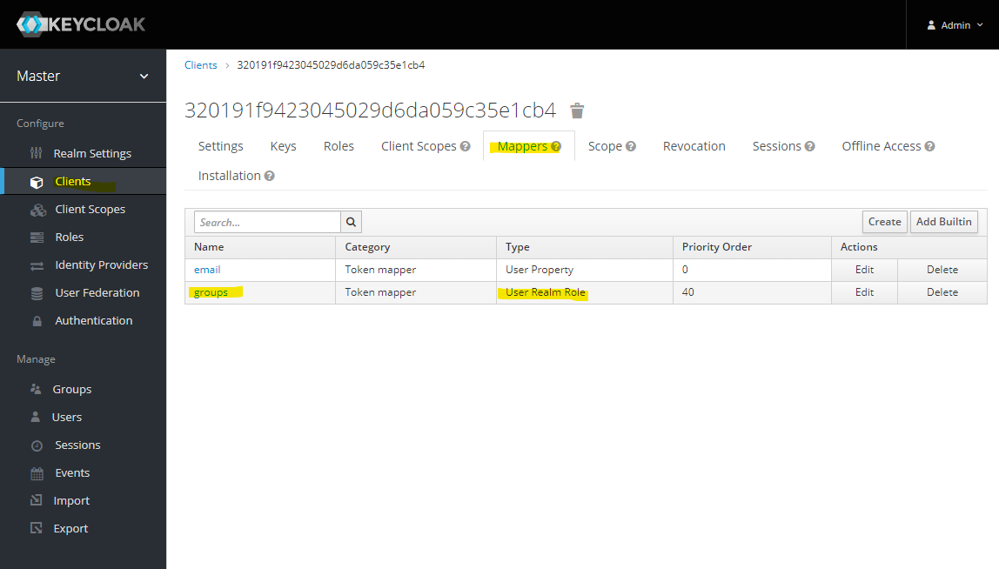

## User Login

The user's profile now has the new application.


The login to authentication portal will succeed and `/whoami` will reflect the assigned groups.

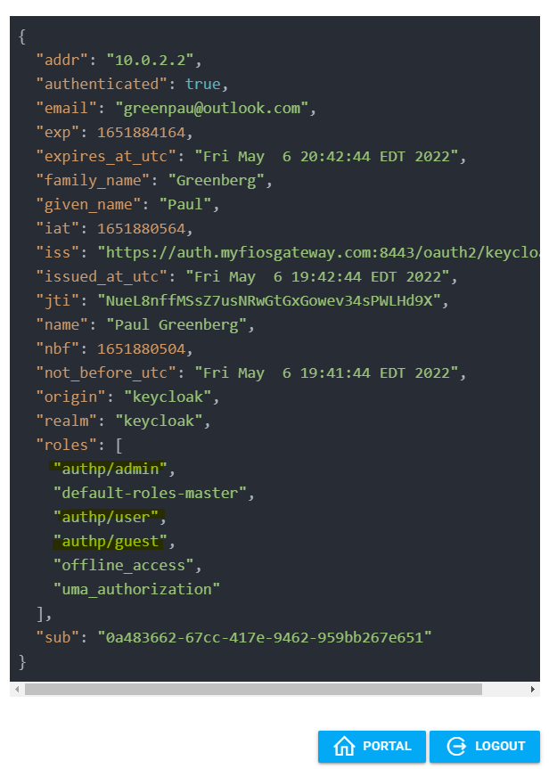
