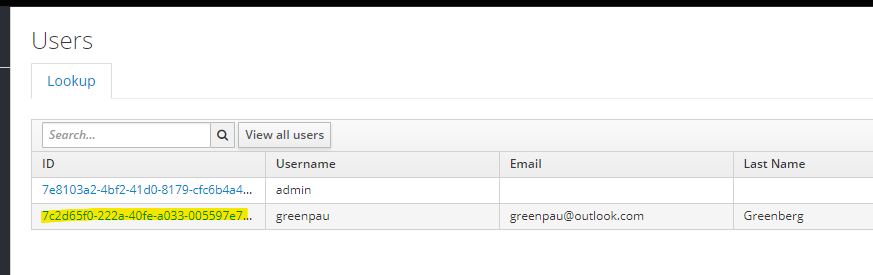
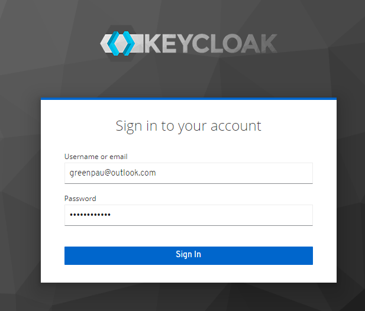
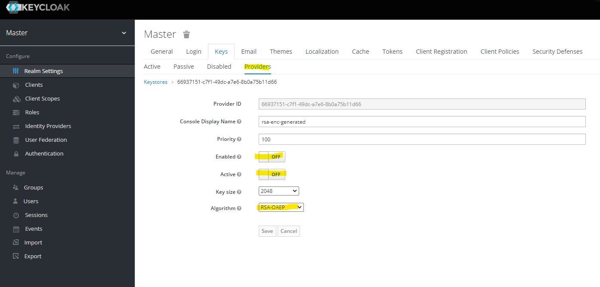
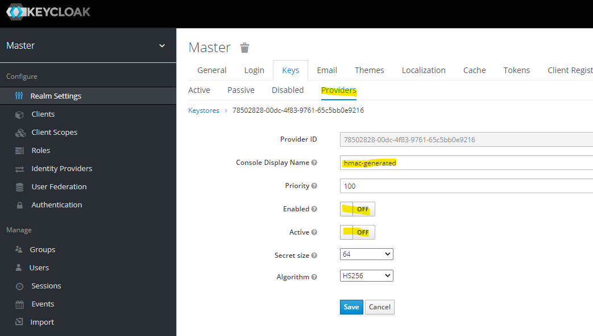
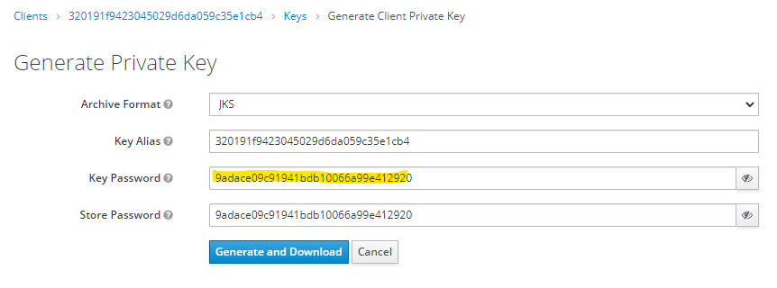
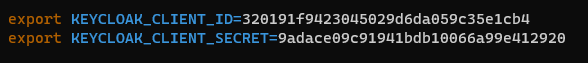

# Keycloak

Find Keycloak integration example in the following [`Caddyfile`](https://github.com/greenpau/caddy-auth-docs/blob/main/assets/conf/oauth/keycloak/Caddyfile).

## User and Group

First, create "Admin", "Editors", and "Viewer" groups under "Manager", "Groups".

Next, create a new user under "Manager", "Users". As part of the process assign
the newly created groups to the user.


Then, click "View all users" and click on the ID of the newly created user:



Browse to "Credentials" tab and set user password.


Test the login by the user. The URL is `https://keycloak/auth/realms/master/account/`.




## Realm

Disable a number of providers under "Configure", "Realm Settings", "Keys", and "Providers".






At the end, you should have `rsa-generated` provider only.


## Client

Add client configuration. See screenshots.

Set "Valid Redirect URIs" to your callback endpoint,
e.g. `https://auth.myfiosgateway.com:8443/oauth2/keycloak/authorization-code-callback`.

Set "Base URL" to the authentication portal, e.g. `https://auth.myfiosgateway.com:8443/`.

The "well-known" configuration URL would be:

```
http://keycloak/auth/realms/{realm}/.well-known/openid-configuration
https://keycloak.axi92.at/auth/realms/master/.well-known/openid-configuration
```







Confirm the configuration.


## User Login

The user's profile now has the new application.


The login to authentication portal will succeed.


