import CodeBlock from '@theme/CodeBlock';
import caddyfile from '@site/assets/conf/oauth/keycloak/Caddyfile?raw';

# Keycloak

Sign in with Keycloak and let an AuthCrunch policy protect your application.
This walkthrough admits members of one Keycloak group. Other users can sign in
to the portal but cannot access the app.

The integration was tested with **Keycloak 26.7.4** and the published
**caddy-security v1.3.0** bundle, containing **go-authcrunch v1.3.8**. Real browser
logins against a disposable local Keycloak instance verified PKCE, claim mapping,
and application access. Public HTTPS and your deployment's network paths still
need verification.

## Before you start

Have an existing Keycloak server and permission to manage a realm and client.
For a new server, follow Keycloak's [getting-started guide](https://www.keycloak.org/getting-started/getting-started-docker)
and [production configuration guidance](https://www.keycloak.org/server/configuration-production).
Complete [Install and verify](../../start/install.md) for the AuthCrunch binary.

This example uses two public HTTPS hosts. Replace them with your own:

| Name | Value in this guide |
| --- | --- |
| Keycloak server | `https://id.example.com` |
| Keycloak realm | `example` |
| Keycloak client ID | `authcrunch` |
| AuthCrunch portal | `https://auth.example.com/auth/` |
| AuthCrunch provider name and realm | `keycloak` |
| Protected application | `https://auth.example.com/app` |

The Keycloak realm selects the tenant. The AuthCrunch realm identifies the
login source inside the portal. They serve different purposes and need not
share a name.

## Realm

Create a realm named `example`, or select an existing application realm. Keep
`master` for Keycloak administration, as described in
[Keycloak's realm setup](https://www.keycloak.org/getting-started/getting-started-docker#create-a-realm).
Leave the realm's signing-key providers in place; this integration retrieves
public verification keys through discovery.

Check this URL from the AuthCrunch server:

```text
https://id.example.com/realms/example/.well-known/openid-configuration
```

The response's `issuer` should be `https://id.example.com/realms/example`, and
its endpoints must be reachable by the browser or server that uses them. Current
Keycloak deployments use `/realms/…` by default. Include an additional `/auth`
prefix only if your deployment actually configures it. See
[Keycloak's OIDC endpoints](https://www.keycloak.org/securing-apps/oidc-layers).

<details className="screenshot-gallery">
<summary>Earlier console reference: realm signing keys</summary>

These images document the old realm-key screens. Keep the current realm signing-key providers enabled as described above; the disabled switches and reduced key list in these historical captures are not steps to reproduce. The current integration discovers the provider’s public keys.

<figure className="doc-screenshot">

[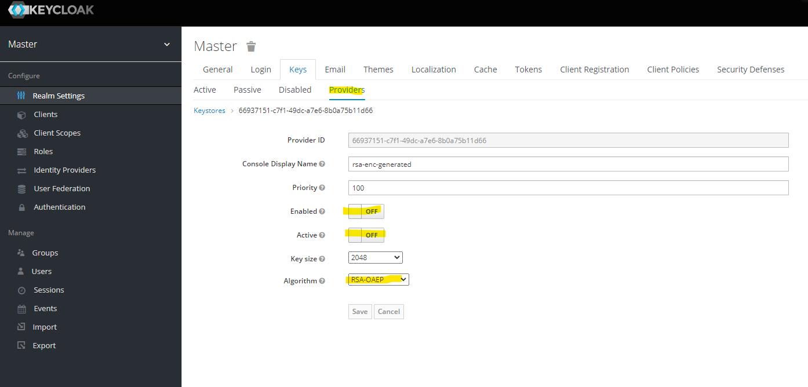](./images/keycloak/keycloak_realm_1.png)

<figcaption>Earlier realm key-provider form, retained to identify the legacy screen. Select the image to view it at full size.</figcaption>
</figure>
<figure className="doc-screenshot">

[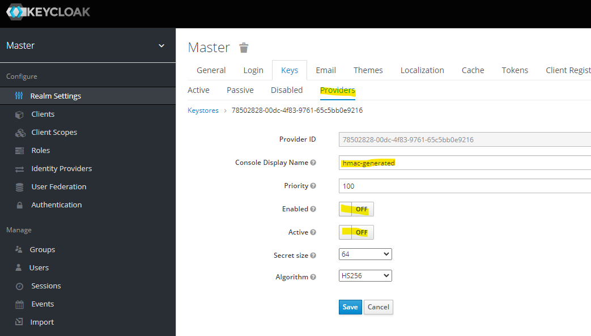](./images/keycloak/keycloak_realm_2.png)

<figcaption>Historical disabled HMAC provider: this is not required for the current integration. Select the image to view it at full size.</figcaption>
</figure>
<figure className="doc-screenshot">

[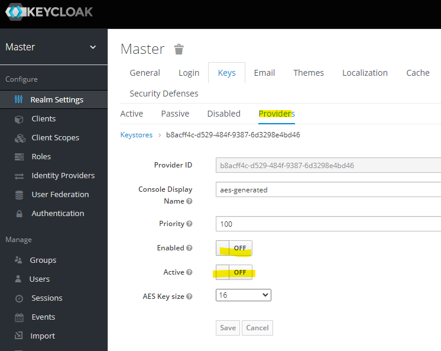](./images/keycloak/keycloak_realm_3.png)

<figcaption>Historical disabled AES provider: leave current provider settings intact for this walkthrough. Select the image to view it at full size.</figcaption>
</figure>
<figure className="doc-screenshot">

[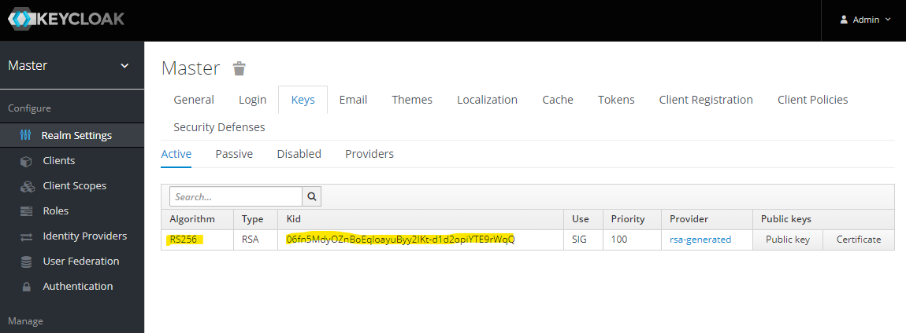](./images/keycloak/keycloak_realm_4.png)

<figcaption>A historical key list does not define which providers your current realm should retain. Select the image to view it at full size.</figcaption>
</figure>

</details>

## Client

In the `example` realm, create an **OpenID Connect** client with client ID
`authcrunch`. Configure these capabilities and URLs:

| Setting | Value |
| --- | --- |
| Client authentication | On; AuthCrunch is a confidential server-side client |
| Standard flow | On |
| Implicit flow, Direct access grants, Service accounts | Off for this integration |
| Home URL | `https://auth.example.com/auth/` |
| Valid redirect URIs | `https://auth.example.com/auth/oauth2/keycloak/authorization-code-callback` |
| Require PKCE | On |
| PKCE Method | `S256` |

Use the exact redirect URI. The code exchange happens on the server; the
walkthrough does not require a wildcard redirect or browser CORS access to the
token endpoint. Save the client and copy its secret from **Credentials**.
Keep the client secret out of the browser and repository.

The generic driver sends the client ID and secret in the token request body.
Use Keycloak's client ID/secret authentication for this setup, rather than a
signed client assertion. The driver already sends S256 PKCE; configure the
client to require that method. See the
[Keycloak OIDC client settings](https://www.keycloak.org/docs/latest/server_admin/index.html#_oidc_clients).

<details className="screenshot-gallery">
<summary>Screenshots: client registration in the earlier Keycloak console</summary>

The older console used Access Type = confidential; current Keycloak uses Client authentication = On. The screenshots use the master realm and old example URLs. Use the application realm, exact callback, flow settings, and S256 PKCE from this guide.

<figure className="doc-screenshot">

[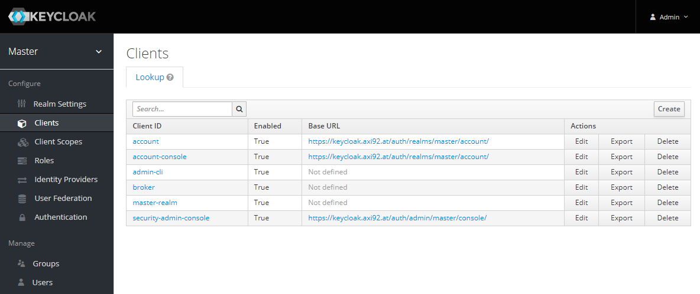](./images/keycloak/keycloak_new_client_1.png)

<figcaption>Open Clients in your application realm. Select the image to view it at full size.</figcaption>
</figure>
<figure className="doc-screenshot">

[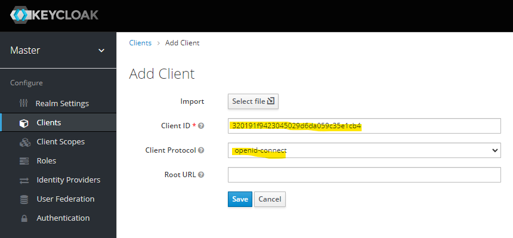](./images/keycloak/keycloak_new_client_2.png)

<figcaption>Create an OpenID Connect client with your chosen client ID. Select the image to view it at full size.</figcaption>
</figure>
<figure className="doc-screenshot">

[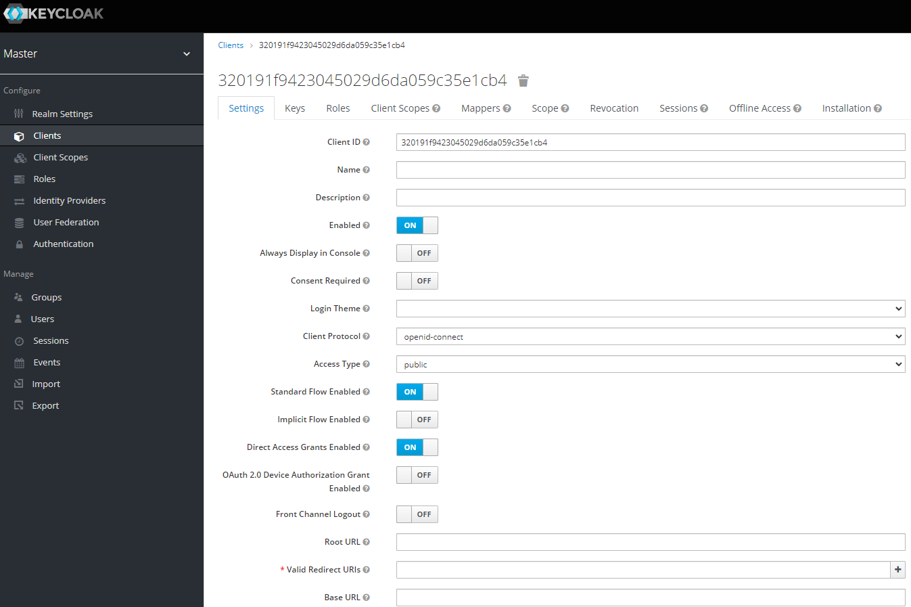](./images/keycloak/keycloak_new_client_3.png)

<figcaption>The legacy client settings layout predates the current Capability config and Login settings screens. Select the image to view it at full size.</figcaption>
</figure>
<figure className="doc-screenshot">

[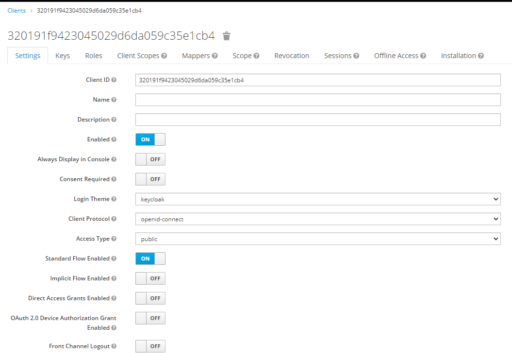](./images/keycloak/keycloak_client_config_1.png)

<figcaption>Use current Client authentication and flow controls from the table above. Select the image to view it at full size.</figcaption>
</figure>
<figure className="doc-screenshot">

[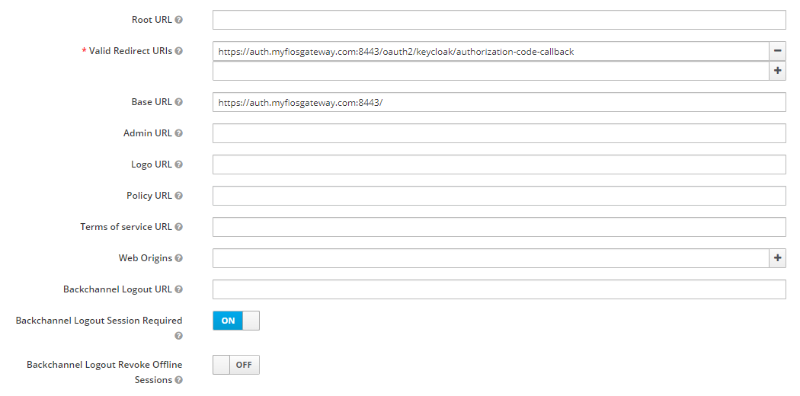](./images/keycloak/keycloak_client_config_2.png)

<figcaption>Use the exact current portal callback; the hostname and mount shown here are historical. Select the image to view it at full size.</figcaption>
</figure>
<figure className="doc-screenshot">

[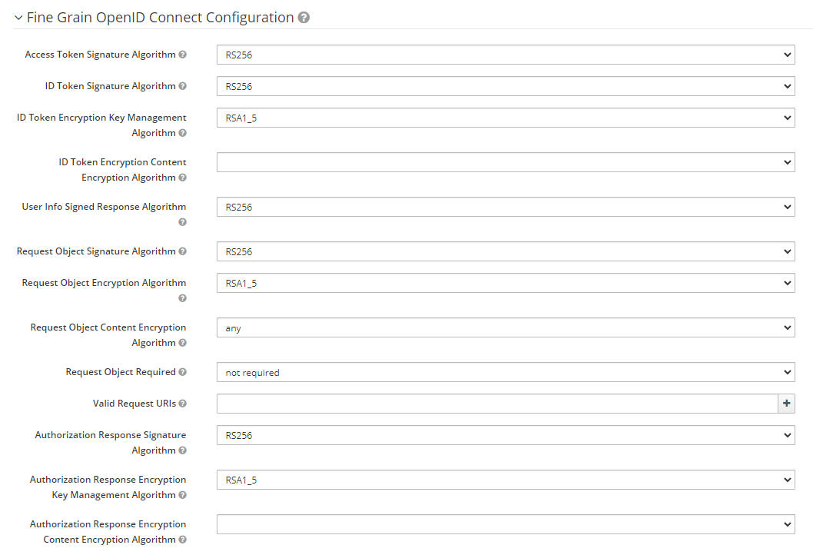](./images/keycloak/keycloak_client_config_3.png)

<figcaption>Earlier advanced settings for comparison; do not copy these options over the current client defaults. Select the image to view it at full size.</figcaption>
</figure>

</details>

<details className="screenshot-gallery">
<summary>Earlier console reference: client keys and credentials</summary>

This sequence came from the old client-key walkthrough. The current configuration authenticates with a client secret from Credentials; it does not require generating a JKS archive or reusing a key-store password as that secret. The password fields and exported secret below are redacted.

<figure className="doc-screenshot">

[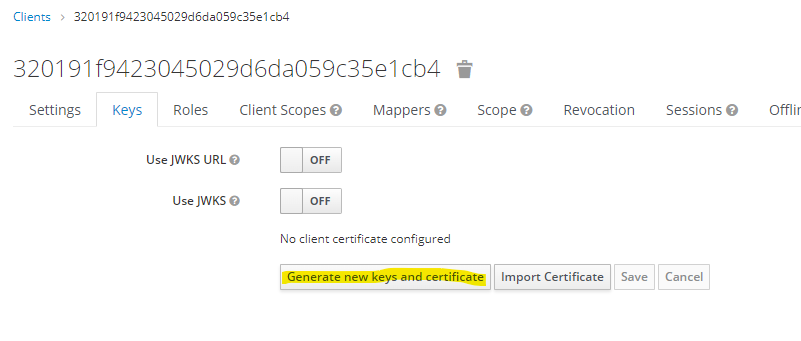](./images/keycloak/keycloak_new_client_4.png)

<figcaption>Legacy client key management, separate from the client-secret setup used here. Select the image to view it at full size.</figcaption>
</figure>
<figure className="doc-screenshot">

[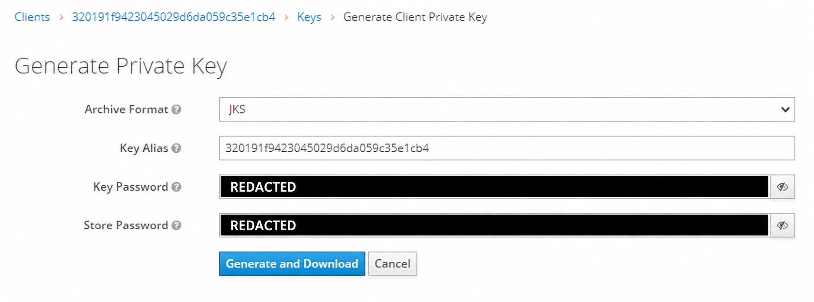](./images/keycloak/keycloak_new_client_5-redacted.png)

<figcaption>Historical JKS export form with passwords redacted; this step is not part of the current integration. Select the image to view it at full size.</figcaption>
</figure>
<figure className="doc-screenshot">

[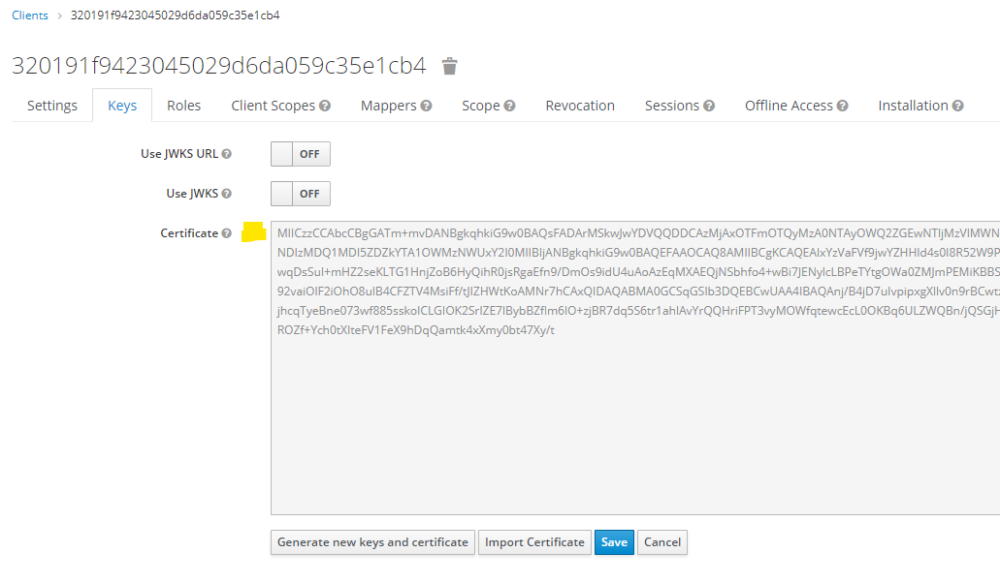](./images/keycloak/keycloak_new_client_6.png)

<figcaption>The legacy client certificate display is retained as a reference, not a current client-authentication requirement. Select the image to view it at full size.</figcaption>
</figure>
<figure className="doc-screenshot">

[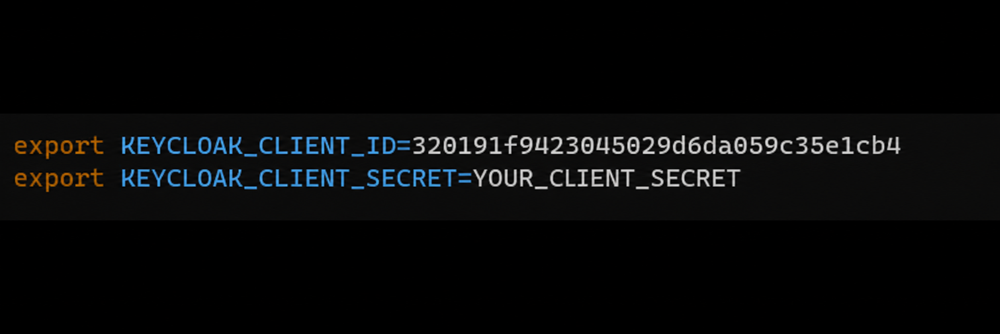](./images/keycloak/keycloak_new_client_7-redacted.png)

<figcaption>The environment-variable names remain useful. Use the real client secret from Credentials, not the historical key-store password. Select the image to view it at full size.</figcaption>
</figure>

</details>

### Map groups into the ID token

Keep the client's `profile` and `email` scopes. Add a **Group Membership**
protocol mapper for this client, with these settings:

| Mapper setting | Value |
| --- | --- |
| Name | `authcrunch-groups` |
| Token Claim Name | `groups` |
| Full group path | On |
| Add to ID token | On |
| Add to access token | Off for this example |
| Add to userinfo | Off for this example |

<figure className="doc-screenshot">

[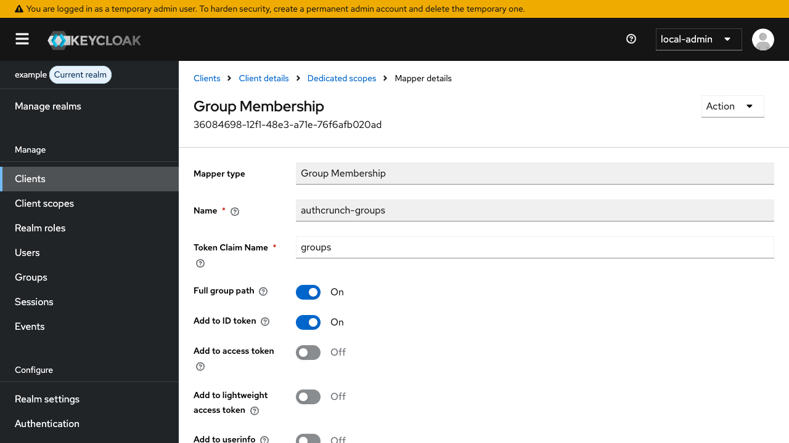](./images/keycloak/keycloak_26_7_4_group_mapper.png)

<figcaption>Keycloak 26.7.4, captured in the disposable test realm: Full group path and Add to ID token are enabled. The temporary-admin banner belongs to that local test environment. Select the image to view it at full size.</figcaption>
</figure>


Use the client's dedicated scope so this mapping applies to this client.
In the client, open **Client scopes**, select its dedicated scope, and add a
mapper **By configuration → Group Membership**. This is ordinary realm group
membership, not an Organization Group Membership mapper.

With full paths enabled, a member of the top-level `app-members` group receives
this ID-token claim:

```json
{
  "groups": ["/app-members"]
}
```

The leading slash matters. AuthCrunch combines group claims into its roles,
so the Caddyfile matches the exact role `/app-members`. Putting the mapper only
on UserInfo does not supply this example's ID-token claim.

<details className="screenshot-gallery">
<summary>Screenshots: claim mappers in the earlier console</summary>

Current Keycloak keeps this configuration in the client’s dedicated scope. These older screenshots show the previous Mappers tab and help connect the email/groups claim names to their protocol mappers.

<figure className="doc-screenshot">

[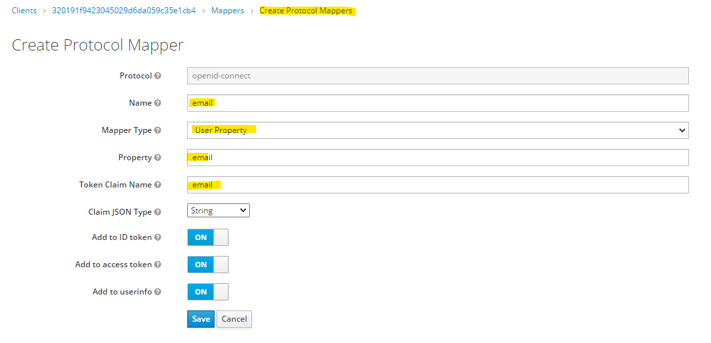](./images/keycloak/keycloak_client_create_mapper.png)

<figcaption>An older email mapper with Add to ID token enabled. The current walkthrough retains the email client scope. Select the image to view it at full size.</figcaption>
</figure>
<figure className="doc-screenshot">

[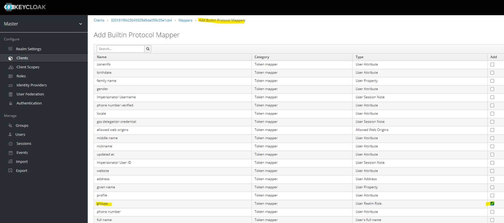](./images/keycloak/keycloak_client_add_builtin_mapper.png)

<figcaption>The older built-in mapper picker. In the current console, use By configuration → Group Membership. Select the image to view it at full size.</figcaption>
</figure>
<figure className="doc-screenshot">

[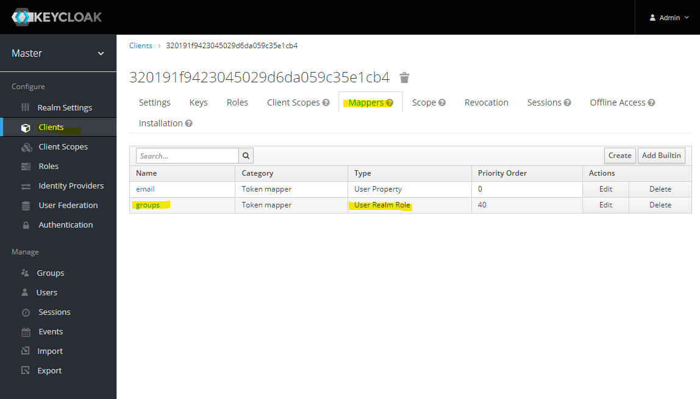](./images/keycloak/keycloak_client_mappers.png)

<figcaption>Verify the effective mappers on your current client’s dedicated scope. Select the image to view it at full size.</figcaption>
</figure>

</details>

## Groups

Create a top-level group named `app-members`. Assign only the intended
application users to it. In this walkthrough, Alice is a member and Bob is not.

| Stage | Access information |
| --- | --- |
| Keycloak membership | Alice belongs to `/app-members` |
| Keycloak ID token | Contains `groups: ["/app-members"]` |
| AuthCrunch transform | Matches realm `keycloak` and role `/app-members` |
| AuthCrunch application token | Receives `app/member` |
| Application policy | Allows `app/member` |

The transform also gives every signed-in Keycloak user `authp/user` for ordinary
portal access. That role does not meet the application's rule.

<details className="screenshot-gallery">
<summary>Screenshots: group creation and role mappings in the earlier console</summary>

The older example used Admins, Editors, and Viewers groups with portal roles. The current example needs one app-members group and a separate AuthCrunch transform that grants app/member. These screenshots illustrate the group editor and where role mappings were displayed; do not grant portal administration just to permit app access.

<figure className="doc-screenshot">

[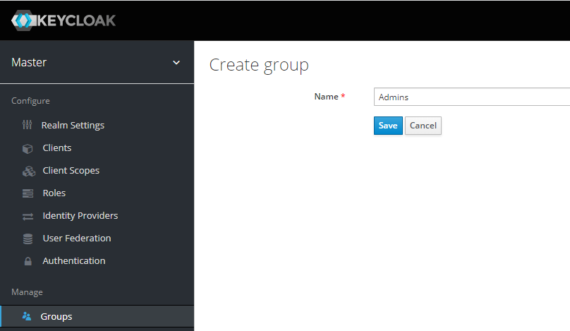](./images/keycloak/keycloak_new_group_1a.png)

<figcaption>Group creation dialog in the earlier console. Select the image to view it at full size.</figcaption>
</figure>
<figure className="doc-screenshot">

[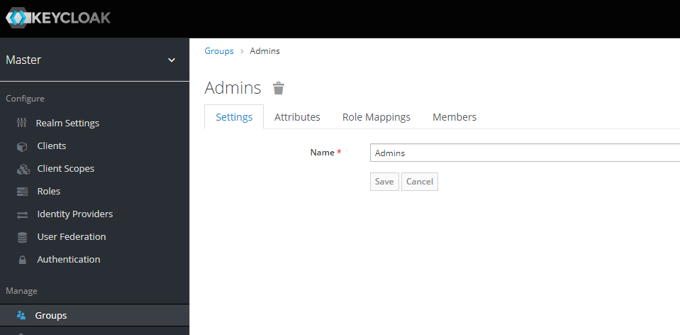](./images/keycloak/keycloak_new_group_1b.png)

<figcaption>Group settings and the Role Mappings tab. Select the image to view it at full size.</figcaption>
</figure>
<figure className="doc-screenshot">

[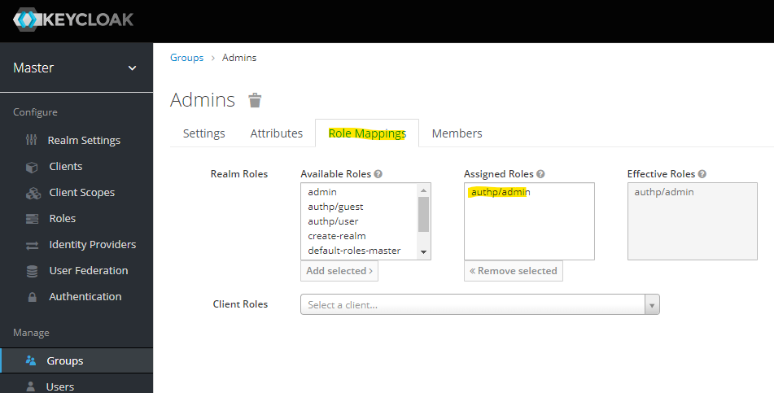](./images/keycloak/keycloak_new_group_1c.png)

<figcaption>Historical admin-role mapping. The app-members group in this guide does not require authp/admin. Select the image to view it at full size.</figcaption>
</figure>
<figure className="doc-screenshot">

[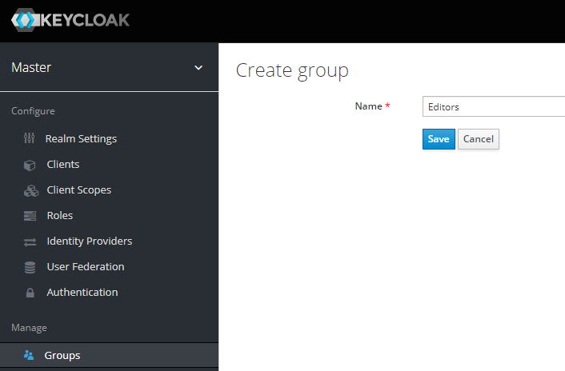](./images/keycloak/keycloak_new_group_2a.png)

<figcaption>A second group in the original walkthrough. Select the image to view it at full size.</figcaption>
</figure>
<figure className="doc-screenshot">

[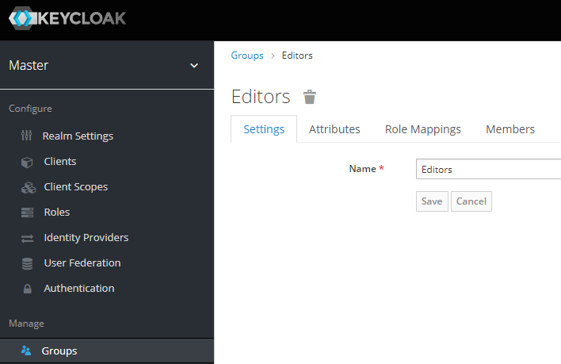](./images/keycloak/keycloak_new_group_2b.png)

<figcaption>Editing a group’s name and settings. Select the image to view it at full size.</figcaption>
</figure>
<figure className="doc-screenshot">

[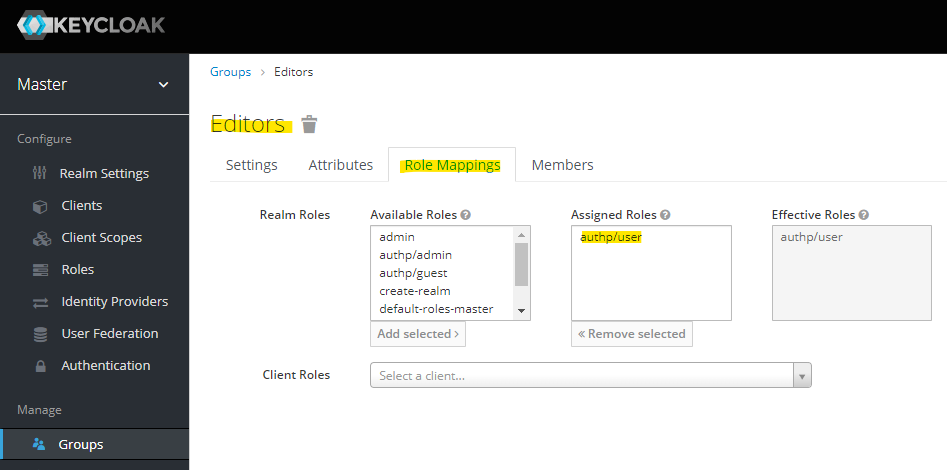](./images/keycloak/keycloak_new_group_2c.png)

<figcaption>A historical group-to-realm-role mapping, distinct from the current group-claim transform. Select the image to view it at full size.</figcaption>
</figure>
<figure className="doc-screenshot">

[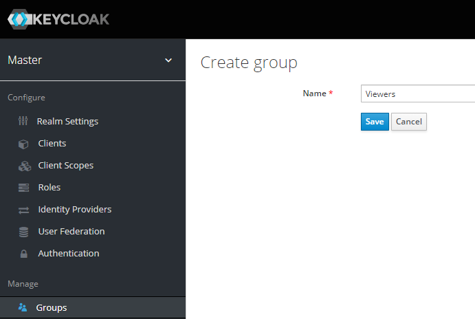](./images/keycloak/keycloak_new_group_3a.png)

<figcaption>A third group in the original walkthrough. Select the image to view it at full size.</figcaption>
</figure>
<figure className="doc-screenshot">

[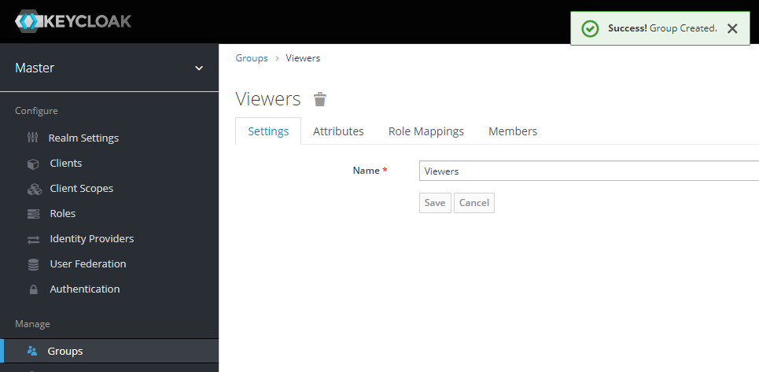](./images/keycloak/keycloak_new_group_3b.png)

<figcaption>Reviewing the created group. Select the image to view it at full size.</figcaption>
</figure>
<figure className="doc-screenshot">

[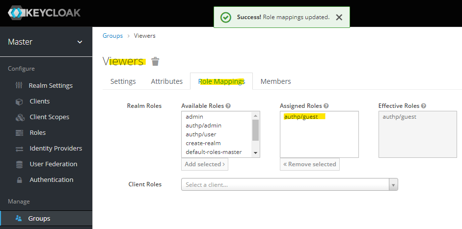](./images/keycloak/keycloak_new_group_3c.png)

<figcaption>Historical role mapping. Use the current access policy rather than these example portal roles. Select the image to view it at full size.</figcaption>
</figure>
<figure className="doc-screenshot">

[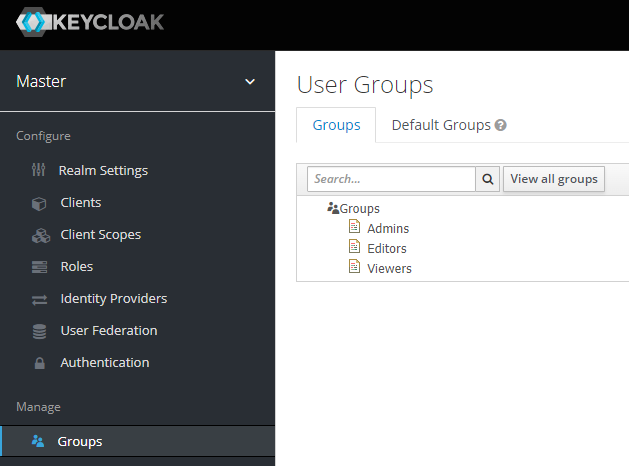](./images/keycloak/keycloak_new_group_4.png)

<figcaption>The original group list. Your walkthrough’s group is app-members. Select the image to view it at full size.</figcaption>
</figure>

</details>

## Users

Create or choose two users in the same realm:

| User | Group membership | Expected `/app` result |
| --- | --- | --- |
| Alice | `/app-members` | 200, protected response |
| Bob | No `/app-members` membership | 403, no protected response |

Set each user's email and credentials. The generic driver requires an email
claim in the ID token by default, so retain the `email` client scope and its
ID-token mapping. For disposable test users, set a password in **Credentials**;
if it is temporary, complete Keycloak's required password change during login.

Assign Alice through the user's **Groups** tab. An email address or a similarly
named Keycloak role does not automatically place a user in this group.

<details className="screenshot-gallery">
<summary>Screenshots: users, credentials, and membership</summary>

These earlier screens remain useful for locating user creation and credentials. Use ordinary test users in your application realm, set their email, and give only Alice membership in app-members.

<figure className="doc-screenshot">

[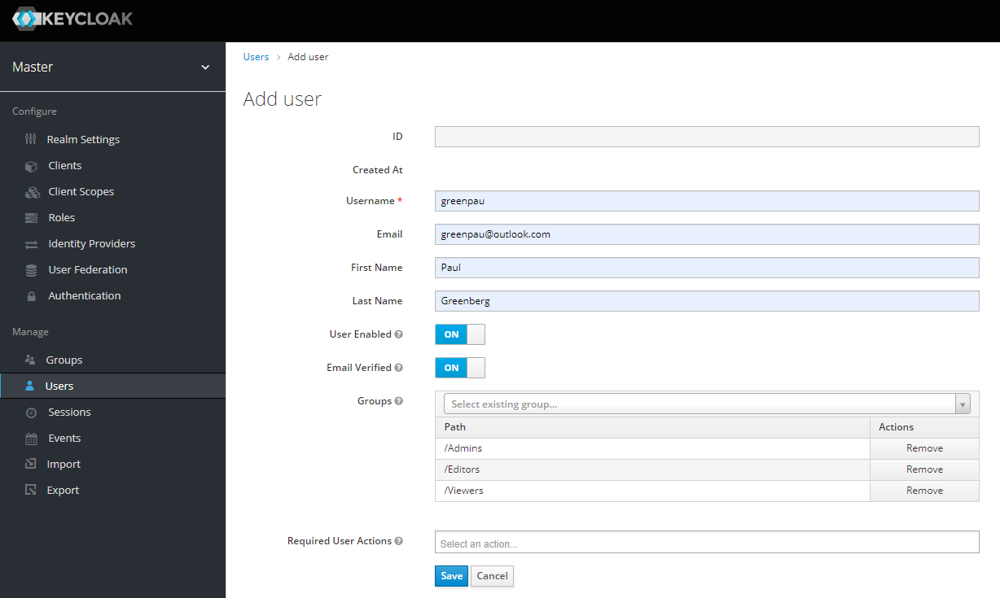](./images/keycloak/keycloak_new_user.png)

<figcaption>Create the user in the intended application realm; the original screenshot uses different example values. Select the image to view it at full size.</figcaption>
</figure>
<figure className="doc-screenshot">

[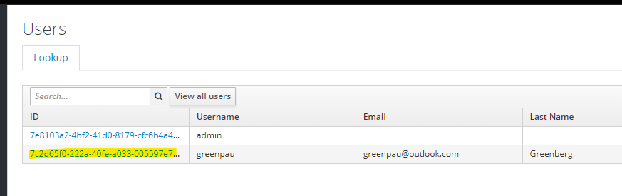](./images/keycloak/keycloak_new_user_1.png)

<figcaption>Select a user to manage credentials and membership. Select the image to view it at full size.</figcaption>
</figure>
<figure className="doc-screenshot">

[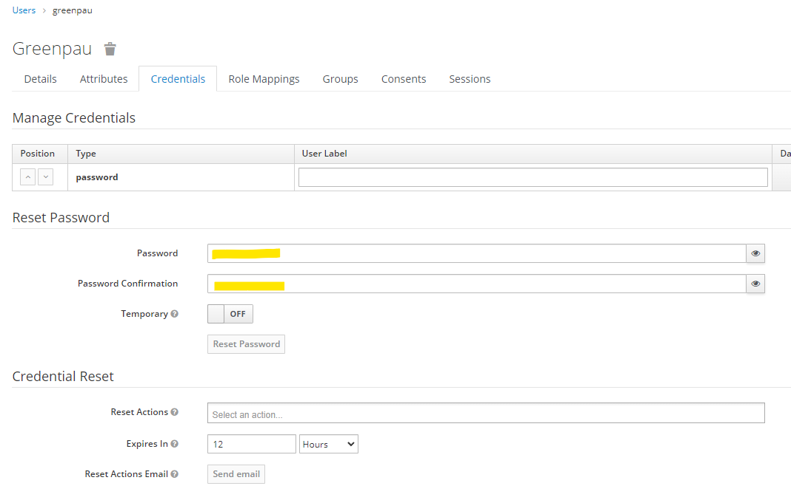](./images/keycloak/keycloak_new_user_2.png)

<figcaption>Set a disposable test password; complete any required temporary-password change during sign-in. Select the image to view it at full size.</figcaption>
</figure>
<figure className="doc-screenshot">

[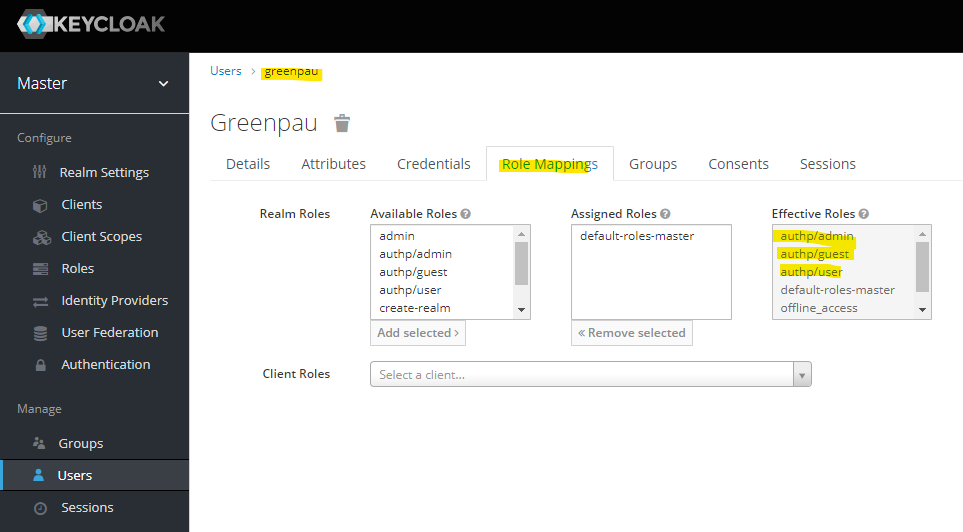](./images/keycloak/keycloak_user_effective_roles.png)

<figcaption>Historical effective roles. Check group membership and resulting portal roles separately in the current example. Select the image to view it at full size.</figcaption>
</figure>

</details>

## Realm Roles

Existing deployments may prefer realm roles over a groups mapper. The bundled
generic driver recognizes `realm_access.roles` as well as top-level `roles`.
Configure the relevant realm-role mapper to include the intended role in the
ID token, then replace the group matcher with that role name. For example:

```text
transform user {
    match realm keycloak
    match role example-app-member
    action add role app/member
}
```

This is an alternative to the group-granting transform. Keeping both grants
would allow either one to add `app/member`. Nested client roles under
`resource_access.CLIENT.roles` are not extracted by this release's generic
parser; map the needed values into a supported claim. See the
[generic claim reference](81-backend-oauth2-0000-generic.md#map-claims-to-application-permissions).

There is no need to give application members `authp/admin` in Keycloak.
The example keeps portal permissions and application permissions separate.

<details className="screenshot-gallery">
<summary>Screenshots: realm-role alternative in the earlier console</summary>

These images show the earlier Add Role and role detail screens. For the alternative above, use a dedicated application role such as example-app-member. The old authp/admin, authp/user, and authp/guest names are historical examples and are not required Keycloak roles for this walkthrough.

<figure className="doc-screenshot">

[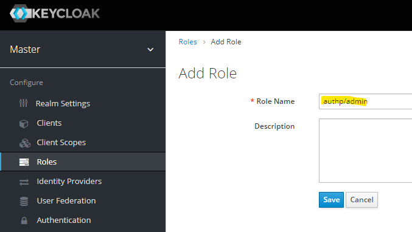](./images/keycloak/keycloak_new_role_1a.png)

<figcaption>Creating a realm role in the earlier console; choose an application-specific role for the current alternative. Select the image to view it at full size.</figcaption>
</figure>
<figure className="doc-screenshot">

[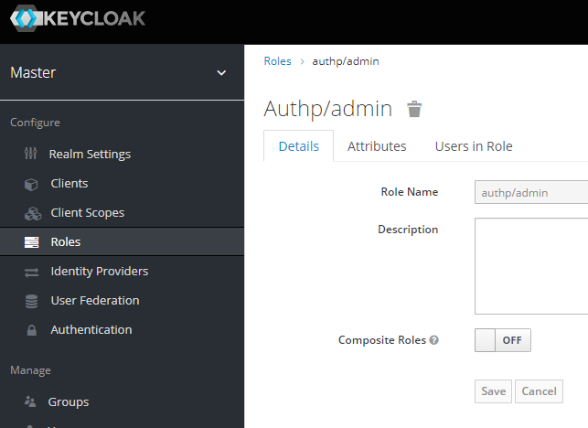](./images/keycloak/keycloak_new_role_1b.png)

<figcaption>Historical role detail view. Select the image to view it at full size.</figcaption>
</figure>
<figure className="doc-screenshot">

[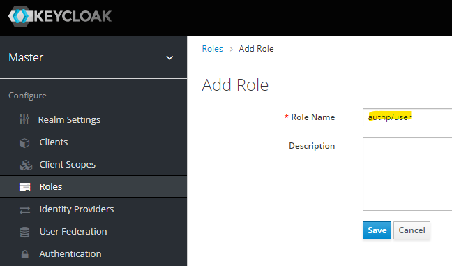](./images/keycloak/keycloak_new_role_2a.png)

<figcaption>Another role from the original example. Select the image to view it at full size.</figcaption>
</figure>
<figure className="doc-screenshot">

[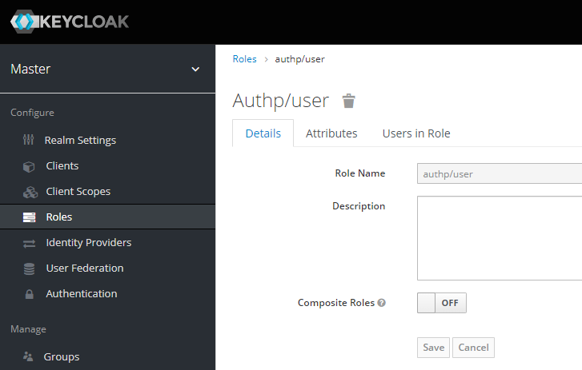](./images/keycloak/keycloak_new_role_2b.png)

<figcaption>Role name and configuration in the earlier console. Select the image to view it at full size.</figcaption>
</figure>
<figure className="doc-screenshot">

[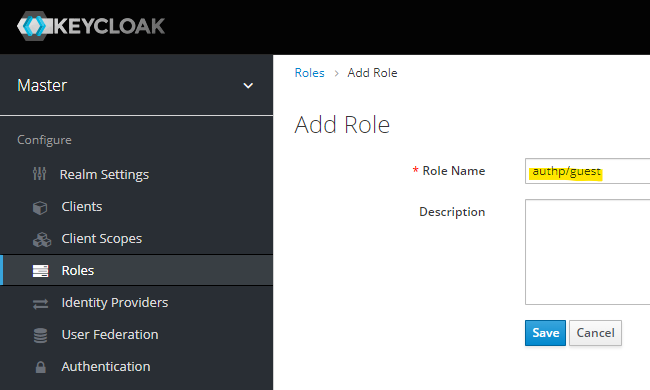](./images/keycloak/keycloak_new_role_3a.png)

<figcaption>The old example’s guest role. Select the image to view it at full size.</figcaption>
</figure>
<figure className="doc-screenshot">

[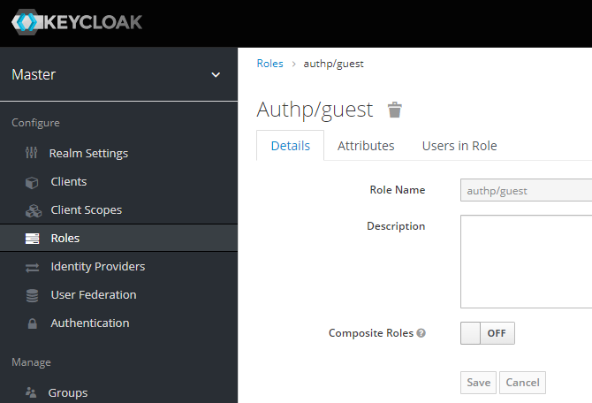](./images/keycloak/keycloak_new_role_3b.png)

<figcaption>Reviewing a created role in the earlier console. Select the image to view it at full size.</figcaption>
</figure>
<figure className="doc-screenshot">

[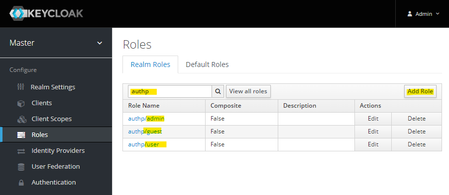](./images/keycloak/keycloak_new_role_4.png)

<figcaption>Role list from the historical example. Map only the role needed by your current application. Select the image to view it at full size.</figcaption>
</figure>

</details>

## Configure AuthCrunch

Save this as `Caddyfile`. Replace `auth.example.com` in both the site address and
policy login URL. Replace `id.example.com` and `example` in the issuer and
metadata URLs to match your Keycloak deployment. Keep the registered callback
in sync with the public portal hostname and `/auth/` mount.

The example is embedded from the
[canonical Keycloak Caddyfile](https://github.com/authcrunch/authcrunch.github.io/blob/main/assets/conf/oauth/keycloak/Caddyfile).

<CodeBlock language="text" title="Caddyfile">{caddyfile}</CodeBlock>

The first transform removes provider-derived `authp/*` and `app/member` roles.
The following transforms grant portal access and translate `/app-members`
into application access. Keep that order so a Keycloak role named `app/member`
cannot bypass group membership or a role named `authp/admin` grant portal
administration. The required `/app-members` group remains available.

Supply these values to the AuthCrunch process:

```sh
export KEYCLOAK_CLIENT_ID='authcrunch'
export KEYCLOAK_CLIENT_SECRET='YOUR_KEYCLOAK_CLIENT_SECRET'
export JWT_SHARED_KEY="$(openssl rand -hex 32)"
```

Replace the secret placeholder with the client secret from Keycloak. For a
managed service, store these values in its protected environment and reuse the
signing key across restarts. The portal and policy must use the same key.

Start Keycloak before AuthCrunch, then check and run the Caddyfile:

```sh
./bin/authcrunch adapt --adapter caddyfile --config Caddyfile >/dev/null
./bin/authcrunch run --config Caddyfile
```

Adaptation checks parsing. Startup loads the discovery document and keys, and
Caddy provisions HTTPS for the public portal host. DNS and ports 80/443 must be
configured for your certificate setup. The example disables the admin endpoint;
use **Ctrl+C** and restart the foreground process after edits.

The protected handler currently responds with a message. Replace that `respond`
with your application's `reverse_proxy` after verification. Keep `authorize`
before it and preserve the matcher covering `/app` and `/app/*`.

## User Login

1. Open `https://auth.example.com/app`. The policy sends you to the portal.
2. Choose **Keycloak** and sign in as Alice.
3. If you reach the portal's Applications page, select **Example app**.
   You should see `You reached the Keycloak-protected app.`
4. Select **My identity** or visit `/auth/whoami`. Confirm that `roles` includes
   `/app-members`, `authp/user`, and `app/member`, and `realm` is `keycloak`.
5. In a separate browser session, sign in as Bob. He should reach the portal,
   but `/app`, `/app/`, and `/app/nested` should return **403**.

Membership and transforms are evaluated at login. Removing Alice from the group
does not rewrite an existing AuthCrunch token. This example uses a 900-second
token lifetime; test changed membership with a fresh login.

<details className="screenshot-gallery">
<summary>Screenshots: sign-in, account applications, and portal identity</summary>

These captures show the older Keycloak account console and AuthCrunch identity view. They illustrate where a user signs in and inspects roles. The current expected roles are /app-members, authp/user, and app/member; the old account names, hostnames, and role set are illustrative only.

<figure className="doc-screenshot">

[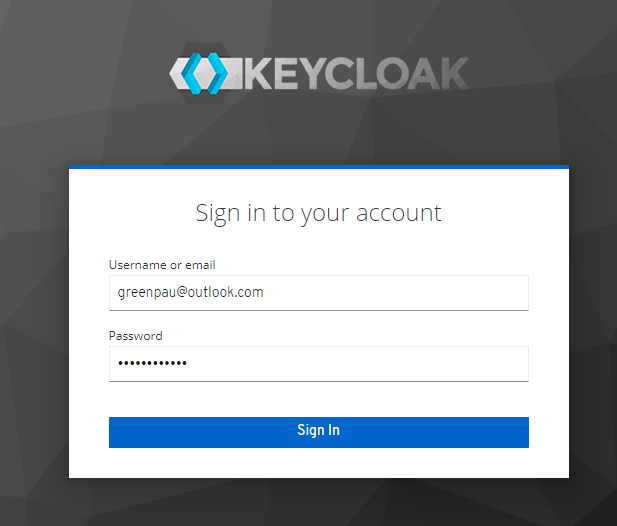](./images/keycloak/keycloak_user_login.png)

<figcaption>The provider’s sign-in form; users authenticate at Keycloak before returning to the portal. Select the image to view it at full size.</figcaption>
</figure>
<figure className="doc-screenshot">

[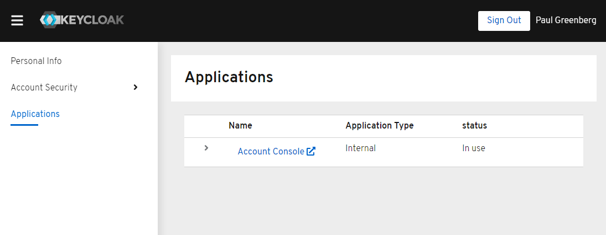](./images/keycloak/keycloak_user_dashboard.png)

<figcaption>Keycloak’s account application list is separate from the AuthCrunch portal’s application links. Select the image to view it at full size.</figcaption>
</figure>
<figure className="doc-screenshot">

[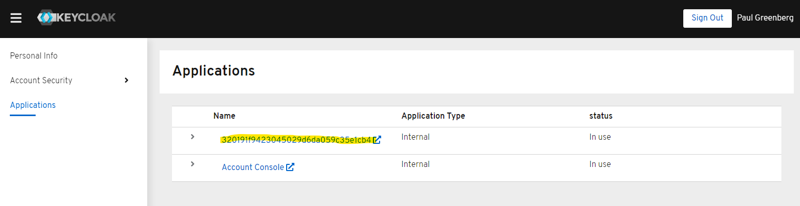](./images/keycloak/keycloak_user_profile.png)

<figcaption>The client appears in the earlier account console after authorization. Select the image to view it at full size.</figcaption>
</figure>
<figure className="doc-screenshot">

[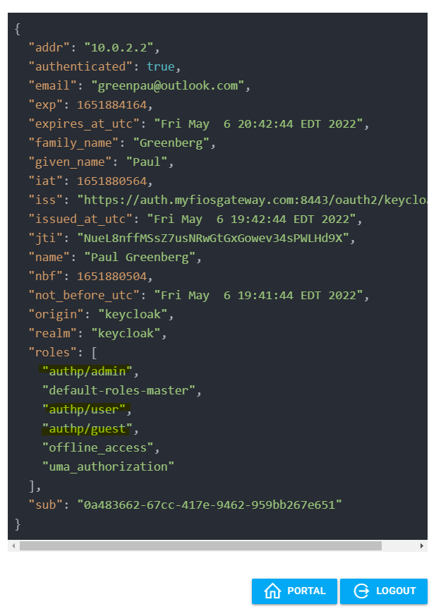](./images/keycloak/keycloak_assigned_roles.png)

<figcaption>Inspect the current portal identity to verify the exact group path and application role from this guide. Select the image to view it at full size.</figcaption>
</figure>

</details>

### Check logout separately

The portal's **Sign out** action clears its browser session. In this configuration,
it does not end the Keycloak SSO session. A subsequent Keycloak login can issue
a new portal token without asking for a password again. Use separate browser
sessions when testing Alice and Bob; portal logout alone does not switch their
Keycloak account.

## Troubleshoot

| Symptom | Check |
| --- | --- |
| Discovery fails at startup | Verify the realm's full discovery URL, configured context path, DNS, and TLS trust from the AuthCrunch server. |
| `invalid_redirect_uri` | Match the registered callback to the portal hostname, `/auth/` mount, and AuthCrunch realm `keycloak`. |
| Client authentication fails | Verify Client authentication is On and the process has the current client ID and secret. |
| Issuer mismatch | Compare the configured issuer with Keycloak's discovery document and ID token; proxy hostname settings and realm paths must agree. |
| PKCE failure | Require `S256` at the client and leave PKCE enabled in AuthCrunch. Start a fresh login flow. |
| Email claim missing | Give the user an email and include it in the ID token through the client's email scope. |
| Alice signs in but gets 403 | Check membership, mapper placement, Add to ID token, and the leading slash in `/app-members`; inspect the resulting roles after a new login. |
| Bob reaches the app | Check for another transform or provider role that grants `app/member`, and ensure the policy requires that role rather than `authp/user`. |
| Login resumes immediately after logout | The Keycloak SSO session is still active; use a separate browser session for a different account. |

For discovery overrides, supported claim paths, and optional UserInfo behavior,
continue to [Generic OpenID Connect](81-backend-oauth2-0000-generic.md).
