# AWS Cognito

Find AWS Cognito integration example in the following [`Caddyfile`](https://github.com/greenpau/caddy-auth-docs/blob/main/assets/conf/oauth/cognito/Caddyfile)
and associated [environment file](https://github.com/greenpau/caddy-auth-docs/blob/main/assets/conf/oauth/cognito/caddy.env).

## Cognito User Pool

Follow the below screenshots to create new Cognito user pool.

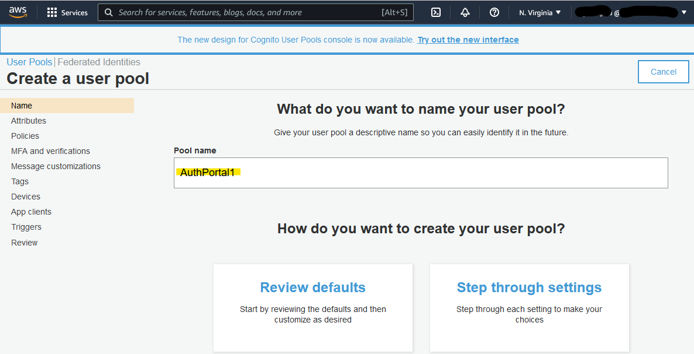

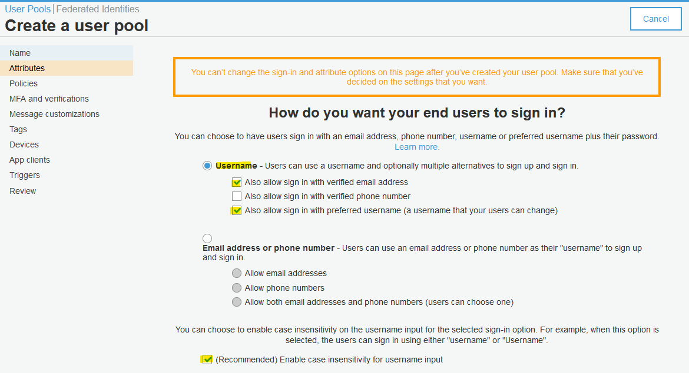

Here, add custom attribute `roles` and `timezone`.
It would help with role-based access.


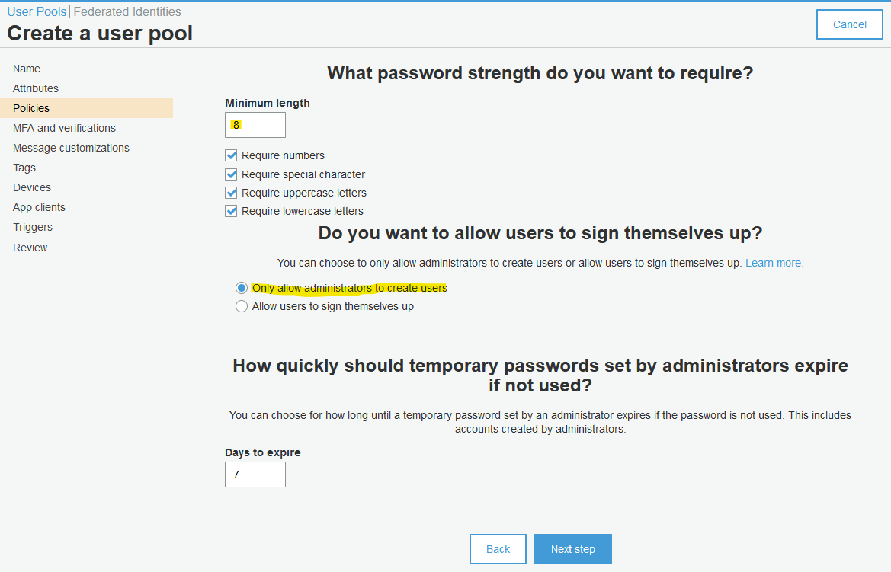

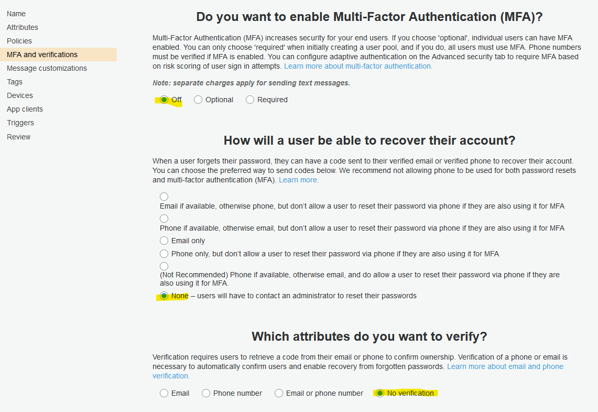

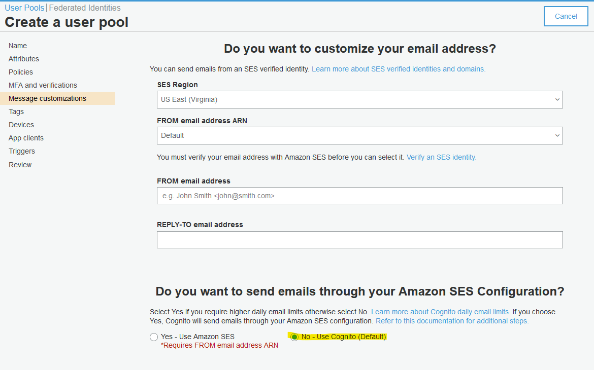


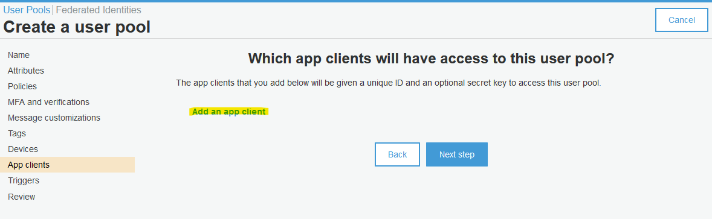


Review your selection.


Note the User Pool ID and update your environment file with it.

```bash
export COGNITO_US_EAST_1_POOL_ID=us-east-1_UFeMzbuJe
```

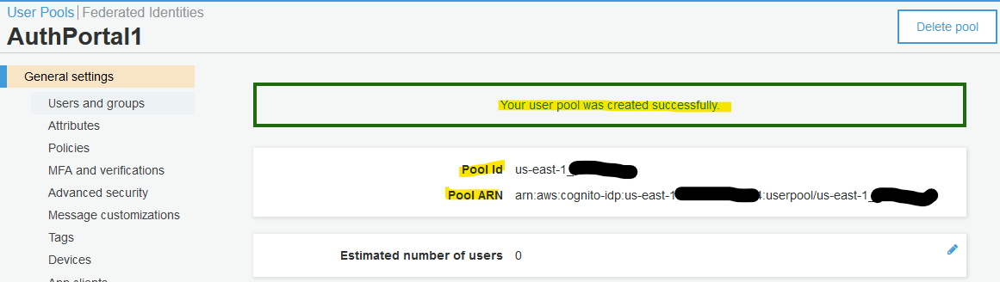

Next, browse to "App Integration", "App client settings". Enable Cognito User Pool
and update relevant URL.

For example:

* Set "Callback URL(s)" to `https://auth.myfiosgateway.com:8443/oauth2/cognito-us-east-1/authorization-code-callback`
* Set "Sign out URL(s)" to `https://auth.myfiosgateway.com:8443/logout`


Next, create a random string for your Cognito domain and save it.
This step is mandatory for a working OAuth integration.

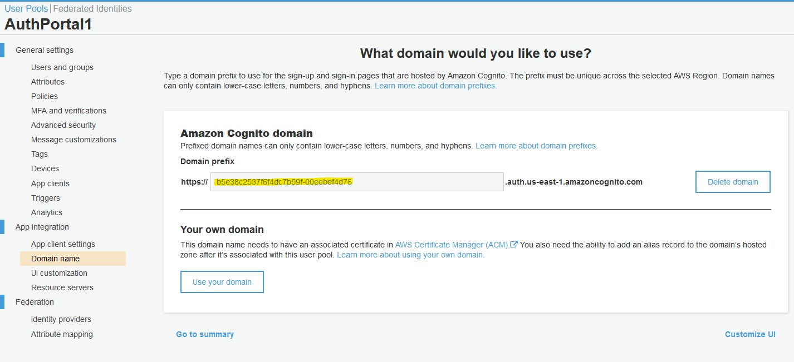

## Cognito Client

During this step, you will extract Client ID and Secret and update environment file with:

```bash
export COGNITO_US_EAST_1_CLIENT_ID=2jvuq8gkhfoh7u4fdfihiditj5
export COGNITO_US_EAST_1_CLIENT_SECRET=ldjkr0pn1jmo9lule3ge06ju13rhmsffda1vama1f80frlcvplf
```

Note the "App client id" and click "Show Details".

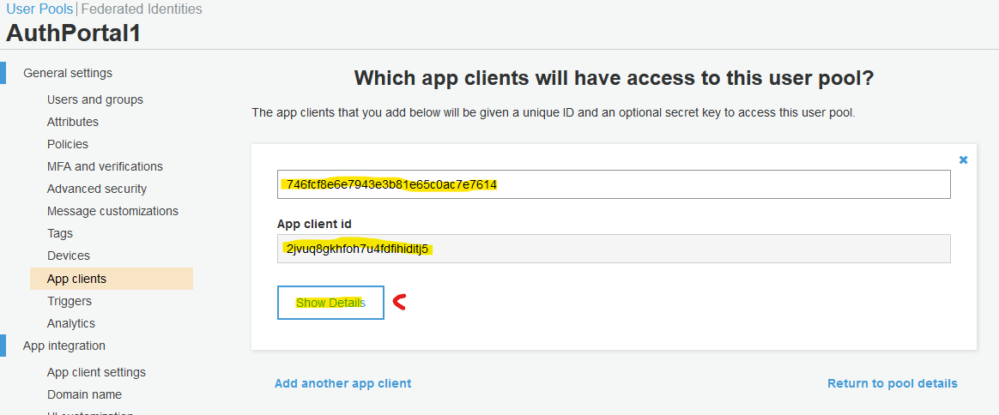

Not the "App client secret".


## Cognito User

During this step, you will create a user.

Click "Create user".


Follow the selections below.

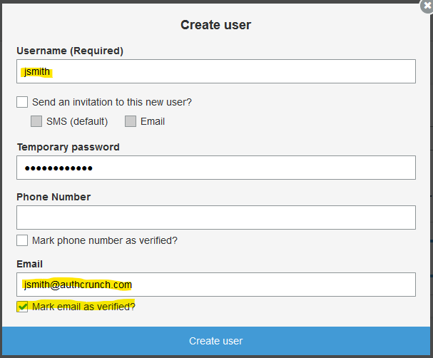

After creating the user, the user will have `FORCE_CHANGE_PASSWORD` status.
We will overwrite it via command-line.

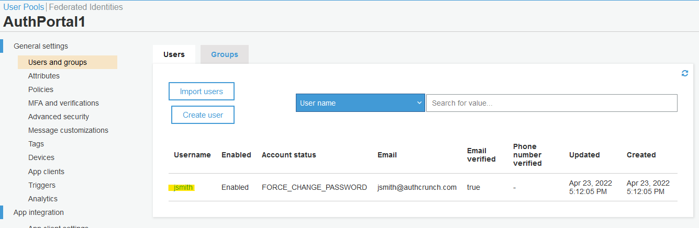

Open AWS CloudShell.

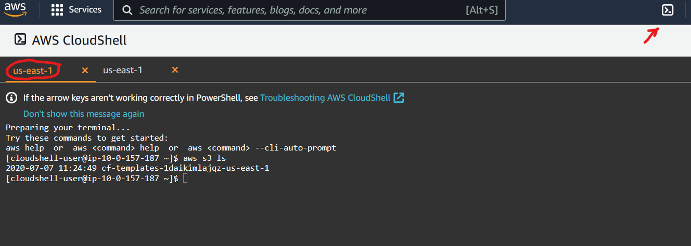

Run the following commands in the terminal.

```bash
export TARGET_POOL="us-east-1_UFeMzbuJe"
export TARGET_USER="jsmith"
export TARGET_USER_NAME="John Smith"
aws cognito-idp admin-set-user-password --user-pool-id ${TARGET_POOL} --username ${TARGET_USER} --password "The@Password" --permanent
aws cognito-idp admin-update-user-attributes --user-pool-id ${TARGET_POOL} --username ${TARGET_USER} \
  --user-attributes Name="name",Value="${TARGET_USER_NAME}" \
  --user-attributes Name="custom:roles",Value="authp/admin|authp/user" \
  --user-attributes Name="custom:timezone",Value="America/New_York"
aws cognito-idp admin-get-user --user-pool-id ${TARGET_POOL} --username ${TARGET_USER}
```

The `roles` are being separated by `|` (pipe).

The above command set permanent user password (i.e. no need to do password change),
set custom roles and timezone.

Next, run the following command to review the created user:

```bash
aws cognito-idp admin-get-user --user-pool-id ${TARGET_POOL} --username ${TARGET_USER}
```

The output follows:

```json
{
    "Username": "jsmith",
    "UserAttributes": [
        {
            "Name": "sub",
            "Value": "55ddc31e-b818-4136-8fb8-84cfb31af537"
        },
        {
            "Name": "custom:roles",
            "Value": "authp/admin|authp/user"
        },
        {
            "Name": "custom:timezone",
            "Value": "America/New_York"
        },
        {
            "Name": "email_verified",
            "Value": "true"
        },
        {
            "Name": "name",
            "Value": "John Smith"
        },
        {
            "Name": "email",
            "Value": "jsmith@authcrunch.com"
        }
    ],
    "UserCreateDate": "2022-04-23T17:12:05.282000+00:00",
    "UserLastModifiedDate": "2022-04-23T17:30:43.896000+00:00",
    "Enabled": true,
    "UserStatus": "CONFIRMED"
}
```

## User Login

Finally, start Caddy and browse to authentication portal.
Click "AWS Cognito US" link to initiate authentication.


You will be redirected to AWS Cognito for authentication.

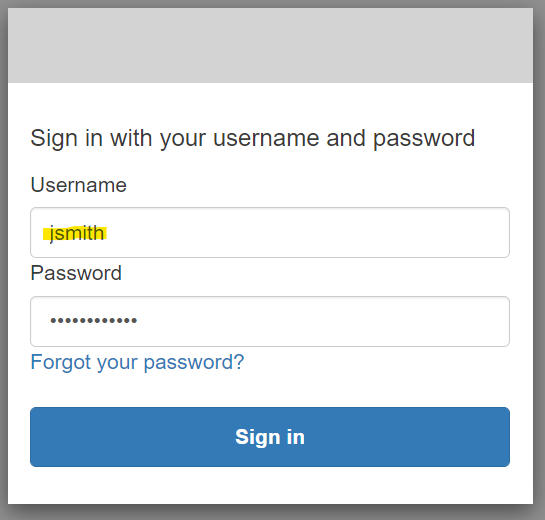

You will be redirected back to authentication portal after successful authentication.
Click "My Identity" to see the contents of your user token.

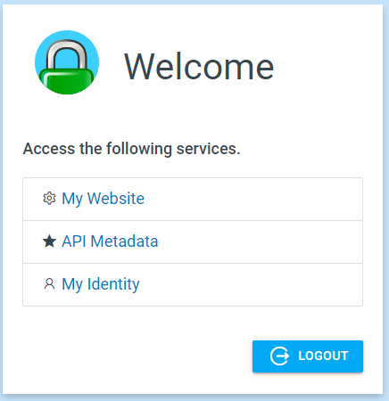

The token will contain your name email. However, the custom roles and timezone will not be there.

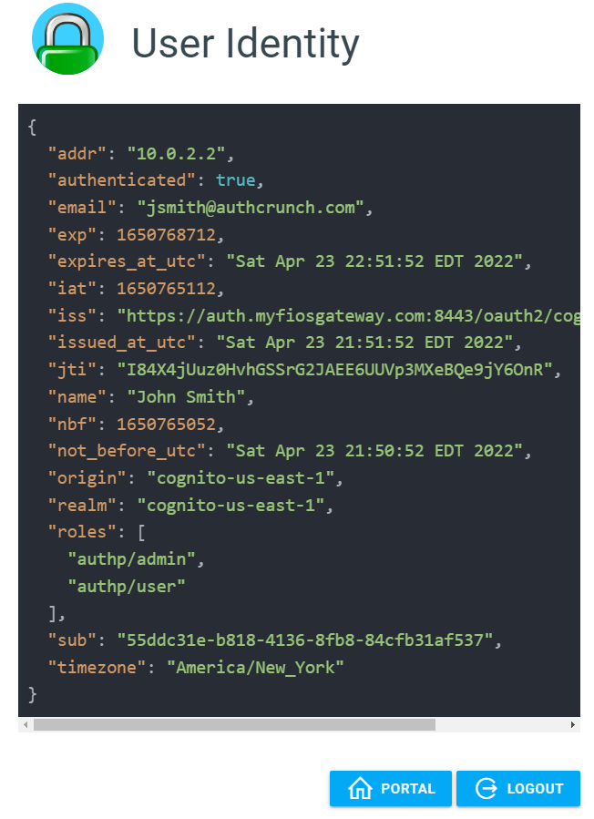
