import CodeBlock from '@theme/CodeBlock';
import example from '@site/assets/conf/oauth/cognito/Caddyfile?raw';

# AWS Cognito

Use a **Cognito user pool** and confidential authorization-code app client.
An identity pool that issues AWS credentials is a different service. The released
named driver discovers the pool's endpoints, validates the provider tokens,
and maps selected Cognito claims. It does not automatically renew the Cognito
refresh token as an AuthCrunch browser session.

## Cognito User Pool

Create or select the pool in your AWS region. Choose sign-in, verification,
password/MFA, and recovery policy appropriate to the organization. The screenshots
are a preserved 2022 console sequence, not recommendations to disable verification
or MFA. Add a user-pool domain for managed login and OAuth endpoints; the pool ID
and managed-login domain are different values. See
[AWS endpoint documentation](https://docs.aws.amazon.com/cognito/latest/developerguide/federation-endpoints.html).

<figure className="doc-screenshot">

[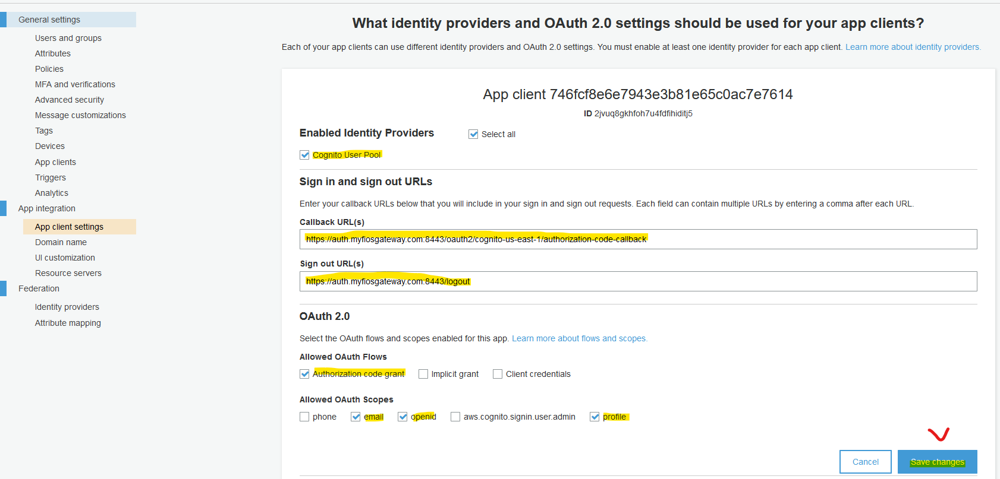](./images/cognito/cognito_user_pool_15.png)

<figcaption>Historical OAuth app-client settings; register the callback and scopes described below, not the old hostname.</figcaption>
</figure>
<details className="screenshot-gallery">
<summary>Preserved Cognito pool configuration screens</summary>

<figure className="doc-screenshot">

[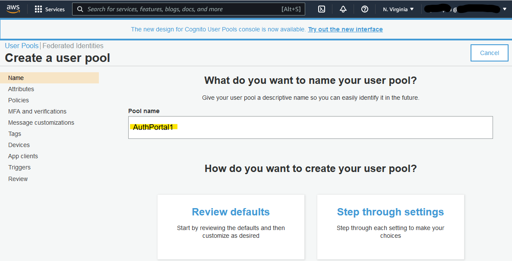](./images/cognito/cognito_user_pool_1.png)

<figcaption>Historical user-pool creation.</figcaption>
</figure>

<figure className="doc-screenshot">

[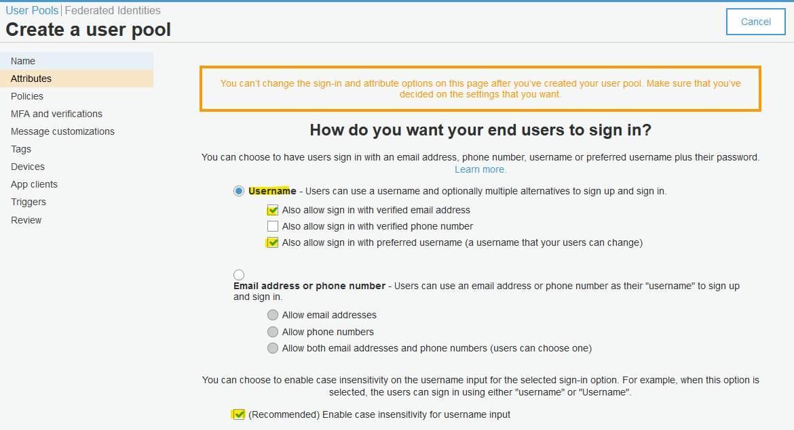](./images/cognito/cognito_user_pool_2.png)

<figcaption>Historical username/email sign-in choices.</figcaption>
</figure>

<figure className="doc-screenshot">

[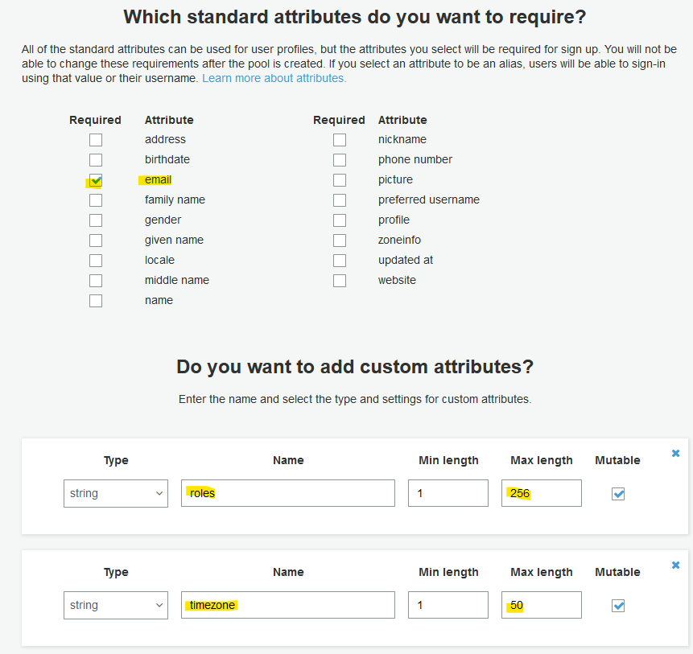](./images/cognito/cognito_user_pool_3.png)

<figcaption>Historical custom attributes; keep permission-bearing attributes administrator-controlled.</figcaption>
</figure>

<figure className="doc-screenshot">

[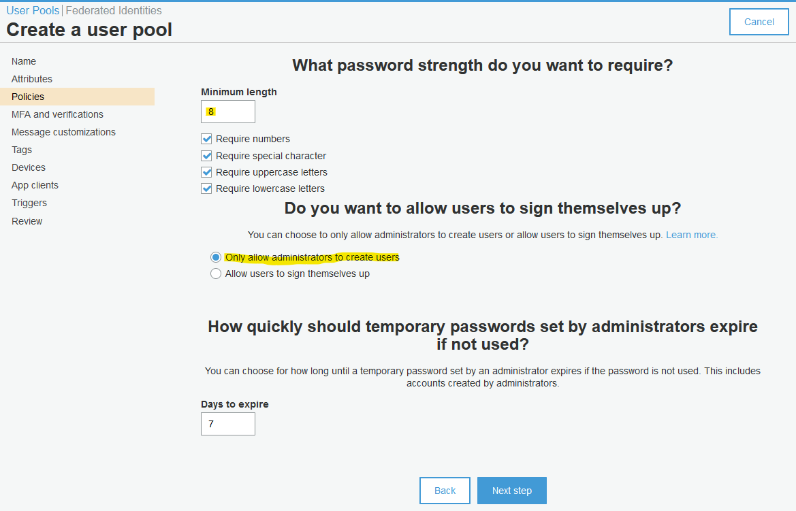](./images/cognito/cognito_user_pool_4.png)

<figcaption>Historical password and account-creation policy; choose your current policy.</figcaption>
</figure>

<figure className="doc-screenshot">

[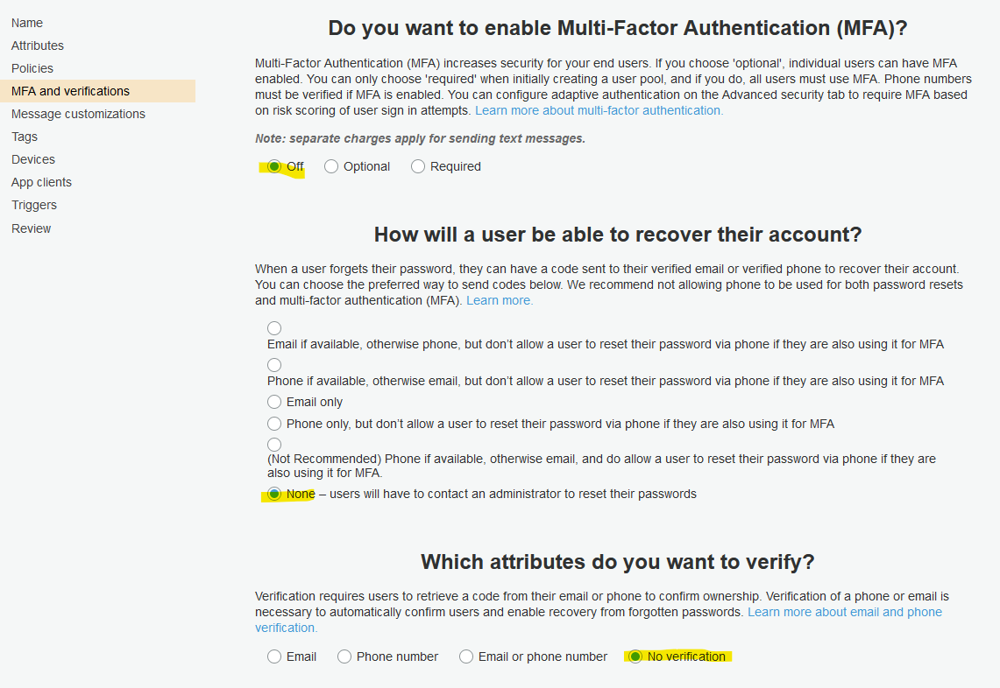](./images/cognito/cognito_user_pool_5.png)

<figcaption>Historical MFA and verification options; do not copy disabled security settings.</figcaption>
</figure>

<figure className="doc-screenshot">

[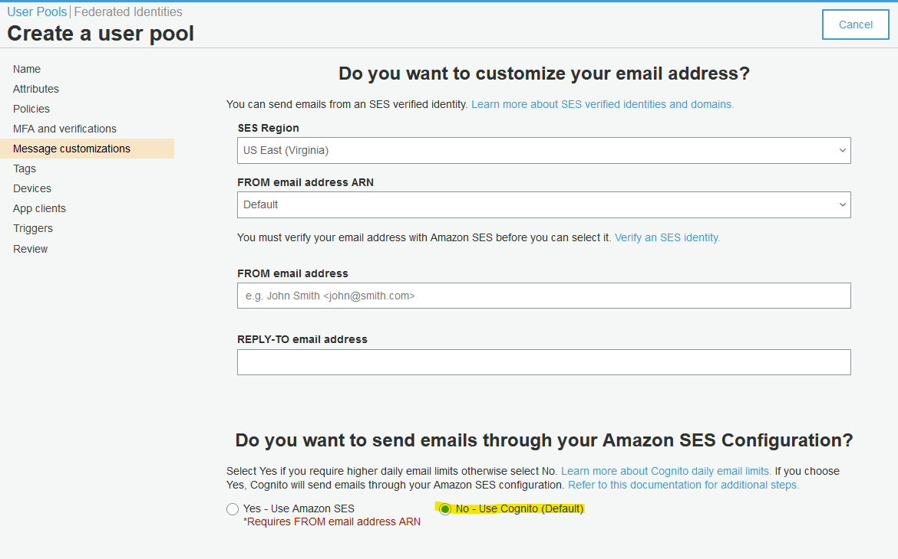](./images/cognito/cognito_user_pool_6.png)

<figcaption>Historical message delivery settings.</figcaption>
</figure>

<figure className="doc-screenshot">

[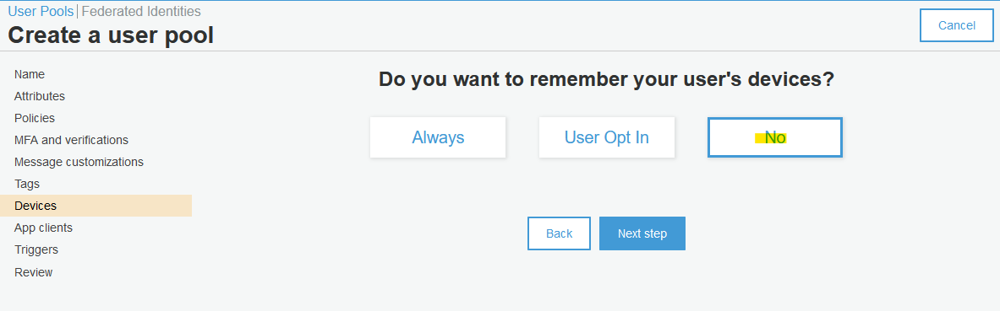](./images/cognito/cognito_user_pool_7.png)

<figcaption>Historical remembered-device choice.</figcaption>
</figure>

<figure className="doc-screenshot">

[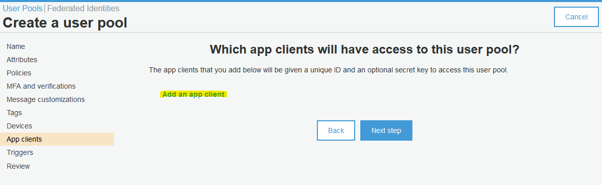](./images/cognito/cognito_user_pool_8.png)

<figcaption>Historical app-client creation.</figcaption>
</figure>

<figure className="doc-screenshot">

[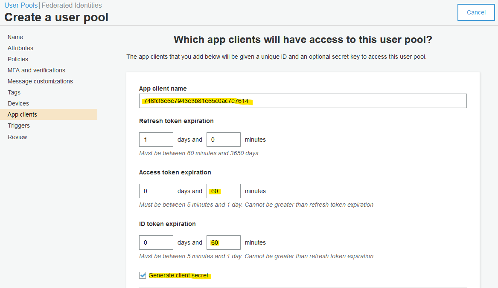](./images/cognito/cognito_user_pool_9.png)

<figcaption>Historical private-client secret and token lifetime options.</figcaption>
</figure>

<figure className="doc-screenshot">

[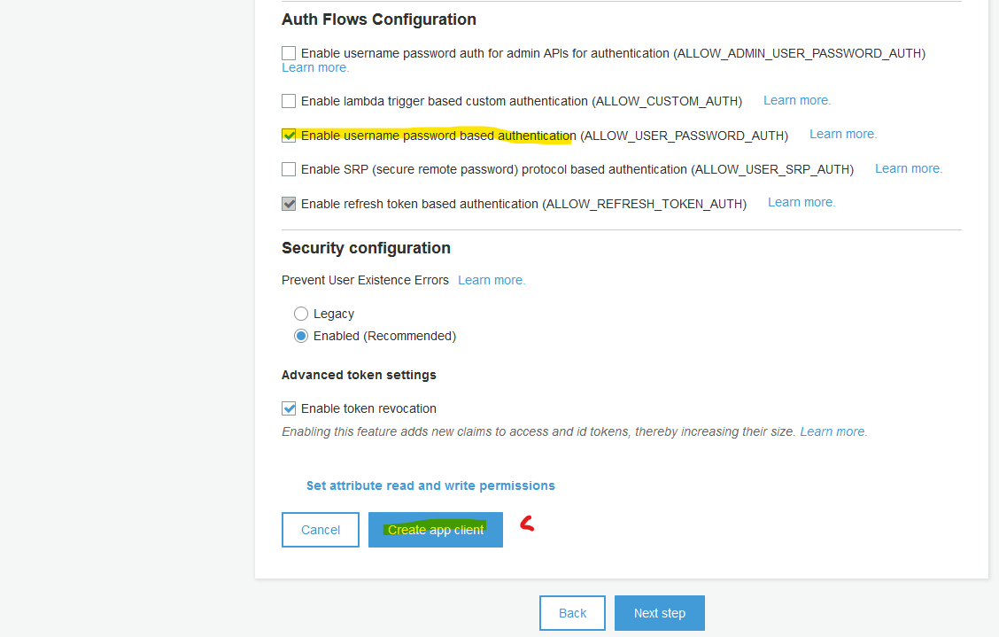](./images/cognito/cognito_user_pool_10.png)

<figcaption>Historical API auth-flow controls; the AuthCrunch web integration uses OAuth code flow.</figcaption>
</figure>

<figure className="doc-screenshot">

[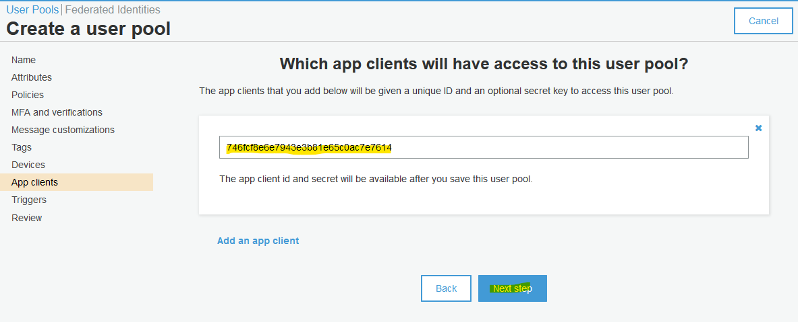](./images/cognito/cognito_user_pool_11.png)

<figcaption>Historical completed app-client registration.</figcaption>
</figure>

<figure className="doc-screenshot">

[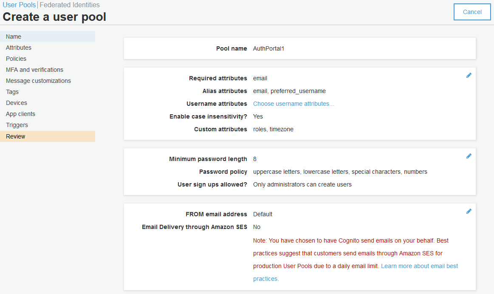](./images/cognito/cognito_user_pool_12.png)

<figcaption>Historical pool review.</figcaption>
</figure>

<figure className="doc-screenshot">

[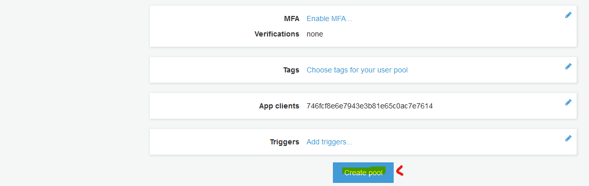](./images/cognito/cognito_user_pool_13.png)

<figcaption>Historical pool creation confirmation.</figcaption>
</figure>

<figure className="doc-screenshot">

[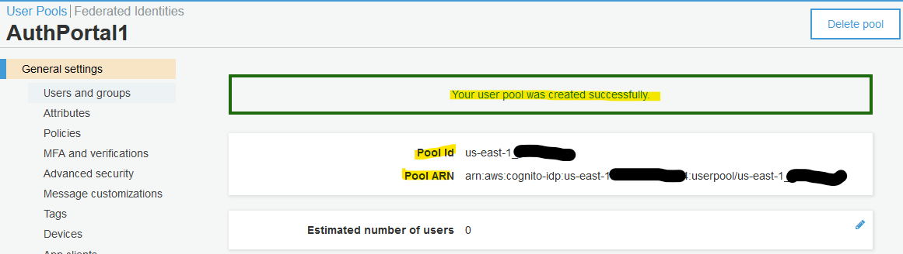](./images/cognito/cognito_user_pool_14.png)

<figcaption>Historical pool ID display; configure your own region and ID.</figcaption>
</figure>

<figure className="doc-screenshot">

[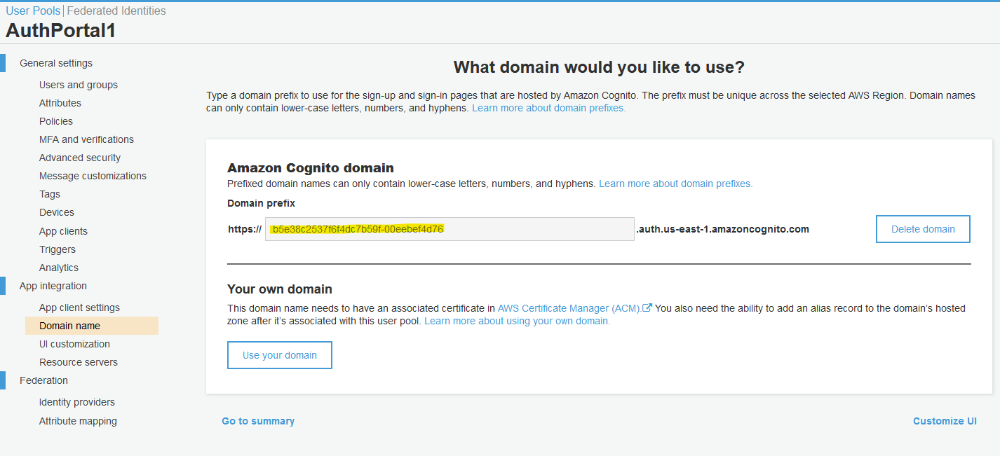](./images/cognito/cognito_user_pool_16.png)

<figcaption>Historical managed-login domain configuration; a pool domain enables OAuth endpoints.</figcaption>
</figure>

</details>
## Cognito Client

Create a confidential web app client with a secret, enable the authorization-code
grant and `openid profile email`, and register:

```text
https://auth.example.com/auth/oauth2/cognito/authorization-code-callback
```

Use a separate registered sign-out URL only when deliberately integrating provider
logout. AWS supports `client_secret_post`, used by this server-side exchange.
See the [token endpoint contract](https://docs.aws.amazon.com/cognito/latest/developerguide/token-endpoint.html).
Store `COGNITO_CLIENT_ID`, `COGNITO_CLIENT_SECRET`, `COGNITO_USER_POOL_ID`, and a
private `AUTHCRUNCH_SIGNING_KEY` in the server environment. Change `region` if
the pool is outside `us-east-1`; never copy IDs or secrets from the old example.

<details className="screenshot-gallery">
<summary>Preserved Cognito client screens</summary>

<figure className="doc-screenshot">

[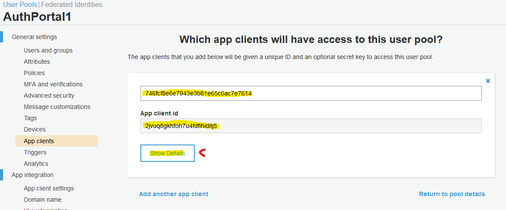](./images/cognito/cognito_client_1.png)

<figcaption>Historical app-client ID view.</figcaption>
</figure>

<figure className="doc-screenshot">

[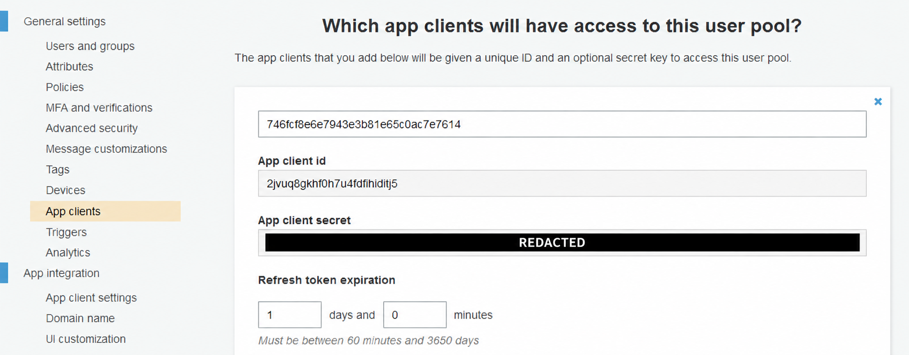](./images/cognito/cognito_client_2.png)

<figcaption>Historical app-client detail view with the secret redacted for publication; keep your actual secret private.</figcaption>
</figure>

</details>
## Cognito User

Provision and confirm a test user through your organization's invitation and
verification workflow. Do not bypass a required password change or mark an
email verified merely to reproduce the old screenshots. Put intended application
members in an administrator-managed Cognito group named `app-members`.

The released Cognito parser supports these **ID-token** claims:

| Claim | AuthCrunch mapping |
| --- | --- |
| `cognito:groups` | Group strings become roles |
| `custom:roles` | String split on `|`, or a string array, becomes roles |
| `cognito:roles` | Role strings/ARNs become roles; they do not assume an AWS IAM role |
| `cognito:username` | `username` |
| `zoneinfo`, then `custom:timezone` | `timezone`, with the custom value taking precedence |

The prior guide's claim that custom roles/timezone are absent is outdated.
Malformed types can reject login. Attribute readability controls whether custom
values reach the ID token; granting an end user write permission to an attribute
used for authorization would let them change that permission input. Prefer
administrator-managed groups, and do not emit reserved `authp/admin` to all users.
See [Cognito ID-token claims](https://docs.aws.amazon.com/cognito/latest/developerguide/amazon-cognito-user-pools-using-the-id-token.html).

<details className="screenshot-gallery">
<summary>Preserved Cognito user provisioning screens</summary>

<figure className="doc-screenshot">

[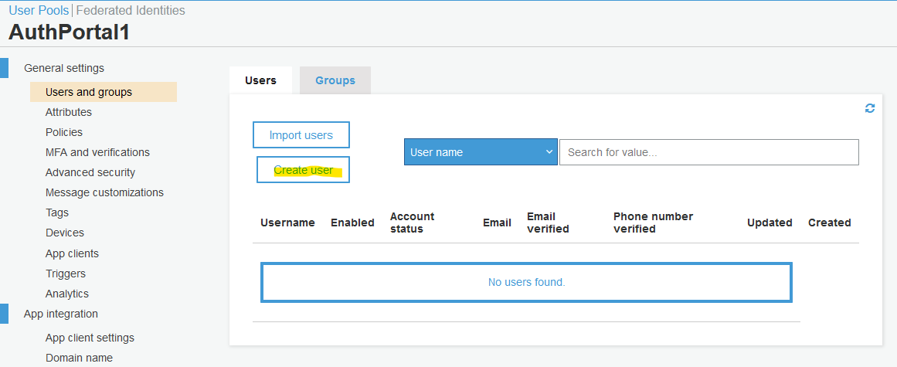](./images/cognito/cognito_user_1.png)

<figcaption>Historical user creation.</figcaption>
</figure>

<figure className="doc-screenshot">

[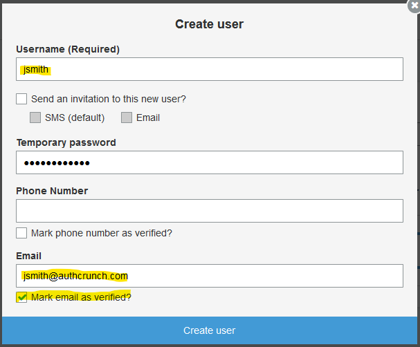](./images/cognito/cognito_user_2.png)

<figcaption>Historical invitation and email-verification choices; apply your actual verification workflow.</figcaption>
</figure>

<figure className="doc-screenshot">

[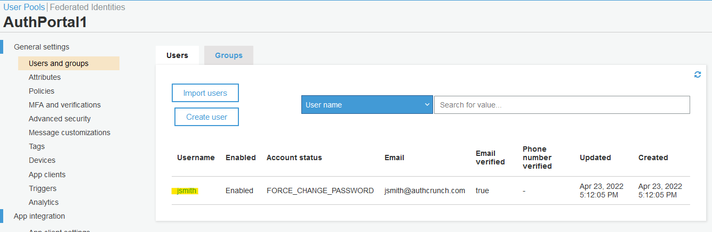](./images/cognito/cognito_user_3.png)

<figcaption>Historical temporary-password state; let the user complete required password changes.</figcaption>
</figure>

<figure className="doc-screenshot">

[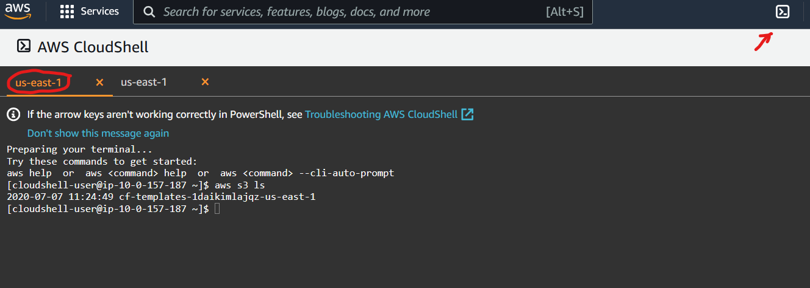](./images/cognito/cognito_user_4.png)

<figcaption>Historical CloudShell access; no password or role-administration command is required by this guide.</figcaption>
</figure>

</details>
## Configure AuthCrunch

<CodeBlock language="caddyfile" title="assets/conf/oauth/cognito/Caddyfile">{example}</CodeBlock>
The first transform removes provider-controlled reserved portal roles and direct
`app/member`, then grants a limited portal role. Only `app-members` receives
application access. A `cognito:roles` IAM ARN or a similarly named group must not
satisfy that rule.

## User Login

Open `/auth/oauth2/cognito`, complete Cognito login, and inspect the portal
identity. Verify that a group member reaches `/app` and a second confirmed user
outside the group is denied. Cognito's managed-login session and AuthCrunch's
access-token lifetime/logout are separate; test them separately.

<details className="screenshot-gallery">
<summary>Preserved Cognito login and identity screens</summary>

<figure className="doc-screenshot">

[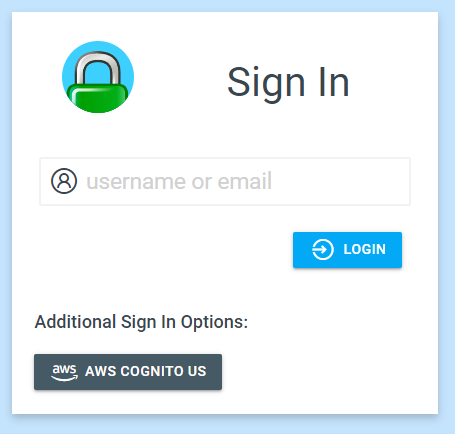](./images/cognito/cognito_user_login_1.png)

<figcaption>Historical Cognito portal login button with older branding.</figcaption>
</figure>

<figure className="doc-screenshot">

[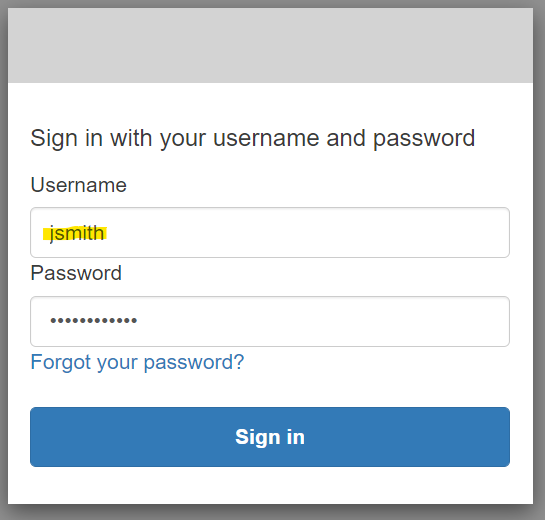](./images/cognito/cognito_user_login_2.png)

<figcaption>Historical provider password screen.</figcaption>
</figure>

<figure className="doc-screenshot">

[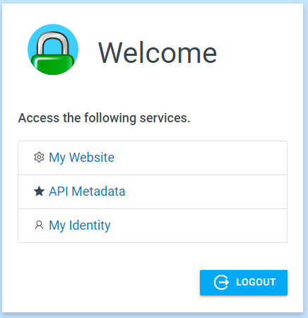](./images/cognito/cognito_user_login_3.png)

<figcaption>Historical portal application links.</figcaption>
</figure>

<figure className="doc-screenshot">

[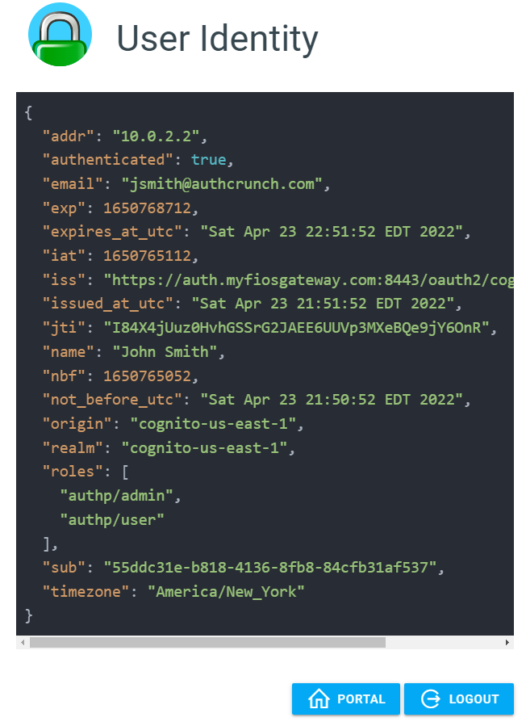](./images/cognito/cognito_user_login_4.png)

<figcaption>Historical identity response already contained custom roles/timezone; the current example avoids its administrator grant.</figcaption>
</figure>

</details>
## Verify and troubleshoot

Sign in through `/auth/oauth2/cognito`, inspect `/auth/whoami?format=json`, and
record the exact subject and realm without logging access tokens. Confirm that
an intended member reaches `/app` and another valid identity is denied. A
successful provider login alone does not establish application authorization.

Check callback scheme, hostname, port, mount, and realm literally; inspect
provider errors and [diagnostic logs](../../operations/logging.md). Keep client
secrets on the server. These examples are parser-verified against the released
bundle; console registration, live provider login, consent, and production TLS
require verification in your own organization.

## Agentic Prompts

Copy a prompt into your LLM to explore this topic. Each prompt prioritizes
upstream repository guidance and code over this page, and asks for version-aware
reasoning.

<div className="agentic-prompts">

<details>
<summary>Separate user and identity pools</summary>

```text
Help me understand AWS Cognito.

Primary authorities (take precedence over website documentation):
https://github.com/greenpau/caddy-security/blob/main/AGENTS.md
https://github.com/greenpau/caddy-security/tree/main/.codex/skills
https://github.com/greenpau/go-authcrunch/blob/main/AGENTS.md
https://github.com/greenpau/go-authcrunch/tree/main/.codex/skills
Read each repository's root AGENTS.md first, then any scoped AGENTS.md that
applies to inspected paths. Read the relevant SKILL.md files and follow their
implementation and test references.

Relevant skills to locate: configuration-oauth-providers,
oauth-identity-provider.

Secondary reference:
https://docs.authcrunch.com/docs/authenticate/oauth/backend-oauth2-0012-cognito

If a source is inaccessible, ask me to paste its relevant text. Identify the
versions your answer applies to; main may be newer than my release. Resolve
disagreements using code and tests, and flag unverified claims. Use synthetic
credentials and redacted examples; explain proposed checks before any changes.

Explain the Cognito user-pool confidential code client used for sign-in versus
an identity pool issuing AWS credentials. Trace hosted UI/domain, pool issuer
metadata, callback realm, and AuthCrunch token issuance. Keep AWS resource
credentials outside the portal session model.
```

</details>

<details>
<summary>Read Cognito claim mappings</summary>

```text
Help me understand AWS Cognito.

Primary authorities (take precedence over website documentation):
https://github.com/greenpau/caddy-security/blob/main/AGENTS.md
https://github.com/greenpau/caddy-security/tree/main/.codex/skills
https://github.com/greenpau/go-authcrunch/blob/main/AGENTS.md
https://github.com/greenpau/go-authcrunch/tree/main/.codex/skills
Read each repository's root AGENTS.md first, then any scoped AGENTS.md that
applies to inspected paths. Read the relevant SKILL.md files and follow their
implementation and test references.

Relevant skills to locate: configuration-oauth-providers,
oauth-identity-provider.

Secondary reference:
https://docs.authcrunch.com/docs/authenticate/oauth/backend-oauth2-0012-cognito

If a source is inaccessible, ask me to paste its relevant text. Identify the
versions your answer applies to; main may be newer than my release. Resolve
disagreements using code and tests, and flag unverified claims. Use synthetic
credentials and redacted examples; explain proposed checks before any changes.

Inspect cognito:groups and supported custom role/profile fields in my
installed parser. Explain malformed types, attribute readability, and
administrator-controlled authorization inputs. Compare a custom user-writable
attribute with a managed membership grant.
```

</details>

<details>
<summary>Diagnose a pool/client mismatch</summary>

```text
Help me understand AWS Cognito.

Primary authorities (take precedence over website documentation):
https://github.com/greenpau/caddy-security/blob/main/AGENTS.md
https://github.com/greenpau/caddy-security/tree/main/.codex/skills
https://github.com/greenpau/go-authcrunch/blob/main/AGENTS.md
https://github.com/greenpau/go-authcrunch/tree/main/.codex/skills
Read each repository's root AGENTS.md first, then any scoped AGENTS.md that
applies to inspected paths. Read the relevant SKILL.md files and follow their
implementation and test references.

Relevant skills to locate: configuration-oauth-providers,
oauth-identity-provider.

Secondary reference:
https://docs.authcrunch.com/docs/authenticate/oauth/backend-oauth2-0012-cognito

If a source is inaccessible, ask me to paste its relevant text. Identify the
versions your answer applies to; main may be newer than my release. Resolve
disagreements using code and tests, and flag unverified claims. Use synthetic
credentials and redacted examples; explain proposed checks before any changes.

Help me investigate region/pool issuer, hosted-domain setup, secret-enabled
app client, exact callback, scope, confirmed account, and claim shape. Ask for
public identifiers and redacted metadata only. Do not bypass required password
changes to imitate historical screenshots.
```

</details>

<details>
<summary>Review logout and refresh boundaries</summary>

```text
Help me understand AWS Cognito.

Primary authorities (take precedence over website documentation):
https://github.com/greenpau/caddy-security/blob/main/AGENTS.md
https://github.com/greenpau/caddy-security/tree/main/.codex/skills
https://github.com/greenpau/go-authcrunch/blob/main/AGENTS.md
https://github.com/greenpau/go-authcrunch/tree/main/.codex/skills
Read each repository's root AGENTS.md first, then any scoped AGENTS.md that
applies to inspected paths. Read the relevant SKILL.md files and follow their
implementation and test references.

Relevant skills to locate: configuration-oauth-providers,
oauth-identity-provider.

Secondary reference:
https://docs.authcrunch.com/docs/authenticate/oauth/backend-oauth2-0012-cognito

If a source is inaccessible, ask me to paste its relevant text. Identify the
versions your answer applies to; main may be newer than my release. Resolve
disagreements using code and tests, and flag unverified claims. Use synthetic
credentials and redacted examples; explain proposed checks before any changes.

Explain Cognito upstream logout URL requirements separately from portal logout
and local refresh sessions. Compare Cognito refresh-token availability with
whether AuthCrunch renews it. Check current official Cognito registration
rules before constructing a complete URL.
```

</details>

<details>
<summary>Test groups and account lifecycle</summary>

```text
Help me understand AWS Cognito.

Primary authorities (take precedence over website documentation):
https://github.com/greenpau/caddy-security/blob/main/AGENTS.md
https://github.com/greenpau/caddy-security/tree/main/.codex/skills
https://github.com/greenpau/go-authcrunch/blob/main/AGENTS.md
https://github.com/greenpau/go-authcrunch/tree/main/.codex/skills
Read each repository's root AGENTS.md first, then any scoped AGENTS.md that
applies to inspected paths. Read the relevant SKILL.md files and follow their
implementation and test references.

Relevant skills to locate: configuration-oauth-providers,
oauth-identity-provider.

Secondary reference:
https://docs.authcrunch.com/docs/authenticate/oauth/backend-oauth2-0012-cognito

If a source is inaccessible, ask me to paste its relevant text. Identify the
versions your answer applies to; main may be newer than my release. Resolve
disagreements using code and tests, and flag unverified claims. Use synthetic
credentials and redacted examples; explain proposed checks before any changes.

Create cases for managed app group member, nonmember, user-editable custom
role, malformed list, missing optional data, and fresh login after group
removal. Include local versus upstream session observations and keep reserved
portal role injection from becoming a grant.
```

</details>

</div>

## Source Code References

Start with the code search, then follow the parser, runtime, and tests relevant
to this topic. These links target `main`; use GitHub's branch/tag selector to
compare them with your installed release.

1. [Search this topic in both repositories](https://github.com/search?q=%28repo%3Agreenpau%2Fgo-authcrunch%20OR%20repo%3Agreenpau%2Fcaddy-security%29%20%28cognito%20OR%20cognito%3Agroups%20OR%20custom%3Aroles%29&type=code)
   — searches topic-specific symbols and paths across both codebases.
2. [caddy-security: caddyfile_identity_provider_oauth.go](https://github.com/greenpau/caddy-security/blob/main/caddyfile_identity_provider_oauth.go)
   — adapts OAuth/OIDC provider settings, scopes, endpoints, and trust options.
3. [go-authcrunch: pkg/idp/oauth/config.go](https://github.com/greenpau/go-authcrunch/blob/main/pkg/idp/oauth/config.go)
   — validates generic and named-driver defaults and endpoint settings.
4. [go-authcrunch: pkg/idp/oauth/claim_parser.go](https://github.com/greenpau/go-authcrunch/blob/main/pkg/idp/oauth/claim_parser.go)
   — maps supported token claims into the normalized provider identity.
5. [go-authcrunch: pkg/idp/oauth/jwt.go](https://github.com/greenpau/go-authcrunch/blob/main/pkg/idp/oauth/jwt.go)
   — checks upstream token signatures, issuer, audience, and transaction trust.
6. [go-authcrunch: pkg/idp/oauth/claim_parser_test.go](https://github.com/greenpau/go-authcrunch/blob/main/pkg/idp/oauth/claim_parser_test.go)
   — tests supported claim paths and rejected value shapes.
