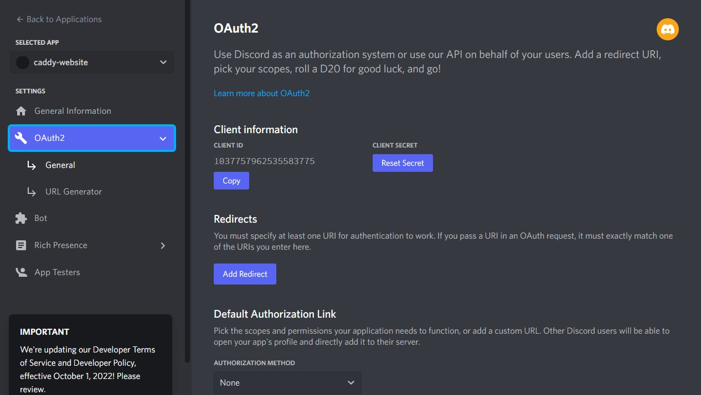
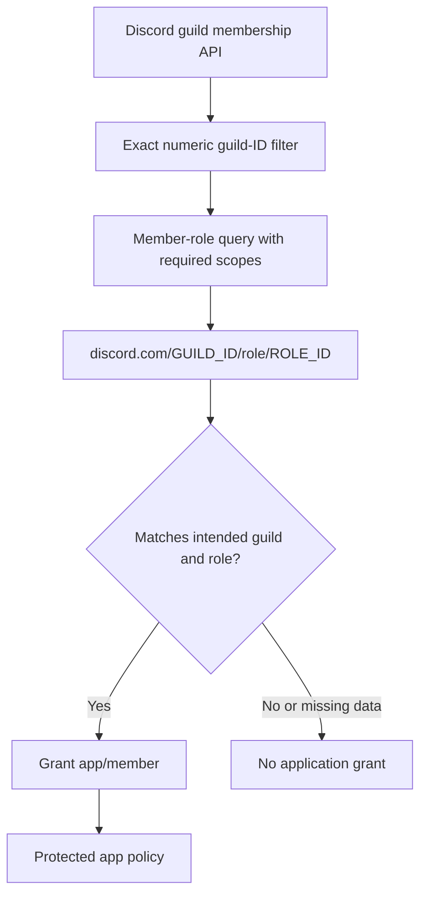

import CodeBlock from '@theme/CodeBlock';
import example from '@site/assets/conf/oauth/discord/Caddyfile?raw';

# Discord

Use the Discord OAuth2 named driver to identify an account and optionally map
its guild memberships/roles. A guild is Discord's term for a server. This is a
user OAuth application, not a bot invitation or a bot token configuration.

### Registering a discord application

Create an application in the [Discord developer portal](https://discord.com/developers/applications),
record its client ID and private OAuth client secret, and add exactly:

```text
https://auth.example.com/auth/oauth2/discord/authorization-code-callback
```

Save `DISCORD_CLIENT_ID` and `DISCORD_CLIENT_SECRET` in the server environment.
Enable developer mode when copying numeric guild and role IDs. IDs and display
names are different; names alone cannot populate this example's filters.
See [Discord's OAuth2 scopes and code flow](https://docs.discord.com/developers/topics/oauth2).

<figure className="doc-screenshot">

[](../images/oauth2_discord_new_app.jpg)

<figcaption>Historical Discord OAuth2 settings and Add Redirect; keep the client secret private and use the public callback above.</figcaption>
</figure>
### Sample Caddyfile configuration

<CodeBlock language="caddyfile" title="assets/conf/oauth/discord/Caddyfile">{example}</CodeBlock>
Set a private `AUTHCRUNCH_SIGNING_KEY` plus numeric `DISCORD_GUILD_ID` and
`DISCORD_ROLE_ID` before parsing. The ID placeholders expand at parse time.
The initial transform clears reserved portal roles and direct `app/member`;
only the intended role in the intended guild grants application access.

The named driver defaults to `identify` and disables PKCE and nonce. `email`
requests optional email, `guilds` enables membership queries, and
`guilds.members.read` enables a per-guild member-role query. Email may still be
missing; choose deliberately whether your subject-based application permits
`disable email claim check`.

For account-specific access instead, match the **entire**
`discord.com/NUMERIC_USER_ID` subject with the correct realm, then add an
application role. A Discord account or guild administrator is not automatically
an AuthCrunch administrator.




### Filtering by guild

`user_group_filters` contains **regular expressions**, not a wildcard language.
Use anchored `^NUMERIC_GUILD_ID$` for one exact guild. The old `*` example is
invalid regex; `.*` would match every returned guild and should be used only
when that broad disclosure/role mapping is intentional. Without filters, guild
membership does not produce these roles.

| Observed membership | Derived role |
| --- | --- |
| Member of an included guild | `discord.com/GUILD_ID/members` |
| Administrator permission bit in that guild | `discord.com/GUILD_ID/admins` |

Filtering controls which membership data becomes roles; it does not itself deny
an otherwise valid Discord login. The application's policy still requires
`app/member`. An API failure can leave login without guild roles; a restrictive
policy then denies application access.

### Filtering by guild role

With both `guilds` and `guilds.members.read`, the connector queries each included
guild member and adds `discord.com/GUILD_ID/role/ROLE_ID` for returned role IDs.
The canonical transform admits exactly the selected guild-role combination.
It does not grant all guild members application access, nor does it promote a
Discord guild administrator to portal administration.

Test a member with the selected role, a member without it, and an account in
another guild. Removing a guild role does not revoke every previously issued
portal JWT immediately; use a suitable access lifetime and require a fresh
login to inspect changed provider data.

## Verify and troubleshoot

Sign in through `/auth/oauth2/discord`, inspect `/auth/whoami?format=json`, and
record the exact subject and realm without logging access tokens. Confirm that
an intended member reaches `/app` and another valid identity is denied. A
successful provider login alone does not establish application authorization.

Check callback scheme, hostname, port, mount, and realm literally; inspect
provider errors and [diagnostic logs](../../operations/logging.md). Keep client
secrets on the server. These examples are parser-verified against the released
bundle; console registration, live provider login, consent, and production TLS
require verification in your own organization.

## Agentic Prompts

Copy a prompt into your LLM to explore this topic. Each prompt prioritizes
upstream repository guidance and code over this page, and asks for version-aware
reasoning.

<div className="agentic-prompts">

<details>
<summary>Distinguish user OAuth from a bot</summary>

```text
Help me understand Discord.

Primary authorities (take precedence over website documentation):
https://github.com/greenpau/caddy-security/blob/main/AGENTS.md
https://github.com/greenpau/caddy-security/tree/main/.codex/skills
https://github.com/greenpau/go-authcrunch/blob/main/AGENTS.md
https://github.com/greenpau/go-authcrunch/tree/main/.codex/skills
Read each repository's root AGENTS.md first, then any scoped AGENTS.md that
applies to inspected paths. Read the relevant SKILL.md files and follow their
implementation and test references.

Relevant skills to locate: configuration-oauth-providers,
oauth-identity-provider.

Secondary reference:
https://docs.authcrunch.com/docs/authenticate/oauth/backend-oauth2-0013-discord

If a source is inaccessible, ask me to paste its relevant text. Identify the
versions your answer applies to; main may be newer than my release. Resolve
disagreements using code and tests, and flag unverified claims. Use synthetic
credentials and redacted examples; explain proposed checks before any changes.

Explain Discord account identity, OAuth client secret, scopes, guilds, and
guild roles. Contrast this with bot installation/token authorization. Trace
the named driver’s actual transaction defaults and profile path rather than
assuming generic OIDC behavior.
```

</details>

<details>
<summary>Read guild filters and role names</summary>

```text
Help me understand Discord.

Primary authorities (take precedence over website documentation):
https://github.com/greenpau/caddy-security/blob/main/AGENTS.md
https://github.com/greenpau/caddy-security/tree/main/.codex/skills
https://github.com/greenpau/go-authcrunch/blob/main/AGENTS.md
https://github.com/greenpau/go-authcrunch/tree/main/.codex/skills
Read each repository's root AGENTS.md first, then any scoped AGENTS.md that
applies to inspected paths. Read the relevant SKILL.md files and follow their
implementation and test references.

Relevant skills to locate: configuration-oauth-providers,
oauth-identity-provider.

Secondary reference:
https://docs.authcrunch.com/docs/authenticate/oauth/backend-oauth2-0013-discord

If a source is inaccessible, ask me to paste its relevant text. Identify the
versions your answer applies to; main may be newer than my release. Resolve
disagreements using code and tests, and flag unverified claims. Use synthetic
credentials and redacted examples; explain proposed checks before any changes.

Compare an anchored numeric guild regex, invalid star wildcard, and broad
dot-star regex. Trace guild membership and guild-role output names. Explain
why selecting returned data is separate from the portal transform and
application ACL.
```

</details>

<details>
<summary>Review the membership scopes</summary>

```text
Help me understand Discord.

Primary authorities (take precedence over website documentation):
https://github.com/greenpau/caddy-security/blob/main/AGENTS.md
https://github.com/greenpau/caddy-security/tree/main/.codex/skills
https://github.com/greenpau/go-authcrunch/blob/main/AGENTS.md
https://github.com/greenpau/go-authcrunch/tree/main/.codex/skills
Read each repository's root AGENTS.md first, then any scoped AGENTS.md that
applies to inspected paths. Read the relevant SKILL.md files and follow their
implementation and test references.

Relevant skills to locate: configuration-oauth-providers,
oauth-identity-provider.

Secondary reference:
https://docs.authcrunch.com/docs/authenticate/oauth/backend-oauth2-0013-discord

If a source is inaccessible, ask me to paste its relevant text. Identify the
versions your answer applies to; main may be newer than my release. Resolve
disagreements using code and tests, and flag unverified claims. Use synthetic
credentials and redacted examples; explain proposed checks before any changes.

Explain identify, optional email, guilds, and guilds.members.read in relation
to actual API requests. Ask whether a guild or one specific role should grant
app access. Keep missing/API-failed membership from becoming a broad
permission.
```

</details>

<details>
<summary>Diagnose a denied guild member</summary>

```text
Help me understand Discord.

Primary authorities (take precedence over website documentation):
https://github.com/greenpau/caddy-security/blob/main/AGENTS.md
https://github.com/greenpau/caddy-security/tree/main/.codex/skills
https://github.com/greenpau/go-authcrunch/blob/main/AGENTS.md
https://github.com/greenpau/go-authcrunch/tree/main/.codex/skills
Read each repository's root AGENTS.md first, then any scoped AGENTS.md that
applies to inspected paths. Read the relevant SKILL.md files and follow their
implementation and test references.

Relevant skills to locate: configuration-oauth-providers,
oauth-identity-provider.

Secondary reference:
https://docs.authcrunch.com/docs/authenticate/oauth/backend-oauth2-0013-discord

If a source is inaccessible, ask me to paste its relevant text. Identify the
versions your answer applies to; main may be newer than my release. Resolve
disagreements using code and tests, and flag unverified claims. Use synthetic
credentials and redacted examples; explain proposed checks before any changes.

Help me inspect redacted numeric guild/role IDs, scopes, regex, normalized
role names, and provider errors. Distinguish membership without selected role,
another guild, missing filter, and missing email policy. Never request a bot
token as a substitute.
```

</details>

<details>
<summary>Test selected-role access</summary>

```text
Help me understand Discord.

Primary authorities (take precedence over website documentation):
https://github.com/greenpau/caddy-security/blob/main/AGENTS.md
https://github.com/greenpau/caddy-security/tree/main/.codex/skills
https://github.com/greenpau/go-authcrunch/blob/main/AGENTS.md
https://github.com/greenpau/go-authcrunch/tree/main/.codex/skills
Read each repository's root AGENTS.md first, then any scoped AGENTS.md that
applies to inspected paths. Read the relevant SKILL.md files and follow their
implementation and test references.

Relevant skills to locate: configuration-oauth-providers,
oauth-identity-provider.

Secondary reference:
https://docs.authcrunch.com/docs/authenticate/oauth/backend-oauth2-0013-discord

If a source is inaccessible, ask me to paste its relevant text. Identify the
versions your answer applies to; main may be newer than my release. Resolve
disagreements using code and tests, and flag unverified claims. Use synthetic
credentials and redacted examples; explain proposed checks before any changes.

Create cases for selected guild-role member, guild member without it, account
in another guild, API failure, and role removal with fresh login. Explain why
Discord administration is not AuthCrunch administration and why an old portal
JWT can retain issued roles.
```

</details>

</div>

## Source Code References

Start with the code search, then follow the parser, runtime, and tests relevant
to this topic. These links target `main`; use GitHub's branch/tag selector to
compare them with your installed release.

1. [Search this topic in both repositories](https://github.com/search?q=%28repo%3Agreenpau%2Fgo-authcrunch%20OR%20repo%3Agreenpau%2Fcaddy-security%29%20%28discord%20OR%20guilds.members.read%20OR%20user_group_filters%29&type=code)
   — searches topic-specific symbols and paths across both codebases.
2. [caddy-security: caddyfile_identity_provider_oauth.go](https://github.com/greenpau/caddy-security/blob/main/caddyfile_identity_provider_oauth.go)
   — adapts OAuth/OIDC provider settings, scopes, endpoints, and trust options.
3. [go-authcrunch: pkg/idp/oauth/config.go](https://github.com/greenpau/go-authcrunch/blob/main/pkg/idp/oauth/config.go)
   — validates generic and named-driver defaults and endpoint settings.
4. [go-authcrunch: pkg/idp/oauth/user.go](https://github.com/greenpau/go-authcrunch/blob/main/pkg/idp/oauth/user.go)
   — fetches and normalizes named-provider profile, membership, and identity data.
5. [go-authcrunch: pkg/idp/oauth/user_groups.go](https://github.com/greenpau/go-authcrunch/blob/main/pkg/idp/oauth/user_groups.go)
   — retrieves and filters provider-specific group membership data.
6. [go-authcrunch: pkg/idp/oauth/user_groups_test.go](https://github.com/greenpau/go-authcrunch/blob/main/pkg/idp/oauth/user_groups_test.go)
   — tests provider group extraction and filtering.
