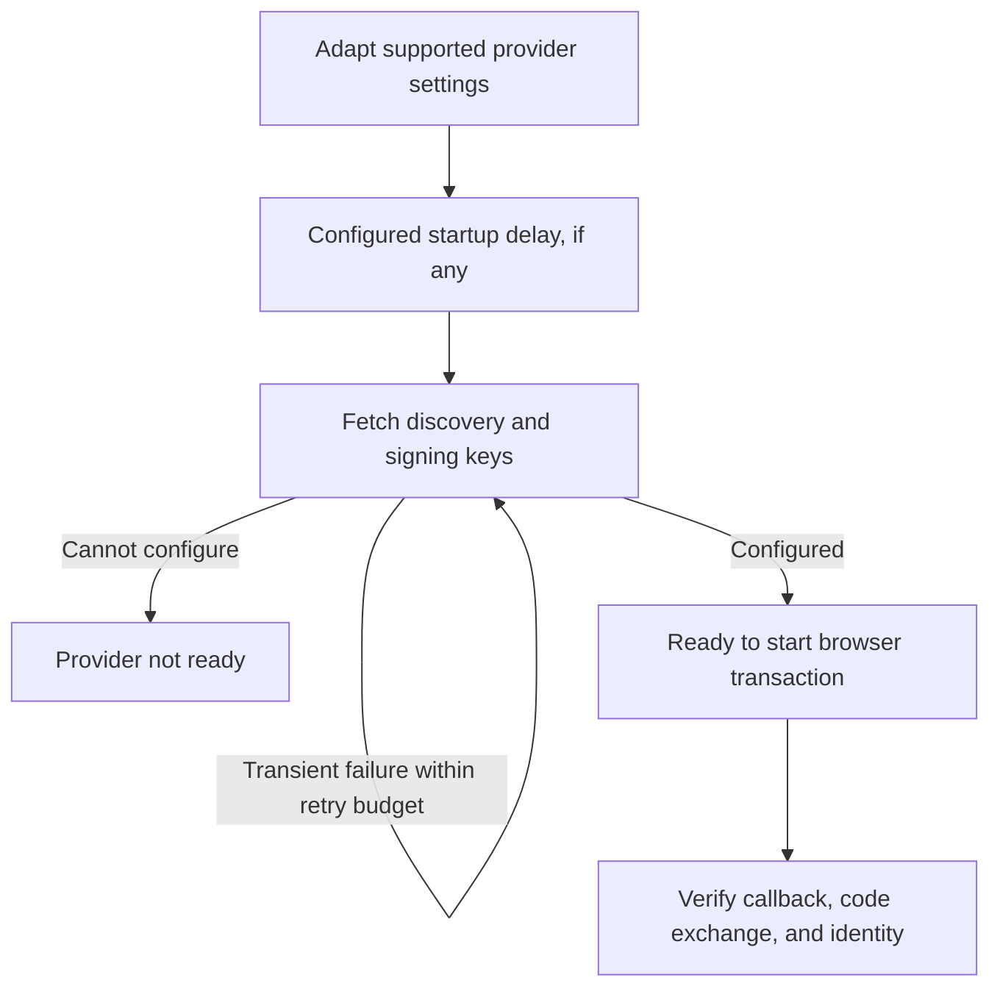

# OAuth provider endpoint settings

Place these settings inside an existing `oauth identity provider` block.
They control upstream provider setup and login behavior, separately from the
portal's access-token lifetime, local refresh sessions, or direct OAuth policy.
This reference targets [Caddy Security v1.3.0 / library v1.3.8](../../operations/versions.md).




## OAuth 2.0 Endpoint Delayed Start

```Caddyfile
delay_start 5
```

Delay discovery/key setup by five seconds. With no delay, required setup runs
while provisioning; failure can prevent the configuration from loading. With a
delay, the provider starts setup asynchronously and rejects login while it is
not ready. This is useful when another service needs time to start, but it does
not turn an unavailable provider into an authenticated identity.

When a delay is configured without retry settings, the released configuration
uses two attempts and an interval equal to the delay. Worker cancellation on
reload/shutdown stops owned setup work; delayed setup does not authorize stale
callbacks after the provider closes.

## OAuth 2.0 Endpoint Retry Attempts

```Caddyfile
retry_attempts 3
retry_interval 10
```

These values allow up to **three total attempts** for discovery and key fetch,
with ten seconds between failures. Without a delay, a positive retry count with
no interval defaults to five seconds. Discovery and key retrieval are separate
stages; the count is not a universal retry policy for every HTTP call.

The options do not replay authorization-code exchange, automatically renew a
provider access/refresh token, or repair a bad issuer/callback/client secret.
Inspect [diagnostic logs](../../operations/logging.md), DNS, TLS trust, network
access, and provider metadata before increasing retries. A completed setup does
not imply every future upstream request will succeed.

## OAuth 2.0 Logout

```Caddyfile
enable logout
```

Provider logout is optional and distinct from
[portal logout](../15-logout.md). Discovery can supply an
`end_session_endpoint`; an explicit `logout_url` overrides the discovered URL.
The released named Cognito driver derives its `/logout` URL and appends a client
ID; Google uses its own logout URL. Generic OIDC can use discovery's logout
endpoint. The previous claim that only Cognito supports this option is outdated.

Provider-specific parameters still matter. An endpoint can require a registered
post-logout destination, ID-token hint, or other fields that the bare discovered
URL does not supply automatically. For Cognito, a complete explicit `logout_url`
can include the provider-required, URL-encoded registered destination. Consult
the provider's current logout contract and verify the actual browser flow.

Signing out from AuthCrunch does not prove that the upstream provider session
ended, that every application session ended, or that independently accepted JWTs
were revoked. Test local logout, upstream logout, and any return redirect as
separate outcomes.

## OAuth 2.0 PKCE

The generic OIDC driver enables PKCE by default. This does **not** apply equally
to all named drivers: released GitHub, Facebook, Discord, and LinkedIn configure
it off. LinkedIn also disables nonce generation; GitHub/Facebook/Discord use an
opaque access-token/profile flow rather than signed OIDC ID-token validation.

```Caddyfile
# For a specific provider that deliberately cannot use PKCE:
disable pkce
```

Use a code-flow confidential client whose settings match the driver's behavior.
Do not disable signature, issuer, audience, or nonce checks to hide a failed
OIDC registration. The [OAuth/OIDC overview](10-oauth2.md#pkce) and
[generic OIDC guide](81-backend-oauth2-0000-generic.md) explain the flow and
validation controls. State binding and PKCE are complementary checks.

## Accepted flags and actual discovery

In this release, `disable metadata discovery` is accepted configuration but
not read by the provider consumer. Explicit endpoints plus static keys and no
metadata URL can avoid discovery; supplying metadata still causes it to be
fetched. See [OIDC token trust](83-oidc-trust.md) for static pins and remote key
rollover. `disable key verification` controls remote fetching, while the JWT
parser still enforces asymmetric signature/key checks.

## Agentic Prompts

Copy a prompt into your LLM to explore this topic. Each prompt prioritizes
upstream repository guidance and code over this page, and asks for version-aware
reasoning.

<div className="agentic-prompts">

<details>
<summary>Explain readiness and delayed setup</summary>

```text
Help me understand OAuth provider endpoint settings.

Primary authorities (take precedence over website documentation):
https://github.com/greenpau/caddy-security/blob/main/AGENTS.md
https://github.com/greenpau/caddy-security/tree/main/.codex/skills
https://github.com/greenpau/go-authcrunch/blob/main/AGENTS.md
https://github.com/greenpau/go-authcrunch/tree/main/.codex/skills
Read each repository's root AGENTS.md first, then any scoped AGENTS.md that
applies to inspected paths. Read the relevant SKILL.md files and follow their
implementation and test references.

Relevant skills to locate: configuration-oauth-providers,
oauth-identity-provider.

Secondary reference:
https://docs.authcrunch.com/docs/authenticate/oauth/backend-oauth2-endpoint

If a source is inaccessible, ask me to paste its relevant text. Identify the
versions your answer applies to; main may be newer than my release. Resolve
disagreements using code and tests, and flag unverified claims. Use synthetic
credentials and redacted examples; explain proposed checks before any changes.

Trace synchronous setup versus delay_start, asynchronous readiness, and
requests before provider configuration completes. Explain startup dependency
ordering and what cancellation on shutdown/reload must stop. Separate
availability from authentication authority.
```

</details>

<details>
<summary>Read the retry contract</summary>

```text
Help me understand OAuth provider endpoint settings.

Primary authorities (take precedence over website documentation):
https://github.com/greenpau/caddy-security/blob/main/AGENTS.md
https://github.com/greenpau/caddy-security/tree/main/.codex/skills
https://github.com/greenpau/go-authcrunch/blob/main/AGENTS.md
https://github.com/greenpau/go-authcrunch/tree/main/.codex/skills
Read each repository's root AGENTS.md first, then any scoped AGENTS.md that
applies to inspected paths. Read the relevant SKILL.md files and follow their
implementation and test references.

Relevant skills to locate: configuration-oauth-providers,
oauth-identity-provider.

Secondary reference:
https://docs.authcrunch.com/docs/authenticate/oauth/backend-oauth2-endpoint

If a source is inaccessible, ask me to paste its relevant text. Identify the
versions your answer applies to; main may be newer than my release. Resolve
disagreements using code and tests, and flag unverified claims. Use synthetic
credentials and redacted examples; explain proposed checks before any changes.

Compare total attempt count, interval defaults, discovery/key stages, and
authorization-code exchange. Use a small timeline for repeated setup failure.
Explain why these knobs are not a universal retry policy or an upstream
token-renewal mechanism.
```

</details>

<details>
<summary>Diagnose persistent startup failure</summary>

```text
Help me understand OAuth provider endpoint settings.

Primary authorities (take precedence over website documentation):
https://github.com/greenpau/caddy-security/blob/main/AGENTS.md
https://github.com/greenpau/caddy-security/tree/main/.codex/skills
https://github.com/greenpau/go-authcrunch/blob/main/AGENTS.md
https://github.com/greenpau/go-authcrunch/tree/main/.codex/skills
Read each repository's root AGENTS.md first, then any scoped AGENTS.md that
applies to inspected paths. Read the relevant SKILL.md files and follow their
implementation and test references.

Relevant skills to locate: configuration-oauth-providers,
oauth-identity-provider.

Secondary reference:
https://docs.authcrunch.com/docs/authenticate/oauth/backend-oauth2-endpoint

If a source is inaccessible, ask me to paste its relevant text. Identify the
versions your answer applies to; main may be newer than my release. Resolve
disagreements using code and tests, and flag unverified claims. Use synthetic
credentials and redacted examples; explain proposed checks before any changes.

Help me inspect DNS, TLS trust, discovery URLs, issuer, key endpoint, and
redacted setup errors before increasing retries. Separate transient
unavailability from a wrong callback/client secret. Identify observations that
prove actual provider readiness.
```

</details>

<details>
<summary>Compare accepted flags with consumers</summary>

```text
Help me understand OAuth provider endpoint settings.

Primary authorities (take precedence over website documentation):
https://github.com/greenpau/caddy-security/blob/main/AGENTS.md
https://github.com/greenpau/caddy-security/tree/main/.codex/skills
https://github.com/greenpau/go-authcrunch/blob/main/AGENTS.md
https://github.com/greenpau/go-authcrunch/tree/main/.codex/skills
Read each repository's root AGENTS.md first, then any scoped AGENTS.md that
applies to inspected paths. Read the relevant SKILL.md files and follow their
implementation and test references.

Relevant skills to locate: configuration-oauth-providers,
oauth-identity-provider.

Secondary reference:
https://docs.authcrunch.com/docs/authenticate/oauth/backend-oauth2-endpoint

If a source is inaccessible, ask me to paste its relevant text. Identify the
versions your answer applies to; main may be newer than my release. Resolve
disagreements using code and tests, and flag unverified claims. Use synthetic
credentials and redacted examples; explain proposed checks before any changes.

Inspect disable metadata discovery and disable key verification from parser
through runtime. Explain what the installed consumer actually reads. Compare
explicit endpoints/static keys with a supplied metadata URL; do not infer
offline provisioning from a flag name alone.
```

</details>

<details>
<summary>Review driver-specific logout and PKCE</summary>

```text
Help me understand OAuth provider endpoint settings.

Primary authorities (take precedence over website documentation):
https://github.com/greenpau/caddy-security/blob/main/AGENTS.md
https://github.com/greenpau/caddy-security/tree/main/.codex/skills
https://github.com/greenpau/go-authcrunch/blob/main/AGENTS.md
https://github.com/greenpau/go-authcrunch/tree/main/.codex/skills
Read each repository's root AGENTS.md first, then any scoped AGENTS.md that
applies to inspected paths. Read the relevant SKILL.md files and follow their
implementation and test references.

Relevant skills to locate: configuration-oauth-providers,
oauth-identity-provider.

Secondary reference:
https://docs.authcrunch.com/docs/authenticate/oauth/backend-oauth2-endpoint

If a source is inaccessible, ask me to paste its relevant text. Identify the
versions your answer applies to; main may be newer than my release. Resolve
disagreements using code and tests, and flag unverified claims. Use synthetic
credentials and redacted examples; explain proposed checks before any changes.

Compare named-driver PKCE/nonce defaults with generic OIDC and optional
provider logout. Use current official provider requirements for token
hints/registered destinations. Design separate tests for local logout,
upstream logout, delayed readiness, and shutdown cancellation.
```

</details>

</div>

## Source Code References

Start with the code search, then follow the parser, runtime, and tests relevant
to this topic. These links target `main`; use GitHub's branch/tag selector to
compare them with your installed release.

1. [Search this topic in both repositories](https://github.com/search?q=%28repo%3Agreenpau%2Fgo-authcrunch%20OR%20repo%3Agreenpau%2Fcaddy-security%29%20%28DelayStart%20OR%20RetryAttempts%20OR%20MetadataDiscoveryDisabled%29&type=code)
   — searches topic-specific symbols and paths across both codebases.
2. [caddy-security: caddyfile_identity_provider_oauth.go](https://github.com/greenpau/caddy-security/blob/main/caddyfile_identity_provider_oauth.go)
   — adapts OAuth/OIDC provider settings, scopes, endpoints, and trust options.
3. [go-authcrunch: pkg/idp/oauth/config.go](https://github.com/greenpau/go-authcrunch/blob/main/pkg/idp/oauth/config.go)
   — validates generic and named-driver defaults and endpoint settings.
4. [go-authcrunch: pkg/idp/oauth/provider.go](https://github.com/greenpau/go-authcrunch/blob/main/pkg/idp/oauth/provider.go)
   — loads discovery metadata, provider readiness, and driver setup.
5. [go-authcrunch: pkg/idp/oauth/config_test.go](https://github.com/greenpau/go-authcrunch/blob/main/pkg/idp/oauth/config_test.go)
   — tests generic/named provider configuration and validation.
6. [go-authcrunch: pkg/idp/oauth/provider_lifecycle_test.go](https://github.com/greenpau/go-authcrunch/blob/main/pkg/idp/oauth/provider_lifecycle_test.go)
   — tests provider lifecycle and setup cancellation.
