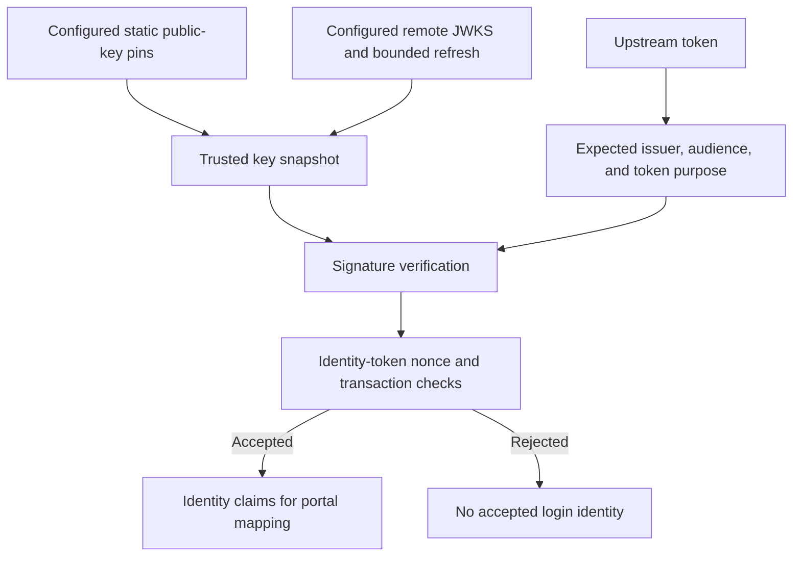

# Upstream OIDC token trust and key rollover

These controls validate tokens **received from an upstream OAuth/OIDC provider** in Caddy Security v1.3.0 / go-authcrunch v1.3.8. They are separate from [the portal's own JWT signing/verification](../../authorize/token-verification.md) and [AuthCrunch serving as an OIDC issuer](../../apps/oidc-provider.md). Begin with [generic OIDC setup](81-backend-oauth2-0000-generic.md) for a complete portal and app example.




## Keep token purposes distinct

| Token | Released trust decision |
| --- | --- |
| Identity token | Supported asymmetric signature, configured/discovered exact issuer, audience containing this client ID, and transaction nonce when enabled |
| Identity token with multiple audiences | Also requires `azp` matching the OAuth client ID |
| Supplemental JWT access token | Signature and issuer; explicit `access_token_audience` when set. Without it, a resource audience can be accepted only with `azp` identifying this client |
| Opaque access token | Not parsed as identity JWT claims |

A present `azp` must match the client even when it is not otherwise required. An invalid identity token rejects login. A supplemental access JWT that fails validation contributes no claims; it does not turn an otherwise valid ID token into a failed login. Put essential application membership in a verified ID-token claim and use controlled transforms.

The default generic response requires both `id_token` and `access_token`. `required_token_fields` changes response-field requirements, not the trust checks or the ability to derive identity from an arbitrary opaque token.

## Pin upstream public keys

For a provider with explicitly managed endpoints/keys, this block can be added to an existing `security` configuration:

```caddyfile
oauth identity provider pinned-company {
  realm company
  driver generic
  client_id {env.OIDC_CLIENT_ID}
  client_secret {env.OIDC_CLIENT_SECRET}
  base_auth_url https://id.example.com
  issuer https://id.example.com
  authorization_url https://id.example.com/authorize
  token_url https://id.example.com/token
  scopes openid email profile
  jwks key company-2026 /etc/authcrunch/keys/company-public.pem
}
```

Enable this provider's name in the portal and retain the application-role boundary from the generic example. `jwks key` takes a key ID and a local public PEM path, not private key material or an HTTP URL. RSA, supported EC curves and Ed25519 public keys are supported; at most 64 static keys are accepted. The key ID must agree with the upstream JWT header when it supplies `kid`.

An explicit static key ID takes precedence over a remote key with the same ID. Updating remote metadata cannot silently replace that pin. Verify a replacement public key out of band and reprovision after changing its file/configuration. No discovered issuer is available in this manual example, so the explicit `issuer` is essential.

With explicit authorization/token URLs, static keys and no metadata URL, provisioning does not need discovery. If a metadata URL is also configured, it is still fetched. The accepted `disable metadata discovery` flag is not consumed by the released provider and does not guarantee offline provisioning. Preserve signature, PKCE and nonce checks rather than relying on a flag name to bypass missing setup.

## Follow remote rollover

When discovery supplies a JWKS URL, a missing eligible key ID or a cryptographic signature failure using a remote key can trigger one bounded refresh/retry for that parse. This supports rollover where either `kid` or key material changes. Concurrent requests share the fetch result; fetch attempts are rate limited. Static pins, malformed headers, claim failures and unsupported algorithms do not become remote refresh bypasses.

A complete valid remote `keys` array replaces the previous remote trust snapshot while preserving explicit static pins. Malformed/failed transport does not publish a partial replacement. Remote TLS and HTTP status still matter. This refresh behavior is not an upstream refresh-token grant and does not renew the portal session.

The historical `disable key verification` setting controls remote key fetching; the JWT parser still enforces its asymmetric method/key checks. It is not a way to accept unsigned or HMAC identity tokens.

## Verify the provider boundary

Test a valid ID token, wrong issuer/client/nonce, multiple audiences with missing/wrong `azp`, a changed remote key and a rogue key claiming a pinned ID. Test optional access-token claims separately. Successful adaptation only proves grammar and static-file acceptance; a synthetic signing fixture verifies these checks, while live provider consent and certificate/network setup need their own test.

## Agentic Prompts

Copy a prompt into your LLM to explore this topic. Each prompt prioritizes
upstream repository guidance and code over this page, and asks for version-aware
reasoning.

<div className="agentic-prompts">

<details>
<summary>Separate upstream trust from portal keys</summary>

```text
Help me understand Upstream OIDC token trust and key rollover.

Primary authorities (take precedence over website documentation):
https://github.com/greenpau/caddy-security/blob/main/AGENTS.md
https://github.com/greenpau/caddy-security/tree/main/.codex/skills
https://github.com/greenpau/go-authcrunch/blob/main/AGENTS.md
https://github.com/greenpau/go-authcrunch/tree/main/.codex/skills
Read each repository's root AGENTS.md first, then any scoped AGENTS.md that
applies to inspected paths. Read the relevant SKILL.md files and follow their
implementation and test references.

Relevant skills to locate: configuration-oauth-providers,
oauth-identity-provider.

Secondary reference:
https://docs.authcrunch.com/docs/authenticate/oauth/oidc-trust

If a source is inaccessible, ask me to paste its relevant text. Identify the
versions your answer applies to; main may be newer than my release. Resolve
disagreements using code and tests, and flag unverified claims. Use synthetic
credentials and redacted examples; explain proposed checks before any changes.

Explain verifying upstream ID/access tokens versus signing the portal access
JWT and serving downstream OIDC. Trace issuer, audience, azp, nonce,
algorithm, and key selection. Separate opaque tokens from signed identity
claims.
```

</details>

<details>
<summary>Work through token purposes</summary>

```text
Help me understand Upstream OIDC token trust and key rollover.

Primary authorities (take precedence over website documentation):
https://github.com/greenpau/caddy-security/blob/main/AGENTS.md
https://github.com/greenpau/caddy-security/tree/main/.codex/skills
https://github.com/greenpau/go-authcrunch/blob/main/AGENTS.md
https://github.com/greenpau/go-authcrunch/tree/main/.codex/skills
Read each repository's root AGENTS.md first, then any scoped AGENTS.md that
applies to inspected paths. Read the relevant SKILL.md files and follow their
implementation and test references.

Relevant skills to locate: configuration-oauth-providers,
oauth-identity-provider.

Secondary reference:
https://docs.authcrunch.com/docs/authenticate/oauth/oidc-trust

If a source is inaccessible, ask me to paste its relevant text. Identify the
versions your answer applies to; main may be newer than my release. Resolve
disagreements using code and tests, and flag unverified claims. Use synthetic
credentials and redacted examples; explain proposed checks before any changes.

Compare required ID token, optional supplemental access JWT, and
multi-audience identity token. Use synthetic claim maps to explain when azp
and configured access-token audience matter. Inspect whether invalid
supplemental data rejects login or simply contributes no claims.
```

</details>

<details>
<summary>Understand pins and rollover</summary>

```text
Help me understand Upstream OIDC token trust and key rollover.

Primary authorities (take precedence over website documentation):
https://github.com/greenpau/caddy-security/blob/main/AGENTS.md
https://github.com/greenpau/caddy-security/tree/main/.codex/skills
https://github.com/greenpau/go-authcrunch/blob/main/AGENTS.md
https://github.com/greenpau/go-authcrunch/tree/main/.codex/skills
Read each repository's root AGENTS.md first, then any scoped AGENTS.md that
applies to inspected paths. Read the relevant SKILL.md files and follow their
implementation and test references.

Relevant skills to locate: configuration-oauth-providers,
oauth-identity-provider.

Secondary reference:
https://docs.authcrunch.com/docs/authenticate/oauth/oidc-trust

If a source is inaccessible, ask me to paste its relevant text. Identify the
versions your answer applies to; main may be newer than my release. Resolve
disagreements using code and tests, and flag unverified claims. Use synthetic
credentials and redacted examples; explain proposed checks before any changes.

Compare a local public PEM pin with a remote JWKS entry having the same kid.
Trace complete remote snapshot replacement and bounded refresh/retry after an
eligible missing key or signature failure. Explain what malformed transport
and static pins must preserve.
```

</details>

<details>
<summary>Diagnose a trust rejection</summary>

```text
Help me understand Upstream OIDC token trust and key rollover.

Primary authorities (take precedence over website documentation):
https://github.com/greenpau/caddy-security/blob/main/AGENTS.md
https://github.com/greenpau/caddy-security/tree/main/.codex/skills
https://github.com/greenpau/go-authcrunch/blob/main/AGENTS.md
https://github.com/greenpau/go-authcrunch/tree/main/.codex/skills
Read each repository's root AGENTS.md first, then any scoped AGENTS.md that
applies to inspected paths. Read the relevant SKILL.md files and follow their
implementation and test references.

Relevant skills to locate: configuration-oauth-providers,
oauth-identity-provider.

Secondary reference:
https://docs.authcrunch.com/docs/authenticate/oauth/oidc-trust

If a source is inaccessible, ask me to paste its relevant text. Identify the
versions your answer applies to; main may be newer than my release. Resolve
disagreements using code and tests, and flag unverified claims. Use synthetic
credentials and redacted examples; explain proposed checks before any changes.

Help me inspect public algorithm/kid/issuer/audience metadata and redacted
errors for wrong client, wrong issuer, missing azp, nonce mismatch, or rotated
key. Do not treat kid as an arbitrary fetch URL or disable signature checks to
solve a rollout problem.
```

</details>

<details>
<summary>Build a synthetic trust matrix</summary>

```text
Help me understand Upstream OIDC token trust and key rollover.

Primary authorities (take precedence over website documentation):
https://github.com/greenpau/caddy-security/blob/main/AGENTS.md
https://github.com/greenpau/caddy-security/tree/main/.codex/skills
https://github.com/greenpau/go-authcrunch/blob/main/AGENTS.md
https://github.com/greenpau/go-authcrunch/tree/main/.codex/skills
Read each repository's root AGENTS.md first, then any scoped AGENTS.md that
applies to inspected paths. Read the relevant SKILL.md files and follow their
implementation and test references.

Relevant skills to locate: configuration-oauth-providers,
oauth-identity-provider.

Secondary reference:
https://docs.authcrunch.com/docs/authenticate/oauth/oidc-trust

If a source is inaccessible, ask me to paste its relevant text. Identify the
versions your answer applies to; main may be newer than my release. Resolve
disagreements using code and tests, and flag unverified claims. Use synthetic
credentials and redacted examples; explain proposed checks before any changes.

Design independently signed disposable fixtures for valid identity, wrong
issuer/client/nonce, multiple audiences, remote key change, rogue pinned-ID
key, and malformed JWKS. Keep live consent/network tests separate and explain
what each fixture proves about the consumer.
```

</details>

</div>

## Source Code References

Start with the code search, then follow the parser, runtime, and tests relevant
to this topic. These links target `main`; use GitHub's branch/tag selector to
compare them with your installed release.

1. [Search this topic in both repositories](https://github.com/search?q=%28repo%3Agreenpau%2Fgo-authcrunch%20OR%20repo%3Agreenpau%2Fcaddy-security%29%20%28access_token_audience%20OR%20jwksSnapshot%20OR%20azp%29&type=code)
   — searches topic-specific symbols and paths across both codebases.
2. [caddy-security: caddyfile_identity_provider_oauth.go](https://github.com/greenpau/caddy-security/blob/main/caddyfile_identity_provider_oauth.go)
   — adapts OAuth/OIDC provider settings, scopes, endpoints, and trust options.
3. [go-authcrunch: pkg/idp/oauth/jwt.go](https://github.com/greenpau/go-authcrunch/blob/main/pkg/idp/oauth/jwt.go)
   — checks upstream token signatures, issuer, audience, and transaction trust.
4. [go-authcrunch: pkg/idp/oauth/jwks.go](https://github.com/greenpau/go-authcrunch/blob/main/pkg/idp/oauth/jwks.go)
   — fetches upstream signing keys and handles configured public-key material.
5. [go-authcrunch: pkg/idp/oauth/jwks_store.go](https://github.com/greenpau/go-authcrunch/blob/main/pkg/idp/oauth/jwks_store.go)
   — maintains pinned and remote key snapshots and bounded refresh behavior.
6. [go-authcrunch: pkg/idp/oauth/jwks_store_test.go](https://github.com/greenpau/go-authcrunch/blob/main/pkg/idp/oauth/jwks_store_test.go)
   — tests key snapshot replacement, pins, and refresh behavior.
