import CodeBlock from '@theme/CodeBlock';
import canonicalCaddyfile from '@site/assets/conf/saml/azure/Caddyfile?raw';

# Microsoft Entra ID (SAML)

Use Entra as the upstream SAML IdP for an AuthCrunch portal. This guide uses the released **generic** SAML driver with an explicit Entra Login URL. Read the [SAML transaction and claim contract](10-saml.md) first. For OIDC instead, use [Microsoft Entra OAuth](../oauth/81-backend-oauth2-0006-microsoft.md).


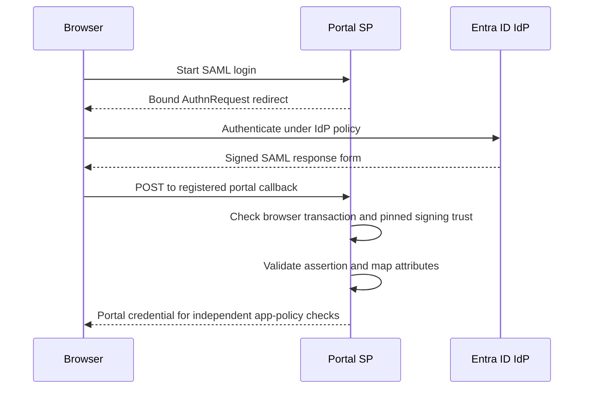

## Azure AD SAML Configuration

The complete [canonical example](https://github.com/authcrunch/authcrunch.github.io/blob/main/assets/conf/saml/azure/Caddyfile) serves `/auth/` and protects `/app` on `auth.example.com`. Replace that hostname consistently in Caddy and Entra.

Set `ENTRA_SAML_LOGIN_URL` to the enterprise application's Login URL, `SAML_METADATA_PATH` and `SAML_CERT_PATH` to its downloaded metadata and PEM signing certificate, and `JWT_SHARED_KEY` to a private random portal signing secret. The first three use Caddyfile `{$VARIABLE}` expansion; the signing key resolves at runtime.

```caddyfile
saml identity provider azure {
  realm azure
  driver generic
  entity_id urn:authcrunch:entra
  acs_url https://auth.example.com/auth/saml/azure
  idp_login_url {$ENTRA_SAML_LOGIN_URL}
  idp_metadata_location {$SAML_METADATA_PATH}
  idp_sign_cert_location {$SAML_CERT_PATH}
}
```

The older `driver azure` remains accepted. It requires `tenant_id`, `application_id` and `application_name`, derives legacy URLs when omitted, and checks callback Origin/Referer in addition to state and signed-response validation. It expects Origin containing `login.microsoftonline.com` or Referer containing `windowsazure.com`. Those headers are not authentication proof. The generic driver avoids this legacy header dependency while retaining signature and transaction checks.

## Set Up Azure AD Application

Create or select an Entra enterprise application that supports SAML. Configure its app assignment policy, then define an application role such as `App.Access` and assign it to the intended users/groups. An assignment to the enterprise application and an AuthCrunch application role serve different decisions: successful upstream sign-in does not itself grant `/app`.

Use the current [Entra SAML setup](https://learn.microsoft.com/en-us/entra/identity/enterprise-apps/add-application-portal-setup-sso) and [role-claim guidance](https://learn.microsoft.com/en-us/entra/identity-platform/saml-claims-customization) for console controls. Older Azure branding and manifest examples below illustrate the concepts; do not copy their tenant, application or role IDs.

## Configure SAML Authentication

Set these application values:

| Entra setting | Value for this example |
| --- | --- |
| Identifier / SP Entity ID | `urn:authcrunch:entra` |
| Reply URL / ACS URL | `https://auth.example.com/auth/saml/azure` |
| Sign-on URL | `https://auth.example.com/auth/saml/azure` — the browser starts with GET |

Configure additional attributes, including a nonempty display name and email:

| Attribute name | AuthCrunch claim | Requirement |
| --- | --- | --- |
| `http://schemas.xmlsoap.org/ws/2005/05/identity/claims/displayname` | `name` | Required, nonempty display name |
| `http://schemas.xmlsoap.org/ws/2005/05/identity/claims/emailaddress` | `email` | Required, nonempty email |
| `http://schemas.xmlsoap.org/ws/2005/05/identity/claims/name` | `sub` | Send a stable application identity |
| `http://claims.example.com/SAML/Attributes/Role` | `roles` | Optional, one value per application role |

Map display name to the user's display name, email to a populated email attribute, and name to your stable chosen application identity. Configure the custom `Role` attribute under namespace `http://claims.example.com/SAML/Attributes` from assigned app roles. The canonical transform grants `app/member` only for realm `azure` **and** `App.Access`, after clearing reserved roles. A signed upstream `authp/admin` or `app/member` value cannot supply that grant directly.

Keep RelayState from the SP request. Test the portal's GET entry point rather than treating an unsolicited POST from an Office/My Apps tile as a supported flow.

## Azure AD IdP Metadata and Certificate

Download the enterprise application's Federation Metadata XML and active signing certificate. Store both at the configured paths; convert a downloaded Base64 certificate to a PEM certificate if necessary and inspect it:

```sh
openssl x509 -in /etc/authcrunch/saml/signing-cert.pem -noout -subject -issuer -dates -fingerprint -sha256
```

The certificate is public trust material; restrict writes so it cannot be replaced by an untrusted account. The independently pinned certificate is the only SAML signing trust anchor. Plan certificate rollover and reprovision the portal after updating the verified pin. A metadata URL alone does not automatically accept a replacement signing key.

## User Interface Options

Start from the portal login button or a link/bookmark to the GET Sign-on URL above. If a provider application tile sends an unsolicited SAMLResponse, use a bookmark that opens the portal entry point instead. The historical tile image below is not evidence that unsolicited IdP-initiated login is accepted by the current release.

Check an app member reaches `/app`, a portal-only user receives 403, and an unassigned user is rejected according to Entra's assignment policy. Check `/auth/whoami` for `name`, `email`, `sub`, upstream roles and the controlled `app/member` grant.

## Development Notes

A successful cross-site callback carries the original SAMLResponse and RelayState in a form POST. The dedicated `AUTHP_SAML_SESSION_ID` cookie must return to the same HTTPS callback. The server binds the response to its AuthnRequest and rejects replay. A Referer match alone never validates a SAML assertion.

For callback failures, use the [SAML troubleshooting table](10-saml.md#verify-and-troubleshoot). Avoid publishing full assertions or session cookies from browser/network captures.

## Complete Caddyfile

<CodeBlock language="caddyfile" title="Caddyfile">{canonicalCaddyfile}</CodeBlock>

## Historical Azure console walkthrough

The preserved screenshots show the original Azure application/roles, assignments, SAML settings, signing downloads and portal button. Current controls may be named differently. In particular, the old claim screenshot needs the required display-name mapping described above.

<figure>

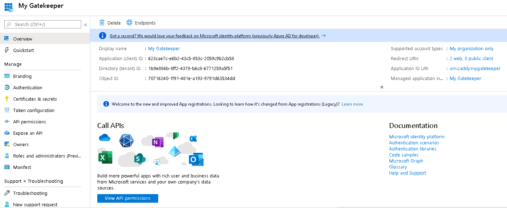

<figcaption>Historical console: Azure AD App Registration - Overview. Use the current values and flow described above; the displayed IDs, hosts and ports belong to the old example.</figcaption>
</figure>

<figure>

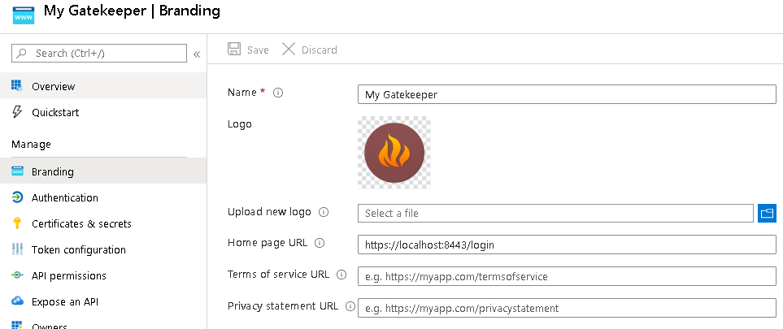

<figcaption>Historical console: Azure AD App Registration - Branding. Use the current values and flow described above; the displayed IDs, hosts and ports belong to the old example.</figcaption>
</figure>

<figure>

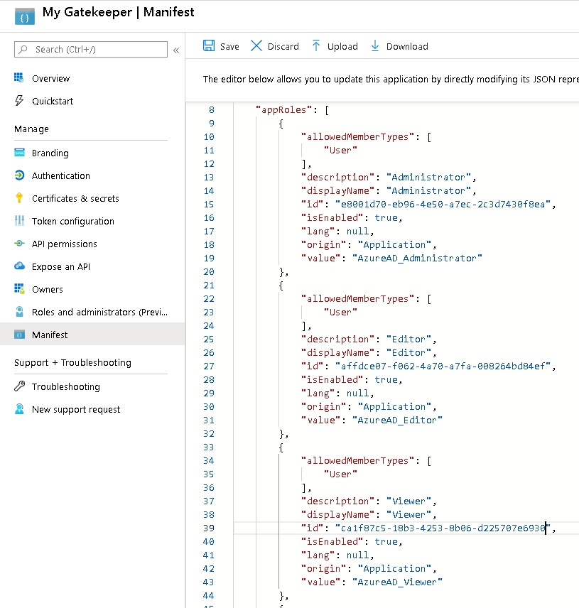

<figcaption>Historical console: Azure AD App Registration - Manifest - User Roles. Use the current values and flow described above; the displayed IDs, hosts and ports belong to the old example.</figcaption>
</figure>

<figure>

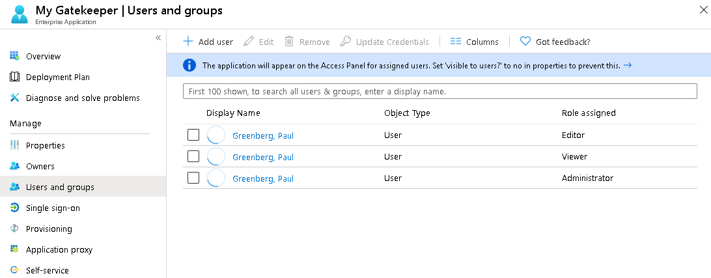

<figcaption>Historical console: Azure AD App - Users and Groups - Add User. Use the current values and flow described above; the displayed IDs, hosts and ports belong to the old example.</figcaption>
</figure>

<figure>

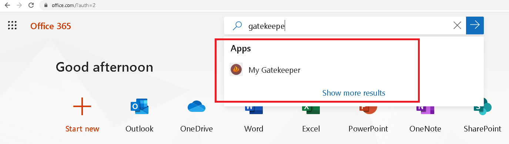

<figcaption>Historical console: Office 365 - Access Application. Use the current values and flow described above; the displayed IDs, hosts and ports belong to the old example.</figcaption>
</figure>

<figure>

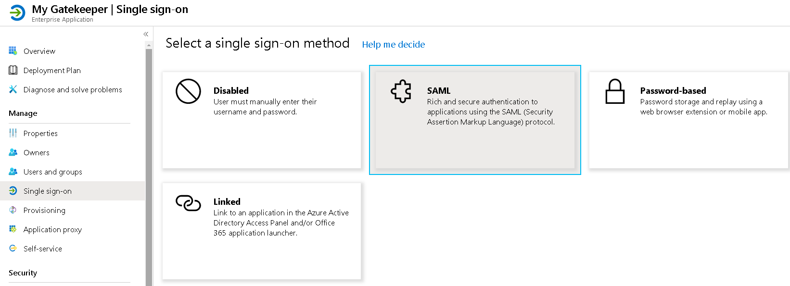

<figcaption>Historical console: Azure AD App - Enable SAML. Use the current values and flow described above; the displayed IDs, hosts and ports belong to the old example.</figcaption>
</figure>

<figure>

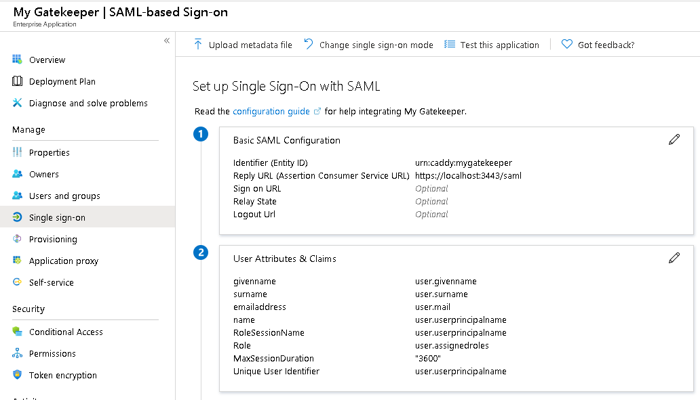

<figcaption>Historical console: Azure AD App - Basic SAML Configuration. Use the current values and flow described above; the displayed IDs, hosts and ports belong to the old example.</figcaption>
</figure>

<figure>

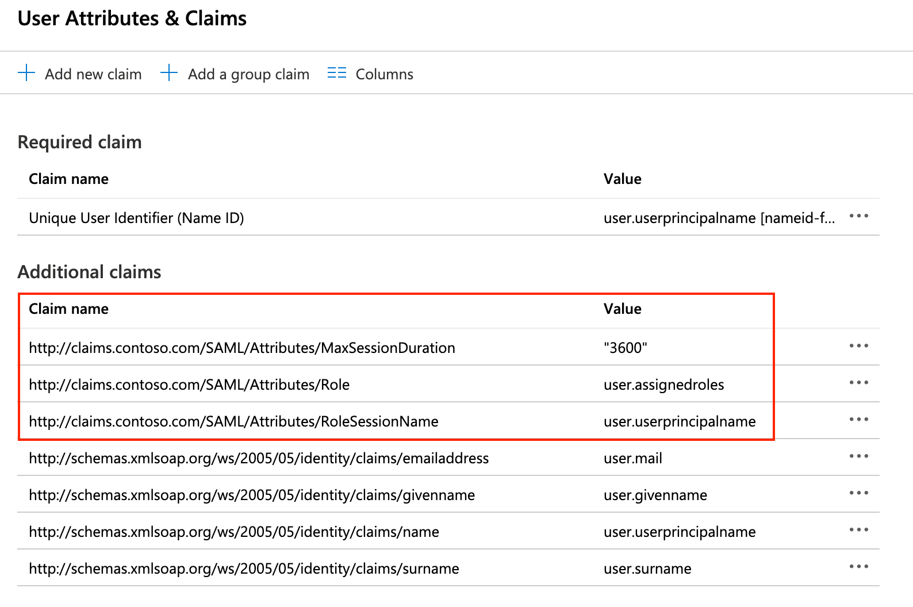

<figcaption>Historical console: Azure AD App - User Attributes and Claims. Use the current values and flow described above; the displayed IDs, hosts and ports belong to the old example.</figcaption>
</figure>

<figure>

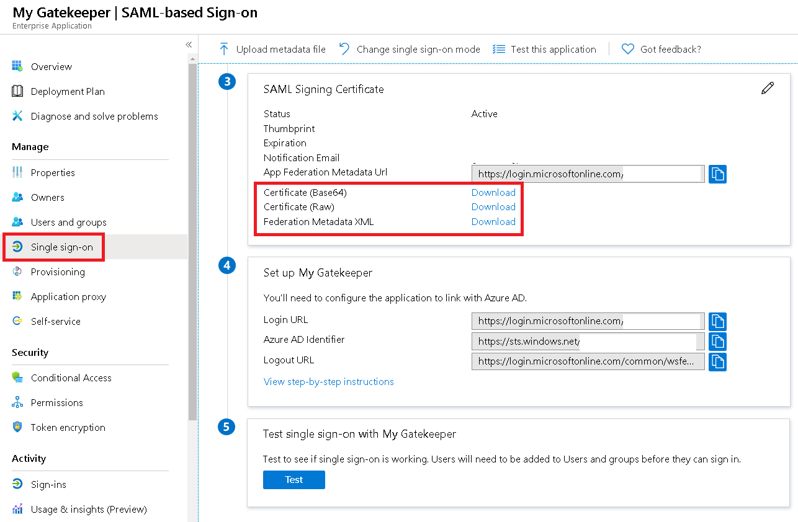

<figcaption>Historical console: Azure AD App - SAML Signing Certificate. Use the current values and flow described above; the displayed IDs, hosts and ports belong to the old example.</figcaption>
</figure>

<figure>

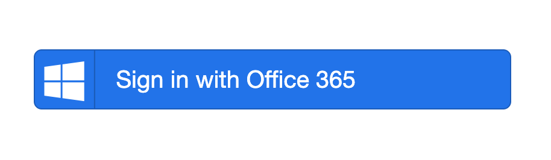

<figcaption>Historical console: Azure AD App - Login with Azure Button. Use the current values and flow described above; the displayed IDs, hosts and ports belong to the old example.</figcaption>
</figure>

<figure>


<figcaption>Historical console: Office 365 - Access Application. Use the current values and flow described above; the displayed IDs, hosts and ports belong to the old example.</figcaption>
</figure>

## Agentic Prompts

Copy a prompt into your LLM to explore this topic. Each prompt prioritizes
upstream repository guidance and code over this page, and asks for version-aware
reasoning.

<div className="agentic-prompts">

<details>
<summary>Map Entra SAML identifiers</summary>

```text
Help me understand Microsoft Entra ID (SAML).

Primary authorities (take precedence over website documentation):
https://github.com/greenpau/caddy-security/blob/main/AGENTS.md
https://github.com/greenpau/caddy-security/tree/main/.codex/skills
https://github.com/greenpau/go-authcrunch/blob/main/AGENTS.md
https://github.com/greenpau/go-authcrunch/tree/main/.codex/skills
Read each repository's root AGENTS.md first, then any scoped AGENTS.md that
applies to inspected paths. Read the relevant SKILL.md files and follow their
implementation and test references.

Relevant skills to locate: configuration-saml-providers,
saml-identity-provider.

Secondary reference:
https://docs.authcrunch.com/docs/authenticate/saml/azure

If a source is inaccessible, ask me to paste its relevant text. Identify the
versions your answer applies to; main may be newer than my release. Resolve
disagreements using code and tests, and flag unverified claims. Use synthetic
credentials and redacted examples; explain proposed checks before any changes.

Explain SP Entity ID, ACS/Reply URL, GET sign-on URL, Entra Login URL,
metadata, and separately pinned signing certificate. Contrast generic SAML
setup with the legacy azure driver’s header dependencies. Use current official
Entra settings for console names.
```

</details>

<details>
<summary>Trace SP-initiated browser state</summary>

```text
Help me understand Microsoft Entra ID (SAML).

Primary authorities (take precedence over website documentation):
https://github.com/greenpau/caddy-security/blob/main/AGENTS.md
https://github.com/greenpau/caddy-security/tree/main/.codex/skills
https://github.com/greenpau/go-authcrunch/blob/main/AGENTS.md
https://github.com/greenpau/go-authcrunch/tree/main/.codex/skills
Read each repository's root AGENTS.md first, then any scoped AGENTS.md that
applies to inspected paths. Read the relevant SKILL.md files and follow their
implementation and test references.

Relevant skills to locate: configuration-saml-providers,
saml-identity-provider.

Secondary reference:
https://docs.authcrunch.com/docs/authenticate/saml/azure

If a source is inaccessible, ask me to paste its relevant text. Identify the
versions your answer applies to; main may be newer than my release. Resolve
disagreements using code and tests, and flag unverified claims. Use synthetic
credentials and redacted examples; explain proposed checks before any changes.

Draw the portal GET, AuthnRequest, IdP login, signed cross-site POST,
RelayState, and same-browser binding. Explain why an unsolicited
application-tile POST or matching Referer does not establish the required
transaction.
```

</details>

<details>
<summary>Review attributes and roles</summary>

```text
Help me understand Microsoft Entra ID (SAML).

Primary authorities (take precedence over website documentation):
https://github.com/greenpau/caddy-security/blob/main/AGENTS.md
https://github.com/greenpau/caddy-security/tree/main/.codex/skills
https://github.com/greenpau/go-authcrunch/blob/main/AGENTS.md
https://github.com/greenpau/go-authcrunch/tree/main/.codex/skills
Read each repository's root AGENTS.md first, then any scoped AGENTS.md that
applies to inspected paths. Read the relevant SKILL.md files and follow their
implementation and test references.

Relevant skills to locate: configuration-saml-providers,
saml-identity-provider.

Secondary reference:
https://docs.authcrunch.com/docs/authenticate/saml/azure

If a source is inaccessible, ask me to paste its relevant text. Identify the
versions your answer applies to; main may be newer than my release. Resolve
disagreements using code and tests, and flag unverified claims. Use synthetic
credentials and redacted examples; explain proposed checks before any changes.

Map required display name/email, stable subject, and the supported custom Role
attribute to portal identity. Separate Entra assignment from a realm-scoped
App.Access transform. Explain reserved-role removal and why user-editable
authorization attributes must not grant membership.
```

</details>

<details>
<summary>Diagnose a signed callback failure</summary>

```text
Help me understand Microsoft Entra ID (SAML).

Primary authorities (take precedence over website documentation):
https://github.com/greenpau/caddy-security/blob/main/AGENTS.md
https://github.com/greenpau/caddy-security/tree/main/.codex/skills
https://github.com/greenpau/go-authcrunch/blob/main/AGENTS.md
https://github.com/greenpau/go-authcrunch/tree/main/.codex/skills
Read each repository's root AGENTS.md first, then any scoped AGENTS.md that
applies to inspected paths. Read the relevant SKILL.md files and follow their
implementation and test references.

Relevant skills to locate: configuration-saml-providers,
saml-identity-provider.

Secondary reference:
https://docs.authcrunch.com/docs/authenticate/saml/azure

If a source is inaccessible, ask me to paste its relevant text. Identify the
versions your answer applies to; main may be newer than my release. Resolve
disagreements using code and tests, and flag unverified claims. Use synthetic
credentials and redacted examples; explain proposed checks before any changes.

Help me classify certificate pin, issuer/destination, missing required
attributes, lost binding cookie, wrong mount, and replay. Ask for public
certificate metadata and redacted attribute names/status only, never a full
real assertion or cookie.
```

</details>

<details>
<summary>Plan rollover and denial checks</summary>

```text
Help me understand Microsoft Entra ID (SAML).

Primary authorities (take precedence over website documentation):
https://github.com/greenpau/caddy-security/blob/main/AGENTS.md
https://github.com/greenpau/caddy-security/tree/main/.codex/skills
https://github.com/greenpau/go-authcrunch/blob/main/AGENTS.md
https://github.com/greenpau/go-authcrunch/tree/main/.codex/skills
Read each repository's root AGENTS.md first, then any scoped AGENTS.md that
applies to inspected paths. Read the relevant SKILL.md files and follow their
implementation and test references.

Relevant skills to locate: configuration-saml-providers,
saml-identity-provider.

Secondary reference:
https://docs.authcrunch.com/docs/authenticate/saml/azure

If a source is inaccessible, ask me to paste its relevant text. Identify the
versions your answer applies to; main may be newer than my release. Resolve
disagreements using code and tests, and flag unverified claims. Use synthetic
credentials and redacted examples; explain proposed checks before any changes.

Design member, portal-only, unassigned, wrong-browser, replay, and
certificate-rollover cases. Explain what updating metadata does not override
about the pinned key. Check local app access independently from successful
provider sign-in.
```

</details>

</div>

## Source Code References

Start with the code search, then follow the parser, runtime, and tests relevant
to this topic. These links target `main`; use GitHub's branch/tag selector to
compare them with your installed release.

1. [Search this topic in both repositories](https://github.com/search?q=%28repo%3Agreenpau%2Fgo-authcrunch%20OR%20repo%3Agreenpau%2Fcaddy-security%29%20%28azure%20OR%20AuthnRequest%20OR%20RelayState%29%20path%3Apkg%2Fidp%2Fsaml&type=code)
   — searches topic-specific symbols and paths across both codebases.
2. [caddy-security: caddyfile_identity_provider.go](https://github.com/greenpau/caddy-security/blob/main/caddyfile_identity_provider.go)
   — adapts SAML identity-provider settings and certificate/metadata locations.
3. [go-authcrunch: pkg/idp/saml/config.go](https://github.com/greenpau/go-authcrunch/blob/main/pkg/idp/saml/config.go)
   — validates SAML endpoints, drivers, and pinned trust settings.
4. [go-authcrunch: pkg/idp/saml/provider.go](https://github.com/greenpau/go-authcrunch/blob/main/pkg/idp/saml/provider.go)
   — loads IdP metadata and constructs the service provider with pinned signing trust.
5. [go-authcrunch: pkg/idp/saml/authenticate.go](https://github.com/greenpau/go-authcrunch/blob/main/pkg/idp/saml/authenticate.go)
   — validates browser-bound SAML responses and maps accepted attributes.
6. [go-authcrunch: pkg/idp/saml/state.go](https://github.com/greenpau/go-authcrunch/blob/main/pkg/idp/saml/state.go)
   — tracks SP-initiated SAML transactions and single-use completion.
7. [go-authcrunch: pkg/authn/saml_state_e2e_test.go](https://github.com/greenpau/go-authcrunch/blob/main/pkg/authn/saml_state_e2e_test.go)
   — tests signed SAML callbacks, browser state, and rejection boundaries.
