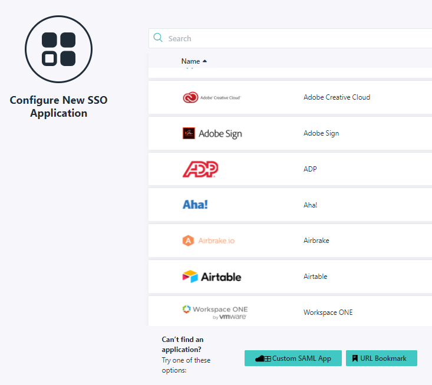
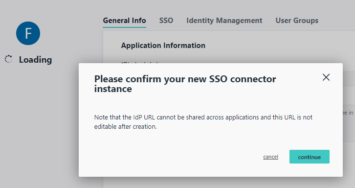
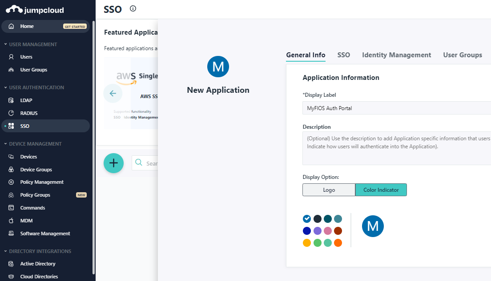
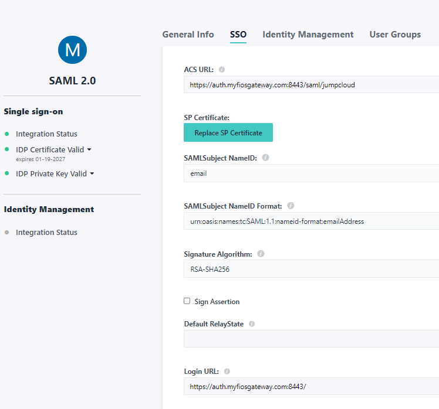
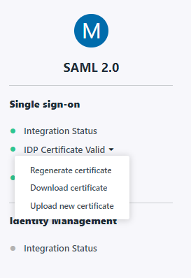

# Jumpcloud SAML Integration

This [`Caddyfile`](https://github.com/greenpau/caddy-auth-docs/blob/main/assets/conf/saml/jumpcloud/Caddyfile)
contains the configuration for the SAML integration.

First, browse to "User Authentication | SSO" and create a new application.

Select "Custom SAML App".

Confirm new SSO connector instance.

Provide app name, e.g. "MyFIOS Auth Portal".

Next, provide IdP Entity ID and SP Entity ID values. Here, `urn:auth-portal`.

Then, provide the following:

* ACS URL: `https://auth.myfiosgateway.com:8443/saml/jumpcloud`
* SAMLSubject NameID: `email`
* SAMLSubject NameID Format: `urn:oasis:names:tc:SAML:1.1:nameid-format:emailAddress`
* Signature Algorithm: `RSA-SHA256`
* Login URL: `https://auth.myfiosgateway.com:8443/`

Next, provide IDP URL: `https://sso.jumpcloud.com/saml2/auth-portal-saml`

Finally, add User Attributes.

* `http://schemas.xmlsoap.org/ws/2005/05/identity/claims/emailaddress`: `email`
* `http://schemas.xmlsoap.org/ws/2005/05/identity/claims/displayname`: `fullname`

After saving the configuration, browse back to "User Authentication | SSO".

Re-enter the application, browse to SSO and download JumpCloud Metadata.
This would be the `JumpCloud-saml2-metadata.xml` file referenced in the config.

Additionally, while in the app, click "IDP Certificate Valid" and "Download certificate.
This would be the `certificate.pem` file referenced in the config.

The setup is now complete.

When a user accesses Jumpcloud user portal, the user sees the new app in the
list of application.

