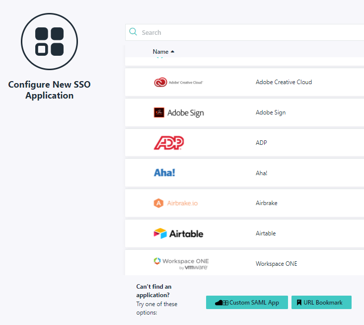
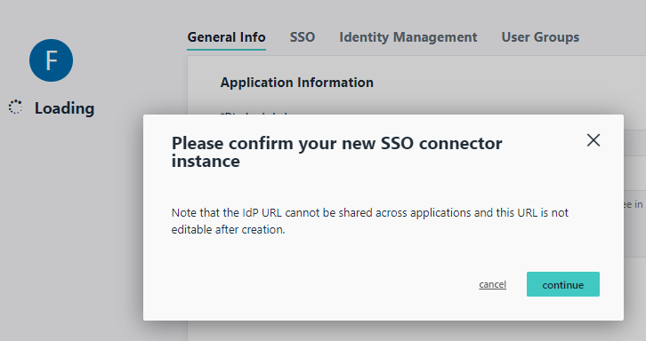
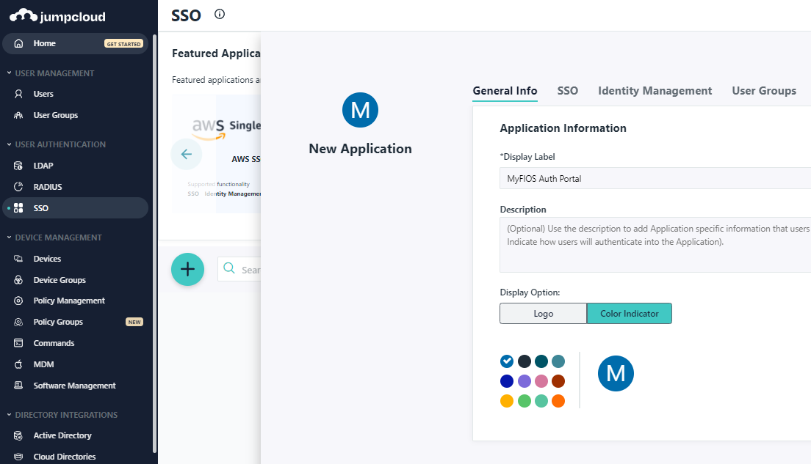
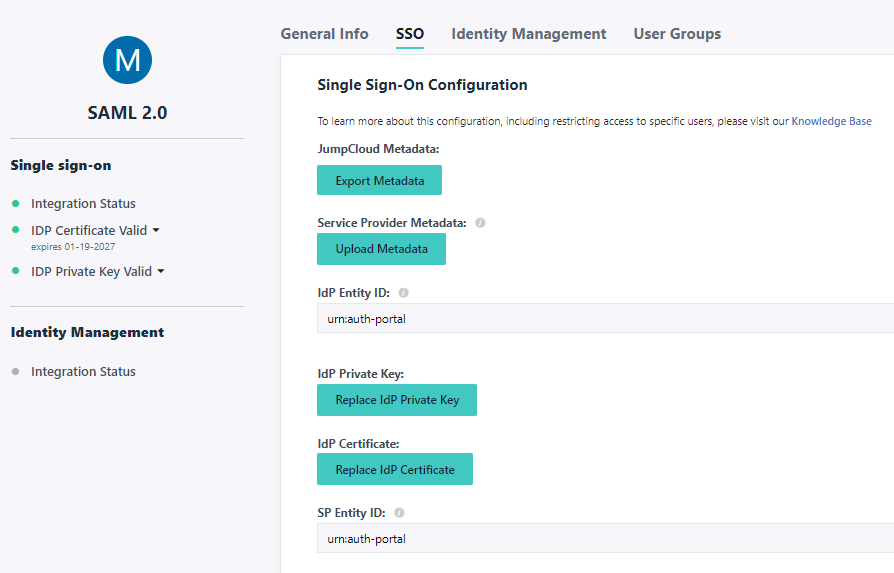
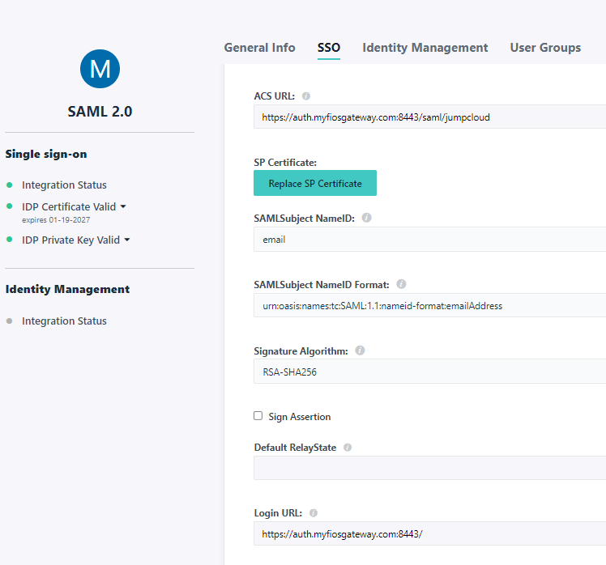
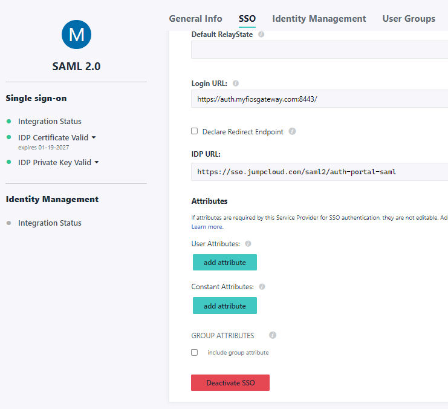
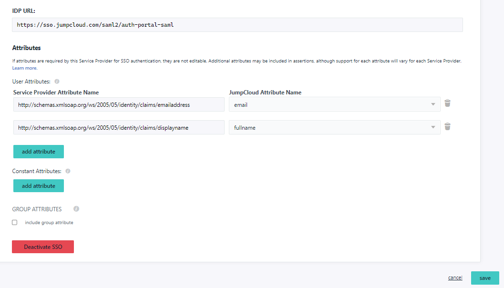
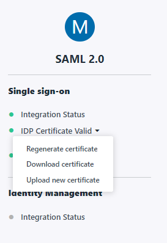
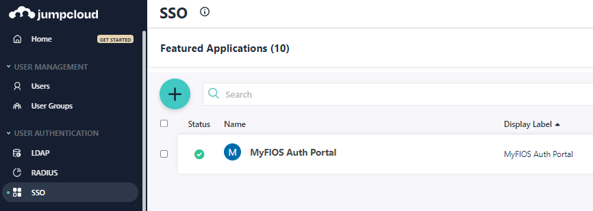
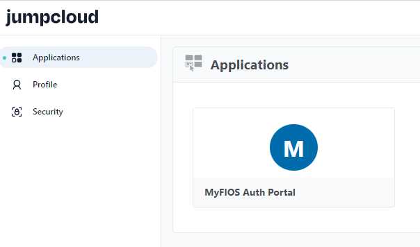

import CodeBlock from '@theme/CodeBlock';
import canonicalCaddyfile from '@site/assets/conf/saml/jumpcloud/Caddyfile?raw';

# JumpCloud SAML Integration

Use a JumpCloud custom SAML application as an upstream identity provider. The [canonical Caddyfile](https://github.com/authcrunch/authcrunch.github.io/blob/main/assets/conf/saml/jumpcloud/Caddyfile) serves the portal at `/auth/` and protects `/app`. It uses `driver generic`, the released SAML mapper and a separately pinned signing certificate.

## Configure the custom SAML application

Create a custom SAML connector using JumpCloud's current [connector-field reference](https://jumpcloud.com/support/sso-application-connector-fields). Use these values consistently:

| Field | Example value |
| --- | --- |
| SP Entity ID | `urn:authcrunch:jumpcloud` |
| ACS URL | `https://auth.example.com/auth/saml/jumpcloud` |
| Login URL / bookmark target | `https://auth.example.com/auth/saml/jumpcloud` |
| IdP URL | Your connector's JumpCloud SSO URL, copied into `JUMPCLOUD_SAML_LOGIN_URL` |
| NameID format | Email-address format if appropriate to your connector; additional mapped attributes are still required |

Set the SP identifier independently of the IdP identifier. Use a signed response/assertion with the downloaded IdP certificate. Retain the SP's original RelayState; do not replace it with a static redirect URL.

Configure these attribute names with populated values:

| Attribute name | AuthCrunch claim | Requirement |
| --- | --- | --- |
| `http://schemas.xmlsoap.org/ws/2005/05/identity/claims/displayname` | `name` | Required, nonempty display name |
| `http://schemas.xmlsoap.org/ws/2005/05/identity/claims/emailaddress` | `email` | Required, nonempty email |
| `http://schemas.xmlsoap.org/ws/2005/05/identity/claims/name` | `sub` | Send a stable application identity |
| `http://claims.example.com/SAML/Attributes/Role` | `roles` | Optional, one value per application role |

Map display name to full name, email to email and name to a stable user identity. To authorize the example app, emit `App.Access` as a value of the custom `Attributes/Role` attribute for an administrator-managed app group/assignment. Do not make authorization attributes user-editable. Arbitrary JumpCloud group attributes are not automatically mapped into roles by the released SAML parser.

## Install trust and start the portal

Download the connector metadata XML and signing certificate. Set `SAML_METADATA_PATH`, `SAML_CERT_PATH`, `JUMPCLOUD_SAML_LOGIN_URL` and a private `JWT_SHARED_KEY`. The certificate must be a local PEM file; metadata can be local XML or an HTTP(S) URL. The first three values expand at Caddyfile adaptation.

Start with the canonical example after replacing its hostname. Its transforms clear reserved roles, grant `authp/user` to the JumpCloud realm and grant `app/member` only when the same realm supplies `App.Access`. A valid SAML login alone does not grant the protected app.

## Verify the browser flow

Open `/app`, follow the portal login and select JumpCloud. The browser must first GET `/auth/saml/jumpcloud` so AuthCrunch can create state before the IdP's POST callback. An unsolicited POST from the JumpCloud user-portal tile is rejected; a bookmark tile can point to that GET entry URL.

Test assigned member and portal-only accounts, inspect `/auth/whoami`, and verify direct `/app` access. Replaying a response or opening its callback in a different browser must fail. See [SAML troubleshooting](10-saml.md#verify-and-troubleshoot) for cookie, claim and signing errors. On certificate rollover, verify and update the separate pin and reprovision; metadata does not override it.

## Complete Caddyfile

<CodeBlock language="caddyfile" title="Caddyfile">{canonicalCaddyfile}</CodeBlock>

## Historical connector walkthrough

These preserved images show connector creation, identifiers, attributes, certificate export and user-portal placement. Their hostname lacks the new `/auth/` mount, and the old user tile must not be used as an unsolicited-login recipe. Follow the current values above.

<figure>



<figcaption>Historical console: Jumpcloud SAML App Registration - New Application. Use the current values and flow described above; the displayed IDs, hosts and ports belong to the old example.</figcaption>
</figure>

<figure>



<figcaption>Historical console: Jumpcloud SAML App Registration - SSO connector. Use the current values and flow described above; the displayed IDs, hosts and ports belong to the old example.</figcaption>
</figure>

<figure>



<figcaption>Historical console: Jumpcloud SAML App Registration - App Name. Use the current values and flow described above; the displayed IDs, hosts and ports belong to the old example.</figcaption>
</figure>

<figure>



<figcaption>Historical console: Jumpcloud SAML App Registration - SSO Configuration. Use the current values and flow described above; the displayed IDs, hosts and ports belong to the old example.</figcaption>
</figure>

<figure>



<figcaption>Historical console: Jumpcloud SAML App Registration - SSO Configuration. Use the current values and flow described above; the displayed IDs, hosts and ports belong to the old example.</figcaption>
</figure>

<figure>



<figcaption>Historical console: Jumpcloud SAML App Registration - SSO Configuration. Use the current values and flow described above; the displayed IDs, hosts and ports belong to the old example.</figcaption>
</figure>

<figure>



<figcaption>Historical console: Jumpcloud SAML App Registration - User Attributes. Use the current values and flow described above; the displayed IDs, hosts and ports belong to the old example.</figcaption>
</figure>

<figure>



<figcaption>Historical console: Jumpcloud SAML App Registration - IDP Certificate. Use the current values and flow described above; the displayed IDs, hosts and ports belong to the old example.</figcaption>
</figure>

<figure>



<figcaption>Historical console: Jumpcloud SAML App Registration - Complete. Use the current values and flow described above; the displayed IDs, hosts and ports belong to the old example.</figcaption>
</figure>

<figure>



<figcaption>Historical console: Jumpcloud SAML App User Portal. Use the current values and flow described above; the displayed IDs, hosts and ports belong to the old example.</figcaption>
</figure>

## Agentic Prompts

Copy a prompt into your LLM to explore this topic. Each prompt prioritizes
upstream repository guidance and code over this page, and asks for version-aware
reasoning.

<div className="agentic-prompts">

<details>
<summary>Read the custom connector</summary>

```text
Help me understand JumpCloud SAML integration.

Primary authorities (take precedence over website documentation):
https://github.com/greenpau/caddy-security/blob/main/AGENTS.md
https://github.com/greenpau/caddy-security/tree/main/.codex/skills
https://github.com/greenpau/go-authcrunch/blob/main/AGENTS.md
https://github.com/greenpau/go-authcrunch/tree/main/.codex/skills
Read each repository's root AGENTS.md first, then any scoped AGENTS.md that
applies to inspected paths. Read the relevant SKILL.md files and follow their
implementation and test references.

Relevant skills to locate: configuration-saml-providers,
saml-identity-provider.

Secondary reference:
https://docs.authcrunch.com/docs/authenticate/saml/jumpcloud

If a source is inaccessible, ask me to paste its relevant text. Identify the
versions your answer applies to; main may be newer than my release. Resolve
disagreements using code and tests, and flag unverified claims. Use synthetic
credentials and redacted examples; explain proposed checks before any changes.

Explain JumpCloud SP identifier, ACS, IdP URL, sign-on bookmark, and
downloaded trust material. Distinguish SP and IdP entity IDs and NameID from
required mapped attributes. Consult current official connector fields rather
than copying historical screenshots.
```

</details>

<details>
<summary>Trace a browser-bound login</summary>

```text
Help me understand JumpCloud SAML integration.

Primary authorities (take precedence over website documentation):
https://github.com/greenpau/caddy-security/blob/main/AGENTS.md
https://github.com/greenpau/caddy-security/tree/main/.codex/skills
https://github.com/greenpau/go-authcrunch/blob/main/AGENTS.md
https://github.com/greenpau/go-authcrunch/tree/main/.codex/skills
Read each repository's root AGENTS.md first, then any scoped AGENTS.md that
applies to inspected paths. Read the relevant SKILL.md files and follow their
implementation and test references.

Relevant skills to locate: configuration-saml-providers,
saml-identity-provider.

Secondary reference:
https://docs.authcrunch.com/docs/authenticate/saml/jumpcloud

If a source is inaccessible, ask me to paste its relevant text. Identify the
versions your answer applies to; main may be newer than my release. Resolve
disagreements using code and tests, and flag unverified claims. Use synthetic
credentials and redacted examples; explain proposed checks before any changes.

Walk through the portal’s initiating GET and JumpCloud POST retaining
RelayState. Explain signed-response and same-browser validation. Compare a
bookmark tile with an unsolicited IdP-initiated assertion and do not assume
both are supported.
```

</details>

<details>
<summary>Review controlled app membership</summary>

```text
Help me understand JumpCloud SAML integration.

Primary authorities (take precedence over website documentation):
https://github.com/greenpau/caddy-security/blob/main/AGENTS.md
https://github.com/greenpau/caddy-security/tree/main/.codex/skills
https://github.com/greenpau/go-authcrunch/blob/main/AGENTS.md
https://github.com/greenpau/go-authcrunch/tree/main/.codex/skills
Read each repository's root AGENTS.md first, then any scoped AGENTS.md that
applies to inspected paths. Read the relevant SKILL.md files and follow their
implementation and test references.

Relevant skills to locate: configuration-saml-providers,
saml-identity-provider.

Secondary reference:
https://docs.authcrunch.com/docs/authenticate/saml/jumpcloud

If a source is inaccessible, ask me to paste its relevant text. Identify the
versions your answer applies to; main may be newer than my release. Resolve
disagreements using code and tests, and flag unverified claims. Use synthetic
credentials and redacted examples; explain proposed checks before any changes.

Compare configured displayname/email/name/Role attribute names with arbitrary
group attributes. Trace an administrator-managed App.Access value through
reserved-role removal and a realm-scoped transform. Explain why
account-editable attributes cannot safely grant app/member.
```

</details>

<details>
<summary>Diagnose trust and claim mismatch</summary>

```text
Help me understand JumpCloud SAML integration.

Primary authorities (take precedence over website documentation):
https://github.com/greenpau/caddy-security/blob/main/AGENTS.md
https://github.com/greenpau/caddy-security/tree/main/.codex/skills
https://github.com/greenpau/go-authcrunch/blob/main/AGENTS.md
https://github.com/greenpau/go-authcrunch/tree/main/.codex/skills
Read each repository's root AGENTS.md first, then any scoped AGENTS.md that
applies to inspected paths. Read the relevant SKILL.md files and follow their
implementation and test references.

Relevant skills to locate: configuration-saml-providers,
saml-identity-provider.

Secondary reference:
https://docs.authcrunch.com/docs/authenticate/saml/jumpcloud

If a source is inaccessible, ask me to paste its relevant text. Identify the
versions your answer applies to; main may be newer than my release. Resolve
disagreements using code and tests, and flag unverified claims. Use synthetic
credentials and redacted examples; explain proposed checks before any changes.

Help me inspect redacted attribute names/types, ACS, mount, binding-cookie
metadata, and public certificate fingerprint. Separate missing required
values, wrong pin, state failure, and app 403. Never ask for a full live
SAMLResponse.
```

</details>

<details>
<summary>Verify callback and certificate lifecycle</summary>

```text
Help me understand JumpCloud SAML integration.

Primary authorities (take precedence over website documentation):
https://github.com/greenpau/caddy-security/blob/main/AGENTS.md
https://github.com/greenpau/caddy-security/tree/main/.codex/skills
https://github.com/greenpau/go-authcrunch/blob/main/AGENTS.md
https://github.com/greenpau/go-authcrunch/tree/main/.codex/skills
Read each repository's root AGENTS.md first, then any scoped AGENTS.md that
applies to inspected paths. Read the relevant SKILL.md files and follow their
implementation and test references.

Relevant skills to locate: configuration-saml-providers,
saml-identity-provider.

Secondary reference:
https://docs.authcrunch.com/docs/authenticate/saml/jumpcloud

If a source is inaccessible, ask me to paste its relevant text. Identify the
versions your answer applies to; main may be newer than my release. Resolve
disagreements using code and tests, and flag unverified claims. Use synthetic
credentials and redacted examples; explain proposed checks before any changes.

Design assigned member, portal-only, wrong browser, replayed response, and
verified pin rollover tests. Explain which updates require reprovisioning and
why metadata alone does not change the trusted signing certificate. Use fresh
logins when retesting role mappings.
```

</details>

</div>

## Source Code References

Start with the code search, then follow the parser, runtime, and tests relevant
to this topic. These links target `main`; use GitHub's branch/tag selector to
compare them with your installed release.

1. [Search this topic in both repositories](https://github.com/search?q=%28repo%3Agreenpau%2Fgo-authcrunch%20OR%20repo%3Agreenpau%2Fcaddy-security%29%20%28generic%20OR%20AuthnRequest%20OR%20RelayState%29%20path%3Apkg%2Fidp%2Fsaml&type=code)
   — searches topic-specific symbols and paths across both codebases.
2. [caddy-security: caddyfile_identity_provider.go](https://github.com/greenpau/caddy-security/blob/main/caddyfile_identity_provider.go)
   — adapts SAML identity-provider settings and certificate/metadata locations.
3. [go-authcrunch: pkg/idp/saml/config.go](https://github.com/greenpau/go-authcrunch/blob/main/pkg/idp/saml/config.go)
   — validates SAML endpoints, drivers, and pinned trust settings.
4. [go-authcrunch: pkg/idp/saml/provider.go](https://github.com/greenpau/go-authcrunch/blob/main/pkg/idp/saml/provider.go)
   — loads IdP metadata and constructs the service provider with pinned signing trust.
5. [go-authcrunch: pkg/idp/saml/authenticate.go](https://github.com/greenpau/go-authcrunch/blob/main/pkg/idp/saml/authenticate.go)
   — validates browser-bound SAML responses and maps accepted attributes.
6. [go-authcrunch: pkg/idp/saml/state.go](https://github.com/greenpau/go-authcrunch/blob/main/pkg/idp/saml/state.go)
   — tracks SP-initiated SAML transactions and single-use completion.
7. [go-authcrunch: pkg/authn/saml_state_e2e_test.go](https://github.com/greenpau/go-authcrunch/blob/main/pkg/authn/saml_state_e2e_test.go)
   — tests signed SAML callbacks, browser state, and rejection boundaries.
