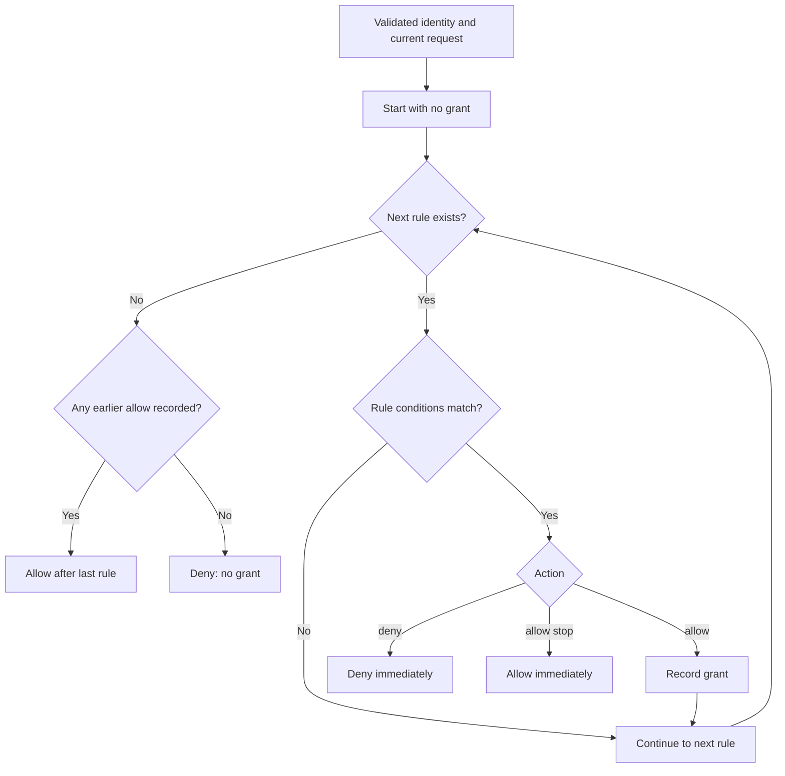

# Access Lists and Role-based Access Control (RBAC)

A valid token establishes an identity. An ACL then decides whether that identity
may access this request. Start with a specific application role:

```Caddyfile
allow roles app/member
```

Unmatched requests are denied. Reserved portal roles such as `authp/user` can
include users who should not belong to this application.




## Sources of Role Information

The normalizer accepts `roles`, `role`, `groups`, or `group`, and supported
nested role arrays in `app_metadata.authorization.roles` and
`realm_access.roles`. Use actual trusted claims from your issuer, and verify
the normalized result through the portal identity page. A group string supplied
by a browser is not a trusted grant.

```json
{"sub":"alice","roles":["app/member"],"realm":"local"}
```

This illustrates claim shape; a real token also needs a valid signature and
appropriate validity claims.

## Anonymous Role

A valid token without recognized roles receives normalized `anonymous` and
`guest` roles. This does **not** authenticate a request with no token. Allowing
those roles allows signed identities without application membership; it is not
an ordinary public-route configuration.

## Granting Access with Access Lists

Use full rules for precise compound conditions:

```Caddyfile
validate method path
acl rule {
    comment Read reports with verified password authentication
    match roles app/member
    match amr pwd
    match method GET
    prefix match path /reports/
    allow stop log debug
}
```

All four conditions must match. Test a member, a nonmember, the wrong method,
and a sibling path. `amr` is authentication evidence, not a role label;
AuthCrunch uses `pwd`, `otp`, and `hwk` for verified password, TOTP, and WebAuthn.
An enrollment requirement alone does not establish completed factor evidence.

### Comment

A `comment` line names the rule for review and diagnostics. It grants nothing.

### Conditions

By default conditions are combined with AND. Put alternatives for a field on
one condition line: the released parser rejects duplicate field conditions in
one rule. Use separate rules when different paths or claim combinations should
grant access.

#### Match Conditions

```text
[no] [exact|partial|prefix|suffix|regex] match FIELD VALUE [VALUE...]
```

The default is exact matching. Examples include `match roles viewer editor`,
`match realm local`, and `regex match path ^/admin(/|$)`. `no` negates the
condition. Built-in typed fields include roles, amr, email, realm, origin,
subject, issuer, audience, scopes, org, github_orgs, address, method, and path.
The [syntax reference](syntax.md) lists the supported names and aliases.

Method/path rules require `validate method path`; the shortcut forms enable
it automatically. Path conditions operate on checked request interpretations,
not query strings. Use exact or boundary-aware prefixes rather than substring
matching for an application tree.

#### Field Exists Conditions

```Caddyfile
# A condition inside acl rule:
field sub exists
```

`field FIELD not exists` tests absence. Presence is not a value match or proof
that the value has the meaning your application requires. Arbitrary nested
claim matching needs the newer [typed field feature](custom-fields.md); do not
assume `match userinfo|tenant VALUE` works in the released bundle.

#### Match Any Condition

`match any` is intended as an unconditional condition for an already validated
identity. **Version boundary:** go-authcrunch v1.3.8, bundled in Caddy Security
v1.3.0, evaluates it through the presence of normalized `exp`; signed-token
identity data can omit that field. The rule can therefore be skipped. Library
v1.3.11 and the Caddy v1.4.0 source tag fix this; the downloadable v1.3.0
bundle retains the limitation. Check [availability](../operations/versions.md).
Do not depend on `match any` or a catch-all default action to close a sensitive
allow rule in v1.3.0. Use explicit `allow stop` rules and implicit denial for
unmatched requests; verify the installed version and behavior.

### Actions

`allow` records a grant and permits later rules to run; a later matching deny
can reject it. `allow stop` returns immediately. A matching `deny` rejects the
request, with or without `stop`. Rule order is therefore part of the policy.

Action option `any` changes condition combination to OR, for example
`allow any stop`. It can broaden a grant dramatically; do not use it when a
role **and** a factor **and** a path must all match.

`log debug`, `log info`, `log warn`, or `log error` records hits at that level.
`tag VALUE` identifies log entries; `counter` enables rule hit counting. Counting
alone does not configure a Prometheus export endpoint. A line inside Caddy's
`acl rule` must have an argument, so use `allow stop` rather than bare `allow`.

### ACL Shortcuts

```Caddyfile
allow roles app/member
allow roles report/reader with GET to /reports/
deny roles suspended
```

The grammar is `allow|deny FIELD VALUES [with METHOD] [to PATH]`. Do not insert
an extra `method` keyword. **Shortcut paths use substring matching**, so prefer
a full exact/prefix rule for a security boundary. `any` or `*` as a shortcut
value checks field presence rather than granting an unauthenticated request.

### Primer

Start from the [first-app example](../start/first-app.md), then add one restriction
at a time. Keep an allowed request and a meaningful denied request for each rule.
The [configuration examples](../examples/intro.md) describe their prerequisites.

## Default Allow ACL

`acl default allow` adds a catch-all rule; `acl default deny` adds a deny rule.
These are ordered rules, not a global default outside the sequence. The
v1.3.8 `match any` limitation above applies to both. Prefer a policy whose
explicit grants fully express the permitted access and whose unmatched requests
are denied. A default-allow policy requires careful exception coverage.

## Forbidden Access

A valid identity that fails the policy receives `403 Forbidden`. If configured,
`set forbidden url /access-denied` instead sends a `303` redirect. Make the
error page reachable without an authorization loop, and avoid placing secrets
in its URL. Authentication failures and missing credentials follow the separate
[redirect/401 policy](auto-redirect-url.md).

## Agentic Prompts

Copy a prompt into your LLM to explore this topic. Each prompt prioritizes
upstream repository guidance and code over this page, and asks for version-aware
reasoning.

<div className="agentic-prompts">

<details>
<summary>Trace an access decision</summary>

```text
Help me understand Access Lists and Role-based Access Control (RBAC).

Primary authorities (take precedence over website documentation):
https://github.com/greenpau/caddy-security/blob/main/AGENTS.md
https://github.com/greenpau/caddy-security/tree/main/.codex/skills
https://github.com/greenpau/go-authcrunch/blob/main/AGENTS.md
https://github.com/greenpau/go-authcrunch/tree/main/.codex/skills
Read each repository's root AGENTS.md first, then any scoped AGENTS.md that
applies to inspected paths. Read the relevant SKILL.md files and follow their
implementation and test references.

Relevant skills to locate: configuration-authorization,
authorization-policy-acl.

Secondary reference:
https://docs.authcrunch.com/docs/authorize/acl-rbac

If a source is inaccessible, ask me to paste its relevant text. Identify the
versions your answer applies to; main may be newer than my release. Resolve
disagreements using code and tests, and flag unverified claims. Use synthetic
credentials and redacted examples; explain proposed checks before any changes.

Explain how verified identity claims reach normalized roles and then ordered
ACL evaluation. Walk through a member, signed identity without roles, and
request without a credential. Separate baseline portal roles, anonymous/guest
normalization, and application membership.
```

</details>

<details>
<summary>Reason about rule order</summary>

```text
Help me understand Access Lists and Role-based Access Control (RBAC).

Primary authorities (take precedence over website documentation):
https://github.com/greenpau/caddy-security/blob/main/AGENTS.md
https://github.com/greenpau/caddy-security/tree/main/.codex/skills
https://github.com/greenpau/go-authcrunch/blob/main/AGENTS.md
https://github.com/greenpau/go-authcrunch/tree/main/.codex/skills
Read each repository's root AGENTS.md first, then any scoped AGENTS.md that
applies to inspected paths. Read the relevant SKILL.md files and follow their
implementation and test references.

Relevant skills to locate: configuration-authorization,
authorization-policy-acl.

Secondary reference:
https://docs.authcrunch.com/docs/authorize/acl-rbac

If a source is inaccessible, ask me to paste its relevant text. Identify the
versions your answer applies to; main may be newer than my release. Resolve
disagreements using code and tests, and flag unverified claims. Use synthetic
credentials and redacted examples; explain proposed checks before any changes.

Use a reports role plus method and path restriction to compare allow, allow
stop, deny, and any. Trace which conditions and later rules run for each
request. Explain the installed release’s catch-all limitation before proposing
defaults.
```

</details>

<details>
<summary>Diagnose a denied member</summary>

```text
Help me understand Access Lists and Role-based Access Control (RBAC).

Primary authorities (take precedence over website documentation):
https://github.com/greenpau/caddy-security/blob/main/AGENTS.md
https://github.com/greenpau/caddy-security/tree/main/.codex/skills
https://github.com/greenpau/go-authcrunch/blob/main/AGENTS.md
https://github.com/greenpau/go-authcrunch/tree/main/.codex/skills
Read each repository's root AGENTS.md first, then any scoped AGENTS.md that
applies to inspected paths. Read the relevant SKILL.md files and follow their
implementation and test references.

Relevant skills to locate: configuration-authorization,
authorization-policy-acl.

Secondary reference:
https://docs.authcrunch.com/docs/authorize/acl-rbac

If a source is inaccessible, ask me to paste its relevant text. Identify the
versions your answer applies to; main may be newer than my release. Resolve
disagreements using code and tests, and flag unverified claims. Use synthetic
credentials and redacted examples; explain proposed checks before any changes.

Help me investigate a valid token whose user still gets 403. Ask for redacted
normalized claims, rule order, method/path settings, and verified factor
evidence. Separate missing role normalization, missing amr evidence, and
method/path mismatch; do not recommend broadening roles as a first fix.
```

</details>

<details>
<summary>Challenge an overly broad grant</summary>

```text
Help me understand Access Lists and Role-based Access Control (RBAC).

Primary authorities (take precedence over website documentation):
https://github.com/greenpau/caddy-security/blob/main/AGENTS.md
https://github.com/greenpau/caddy-security/tree/main/.codex/skills
https://github.com/greenpau/go-authcrunch/blob/main/AGENTS.md
https://github.com/greenpau/go-authcrunch/tree/main/.codex/skills
Read each repository's root AGENTS.md first, then any scoped AGENTS.md that
applies to inspected paths. Read the relevant SKILL.md files and follow their
implementation and test references.

Relevant skills to locate: configuration-authorization,
authorization-policy-acl.

Secondary reference:
https://docs.authcrunch.com/docs/authorize/acl-rbac

If a source is inaccessible, ask me to paste its relevant text. Identify the
versions your answer applies to; main may be newer than my release. Resolve
disagreements using code and tests, and flag unverified claims. Use synthetic
credentials and redacted examples; explain proposed checks before any changes.

Review a synthetic policy allowing authp/user or a substring path shortcut.
Produce positive and negative test cases showing who could enter. Explain how
to express deliberate app membership and a path boundary, and identify what
must be verified in the issuer.
```

</details>

<details>
<summary>Teach back ACL semantics</summary>

```text
Help me understand Access Lists and Role-based Access Control (RBAC).

Primary authorities (take precedence over website documentation):
https://github.com/greenpau/caddy-security/blob/main/AGENTS.md
https://github.com/greenpau/caddy-security/tree/main/.codex/skills
https://github.com/greenpau/go-authcrunch/blob/main/AGENTS.md
https://github.com/greenpau/go-authcrunch/tree/main/.codex/skills
Read each repository's root AGENTS.md first, then any scoped AGENTS.md that
applies to inspected paths. Read the relevant SKILL.md files and follow their
implementation and test references.

Relevant skills to locate: configuration-authorization,
authorization-policy-acl.

Secondary reference:
https://docs.authcrunch.com/docs/authorize/acl-rbac

If a source is inaccessible, ask me to paste its relevant text. Identify the
versions your answer applies to; main may be newer than my release. Resolve
disagreements using code and tests, and flag unverified claims. Use synthetic
credentials and redacted examples; explain proposed checks before any changes.

Ask me five scenarios about AND versus OR, later deny after allow, allow stop,
missing fields, and a valid role-less identity. Wait for each answer and ask
me to justify it. Cite the installed-version code or tests when correcting my
reasoning.
```

</details>

</div>

## Source Code References

Start with the code search, then follow the parser, runtime, and tests relevant
to this topic. These links target `main`; use GitHub's branch/tag selector to
compare them with your installed release.

1. [Search this topic in both repositories](https://github.com/search?q=%28repo%3Agreenpau%2Fgo-authcrunch%20OR%20repo%3Agreenpau%2Fcaddy-security%29%20%28AccessList%20OR%20AddRule%20OR%20AllowWithClaims%29&type=code)
   — searches topic-specific symbols and paths across both codebases.
2. [caddy-security: caddyfile_authz_acl.go](https://github.com/greenpau/caddy-security/blob/main/caddyfile_authz_acl.go)
   — adapts full ACL rules, actions, defaults, and field declarations.
3. [caddy-security: caddyfile_authz_acl_shortcuts.go](https://github.com/greenpau/caddy-security/blob/main/caddyfile_authz_acl_shortcuts.go)
   — adapts compact allow/deny rules and their method/path conditions.
4. [go-authcrunch: pkg/acl/acl.go](https://github.com/greenpau/go-authcrunch/blob/main/pkg/acl/acl.go)
   — compiles and evaluates ordered ACL rules.
5. [go-authcrunch: pkg/acl/fields.go](https://github.com/greenpau/go-authcrunch/blob/main/pkg/acl/fields.go)
   — validates typed field declarations and projects authenticated claims.
6. [go-authcrunch: pkg/acl/rule_test.go](https://github.com/greenpau/go-authcrunch/blob/main/pkg/acl/rule_test.go)
   — tests ACL rule matching and action semantics.
