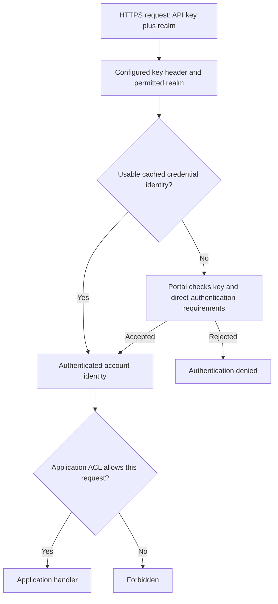

# API Key Authentication

Use a local account API key for machine requests that should not send the
account's password. Keys are private credentials, not browser access JWTs or
refresh tokens. Give the account a narrow application role and use HTTPS.




## Usage

```Caddyfile
# Inside the existing policy:
with api key auth portal myportal realm local
disable auth redirect
allow roles app/member
enable strip token
```

`myportal` must enable the selected local store. An HTTPS portal base URL can
replace the local name for [remote encrypted authentication](../authenticate/api/50-system-api.md),
with matching System keys configured on both services.

```bash
curl --fail-with-body --silent --show-error \
  -H 'X-Auth-Realm: local' \
  -H "X-Api-Key: ${AUTHCRUNCH_ACCOUNT_API_KEY}" \
  https://app.example.com/api/report
```

The realm selector is required unless a trusted route assigns it. A recognized
invalid key returns `401`. A successfully authenticated account still needs the
application role; a wrong/missing header follows missing-authentication behavior.
Do not diagnose a redirect as proof that a key itself was accepted.

The portal's direct-authentication boundary applies: an API key does not prove
password, TOTP, or WebAuthn use and cannot bypass a required interactive factor.
It does not mint a native refresh family or an OIDC grant. Use a dedicated
machine account whose requirements fit this authentication method.

## Changing API Key Header Name

```Caddyfile
with api key header name X-Service-Key
```

The client must use the same configured name. `enable strip token` removes that
accepted header before forwarding; the backend can consume trusted
[identity headers](headers.md) instead of the credential.

## Changing Authentication Realm Header Name

```Caddyfile
with auth realm header name X-Account-Realm
```

For a single-realm route, `request_header X-Account-Realm local` before
`authorize` replaces a client value. Do not use an append operation to construct
an ambiguous selector.

## Generating API Key

Create and manage a key in the local user's [Profile](../authenticate/auth-portal.md#user-settings)
or provision it using the bundled offline generator:

```bash
authcrunch security local generate api key
```

The separate pinned `authdbctl` client also provides `generate api key`.
The bundled command emits a private `secret` for the caller and an `api key PREFIX HASH`
Caddyfile directive for a static user. Store the secret privately; put only the
generated directive inside the intended local store's `user` block. Never reuse
an example key. Profile enrollment accepts a unique 64–72-character
alphanumeric key and stores it through the account-management workflow.

Treat deletion, replacement, account disabling, and role changes as lifecycle
operations. Successful credential identities can be cached until their validity
interval expires, so deletion is not a promise of immediate distributed
revocation. Test key rotation and the denial path in the deployed architecture.

## Agentic Prompts

Copy a prompt into your LLM to explore this topic. Each prompt prioritizes
upstream repository guidance and code over this page, and asks for version-aware
reasoning.

<div className="agentic-prompts">

<details>
<summary>Distinguish credential types</summary>

```text
Help me understand API Key Authentication.

Primary authorities (take precedence over website documentation):
https://github.com/greenpau/caddy-security/blob/main/AGENTS.md
https://github.com/greenpau/caddy-security/tree/main/.codex/skills
https://github.com/greenpau/go-authcrunch/blob/main/AGENTS.md
https://github.com/greenpau/go-authcrunch/tree/main/.codex/skills
Read each repository's root AGENTS.md first, then any scoped AGENTS.md that
applies to inspected paths. Read the relevant SKILL.md files and follow their
implementation and test references.

Relevant skills to locate: configuration-authorization,
authentication-portal-challenges, configuration-users.

Secondary reference:
https://docs.authcrunch.com/docs/authorize/api_key_auth

If a source is inaccessible, ask me to paste its relevant text. Identify the
versions your answer applies to; main may be newer than my release. Resolve
disagreements using code and tests, and flag unverified claims. Use synthetic
credentials and redacted examples; explain proposed checks before any changes.

Compare a local account API key, a browser access JWT, a refresh credential,
and an OIDC grant. Trace an API-key request through realm selection, portal
verification, and application ACLs. Explain what interactive-factor evidence
an API key does not establish.
```

</details>

<details>
<summary>Understand generation and storage</summary>

```text
Help me understand API Key Authentication.

Primary authorities (take precedence over website documentation):
https://github.com/greenpau/caddy-security/blob/main/AGENTS.md
https://github.com/greenpau/caddy-security/tree/main/.codex/skills
https://github.com/greenpau/go-authcrunch/blob/main/AGENTS.md
https://github.com/greenpau/go-authcrunch/tree/main/.codex/skills
Read each repository's root AGENTS.md first, then any scoped AGENTS.md that
applies to inspected paths. Read the relevant SKILL.md files and follow their
implementation and test references.

Relevant skills to locate: configuration-authorization,
authentication-portal-challenges, configuration-users.

Secondary reference:
https://docs.authcrunch.com/docs/authorize/api_key_auth

If a source is inaccessible, ask me to paste its relevant text. Identify the
versions your answer applies to; main may be newer than my release. Resolve
disagreements using code and tests, and flag unverified claims. Use synthetic
credentials and redacted examples; explain proposed checks before any changes.

Explain the private secret versus generated Caddyfile prefix/hash directive
from the bundled key generator. Compare offline static provisioning with
Profile enrollment without running either. Ask which interface and installed
version I use; never reuse a sample credential.
```

</details>

<details>
<summary>Diagnose a machine request</summary>

```text
Help me understand API Key Authentication.

Primary authorities (take precedence over website documentation):
https://github.com/greenpau/caddy-security/blob/main/AGENTS.md
https://github.com/greenpau/caddy-security/tree/main/.codex/skills
https://github.com/greenpau/go-authcrunch/blob/main/AGENTS.md
https://github.com/greenpau/go-authcrunch/tree/main/.codex/skills
Read each repository's root AGENTS.md first, then any scoped AGENTS.md that
applies to inspected paths. Read the relevant SKILL.md files and follow their
implementation and test references.

Relevant skills to locate: configuration-authorization,
authentication-portal-challenges, configuration-users.

Secondary reference:
https://docs.authcrunch.com/docs/authorize/api_key_auth

If a source is inaccessible, ask me to paste its relevant text. Identify the
versions your answer applies to; main may be newer than my release. Resolve
disagreements using code and tests, and flag unverified claims. Use synthetic
credentials and redacted examples; explain proposed checks before any changes.

Help me investigate wrong API-key header names, absent realm selector, invalid
key, redirect instead of 401, and denied application role. Ask for redacted
request structure and challenge policy. Classify the layer responsible rather
than assuming the key was accepted.
```

</details>

<details>
<summary>Plan rotation and revocation tests</summary>

```text
Help me understand API Key Authentication.

Primary authorities (take precedence over website documentation):
https://github.com/greenpau/caddy-security/blob/main/AGENTS.md
https://github.com/greenpau/caddy-security/tree/main/.codex/skills
https://github.com/greenpau/go-authcrunch/blob/main/AGENTS.md
https://github.com/greenpau/go-authcrunch/tree/main/.codex/skills
Read each repository's root AGENTS.md first, then any scoped AGENTS.md that
applies to inspected paths. Read the relevant SKILL.md files and follow their
implementation and test references.

Relevant skills to locate: configuration-authorization,
authentication-portal-challenges, configuration-users.

Secondary reference:
https://docs.authcrunch.com/docs/authorize/api_key_auth

If a source is inaccessible, ask me to paste its relevant text. Identify the
versions your answer applies to; main may be newer than my release. Resolve
disagreements using code and tests, and flag unverified claims. Use synthetic
credentials and redacted examples; explain proposed checks before any changes.

Design a disposable-account test covering valid and invalid keys, key
replacement/deletion, account disabling, and cached identity lifetime. Explain
what observations can establish local denial and what they cannot promise
about immediate distributed revocation.
```

</details>

<details>
<summary>Review downstream provenance</summary>

```text
Help me understand API Key Authentication.

Primary authorities (take precedence over website documentation):
https://github.com/greenpau/caddy-security/blob/main/AGENTS.md
https://github.com/greenpau/caddy-security/tree/main/.codex/skills
https://github.com/greenpau/go-authcrunch/blob/main/AGENTS.md
https://github.com/greenpau/go-authcrunch/tree/main/.codex/skills
Read each repository's root AGENTS.md first, then any scoped AGENTS.md that
applies to inspected paths. Read the relevant SKILL.md files and follow their
implementation and test references.

Relevant skills to locate: configuration-authorization,
authentication-portal-challenges, configuration-users.

Secondary reference:
https://docs.authcrunch.com/docs/authorize/api_key_auth

If a source is inaccessible, ask me to paste its relevant text. Identify the
versions your answer applies to; main may be newer than my release. Resolve
disagreements using code and tests, and flag unverified claims. Use synthetic
credentials and redacted examples; explain proposed checks before any changes.

Help me define a machine policy with a narrow role, matching header names, and
credential stripping. Compare the credential received by AuthCrunch with the
identity received by the backend. Quiz me on a forged identity header and an
account with interactive MFA requirements.
```

</details>

</div>

## Source Code References

Start with the code search, then follow the parser, runtime, and tests relevant
to this topic. These links target `main`; use GitHub's branch/tag selector to
compare them with your installed release.

1. [Search this topic in both repositories](https://github.com/search?q=%28repo%3Agreenpau%2Fgo-authcrunch%20OR%20repo%3Agreenpau%2Fcaddy-security%29%20%28APIKeyAuth%20OR%20APIKeyHeader%20OR%20AuthenticateAPIKey%29&type=code)
   — searches topic-specific symbols and paths across both codebases.
2. [caddy-security: caddyfile_authz_misc.go](https://github.com/greenpau/caddy-security/blob/main/caddyfile_authz_misc.go)
   — parses source selection, validation, identity, and redirect options.
3. [go-authcrunch: pkg/authz/validator/auth.go](https://github.com/greenpau/go-authcrunch/blob/main/pkg/authz/validator/auth.go)
   — parses Basic/API-key Authorization credentials and derives credential-cache keys.
4. [go-authcrunch: pkg/authz/validator/sources.go](https://github.com/greenpau/go-authcrunch/blob/main/pkg/authz/validator/sources.go)
   — selects credentials and invokes the configured Basic/API-key authenticators.
5. [go-authcrunch: pkg/authz/validator/auth_test.go](https://github.com/greenpau/go-authcrunch/blob/main/pkg/authz/validator/auth_test.go)
   — tests quoted Authorization parsing and nonsecret credential-cache keys.
6. [go-authcrunch: pkg/authz/authenticate.go](https://github.com/greenpau/go-authcrunch/blob/main/pkg/authz/authenticate.go)
   — authenticates requests, forwards claims, and strips accepted credentials.
