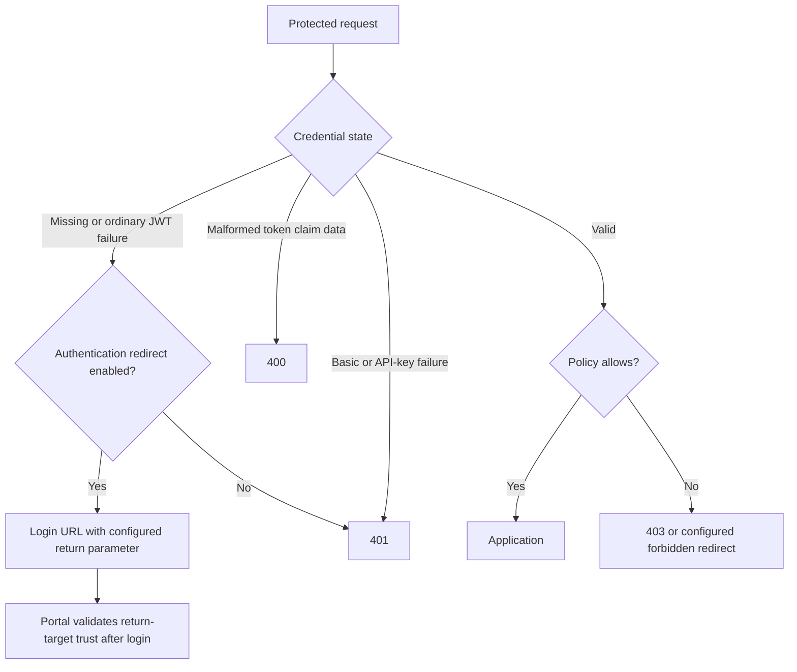

# Authorization redirects




## HTTP Redirect

A missing/invalid portal token normally sends a browser to the policy's auth URL:

```Caddyfile
set auth url https://auth.example.com/auth/
```

The default Location redirect is `302`. Its `redirect_url` query parameter
contains the original application URL so the portal can return there after
login. The portal must explicitly [trust that destination](../authenticate/100-trust-login-logout.md);
a policy redirect does not authorize arbitrary return URLs.

Use the configured trusted portal URL. The released gatekeeper does not replace
it with an arbitrary expired JWT's issuer. Behind a proxy, normalize forwarded
host/scheme information so the return URL represents the intended public origin.

| Policy directive | Effect |
| --- | --- |
| `disable auth redirect` | Missing authentication is refused with `401` instead of redirecting |
| `disable auth redirect query` | Redirect without the return-URL parameter |
| `set redirect query parameter referer_url` | Rename the return parameter; coordinate the receiving authenticator |
| `set redirect status 307` | Change Location status; be deliberate about method-preserving redirects |

For an API, `disable auth redirect` usually gives a clearer contract than
returning a login HTML page to a JSON client. A valid identity denied by an ACL
is a separate [403 response](acl-rbac.md#forbidden-access). Avoid protecting the
login route or error page with the policy that redirects to it.

## Javascript Redirect

```Caddyfile
enable js redirect
```

This returns an HTML script that can preserve a browser fragment such as
`#section`, which is never sent in an HTTP request. Its default response status
is `401`; it is not the ordinary Location/302 response. It requires JavaScript
and a compatible content security policy, so use it only for a browser flow
that needs this behavior.

## Login Hint

A hint suggests a login identifier to a provider; it does not establish identity.
The policy can accept `login_hint` from the request and forward it to the portal.

```Caddyfile
enable login hint with email alphanumeric
```

The default validators are `email`, `phone`, and `alphanumeric`. Select the forms
your integration requires. An OAuth provider must support the hint for it to
affect its UI. Do not treat a hinted email as a verified login or role grant.

### Configuration Example

```Caddyfile
# Inside an existing authorization policy:
set auth url https://auth.example.com/auth/
enable login hint with email
allow roles app/member
```

A request to `/private?login_hint=alice%40example.com` can forward the validated
hint alongside the return URL. Query identifiers can appear in logs; avoid
collecting unnecessary login hints in analytics.

## Additional scopes

`enable additional scopes` allows the request's `additional_scopes` value to be
forwarded through the login flow and merged with configured OAuth scopes.
These are provider API/consent scopes, not authorization-policy application roles.

Enable this only for an integration that deliberately allows client-selected
consent expansion. Prefer a fixed provider scope list for a predictable login.
The provider must support the requested scopes; forwarding them does not grant
the caller access or waive provider consent.

### Configuration Example

```Caddyfile
# Inside the policy that redirects to the configured OAuth login:
set auth url /auth/oauth2/customer
enable additional scopes
allow roles app/member
```

Here `customer` is the provider's configured realm. URL-encode a request such
as `additional_scopes=scopeA%20scopeB`. Complete the provider and portal setup
using the [generic OIDC guide](../authenticate/oauth/81-backend-oauth2-0000-generic.md); this fragment
does not define an identity provider.

## Agentic Prompts

Copy a prompt into your LLM to explore this topic. Each prompt prioritizes
upstream repository guidance and code over this page, and asks for version-aware
reasoning.

<div className="agentic-prompts">

<details>
<summary>Trace a browser return journey</summary>

```text
Help me understand Authorization redirects.

Primary authorities (take precedence over website documentation):
https://github.com/greenpau/caddy-security/blob/main/AGENTS.md
https://github.com/greenpau/caddy-security/tree/main/.codex/skills
https://github.com/greenpau/go-authcrunch/blob/main/AGENTS.md
https://github.com/greenpau/go-authcrunch/tree/main/.codex/skills
Read each repository's root AGENTS.md first, then any scoped AGENTS.md that
applies to inspected paths. Read the relevant SKILL.md files and follow their
implementation and test references.

Relevant skills to locate: configuration-authorization,
configuration-authentication.

Secondary reference:
https://docs.authcrunch.com/docs/authorize/auto-redirect-url

If a source is inaccessible, ask me to paste its relevant text. Identify the
versions your answer applies to; main may be newer than my release. Resolve
disagreements using code and tests, and flag unverified claims. Use synthetic
credentials and redacted examples; explain proposed checks before any changes.

Explain the application-to-portal redirect and return URL, including which
service must trust the destination. Distinguish missing authentication from a
valid identity denied by an ACL. Show the default Location behavior without
treating token issuer text as a trusted login target.
```

</details>

<details>
<summary>Compare browser and API outcomes</summary>

```text
Help me understand Authorization redirects.

Primary authorities (take precedence over website documentation):
https://github.com/greenpau/caddy-security/blob/main/AGENTS.md
https://github.com/greenpau/caddy-security/tree/main/.codex/skills
https://github.com/greenpau/go-authcrunch/blob/main/AGENTS.md
https://github.com/greenpau/go-authcrunch/tree/main/.codex/skills
Read each repository's root AGENTS.md first, then any scoped AGENTS.md that
applies to inspected paths. Read the relevant SKILL.md files and follow their
implementation and test references.

Relevant skills to locate: configuration-authorization,
configuration-authentication.

Secondary reference:
https://docs.authcrunch.com/docs/authorize/auto-redirect-url

If a source is inaccessible, ask me to paste its relevant text. Identify the
versions your answer applies to; main may be newer than my release. Resolve
disagreements using code and tests, and flag unverified claims. Use synthetic
credentials and redacted examples; explain proposed checks before any changes.

Compare disable auth redirect, a custom redirect status, omitted return query,
and JavaScript redirect. Explain method preservation, fragments, CSP, and
JSON-client expectations. Ask which client flow I need before suggesting a
setting.
```

</details>

<details>
<summary>Investigate a redirect loop</summary>

```text
Help me understand Authorization redirects.

Primary authorities (take precedence over website documentation):
https://github.com/greenpau/caddy-security/blob/main/AGENTS.md
https://github.com/greenpau/caddy-security/tree/main/.codex/skills
https://github.com/greenpau/go-authcrunch/blob/main/AGENTS.md
https://github.com/greenpau/go-authcrunch/tree/main/.codex/skills
Read each repository's root AGENTS.md first, then any scoped AGENTS.md that
applies to inspected paths. Read the relevant SKILL.md files and follow their
implementation and test references.

Relevant skills to locate: configuration-authorization,
configuration-authentication.

Secondary reference:
https://docs.authcrunch.com/docs/authorize/auto-redirect-url

If a source is inaccessible, ask me to paste its relevant text. Identify the
versions your answer applies to; main may be newer than my release. Resolve
disagreements using code and tests, and flag unverified claims. Use synthetic
credentials and redacted examples; explain proposed checks before any changes.

Help me diagnose a loop through the portal and application. Ask for redacted
Locations, public scheme/host, route mounting, cookie scope, and return-trust
rules. Separate proxy-origin disagreement, blocked cookie delivery, and an
unreachable login/error route.
```

</details>

<details>
<summary>Review hints and consent scopes</summary>

```text
Help me understand Authorization redirects.

Primary authorities (take precedence over website documentation):
https://github.com/greenpau/caddy-security/blob/main/AGENTS.md
https://github.com/greenpau/caddy-security/tree/main/.codex/skills
https://github.com/greenpau/go-authcrunch/blob/main/AGENTS.md
https://github.com/greenpau/go-authcrunch/tree/main/.codex/skills
Read each repository's root AGENTS.md first, then any scoped AGENTS.md that
applies to inspected paths. Read the relevant SKILL.md files and follow their
implementation and test references.

Relevant skills to locate: configuration-authorization,
configuration-authentication.

Secondary reference:
https://docs.authcrunch.com/docs/authorize/auto-redirect-url

If a source is inaccessible, ask me to paste its relevant text. Identify the
versions your answer applies to; main may be newer than my release. Resolve
disagreements using code and tests, and flag unverified claims. Use synthetic
credentials and redacted examples; explain proposed checks before any changes.

Explain login_hint validators and additional_scopes as untrusted request
inputs. Distinguish a hinted email from verified identity and provider API
scopes from application roles. Review when client-selected scope expansion is
deliberate and how query identifiers can appear in logs.
```

</details>

<details>
<summary>Build redirect regression cases</summary>

```text
Help me understand Authorization redirects.

Primary authorities (take precedence over website documentation):
https://github.com/greenpau/caddy-security/blob/main/AGENTS.md
https://github.com/greenpau/caddy-security/tree/main/.codex/skills
https://github.com/greenpau/go-authcrunch/blob/main/AGENTS.md
https://github.com/greenpau/go-authcrunch/tree/main/.codex/skills
Read each repository's root AGENTS.md first, then any scoped AGENTS.md that
applies to inspected paths. Read the relevant SKILL.md files and follow their
implementation and test references.

Relevant skills to locate: configuration-authorization,
configuration-authentication.

Secondary reference:
https://docs.authcrunch.com/docs/authorize/auto-redirect-url

If a source is inaccessible, ask me to paste its relevant text. Identify the
versions your answer applies to; main may be newer than my release. Resolve
disagreements using code and tests, and flag unverified claims. Use synthetic
credentials and redacted examples; explain proposed checks before any changes.

Design tests for a missing token browser GET, API request, POST, denied
identity, trusted return target, and rejected external destination. Include
one login-hint and one fragment case. Explain which outcomes require a real
browser rather than curl alone.
```

</details>

</div>

## Source Code References

Start with the code search, then follow the parser, runtime, and tests relevant
to this topic. These links target `main`; use GitHub's branch/tag selector to
compare them with your installed release.

1. [Search this topic in both repositories](https://github.com/search?q=%28repo%3Agreenpau%2Fgo-authcrunch%20OR%20repo%3Agreenpau%2Fcaddy-security%29%20%28AuthURL%20OR%20RedirectQueryParameter%20OR%20LoginHint%29&type=code)
   — searches topic-specific symbols and paths across both codebases.
2. [caddy-security: caddyfile_authz_misc.go](https://github.com/greenpau/caddy-security/blob/main/caddyfile_authz_misc.go)
   — parses source selection, validation, identity, and redirect options.
3. [go-authcrunch: pkg/authz/gatekeeper.go](https://github.com/greenpau/go-authcrunch/blob/main/pkg/authz/gatekeeper.go)
   — constructs validators and handles policy requests, bypass, and redirects.
4. [go-authcrunch: pkg/authz/redirect_e2e_test.go](https://github.com/greenpau/go-authcrunch/blob/main/pkg/authz/redirect_e2e_test.go)
   — checks login redirect targets and denial behavior through requests.
5. [caddy-security: caddyfile_authz_test.go](https://github.com/greenpau/caddy-security/blob/main/caddyfile_authz_test.go)
   — checks policy grammar and adapted ACL/credential settings.
