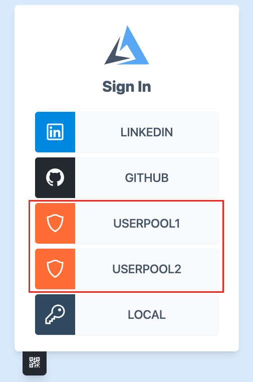

# Basic Authentication

HTTP Basic sends an account username and password with each request. Use HTTPS,
a specific application role, and a policy suitable for machine/API callers.
It does not run an interactive MFA ceremony.

Inside the existing authorization policy:

```Caddyfile
with basic auth portal myportal realm local
disable auth redirect
allow roles app/member
```

`myportal` is a portal on the same instance with the selected store enabled.
Released remote authentication is also supported: replace the name with the
portal HTTPS base URL and configure matching [System keys](../authenticate/api/50-system-api.md)
on both services. It is no longer a future feature.

## Usage

```bash
curl --fail-with-body --silent --show-error \
  -H 'X-Auth-Realm: local' --user alice \
  https://app.example.com/api/report
```

Omitting the password from `--user alice` lets curl prompt instead of putting
it in shell history. Send the configured realm even when only one is declared.
A valid password must still satisfy the portal's direct-authentication challenge
boundary and the policy's ACL. An identity requiring another factor cannot
satisfy that requirement merely by using Basic. Use interactive login and
an appropriate session/token for MFA-protected access.

Recognized invalid credentials return `401`; an authenticated nonmember is
forbidden. Missing or unrecognized credentials use the policy's ordinary
missing-authentication behavior. Keep denied tests alongside a successful call.

## Setting Default Realm

If this route is deliberately tied to one realm, replace the incoming selector
before authorization. Do not append another header value:

```Caddyfile
route /api/* {
    request_header X-Auth-Realm local
    authorize with apipolicy
    reverse_proxy 127.0.0.1:8080
}
```

This is a site-block fragment, with `apipolicy` defined in global security
options. On a multi-realm route, keep the explicit permitted realm selection
instead of forcing a default.

## Multiple Realms

```Caddyfile
# Inside the policy:
with basic auth portal myportal realm userpool1.localdomain
with basic auth portal myportal realm userpool2.localdomain
allow roles app/member
```

The portal must enable both stores, each with a distinct configured realm.
Each request selects one using `X-Auth-Realm`. Accounts with the same username
in different stores are different identities; keep the realm in application
account mapping when it matters.

<figure className="doc-screenshot">

[](./images/multi_realm_basic_auth_login.png)

<figcaption>The preserved portal screen illustrates two configured user pools. HTTP Basic selects a realm with a header; it does not click this browser login UI.</figcaption>
</figure>

## Changing Authentication Realm Header Name

```Caddyfile
with auth realm header name X-Account-Realm
```

Update the client or trusted route assignment to use the same name. A realm
header selects an allowed backend; it is not an authorization grant. Keep
passwords out of access logs and use [credential stripping](headers.md) when
the backend should receive identity rather than the Basic credential.

Successful credential identities may be cached for their validity interval.
Do not assume each request rechecks a password or that changing an account
instantly invalidates every cached result. Plan credential changes and token
lifetimes as part of the application's access policy.

## Agentic Prompts

Copy a prompt into your LLM to explore this topic. Each prompt prioritizes
upstream repository guidance and code over this page, and asks for version-aware
reasoning.

<div className="agentic-prompts">

<details>
<summary>Trace a Basic request</summary>

```text
Help me understand Basic Authentication.

Primary authorities (take precedence over website documentation):
https://github.com/greenpau/caddy-security/blob/main/AGENTS.md
https://github.com/greenpau/caddy-security/tree/main/.codex/skills
https://github.com/greenpau/go-authcrunch/blob/main/AGENTS.md
https://github.com/greenpau/go-authcrunch/tree/main/.codex/skills
Read each repository's root AGENTS.md first, then any scoped AGENTS.md that
applies to inspected paths. Read the relevant SKILL.md files and follow their
implementation and test references.

Relevant skills to locate: configuration-authorization,
authentication-portal-challenges.

Secondary reference:
https://docs.authcrunch.com/docs/authorize/basic_auth

If a source is inaccessible, ask me to paste its relevant text. Identify the
versions your answer applies to; main may be newer than my release. Resolve
disagreements using code and tests, and flag unverified claims. Use synthetic
credentials and redacted examples; explain proposed checks before any changes.

Explain how a username/password and realm selector reach a local or remote
portal, then an application ACL. Distinguish HTTP Basic transport from the
interactive login page. Explain why HTTPS and an application role remain
necessary.
```

</details>

<details>
<summary>Compare realms and remote trust</summary>

```text
Help me understand Basic Authentication.

Primary authorities (take precedence over website documentation):
https://github.com/greenpau/caddy-security/blob/main/AGENTS.md
https://github.com/greenpau/caddy-security/tree/main/.codex/skills
https://github.com/greenpau/go-authcrunch/blob/main/AGENTS.md
https://github.com/greenpau/go-authcrunch/tree/main/.codex/skills
Read each repository's root AGENTS.md first, then any scoped AGENTS.md that
applies to inspected paths. Read the relevant SKILL.md files and follow their
implementation and test references.

Relevant skills to locate: configuration-authorization,
authentication-portal-challenges.

Secondary reference:
https://docs.authcrunch.com/docs/authorize/basic_auth

If a source is inaccessible, ask me to paste its relevant text. Identify the
versions your answer applies to; main may be newer than my release. Resolve
disagreements using code and tests, and flag unverified claims. Use synthetic
credentials and redacted examples; explain proposed checks before any changes.

Use two stores containing the same username to explain explicit realm
selection. Compare a named local portal with an HTTPS remote portal and System
keys. Show how a trusted route replaces a selector rather than appending an
ambiguous value.
```

</details>

<details>
<summary>Diagnose 401 versus 403</summary>

```text
Help me understand Basic Authentication.

Primary authorities (take precedence over website documentation):
https://github.com/greenpau/caddy-security/blob/main/AGENTS.md
https://github.com/greenpau/caddy-security/tree/main/.codex/skills
https://github.com/greenpau/go-authcrunch/blob/main/AGENTS.md
https://github.com/greenpau/go-authcrunch/tree/main/.codex/skills
Read each repository's root AGENTS.md first, then any scoped AGENTS.md that
applies to inspected paths. Read the relevant SKILL.md files and follow their
implementation and test references.

Relevant skills to locate: configuration-authorization,
authentication-portal-challenges.

Secondary reference:
https://docs.authcrunch.com/docs/authorize/basic_auth

If a source is inaccessible, ask me to paste its relevant text. Identify the
versions your answer applies to; main may be newer than my release. Resolve
disagreements using code and tests, and flag unverified claims. Use synthetic
credentials and redacted examples; explain proposed checks before any changes.

Help me classify missing credentials, recognized invalid credentials, a valid
password lacking application membership, and an account requiring another
factor. Ask for redacted headers/status and challenge policy. Do not suggest
bypassing MFA or assume every request rechecks the password.
```

</details>

<details>
<summary>Design credential-lifecycle tests</summary>

```text
Help me understand Basic Authentication.

Primary authorities (take precedence over website documentation):
https://github.com/greenpau/caddy-security/blob/main/AGENTS.md
https://github.com/greenpau/caddy-security/tree/main/.codex/skills
https://github.com/greenpau/go-authcrunch/blob/main/AGENTS.md
https://github.com/greenpau/go-authcrunch/tree/main/.codex/skills
Read each repository's root AGENTS.md first, then any scoped AGENTS.md that
applies to inspected paths. Read the relevant SKILL.md files and follow their
implementation and test references.

Relevant skills to locate: configuration-authorization,
authentication-portal-challenges.

Secondary reference:
https://docs.authcrunch.com/docs/authorize/basic_auth

If a source is inaccessible, ask me to paste its relevant text. Identify the
versions your answer applies to; main may be newer than my release. Resolve
disagreements using code and tests, and flag unverified claims. Use synthetic
credentials and redacted examples; explain proposed checks before any changes.

Create cases for allowed account, wrong password, wrong realm, denied role,
and credential changes while identities may be cached. Include upstream
credential stripping observations. Keep passwords out of URLs, command
history, and logs.
```

</details>

<details>
<summary>Choose the right client flow</summary>

```text
Help me understand Basic Authentication.

Primary authorities (take precedence over website documentation):
https://github.com/greenpau/caddy-security/blob/main/AGENTS.md
https://github.com/greenpau/caddy-security/tree/main/.codex/skills
https://github.com/greenpau/go-authcrunch/blob/main/AGENTS.md
https://github.com/greenpau/go-authcrunch/tree/main/.codex/skills
Read each repository's root AGENTS.md first, then any scoped AGENTS.md that
applies to inspected paths. Read the relevant SKILL.md files and follow their
implementation and test references.

Relevant skills to locate: configuration-authorization,
authentication-portal-challenges.

Secondary reference:
https://docs.authcrunch.com/docs/authorize/basic_auth

If a source is inaccessible, ask me to paste its relevant text. Identify the
versions your answer applies to; main may be newer than my release. Resolve
disagreements using code and tests, and flag unverified claims. Use synthetic
credentials and redacted examples; explain proposed checks before any changes.

Ask about my machine client and whether it must prove MFA. Compare Basic with
interactive session/token access and API keys within the documented
boundaries. Have me explain why a successful password check alone may not
satisfy the required authentication evidence.
```

</details>

</div>

## Source Code References

Start with the code search, then follow the parser, runtime, and tests relevant
to this topic. These links target `main`; use GitHub's branch/tag selector to
compare them with your installed release.

1. [Search this topic in both repositories](https://github.com/search?q=%28repo%3Agreenpau%2Fgo-authcrunch%20OR%20repo%3Agreenpau%2Fcaddy-security%29%20%28BasicAuth%20OR%20AuthenticateBasic%20OR%20AuthProxyConfig%29&type=code)
   — searches topic-specific symbols and paths across both codebases.
2. [caddy-security: caddyfile_authz_misc.go](https://github.com/greenpau/caddy-security/blob/main/caddyfile_authz_misc.go)
   — parses source selection, validation, identity, and redirect options.
3. [go-authcrunch: pkg/authz/validator/auth.go](https://github.com/greenpau/go-authcrunch/blob/main/pkg/authz/validator/auth.go)
   — parses Basic/API-key Authorization credentials and derives credential-cache keys.
4. [go-authcrunch: pkg/authz/validator/sources.go](https://github.com/greenpau/go-authcrunch/blob/main/pkg/authz/validator/sources.go)
   — selects credentials and invokes the configured Basic/API-key authenticators.
5. [go-authcrunch: pkg/authz/validator/auth_test.go](https://github.com/greenpau/go-authcrunch/blob/main/pkg/authz/validator/auth_test.go)
   — tests quoted Authorization parsing and nonsecret credential-cache keys.
6. [go-authcrunch: pkg/authz/authenticate.go](https://github.com/greenpau/go-authcrunch/blob/main/pkg/authz/authenticate.go)
   — authenticates requests, forwards claims, and strips accepted credentials.
