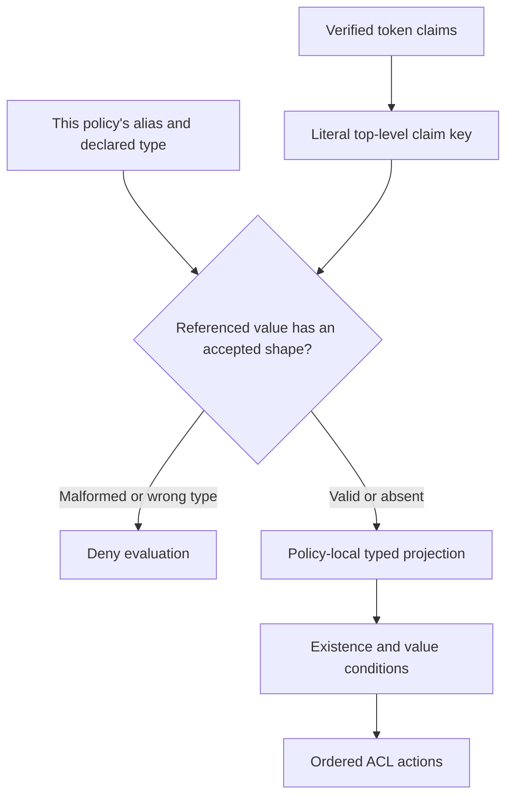

# Typed custom ACL fields

:::info[Version boundary]

Typed fields are released in **go-authcrunch v1.3.9 and later**. The adapter is
in the **caddy-security v1.4.0 source tag**, which pins library v1.3.11. The
published downloadable v1.3.0 bundle does not support `acl field`. At the
October 5 check, v1.4.0 binary assets are not yet published; use a matching
source build and check [availability](../operations/versions.md).

:::

A field declaration binds a literal top-level authenticated claim to a typed
alias used by one policy's ACL rules. This lets a policy match a namespaced
claim without renaming canonical roles or changing the JWT, header output or
another policy's field definitions.




## Declare and match a field

In a Caddy Security v1.4.0 source build, add the declaration and rule inside
the policy:

```caddyfile
authorization policy apppolicy {
    crypto key verify {env.AUTHCRUNCH_SIGNING_KEY}

    acl field department {
        claim "https://example.com/department"
        type string
    }
    acl field entitlements {
        claim "https://example.com/entitlements"
        type string list
    }
    acl rule {
        match department engineering
        match entitlements app:read
        allow stop
    }
    acl default deny
}
```

This matches the following relevant fields of a properly verified token:

```json
{
  "https://example.com/department": "engineering",
  "https://example.com/entitlements": ["app:read", "app:write"]
}
```

The example is a policy fragment, not a token-signing or complete deployment
recipe. Both conditions must match. Configure the issuer so the user cannot edit
the privilege-bearing attributes; a valid signature alone does not establish
their suitability for granting access.

## Grammar and scope

Each declaration requires exactly one `claim` and one `type`, in either order.
Supported types are `string` and `string list` in Caddyfile syntax; serialized
library configuration uses `string` and `string_list`. Names are case-sensitive
ASCII identifiers, at most 128 characters, beginning with a letter or underscore.
Standard fields, aliases and conflicting matcher keywords are reserved.

The claim key is a **literal top-level key**. Dots, pipes, URL punctuation and
spaces do not select nested objects. No placeholder expansion or network lookup
occurs. Declarations are local to the policy and collected before rule
compilation, so their textual order relative to rules does not change scope.

## Missing and malformed claims

| Input | Evaluation |
| --- | --- |
| String scalar for `string` | Valid, including an empty string |
| List containing only strings | Valid; comparison uses list elements |
| Absent claim | Absent; ordinary positive and negative match conditions do not match it |
| Empty list | Exists but matches no value condition, including negation |
| Null, mixed list, number, object or wrong type | Entire evaluation denied when the field is referenced |

Use `field department not exists` for an explicit absence rule. A malformed
referenced claim is checked before allow-stop and default-allow; it cannot turn
a skipped deny into an allow. Malformed unreferenced claims are ignored.

Existing exact, partial, prefix, suffix, regex and negation strategies apply.
Current request method/path data remain authoritative; claim aliases cannot
replace them. These declarations do not make a missing upstream claim appear
in a [direct OAuth identity](direct-oauth.md).

Verify valid input, absent fields, empty lists, null/mixed values, independent
policies, cached requests and wrong-token trust. See the
[library implementation](https://github.com/greenpau/go-authcrunch/tree/v1.3.11/pkg/acl)
and [Caddy adapter commit](https://github.com/greenpau/caddy-security/commit/fe9a179).

## Agentic Prompts

Copy a prompt into your LLM to explore this topic. Each prompt prioritizes
upstream repository guidance and code over this page, and asks for version-aware
reasoning.

<div className="agentic-prompts">

<details>
<summary>Understand a policy-local alias</summary>

```text
Help me understand Typed custom ACL fields.

Primary authorities (take precedence over website documentation):
https://github.com/greenpau/caddy-security/blob/main/AGENTS.md
https://github.com/greenpau/caddy-security/tree/main/.codex/skills
https://github.com/greenpau/go-authcrunch/blob/main/AGENTS.md
https://github.com/greenpau/go-authcrunch/tree/main/.codex/skills
Read each repository's root AGENTS.md first, then any scoped AGENTS.md that
applies to inspected paths. Read the relevant SKILL.md files and follow their
implementation and test references.

Relevant skills to locate: configuration-authorization,
authorization-policy-acl.

Secondary reference:
https://docs.authcrunch.com/docs/authorize/custom-fields

If a source is inaccessible, ask me to paste its relevant text. Identify the
versions your answer applies to; main may be newer than my release. Resolve
disagreements using code and tests, and flag unverified claims. Use synthetic
credentials and redacted examples; explain proposed checks before any changes.

Explain how a typed ACL alias refers to a literal top-level authenticated
claim. Compare a URL-shaped claim key, a nested object, and an ordinary role.
Show what remains unchanged in the token and headers. Check adapter and
library availability before showing syntax.
```

</details>

<details>
<summary>Explore the type table</summary>

```text
Help me understand Typed custom ACL fields.

Primary authorities (take precedence over website documentation):
https://github.com/greenpau/caddy-security/blob/main/AGENTS.md
https://github.com/greenpau/caddy-security/tree/main/.codex/skills
https://github.com/greenpau/go-authcrunch/blob/main/AGENTS.md
https://github.com/greenpau/go-authcrunch/tree/main/.codex/skills
Read each repository's root AGENTS.md first, then any scoped AGENTS.md that
applies to inspected paths. Read the relevant SKILL.md files and follow their
implementation and test references.

Relevant skills to locate: configuration-authorization,
authorization-policy-acl.

Secondary reference:
https://docs.authcrunch.com/docs/authorize/custom-fields

If a source is inaccessible, ask me to paste its relevant text. Identify the
versions your answer applies to; main may be newer than my release. Resolve
disagreements using code and tests, and flag unverified claims. Use synthetic
credentials and redacted examples; explain proposed checks before any changes.

Using synthetic department and entitlements claims, compare absent, null,
empty string, empty list, mixed list, and wrong scalar type. Predict existence
and positive/negative match outcomes from the implementation. Explain why
malformed referenced data must not become an accidental allow.
```

</details>

<details>
<summary>Review a field declaration</summary>

```text
Help me understand Typed custom ACL fields.

Primary authorities (take precedence over website documentation):
https://github.com/greenpau/caddy-security/blob/main/AGENTS.md
https://github.com/greenpau/caddy-security/tree/main/.codex/skills
https://github.com/greenpau/go-authcrunch/blob/main/AGENTS.md
https://github.com/greenpau/go-authcrunch/tree/main/.codex/skills
Read each repository's root AGENTS.md first, then any scoped AGENTS.md that
applies to inspected paths. Read the relevant SKILL.md files and follow their
implementation and test references.

Relevant skills to locate: configuration-authorization,
authorization-policy-acl.

Secondary reference:
https://docs.authcrunch.com/docs/authorize/custom-fields

If a source is inaccessible, ask me to paste its relevant text. Identify the
versions your answer applies to; main may be newer than my release. Resolve
disagreements using code and tests, and flag unverified claims. Use synthetic
credentials and redacted examples; explain proposed checks before any changes.

Review my redacted declaration for alias naming, reserved fields, type,
literal claim spelling, duplicate declarations, and policy scope. Ask who
controls the claim. Explain why signature validity does not make a
user-editable department attribute safe for privilege grants.
```

</details>

<details>
<summary>Test isolation and version boundaries</summary>

```text
Help me understand Typed custom ACL fields.

Primary authorities (take precedence over website documentation):
https://github.com/greenpau/caddy-security/blob/main/AGENTS.md
https://github.com/greenpau/caddy-security/tree/main/.codex/skills
https://github.com/greenpau/go-authcrunch/blob/main/AGENTS.md
https://github.com/greenpau/go-authcrunch/tree/main/.codex/skills
Read each repository's root AGENTS.md first, then any scoped AGENTS.md that
applies to inspected paths. Read the relevant SKILL.md files and follow their
implementation and test references.

Relevant skills to locate: configuration-authorization,
authorization-policy-acl.

Secondary reference:
https://docs.authcrunch.com/docs/authorize/custom-fields

If a source is inaccessible, ask me to paste its relevant text. Identify the
versions your answer applies to; main may be newer than my release. Resolve
disagreements using code and tests, and flag unverified claims. Use synthetic
credentials and redacted examples; explain proposed checks before any changes.

Design cases for two policies using the same alias for different claims,
malformed referenced versus unreferenced claims, cached identities, and
textual declaration order. Add a check proving my binary actually supports the
field grammar. Mark source-only capabilities explicitly.
```

</details>

<details>
<summary>Practice custom-field reasoning</summary>

```text
Help me understand Typed custom ACL fields.

Primary authorities (take precedence over website documentation):
https://github.com/greenpau/caddy-security/blob/main/AGENTS.md
https://github.com/greenpau/caddy-security/tree/main/.codex/skills
https://github.com/greenpau/go-authcrunch/blob/main/AGENTS.md
https://github.com/greenpau/go-authcrunch/tree/main/.codex/skills
Read each repository's root AGENTS.md first, then any scoped AGENTS.md that
applies to inspected paths. Read the relevant SKILL.md files and follow their
implementation and test references.

Relevant skills to locate: configuration-authorization,
authorization-policy-acl.

Secondary reference:
https://docs.authcrunch.com/docs/authorize/custom-fields

If a source is inaccessible, ask me to paste its relevant text. Identify the
versions your answer applies to; main may be newer than my release. Resolve
disagreements using code and tests, and flag unverified claims. Use synthetic
credentials and redacted examples; explain proposed checks before any changes.

Quiz me one case at a time on literal versus nested keys, absence versus null,
negating an empty list, and allowing before a malformed field check. Wait for
my answer. Resolve current-main behavior separately from my installed release.
```

</details>

</div>

## Source Code References

Start with the code search, then follow the parser, runtime, and tests relevant
to this topic. These links target `main`; use GitHub's branch/tag selector to
compare them with your installed release.

1. [Search this topic in both repositories](https://github.com/search?q=%28repo%3Agreenpau%2Fgo-authcrunch%20OR%20repo%3Agreenpau%2Fcaddy-security%29%20%28ACLFieldConfig%20OR%20AccessListFields%20OR%20AllowWithClaims%29&type=code)
   — searches topic-specific symbols and paths across both codebases.
2. [caddy-security: caddyfile_authz_acl.go](https://github.com/greenpau/caddy-security/blob/main/caddyfile_authz_acl.go)
   — adapts full ACL rules, actions, defaults, and field declarations.
3. [caddy-security: caddyfile_authz_fields_test.go](https://github.com/greenpau/caddy-security/blob/main/caddyfile_authz_fields_test.go)
   — tests typed ACL field adaptation and rejection cases.
4. [go-authcrunch: pkg/acl/parser/fields.go](https://github.com/greenpau/go-authcrunch/blob/main/pkg/acl/parser/fields.go)
   — parses typed field declarations through the reusable library interface.
5. [go-authcrunch: pkg/acl/fields.go](https://github.com/greenpau/go-authcrunch/blob/main/pkg/acl/fields.go)
   — validates typed field declarations and projects authenticated claims.
6. [go-authcrunch: pkg/acl/fields_test.go](https://github.com/greenpau/go-authcrunch/blob/main/pkg/acl/fields_test.go)
   — covers typed values, absence, malformed claims, and policy isolation.
