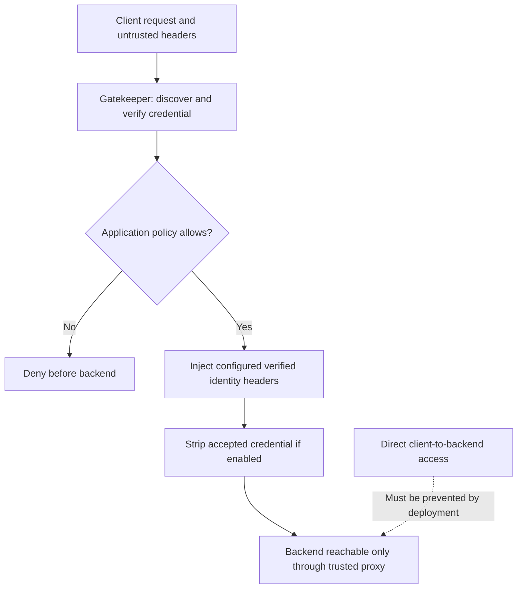

# Identity headers

Pass only the identity data the backend needs. Run authorization before the
proxy and keep the backend reachable only through the trusted proxy path;
otherwise a client can bypass the policy and send its own identity headers.




## Pass JWT Token Claims in HTTP Request Headers

### Auto-Defined Headers

```Caddyfile
# Inside the policy:
inject headers with claims
```

After successful authorization, the policy injects available claims:

| Header | Claim |
| --- | --- |
| `X-Token-Subject` | `sub` |
| `X-Token-User-Name` | `name` |
| `X-Token-User-Email` | `email` |
| `X-Token-User-Roles` | Normalized roles, separated by spaces |

Configured destination headers are cleared before authentication, including
deny and bypass paths. This prevents a client-supplied value from surviving as
trusted identity. A bypassed request does not get an authenticated user.

### Custom Headers

```Caddyfile
inject header X-User-Email from email
inject header X-Picture from picture
```

Map only claims whose source and meaning the application understands. A
profile picture or email value is not proof of application membership, email
verification, or administrator status.

#### Nested Data Source

Use `|` to traverse a nested claim:

```Caddyfile
inject header X-User-Timezone from "userinfo|zoneinfo"
inject header X-User-Groups from "userinfo|custom_groups"
```

String arrays are rendered as comma-separated values for custom injection.
Check the actual response to your upstream, including absent/malformed claim
values; do not build an authorization decision around a display-format guess.
Prefer normalized application roles for permissions. Custom header traversal
is separate from the [typed ACL field registration](custom-fields.md) available
only in newer library/adapter versions.

## Strip JWT Token from HTTP Request

```Caddyfile
enable strip token
```

The released implementation supports more than cookies:

| Accepted source | Removed before the downstream handler |
| --- | --- |
| Cookie | Matching accepted token cookie; unrelated cookies remain |
| Bearer or named Authorization entry | Matching token entry; unrelated entries remain |
| Basic | Basic Authorization entries |
| API-key header | Configured API-key header |
| Query | Accepted token value; unrelated parameters remain |

This removes a credential from the **forwarded request**. It does not delete the
browser cookie, revoke a token, or log the user out. It also does not strip every
possible credential a client could attach. For an upstream that should never
receive an Authorization header, use an explicit proxy header rule such as
`header_up -Authorization` in the `reverse_proxy` block.

See [Caddy placeholders](placeholders.md) for an alternative that lets the proxy
construct a small explicit identity-header set.

## Agentic Prompts

Copy a prompt into your LLM to explore this topic. Each prompt prioritizes
upstream repository guidance and code over this page, and asks for version-aware
reasoning.

<div className="agentic-prompts">

<details>
<summary>Trace trusted identity headers</summary>

```text
Help me understand Identity headers.

Primary authorities (take precedence over website documentation):
https://github.com/greenpau/caddy-security/blob/main/AGENTS.md
https://github.com/greenpau/caddy-security/tree/main/.codex/skills
https://github.com/greenpau/go-authcrunch/blob/main/AGENTS.md
https://github.com/greenpau/go-authcrunch/tree/main/.codex/skills
Read each repository's root AGENTS.md first, then any scoped AGENTS.md that
applies to inspected paths. Read the relevant SKILL.md files and follow their
implementation and test references.

Relevant skills to locate: configuration-authorization,
authorization-policy-acl.

Secondary reference:
https://docs.authcrunch.com/docs/authorize/headers

If a source is inaccessible, ask me to paste its relevant text. Identify the
versions your answer applies to; main may be newer than my release. Resolve
disagreements using code and tests, and flag unverified claims. Use synthetic
credentials and redacted examples; explain proposed checks before any changes.

Explain how a verified claim becomes an upstream identity header and why the
backend must be reachable only through the trusted proxy. Distinguish incoming
client headers, policy clearing, successful injection, and bypass or denial.
Use synthetic identities.
```

</details>

<details>
<summary>Read standard and custom mappings</summary>

```text
Help me understand Identity headers.

Primary authorities (take precedence over website documentation):
https://github.com/greenpau/caddy-security/blob/main/AGENTS.md
https://github.com/greenpau/caddy-security/tree/main/.codex/skills
https://github.com/greenpau/go-authcrunch/blob/main/AGENTS.md
https://github.com/greenpau/go-authcrunch/tree/main/.codex/skills
Read each repository's root AGENTS.md first, then any scoped AGENTS.md that
applies to inspected paths. Read the relevant SKILL.md files and follow their
implementation and test references.

Relevant skills to locate: configuration-authorization,
authorization-policy-acl.

Secondary reference:
https://docs.authcrunch.com/docs/authorize/headers

If a source is inaccessible, ask me to paste its relevant text. Identify the
versions your answer applies to; main may be newer than my release. Resolve
disagreements using code and tests, and flag unverified claims. Use synthetic
credentials and redacted examples; explain proposed checks before any changes.

Compare standard role headers with custom claim injection and pipe-separated
nested lookup. Show scalar, list, absent, and malformed data examples using
the actual formatter. Explain why display values and verified email appearance
do not by themselves grant application membership.
```

</details>

<details>
<summary>Understand credential stripping</summary>

```text
Help me understand Identity headers.

Primary authorities (take precedence over website documentation):
https://github.com/greenpau/caddy-security/blob/main/AGENTS.md
https://github.com/greenpau/caddy-security/tree/main/.codex/skills
https://github.com/greenpau/go-authcrunch/blob/main/AGENTS.md
https://github.com/greenpau/go-authcrunch/tree/main/.codex/skills
Read each repository's root AGENTS.md first, then any scoped AGENTS.md that
applies to inspected paths. Read the relevant SKILL.md files and follow their
implementation and test references.

Relevant skills to locate: configuration-authorization,
authorization-policy-acl.

Secondary reference:
https://docs.authcrunch.com/docs/authorize/headers

If a source is inaccessible, ask me to paste its relevant text. Identify the
versions your answer applies to; main may be newer than my release. Resolve
disagreements using code and tests, and flag unverified claims. Use synthetic
credentials and redacted examples; explain proposed checks before any changes.

Walk through accepted cookie, Bearer, named Authorization entry, Basic,
API-key, and query credentials. Explain what stripping removes from the
forwarded request and what can remain. Separate stripping from logout,
browser-cookie deletion, and distributed revocation.
```

</details>

<details>
<summary>Test spoofing and forwarding</summary>

```text
Help me understand Identity headers.

Primary authorities (take precedence over website documentation):
https://github.com/greenpau/caddy-security/blob/main/AGENTS.md
https://github.com/greenpau/caddy-security/tree/main/.codex/skills
https://github.com/greenpau/go-authcrunch/blob/main/AGENTS.md
https://github.com/greenpau/go-authcrunch/tree/main/.codex/skills
Read each repository's root AGENTS.md first, then any scoped AGENTS.md that
applies to inspected paths. Read the relevant SKILL.md files and follow their
implementation and test references.

Relevant skills to locate: configuration-authorization,
authorization-policy-acl.

Secondary reference:
https://docs.authcrunch.com/docs/authorize/headers

If a source is inaccessible, ask me to paste its relevant text. Identify the
versions your answer applies to; main may be newer than my release. Resolve
disagreements using code and tests, and flag unverified claims. Use synthetic
credentials and redacted examples; explain proposed checks before any changes.

Build a downstream-observation test matrix for successful access, denial,
public bypass, forged identity headers, unrelated cookies, and multiple
Authorization entries. Include an explicit proxy header rule if the upstream
must never receive Authorization. Explain the expected provenance for each
observed value.
```

</details>

<details>
<summary>Review a minimal contract</summary>

```text
Help me understand Identity headers.

Primary authorities (take precedence over website documentation):
https://github.com/greenpau/caddy-security/blob/main/AGENTS.md
https://github.com/greenpau/caddy-security/tree/main/.codex/skills
https://github.com/greenpau/go-authcrunch/blob/main/AGENTS.md
https://github.com/greenpau/go-authcrunch/tree/main/.codex/skills
Read each repository's root AGENTS.md first, then any scoped AGENTS.md that
applies to inspected paths. Read the relevant SKILL.md files and follow their
implementation and test references.

Relevant skills to locate: configuration-authorization,
authorization-policy-acl.

Secondary reference:
https://docs.authcrunch.com/docs/authorize/headers

If a source is inaccessible, ask me to paste its relevant text. Identify the
versions your answer applies to; main may be newer than my release. Resolve
disagreements using code and tests, and flag unverified claims. Use synthetic
credentials and redacted examples; explain proposed checks before any changes.

Help me define the smallest identity-header contract for my backend. Ask which
fields it needs and how it restricts direct access. Compare policy injection
with Caddy placeholders, then have me explain how the backend distinguishes
authenticated and public requests.
```

</details>

</div>

## Source Code References

Start with the code search, then follow the parser, runtime, and tests relevant
to this topic. These links target `main`; use GitHub's branch/tag selector to
compare them with your installed release.

1. [Search this topic in both repositories](https://github.com/search?q=%28repo%3Agreenpau%2Fgo-authcrunch%20OR%20repo%3Agreenpau%2Fcaddy-security%29%20%28HeaderInjection%20OR%20injectHeaders%20OR%20stripAuthToken%29&type=code)
   — searches topic-specific symbols and paths across both codebases.
2. [caddy-security: caddyfile_authz_inject.go](https://github.com/greenpau/caddy-security/blob/main/caddyfile_authz_inject.go)
   — maps identity-header directives into policy configuration.
3. [go-authcrunch: pkg/authz/authenticate.go](https://github.com/greenpau/go-authcrunch/blob/main/pkg/authz/authenticate.go)
   — authenticates requests, forwards claims, and strips accepted credentials.
4. [go-authcrunch: pkg/authz/gatekeeper.go](https://github.com/greenpau/go-authcrunch/blob/main/pkg/authz/gatekeeper.go)
   — constructs validators and handles policy requests, bypass, and redirects.
5. [go-authcrunch: pkg/authz/strip_token_e2e_test.go](https://github.com/greenpau/go-authcrunch/blob/main/pkg/authz/strip_token_e2e_test.go)
   — observes accepted-credential stripping at the downstream boundary.
